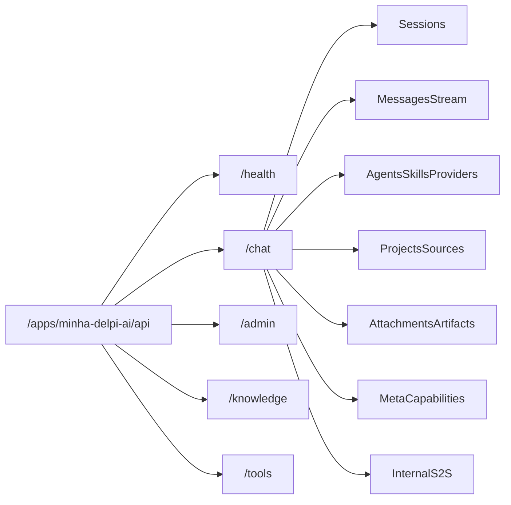

# 00 — Superfície HTTP

## Objetivo

Mapear prefixos e inventário de rotas da API do chat por domínio, com ponte para o contrato detalhado em `docs/api/`.

## Diagrama

## Entrada / saída

| Camada | Prefixo |
|--------|---------|
| Gateway (público) | `/apps/minha-delpi-ai/api/` → strip → app Flask |
| Chat | `chat_bp` `url_prefix="/chat"` → **`/apps/minha-delpi-ai/api/chat`** |
| Admin | `/admin` → **`/apps/minha-delpi-ai/api/admin`** |
| Knowledge | `/knowledge` |
| Tools | `/tools` |
| Health | `/health` |
| S2S Docker | `http://delpi-minha-delpi-ai-api:8000/chat/internal/...` (sem gateway) |

Registro: `app/composition/root_composer.py`. Módulos: `app/interfaces/http/routes/chat/`.

## Serviços / módulos canônicos

| Domínio | Arquivo de rotas |
|---------|------------------|
| Sessões | `session_routes.py` |
| Mensagens / stream | `message_routes.py` + `shared._stream_chat_response` |
| Meta / capabilities | `meta_routes.py` |
| Agentes CRUD | `agent_routes.py` |
| Skills | `agent_skill_routes.py` |
| Providers / actions | `agent_provider_routes.py` |
| Anexos / artefatos | `attachment_routes.py` |
| Projetos / fontes | `project_routes.py` |
| Internos | `internal_openapi_sync_routes.py`, `internal_operational_routes_suggest_*.py` |
| Admin | `admin_routes.py` |
| Knowledge / tools | `knowledge_routes.py`, `tool_routes.py` |

## Inventário por domínio

Paths = path do blueprint. URL pública = `/apps/minha-delpi-ai/api` + path.  
Detalhe de payload/permissão: [10-referencia-rapida-endpoints.md](../api/10-referencia-rapida-endpoints.md).

### Meta / capabilities

| Método | Path | Propósito |
|--------|------|-----------|
| GET | `/chat/status` | Status do chat |
| GET | `/chat/response-modes` | Modos de resposta |
| GET | `/chat/action-providers` | Providers de actions |
| GET | `/chat/actions` | Catálogo de actions |
| GET | `/chat/capabilities` | Flags/permissões do usuário |
| GET | `/chat/assistant/catalog` | Onboarding / sugestões |
| GET | `/chat/assistant/feedback-reasons` | Motivos de feedback |
| POST | `/chat/assistant/help-events` | Telemetria de ajuda |
| POST | `/chat/typing-suggestions` | Correção enquanto digita |

### Sessões e memória

| Método | Path | Propósito |
|--------|------|-----------|
| POST | `/chat/sessions` | Criar sessão |
| GET | `/chat/sessions` | Listar |
| PATCH / DELETE | `/chat/sessions/<id>` | Atualizar / excluir |
| PATCH | `.../pin` · `.../unpin` | Fixar |
| PATCH | `.../archive` · `.../unarchive` | Arquivar |
| POST | `.../memory/clear` | Limpar memória |
| GET | `.../memory/context` | Contexto / pins |
| POST | `.../memory/pins` | Adicionar pin |
| POST / DELETE | `.../memory/context-items` | Itens de contexto |
| PUT | `.../memory/response-format` | Formato de sessão |
| DELETE | `.../memory/pins/<kind>` | Remover pin |

### Mensagens e stream

| Método | Path | Propósito |
|--------|------|-----------|
| GET | `/chat/sessions/<id>/messages` | Histórico |
| POST | `.../messages` | **Send sync** → fluxo [01](./01-turno-canonico-send-stream.md) |
| POST | `.../messages/stream` | **Stream SSE** → [01](./01-turno-canonico-send-stream.md) |
| POST | `.../messages/<mid>/resend/stream` | Reenviar em stream |
| POST | `.../messages/cancel` | Cancelar stream |
| PATCH | `/chat/messages/<mid>` | Editar conteúdo |
| PATCH | `.../active-branch` | Trocar branch de edição |
| PUT | `.../messages/<mid>/feedback` | Feedback +/- |

### Agentes, skills, providers

CRUD agentes (list/get/create/patch/delete), duplicate, transfer, export/import, stats, share, preview, publish, versions — ver [03-agentes.md](../api/03-agentes.md).

| Método | Path | Propósito |
|--------|------|-----------|
| GET | `/chat/skills` | Catálogo de skills |
| GET / PUT | `/chat/agents/<id>/skills` | Skills do agente |
| GET / PUT / DELETE | `.../providers`, `.../actions` | Vínculos OpenAPI |
| POST | `.../providers/<key>/import` | Import OpenAPI (job) |
| POST | `.../actions/<aid>/test` | Testar action |

### Anexos, artefatos, projetos, fontes

Ver [05-projetos-fontes-anexos-artefatos.md](../api/05-projetos-fontes-anexos-artefatos.md). Upload de anexo pode criar sessão; fontes em projeto/agente alimentam RAG.

### Internos S2S (token de serviço)

| Método | Path | Propósito |
|--------|------|-----------|
| POST | `/chat/internal/openapi/sync-api-delpi` | Reimport OpenAPI (api-delpi → chat) |
| POST | `/chat/internal/operational-routes/suggest` | NL → operationIds |
| POST | `/chat/internal/operational-routes/suggest-params` | NL → params (dry-run) |

Detalhe: [06-workspace-agente-admin.md](./06-workspace-agente-admin.md).

### Satélites do turno

| Método | Path | Propósito |
|--------|------|-----------|
| POST | `/tools/execute` | Executar tool (gateway interno do turno) |
| POST | `/knowledge/documents` · `/knowledge/search` | Ingestão / busca RAG |
| POST | `/admin/agent/simulate` | Simulação admin (mesmo prep analysis) |
| GET | `/health` | Healthcheck |

### Admin (resumo)

~100 rotas em `/admin`: RBAC, guidelines, RAG test, simulate, métricas, learning, intelligence-settings, knowledge admin, audit. **Flow E2E profundo:** fora deste mapa — inventário em [08-admin.md](../api/08-admin.md). Settings de inteligência e simulate: [06](./06-workspace-agente-admin.md).

## Branches

- Rotas de **mensagem** exigem `chat.ask`; listagens usam `chat.access`.
- Mutações de agente oficial exigem `chat.admin` / `tools.manage`.
- Internos **não** usam JWT de usuário — `headers_have_valid_internal_service_token`.

## Metadata / SSE

Não aplicável neste doc (superfície). Eventos SSE: [01](./01-turno-canonico-send-stream.md) e [02-chat-sessoes-mensagens.md](../api/02-chat-sessoes-mensagens.md).

## Fixtures / regressão

- Contrato HTTP espelhado no MFE; smoke: `docs/testing/`.
- Não há fixture de “todas as rotas”; inventário deve bater com `routes/chat/*.py`.

## Links

- [README do hub de fluxos](./README.md)
- [api/README.md](../api/README.md)
- [api/00-visao-geral.md](../api/00-visao-geral.md) — auth, erros, SSE
- Gateway: `docs/02-infraestrutura/gateway-nginx.md` (monorepo)
