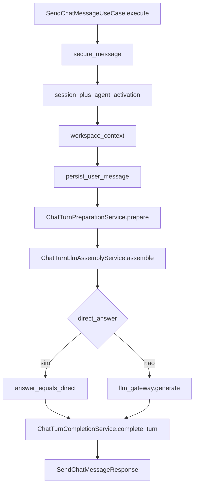
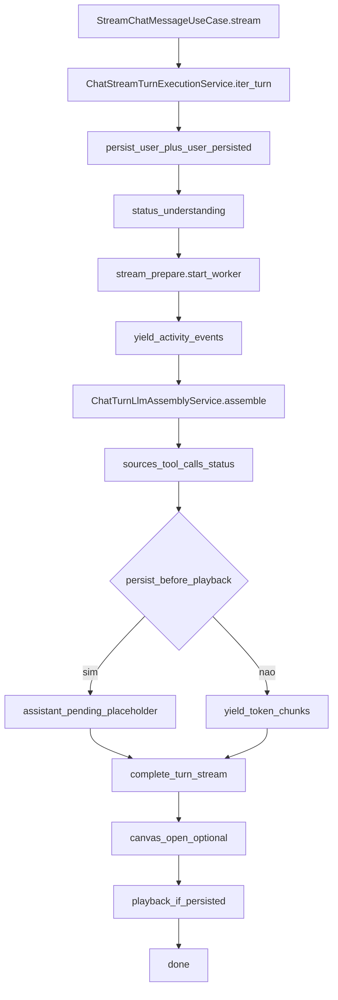

# 01 — Turno canônico send / stream

## Objetivo

Descrever o núcleo compartilhado **prepare → assemble → (LLM|direct) → complete** e as diferenças entre send síncrono e stream SSE.

## Diagrama — Send

## Diagrama — Stream SSE

## Entrada / saída

| | Send | Stream |
|---|------|--------|
| HTTP | `POST /chat/sessions/<id>/messages` | `POST .../messages/stream` (+ resend/cancel) |
| Body | `message`, `responseMode`, `agentId`, anexos… | idem |
| Resposta | JSON `SendChatMessageResponse` | SSE `text/event-stream` |
| Persistência | user + assistant no mesmo request | user cedo; assistant via `assistant_pending` + `playback` (default) |

## Serviços canônicos

| Serviço | Papel |
|---------|--------|
| `SendChatMessageUseCase` | Orquestra send até response |
| `StreamChatMessageUseCase` | Thin wrapper → stream execution |
| `ChatStreamTurnExecutionService` | Loop SSE do turno |
| `ChatStreamTurnPrepareService` | Thread de prepare + fila `activity` |
| `ChatStreamUserMessageService` | Persist user + `user_persisted` |
| `ChatStreamSessionTitleService` | Título fallback + refine async |
| `ChatTurnPreparationService` | Pré-LLM único (send e stream) |
| `ChatTurnLlmAssemblyService` | Prompt / web synthesis / admin debug |
| `ChatTurnCompletionService` | Finalize + metadata + persist + audit |
| `ChatWorkspaceAgentActivationService` | Agente ativo no turno |
| `ChatTurnUseCaseSupportService` | Workspace, tools, agentic, anexos |

## Branches

1. **Paridade:** mesma inteligência em send e stream (ADR-002). Stream só adiciona progresso e modo de persistência.
2. **`direct_answer`:** assembly não chama LLM; completion ainda monta metadata.
3. **`CHAT_PERSIST_BEFORE_PLAYBACK` (default true):** placeholder no DB → `assistant_pending` → `playback` no fim; tokens em tempo real só se flag false.
4. **Resend:** `resend/stream` reabre branch a partir de `message_id`.
5. **Cancel:** `POST .../messages/cancel` → `CancelChatStreamUseCase`.
6. **Memory limited (OCR/visão):** atalho `status` → `assistant_pending` → `playback` → `done` sem LLM completo.

## Metadata / SSE

Ordem típica com `persist_before_playback=true`:

| Ordem | `type` | Origem |
|------:|--------|--------|
| 1 | `user_persisted` | user message service |
| 2 | `session_renamed` | título fallback (opcional) |
| 3 | `status` | entendendo pergunta |
| 4…n | `activity` | prepare worker (tools/RAG) |
| | `status` | direct / assembling / generating |
| | `sources` | pós-assembly |
| | `tool_calls` | + guidelines |
| | `assistant_pending` | placeholder |
| | `canvas_open` | se houver |
| | `playback` | resposta persistida |
| | `done` | fim + metadata cliente |

Textos de activity: `app/content/pt-BR/assistant/stream.json`.

## Fixtures / regressão

- ADR: [adr/002-send-stream-turn-parity.md](../architecture/adr/002-send-stream-turn-parity.md)
- Smoke SSE: [testing/smoke-operacional-manual.md](../testing/smoke-operacional-manual.md)
- Contrato: [api/02-chat-sessoes-mensagens.md](../api/02-chat-sessoes-mensagens.md)

## Links

- [chat-intelligence-base.md](../architecture/chat-intelligence-base.md)
- [chat-pre-llm-layers.md](../architecture/chat-pre-llm-layers.md)
- Prep detalhado: [02](./02-inteligencia-pre-llm.md) · Tools: [03](./03-tools-rag-agentic.md)
- Playbook 11: [playbook-11-clean-architecture-chat-api.md](../roadmap/playbook-11-clean-architecture-chat-api.md)
