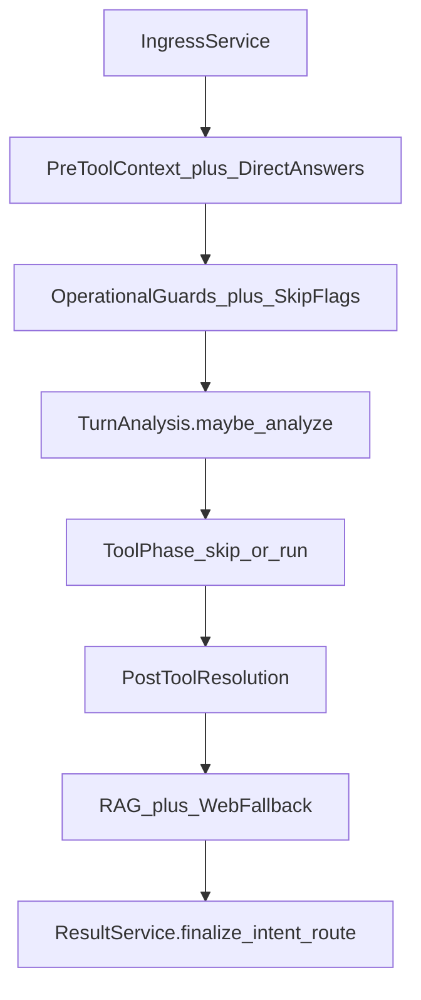

# 02 — Inteligência pré-LLM

## Objetivo

Mapear as fases do `ChatTurnPreparationService` **antes** da montagem do prompt: ingress, directs, guards, turn analysis, resolução pós-tools e modos de turno.

## Diagrama

## Entrada / saída

| Entrada | Saída do prep (`ChatTurnPreparationResult`) |
|---------|-----------------------------------------------|
| `message`, `responseMode`, workspace, histórico, anexos | `direct_answer`, `tool_context` / `tool_calls`, `sources`, `pipeline_stages`, `intent_route`, `skip_rag`, flags operacionais |

## Serviços canônicos

| Fase | Serviço |
|------|---------|
| Ingress | `ChatTurnPreparationIngressService` — canvas, `operational_optimize` / `analysis_mode`, text task, history summary |
| Directs pré-tool | `ChatTurnPreparationDirectAnswerService` + `ChatTurnPreparationPreToolContextService` |
| Memória | `ChatTurnPreparationMemoryContextService` |
| Guards / skip | `ChatTurnPreparationToolRoutingService` |
| Turn analysis | `ChatTurnPreparationTurnAnalysisService` → `ChatTurnAnalysisService` |
| Pós-tools | `ChatTurnPreparationPostToolResolutionService` |
| Flags transversais | `ChatIntelligencePipelineService` |
| Intent executado | `ChatTurnPreparationResultService` → `ChatIntentRouterService.resolve_executed` |
| Modo do turno | `ChatTurnModeService` (`consume_prior`, `ask_slot`, `analyze`, `compose`, `execute_tools`, `llm_narrate`) |
| Clarify | `ChatUnclearRequestService`, `ChatIntentDisambiguationService` |

## Branches

### Direct answer (short-circuit sem LLM)

Ordem efetiva (pre-tool coleta; post-tool prioriza): canvas → capabilities/onboarding → small talk / utility → web/project sources → session memory → interpretation → external action presentation → identity/capabilities → missing product/period/date → learning / routing disambiguation / **unclear** → drawing report → preferência de prosa de apresentação → `ChatResponseModeService.apply_turn_direct_answer_policy` (pode **revogar** direct e forçar síntese LLM).

Se `direct_answer` → em geral `skip_rag=true`.

### Clarify / chips

- Vocabulário vago / `ambiguous_domain` → `ChatUnclearRequestService` + sugestões em `routingDisambiguationSuggestions` → consolidado em `interactivity` (MFE).
- Guards: código/período/data faltando → `clarifyInsteadOfGuess`.
- Turn analysis `decision=clarify` → direct + chips.

### Turn analysis (híbrida)

`maybe_analyze` roda **depois** dos directs early e **antes** da tool phase:

1. Skip se já há early direct.
2. Heurística `ChatIntentRouterService.classify` + gate `ChatTurnAnalysisService.should_analyze` (modo Normal/Pensador, confiança, flag `turnAnalysisEnabled`).
3. LLM estruturado → `decision` execute|clarify|narrate, `action_ids`, `skills_to_load`.
4. Workspace: `turnAnalysis`, `turnAnalysisActionIds`, `turnAnalysisSkillsToLoad`.
5. Clarify → `unclear_request` + direct.

Conteúdo: `turn_analysis.json`. Flag admin: intelligence settings `turnAnalysisEnabled`.

### `ChatTurnModeService`

| Modo | Efeito típico |
|------|----------------|
| `consume_prior` | Skip LLM/agentic (ex.: unclear, drawing confirm) |
| `ask_slot` | Pedir parâmetro |
| `analyze` | Analysis execute sem tools ainda |
| `compose` | Analysis + tools → narrar |
| `execute_tools` | Tools no turno |
| `llm_narrate` | LLM geral |

## Metadata / SSE

- Stages: `ingress`, `unclear_request`, `turn_analysis`, `tools`, `post_tool`, `skip_rag`, `intent:*`.
- Activity SSE durante analysis/tools: `stream.json` → `activity.*`.
- Chips: `routingDisambiguationSuggestions` → `ChatInteractivitySuggestionService` (`interactivity.suggestions`).

## Fixtures / regressão

- `tests/fixtures/chat_intelligence_regression_cases.py` (`HYBRID_ORCHESTRATION_CASES`)
- `test_chat_unclear_request_service.py`, `test_chat_turn_mode_service.py`
- Intent: [intent-routing.md](../architecture/intent-routing.md)

## Links

- [chat-pre-llm-layers.md](../architecture/chat-pre-llm-layers.md)
- [chat-intelligence-base.md](../architecture/chat-intelligence-base.md)
- [chat-response-modes.md](../architecture/chat-response-modes.md)
- Tools na fase seguinte: [03](./03-tools-rag-agentic.md)
- Skills composition: `ChatSkillCompositionService` (heurística ∪ `skillsToLoad`)
