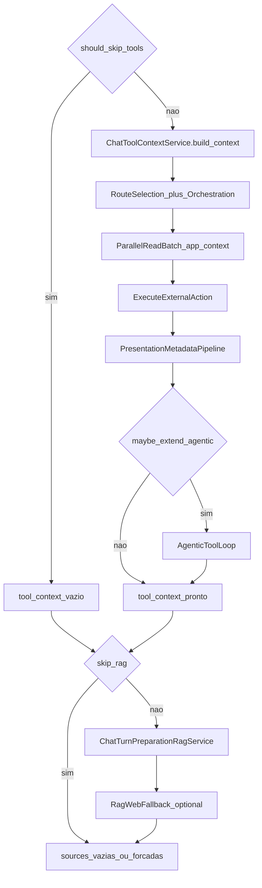

# 03 — Tools, RAG e agentic

## Objetivo

Descrever execução de tools no turno, multi-action / parallel reads, extensão agentic, RAG e fallback web.

## Diagrama

## Entrada / saída

| Entrada | Saída |
|---------|--------|
| Mensagem, `allowedActionIds`, access token, workspace | `tool_context.toolCalls[]` (com metadata de apresentação), `sources`, `agentic` stats |

## Serviços canônicos

| Serviço | Papel |
|---------|--------|
| `ChatTurnPreparationToolRoutingService` | Skip flags + `run_tool_phase` |
| `ChatToolContextService` | Seleção / execução de tools |
| `ChatExternalActionOrchestrationService` | Plano multi-rota + merge `turnAnalysisActionIds` + continuation Fast |
| `ChatMultiIntentContinuationService` | Limite por modo → chips «também consultar» |
| `ChatToolContextParallelReadService` | Batch HTTP paralelo **com** `flask_app.app_context()` |
| `ExecuteExternalActionUseCase` | HTTP api-delpi + presentation |
| `chat_agentic_tool_loop_service` | Extensão pós-tools |
| `ChatTurnPreparationRagService` | RAG documental / skill |
| `ChatTurnPreparationRagWebFallbackService` | Web se RAG insuficiente |
| `ChatIntelligencePipelineService.finalize_after_tools` | Analysis mode + document vision enrich |

## Branches

### Skip tools

`should_skip_tools` quando há early direct / clarify / identity / session_review / agente inativo / text_task_pure / etc. — **exceto** `canvas_operational_update` (ainda precisa tools).

Chat **comum** (sem agente com actions): orientação operacional em vez de APIs DELPI (`common_chat_operational_guidance`).

### Multi-action e Fast

- `max_external_action_calls` / modo Rápida → teto 1 action por turno.
- Analysis pode propor N `actionIds`; merge acumula candidatos; `apply_limit` executa 1ª e grava continuation chips.
- Budget / settings: `multiActionEnabled`, `agenticLoopEnabled`.

### Parallel reads

Candidatos read-only seguros (`ChatWriteConfirmationService.is_parallel_safe_read`) → `ThreadPoolExecutor`. Workers **devem** herdar app context Flask (senão `Working outside of application context`).

### Agentic

Só após tools “normais”, se agente ativo + token + não bloqueado (small talk, utility, normas, chat comum sem tools). Gating também por clarify/narrate e plano já coberto.

### RAG

Roda se `!skip_rag`, ou força documental (identidade assistente, normas, desenho, project sources). Depois: web fallback se habilitado e miss.

### Famílias de fluxo (matriz)

Regressão: `FLOW_FAMILY_MATRIX_CASES` + `test_flow_family_matrix_gates.py` (web, text, API, skill, message_search). Harness: `scripts/check_flow_family_matrix_harness.py`.

## Metadata / SSE

- `toolCalls[]`: `name`, `arguments`, `metadata` (ok, presentation, errors).
- `intelligence.toolCount`, `agentic`, `nativeToolCalling`.
- Activity: planned actions, RAG searching, tool executing.
- Continuation: `multiIntentContinuationSuggestions` → interactivity group `continuar`.

## Fixtures / regressão

- Hybrid smoke: `scripts/smoke_hybrid_orchestration_ago2026.py`
- Parallel: `test_chat_tool_context_parallel_read_batches.py`
- Orchestration merge: `test_chat_external_action_orchestration_turn_analysis_merge.py`

## Links

- [chat-intelligence-base.md](../architecture/chat-intelligence-base.md) — matriz tools/RAG
- Apresentação pós-execute: [04](./04-operacional-e-apresentacao.md)
- Write confirmation: domínio em [05](./05-dominios-especializados.md)
- Regra: `operational-api-routing.mdc`
