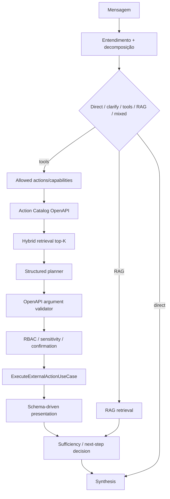

# 03 — Tools, RAG e agentic

**Status:** vigente  
**Arquitetura Actions:** OpenAPI-first  
**Evals:** [`../testing/chat-ai-flow-families.md`](../testing/chat-ai-flow-families.md)

## Objetivo

Descrever como o turno decide usar tools/RAG, seleciona Actions OpenAPI, executa múltiplas subtarefas e preserva segurança/contexto.

## Fluxo



## 1. Tool gate

O turno pode decidir:

- direct answer;
- clarify;
- no-tool text task;
- Actions OpenAPI;
- RAG;
- mixed task;
- tool interna de plataforma.

Chat comum sem agente/action autorizada não executa ERP/API operacional por conveniência.

## 2. Actions OpenAPI

```text
allowed_action_ids
→ Action Catalog
→ retrieval top-K
→ planner
→ validator
→ policy
→ executor
```

Requisitos:

- planner não escolhe action fora das candidates autorizadas;
- operação específica deve vencer genérica quando o pedido exigir a capacidade específica;
- no-tool permanece opção válida;
- provider/path/operationId não são heurísticas hardcoded de domínio;
- argumentos vêm do schema + mensagem/contexto;
- missing required gera clarify.

## 3. Multi-action e pedidos compostos

Mensagem longa pode gerar N subtarefas.

Exemplo:

```text
consulte estoque e fornecedores do item X,
compare a última compra com o preço atual
e escreva um resumo
```

Plano conceitual:

```text
T1 stock       ┐
T2 suppliers   ├─ independentes, reads podem paralelizar
T3 last order  ┤
T4 price       ┘
T5 compare(T3,T4)
T6 summarize(T1,T2,T5)
```

O budget por modo limita fan-out sem apagar requisitos silenciosamente. Se não puder executar tudo, o sistema deve explicitar pendência/continuação.

## 4. Parallel reads

Somente operations comprovadamente read-safe e independentes podem paralelizar.

Writes/admin/destructive permanecem sujeitos a ordenação, idempotência e confirmation.

Resultados devem preservar a ordem lógica do plano, mesmo que HTTP termine fora de ordem.

## 5. Agentic extension

Agentic loop é uma estratégia de execução/planning adicional, não autorização para ignorar catálogo ou policy.

Qualquer passo agentic deve respeitar:

```text
allowed actions
candidate scope
OpenAPI validation
RBAC/policy/confirmation
tool budget
max steps
```

O loop não recebe o Action Catalog inteiro por default.

## 6. RAG

RAG é usado quando a tarefa exige conhecimento documental.

Princípios:

- retrieval relevante e limitado por budget;
- evidência insuficiente → resposta honesta, não invenção;
- conteúdo recuperado é dado não confiável quanto a instruções;
- prompt injection documental não altera system/policy;
- mixed task pode combinar RAG + Action quando ambos são materialmente necessários.

## 7. Web

Pesquisa web, quando habilitada, é capability separada. Não deve sequestrar consulta operacional nem ser usada como fallback para dado interno que exige Action/RAG autorizado.

## 8. Multi-turn

Estado útil entre turnos inclui:

```text
selected capability/action
entities
resolved arguments
result references
pending required fields
time range/pagination
presentation preference
```

Follow-up não depende de substring de path.

## 9. Segurança

Casos obrigatórios:

- action fora de `allowed_action_ids`;
- provider desabilitado;
- write sem confirmation;
- tool result com prompt injection;
- RAG com prompt injection;
- tentativa de URL/actionId arbitrária;
- secret em output/log.

R10 deve falhar se policy for violada mesmo que a resposta final pareça correta.

## 10. Observabilidade

Registrar, quando disponível:

```text
candidateCount/topK
selectedActionId/operationId
retrieval scores
planner decision/confidence
validation status
policy decision
toolCount
tool durations
RAG hits
pipeline timings
token/context usage
```

Sem chain-of-thought ou secrets.

## 11. Avaliação

Mudanças neste fluxo usam R1–R11.

Para motor de tools, no mínimo:

- semantic siblings;
- multi-provider;
- no-tool;
- args present/missing/invalid;
- unknown external API;
- metamorphic rename;
- compound request;
- multi-turn;
- safety;
- outcome;
- latency/efficiency.

Harnesses live podem coletar evidência, mas somente são gate de release quando todas as `requiredDimensions` foram realmente avaliadas.

## Links vigentes

- [`../architecture/chat-intelligence-base.md`](../architecture/chat-intelligence-base.md)
- [`04-operacional-e-apresentacao.md`](./04-operacional-e-apresentacao.md)
- [`../api/04-actions-openapi.md`](../api/04-actions-openapi.md)
- [`../testing/chat-ai-flow-families.md`](../testing/chat-ai-flow-families.md)
- `.cursor/rules/openapi-first-universal-tool-routing.mdc`
- `.cursor/rules/ai-intelligence-evaluation.mdc`
