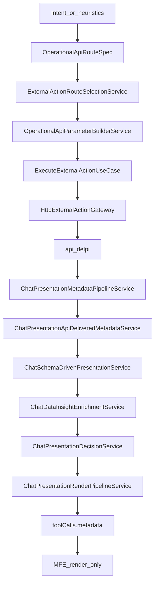

# 04 — Operacional e apresentação

## Objetivo

Mapear o caminho **intenção → rota api-delpi → execução HTTP → metadata schema-first → MFE render-only**.

## Diagrama

## Entrada / saída

| Entrada | Saída |
|---------|--------|
| Mensagem + código/filial/datas + `allowedActionIds` | Action HTTP + `toolCalls[].metadata` (`renderPlan`, `presentationDecision`, `dataAnswer`, coverage) |

## Serviços canônicos

| Camada | Módulo |
|--------|--------|
| Vocabulário | `api_route_domains.json`, `operational_route_registry.json` |
| Spec / params | `OperationalApiRouteSpec`, `OperationalApiParameterBuilderService` |
| Seleção | `ExternalActionSelectionService`, `ExternalActionRouteSelectionService` |
| Execução | `ExecuteExternalActionUseCase`, `HttpExternalActionGateway` |
| Pipeline único | `ChatPresentationMetadataPipelineService` → delivered → schema-driven → insight → decision → finalize |
| Shape / rows | `ChatSchemaDrivenPresentationService.extract_tabular_rows` + `presenter_content.json` (`singleRecordObjectKeys`, `tabularListKeys`) |
| Completude | `ChatOperationalResultCompletenessService`, `ChatDataCoverageNoticeService` |
| MFE | `chatPresentation.ts` — **não** redecide formato |

## Branches

1. **Chat comum sem agente:** não chama api-delpi; orientação (`common_chat_operational_guidance`).
2. **Segmento de rota:** `ChatRouteContextService.segment_from_message` pode forçar path (ex.: notas fiscais → outbound-invoice) antes do rank semântico.
3. **Herança de código:** follow-up reusa produto do histórico / `operationalFocus` / context items — não `lastEntities`.
4. **Lista vazia real:** `items=[]` + `ok=True` → empty honesto (dado TOTVS).
5. **Falso-vazio (evitar):** envelope `data.product` precisa estar em `singleRecordObjectKeys` (shape `product_snapshot`).
6. **Proibido:** `*_presenter.py` por rota, `visualBuilders` / `tableAssembly`, `if "/products/"` no use case ou MFE.

## Metadata / SSE

- `metadata.apiRouteDomain` no tool call.
- `presentationDecision.selected` (`table` | `kpi` | `text` | …).
- `renderPlan`, `dataCoverageNotice`, `suppressedKinds`.
- Activity: «consultando dados autorizados» / planned actions.

## Fixtures / regressão

- `tests/fixtures/api_delpi_responses/*.json`
- Gates: `audit_presentation_coverage.py --check-profiles`, `generate_operational_route_registry.py --check`
- Checklist nova rota: [new-api-route-checklist.md](../architecture/new-api-route-checklist.md) + regra `new-api-route-checklist.mdc`

## Links

- [presentation-delivered-pure-jun2026.md](../architecture/presentation-delivered-pure-jun2026.md) — **pipeline ativo**
- [chat-assistant-content-presentation.md](../architecture/chat-assistant-content-presentation.md)
- [playbook-10](../roadmap/playbook-10-contrato-respostas-api-delpi.md) · [playbook-15](../roadmap/playbook-15-rotas-operacionais-sem-sql.md) · [playbook-22](../roadmap/playbook-22-schema-first-api-actions-jun2026.md)
- MFE: [chat-presentation-hub.md](../../../plugins/minha-delpi-chat/docs/chat-presentation-hub.md)
- Regras: `schema-first-presentation-delivered.mdc`, `operational-api-routing.mdc`, `presentation-operational-decoupling.mdc`
