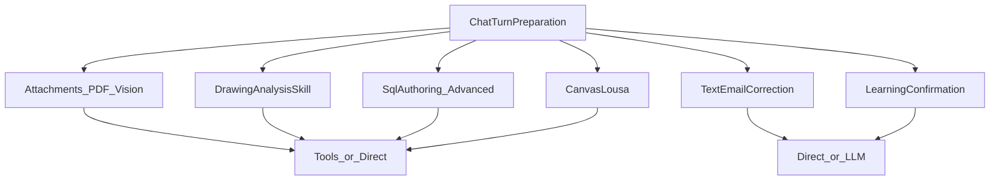
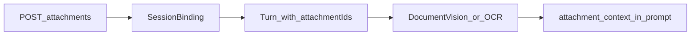
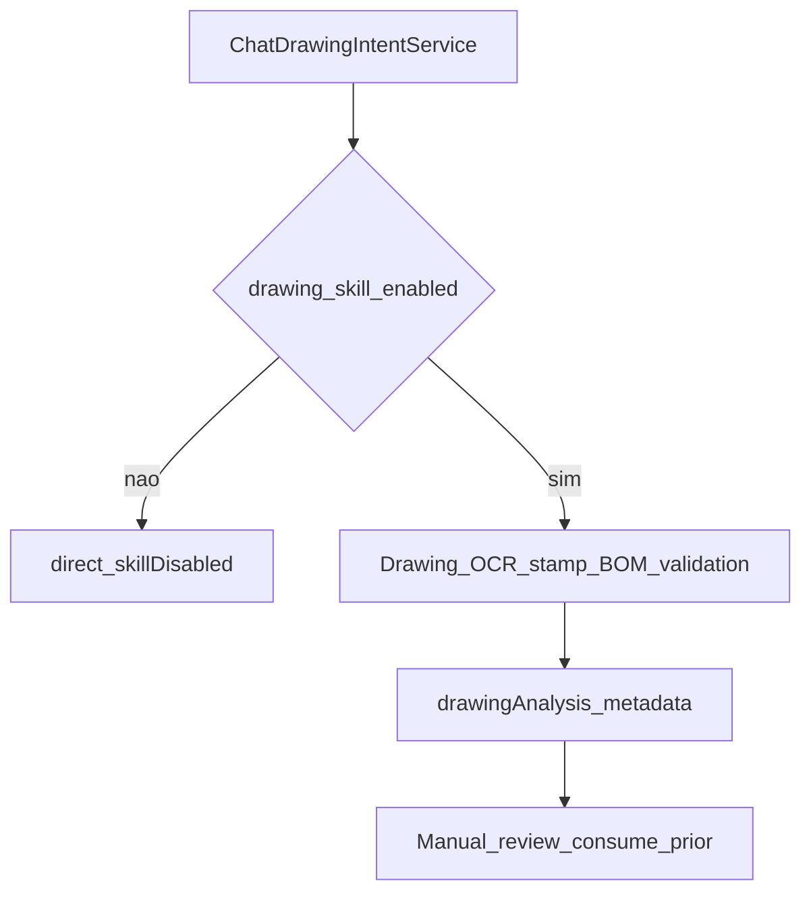
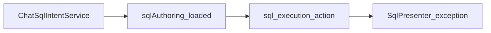
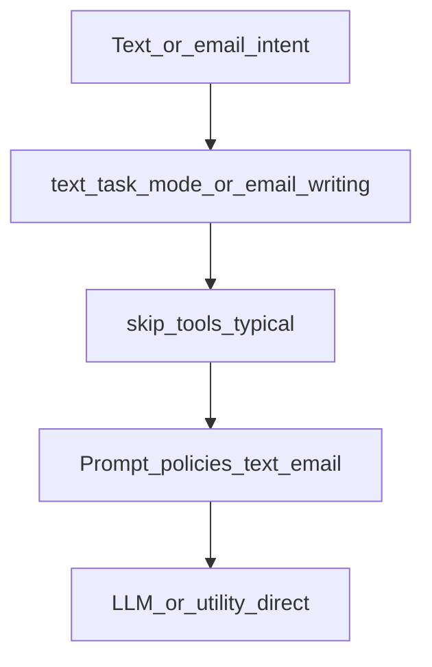
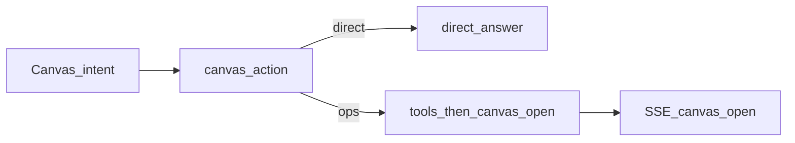

# 05 — Domínios especializados

## Objetivo

Mapear subfluxos que entram no turno canônico sem duplicar o pipeline base: anexos/visão, desenho, SQL, texto/e-mail, canvas e learning.

## Diagrama — visão geral

---

## Anexos / PDF / visão

### Objetivo

Upload e leitura de anexos no turno (OCR / document vision).

### Diagrama

### Serviços

| Serviço | Papel |
|---------|--------|
| Create/list/download attachment use cases | Persistência + volume |
| `ChatDocumentVisionTurnService` | Visão / OCR com app context |
| Policies de ingest | `GET /chat/ingest/policy` |

### Links

- [chat-pdf-document-extraction.md](../architecture/chat-pdf-document-extraction.md)
- Storage: [operations/chat-attachment-storage.md](../operations/chat-attachment-storage.md)
- Regra: `persistent-upload-storage.mdc`

---

## Skill desenho DELPI

### Objetivo

Validar PDF de desenho × Protheus / normas.

### Diagrama

### Serviços

`ChatDrawingIntentService`, serviços de stamp/validation, `ChatDrawingAdminDebugService`, content `drawing_*.json`.

### Links

- Docs `architecture/chat-drawing-*`
- Playbooks desenho em `roadmap/melhorias/`

---

## SQL (agente + skill)

### Objetivo

Autoría / execução SQL via action + policies de skill.

### Diagrama

### Branches

- Skill enabled ≠ loaded: composition + turn analysis.
- Erros SQL: `sql_execution_errors.json` + classifiers.
- Write / confirmação: `ChatWriteConfirmationService`.

### Links

- [playbook-especialista-sql-avancado.md](../roadmap/playbook-especialista-sql-avancado.md)
- Vocabulary: [vocabulary-centralization-jun2026.md](../architecture/vocabulary-centralization-jun2026.md)

---

## Text task / e-mail / correção

### Objetivo

Modos de escrita administrativa sem tools operacionais (salvo exceções).

### Diagrama

### Links

- [email-writing.md](../architecture/email-writing.md)
- [text-correction.md](../architecture/text-correction.md)
- Typing HTTP: `POST /chat/typing-suggestions`

---

## Canvas / lousa

### Objetivo

Abrir/atualizar canvas a partir do turno (tools ou pedido explícito).

### Diagrama

### Links

- [playbook-05-anexos-lousa.md](../roadmap/playbook-05-anexos-lousa.md)

---

## Learning confirmation (herança)

### Objetivo

Confirmação humana de termos / candidatos de aprendizagem.

### Serviços

Learning stages no prep; admin `/admin/learning/*`; content `learning_content.json`.

### Links

- [continuous-learning.md](../architecture/continuous-learning.md)
- [api/08-admin.md](../api/08-admin.md)

---

## Metadata / SSE (comum)

Stages por domínio (`drawing_analysis`, `document_vision`, text modes). Metadata específica (ex.: `drawingAnalysis`, `documentVision`) anexada no completion.

## Fixtures / regressão

- Drawing PDF: `tests/support/drawing_pdf_fixtures.py`
- FLOW_FAMILY_MATRIX (skill / text)
- Hybrid / product fixtures conforme domínio

## Links gerais

- Hub: [README](./README.md)
- Turno: [01](./01-turno-canonico-send-stream.md) · Prep: [02](./02-inteligencia-pre-llm.md)
