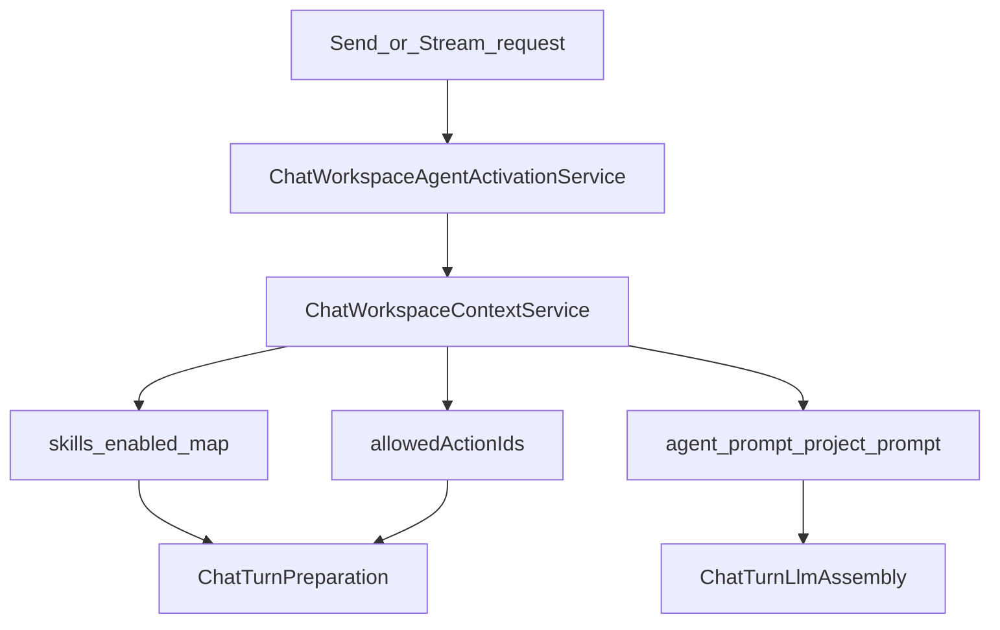

# 06 — Workspace, agente e admin

## Objetivo

Mapear ativação de agente/projeto no turno, simulação admin, settings de inteligência e rotas internas S2S.

## Diagrama — ativação no turno

## Entrada / saída

| Entrada | Saída |
|---------|--------|
| `agentId` / `projectId` no body ou sessão | `workspace_context` (skills, actions, specialization, working memory) |
| Simulate body (`question`, agent, flags) | Preview: planned tools, turnAnalysis, prompt comparison, chips |

## Serviços canônicos

| Serviço | Papel |
|---------|--------|
| `ChatWorkspaceAgentActivationService` | Escolha explícita de agente (não default silencioso de projeto) |
| `ChatWorkspaceContextService` | Monta contexto do turno |
| `ChatHostSurfaceContextService` | Superfície embarcada (ex.: TV copilot) |
| `AdminAgentSimulateUseCase` | Simulação — **mesmo** `ChatTurnPreparationTurnAnalysisService` |
| `ChatIntelligenceSettingsService` | Snapshot admin (incl. `turnAnalysisEnabled`) |
| `ExternalActionImportJobService` | Sync OpenAPI S2S |
| Suggest operational routes / params use cases | TV / consoles |

## Branches

### Chat comum vs agente

- Sem agente com actions: sem api-delpi; orientação + RAG/texto/anexos/web conforme flags.
- Com agente: `allowedActionIds` filtram seleção; skills enabled ∩ loaded.

### Projeto

- Binding de projeto na sessão; fontes do projeto → RAG / inventário.
- **Proibido** ativar agente default do projeto sem escolha do usuário (`chatAgentActivation` no MFE + service na API).

### Simulate

- `POST /admin/agent/simulate`.
- Clarify: `skippedTools` + `routingDisambiguationSuggestions`.
- Execute: planeja actions a partir de `turnAnalysis.actionIds` (sandbox opcional).
- Unit tests: `allow_compose_gateway=False` evita LLM real.

### Settings

- Defaults de `.env` + override admin: `GET/PUT` intelligence-settings.
- Campos relevantes ao fluxo híbrido: `turnAnalysisEnabled`, `agenticLoopEnabled`, `multiActionEnabled`, RAG/web flags.

### Internos S2S

| Path | Auth | Uso |
|------|------|-----|
| `/chat/internal/openapi/sync-api-delpi` | service token | api-delpi após mudança OpenAPI |
| `/chat/internal/operational-routes/suggest` | service token | NL → operationIds |
| `/chat/internal/operational-routes/suggest-params` | service token | NL → params |

## Metadata / SSE

- `adminDebug` (quando permitido): pipeline, tooling, `intelligence.skillsLoaded`, turnAnalysis.
- Simulate devolve espelho estruturado (não SSE).

## Fixtures / regressão

- `test_admin_agent_simulate_use_case.py`
- `test_chat_intelligence_settings_resolver.py`
- Smoke hybrid com `SMOKE_AGENT_ID` / primeiro agente enabled

## Links

- [session-memory.md](../architecture/session-memory.md) · [contexto-vs-entidades.md](../architecture/contexto-vs-entidades.md)
- [api/03-agentes.md](../api/03-agentes.md) · [api/08-admin.md](../api/08-admin.md) · [api/04-actions-openapi.md](../api/04-actions-openapi.md)
- ADR-001: [adr/001-chat-base-intelligence.md](../architecture/adr/001-chat-base-intelligence.md)
- MFE ativação: `plugins/minha-delpi-chat` → `chatAgentActivation.ts`
- Hub fluxos: [README](./README.md)
