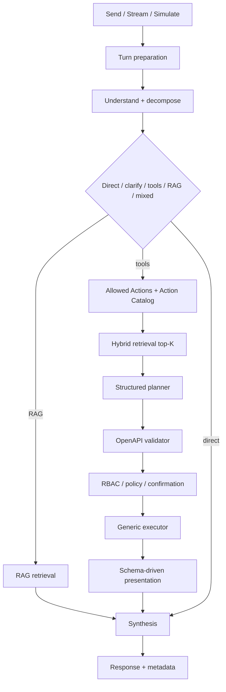

# Fluxos da Minha DELPI AI API

**Status:** vigente  
**Papel:** mapa operacional HTTP → turno → inteligência → tools/RAG → apresentação  
**Evals:** [`../testing/chat-ai-flow-families.md`](../testing/chat-ai-flow-families.md)

Base pública: `/apps/minha-delpi-ai/api`

## Navegação

| Necessidade | Documento |
|-------------|-----------|
| Superfície HTTP | [`00-superficie-http.md`](./00-superficie-http.md) |
| Send/stream | [`01-turno-canonico-send-stream.md`](./01-turno-canonico-send-stream.md) |
| Inteligência pré-LLM | [`02-inteligencia-pre-llm.md`](./02-inteligencia-pre-llm.md) |
| Tools, RAG e agentic | [`03-tools-rag-agentic.md`](./03-tools-rag-agentic.md) |
| Actions + apresentação | [`04-operacional-e-apresentacao.md`](./04-operacional-e-apresentacao.md) |
| Domínios especializados | [`05-dominios-especializados.md`](./05-dominios-especializados.md) |
| Workspace/agente/admin | [`06-workspace-agente-admin.md`](./06-workspace-agente-admin.md) |
| Arquitetura base | [`../architecture/chat-intelligence-base.md`](../architecture/chat-intelligence-base.md) |
| API Actions OpenAPI | [`../api/04-actions-openapi.md`](../api/04-actions-openapi.md) |
| Protocolo de avaliação | **[`../testing/chat-ai-flow-families.md`](../testing/chat-ai-flow-families.md) — R1–R11** |

## Fluxo geral

## Princípios

- inteligência transversal vive no chat base;
- agentes adicionam especialização/actions, não um pipeline paralelo;
- send/stream/simulate compartilham a mesma decisão semântica;
- Actions externas seguem OpenAPI-first;
- pedidos compostos são decompostos em subtarefas;
- follow-up usa contexto estruturado;
- apresentação é schema-driven e MFE render-only;
- segurança/policy não pode ser relaxada por prompt/tool/RAG;
- qualidade é avaliada por R1–R11.

## Matriz de fluxo × avaliação

| Fluxo | Dimensões especialmente relevantes |
|-------|--------------------------------------|
| Direct answer | R1, R2, R4, R8, R11 |
| Action read | R1, R2, R3, R4, R8, R9, R10, R11 |
| Write/admin | R1, R2, R3, R4, R8, R9, R10, R11 |
| RAG | R1, R4, R6, R8, R9, R10, R11 |
| Follow-up | R1, R4, R6, R8, R9 + tools/args quando aplicável |
| Presentation | R4, R5, R7 quando aplicável, R8, R9 |
| Simulate/parity | R1–R7 aplicáveis + R9/R10 |
| Compound request | R1, R2, R3, R4, R6, R8, R9, R10, R11 |

## Regras Cursor relacionadas

- `chat-intelligence-base.mdc`
- `openapi-first-universal-tool-routing.mdc`
- `ai-intelligence-evaluation.mdc`
- `clean-architecture-chat-api.mdc`
- `schema-first-presentation-delivered.mdc`
- `ai-external-tools-security.mdc`
- `ai-context-and-tool-budget.mdc`

Roadmaps e outputs históricos não são critérios de implementação ou PASS.
