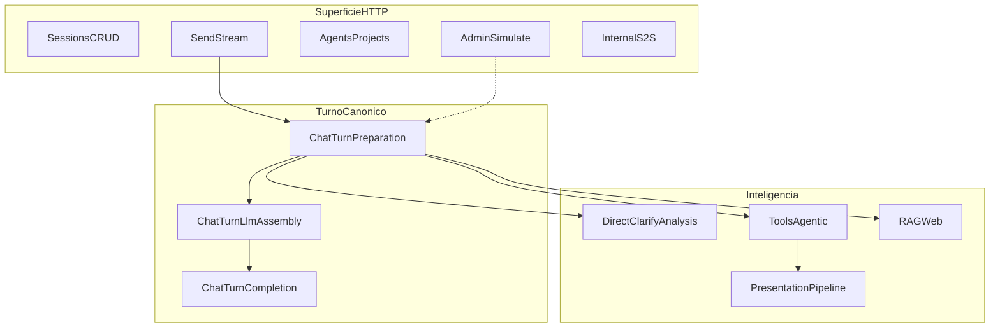

# Fluxos da API do chat — mapa operacional

> **Pacote:** `minha-delpi-ai-api`  
> **Papel:** mapas **vigentes** de fluxo (HTTP → turno → inteligência → apresentação).  
> **Não substitui:** playbooks em `docs/roadmap/` nem ADRs — aponta para eles.

Base pública (gateway): `/apps/minha-delpi-ai/api`  
Blueprint chat: `/chat` → URL pública `/apps/minha-delpi-ai/api/chat`

---

## Como usar

| Precisa de… | Abra |
|-------------|------|
| Inventário de rotas por domínio | [00-superficie-http.md](./00-superficie-http.md) |
| Send sync vs stream SSE | [01-turno-canonico-send-stream.md](./01-turno-canonico-send-stream.md) |
| Direct answer, clarify, turn analysis, modos | [02-inteligencia-pre-llm.md](./02-inteligencia-pre-llm.md) |
| Tools, multi-action, parallel, agentic, RAG, web | [03-tools-rag-agentic.md](./03-tools-rag-agentic.md) |
| api-delpi + apresentação schema-first | [04-operacional-e-apresentacao.md](./04-operacional-e-apresentacao.md) |
| Anexos, desenho, SQL, texto, canvas, learning | [05-dominios-especializados.md](./05-dominios-especializados.md) |
| Agente/projeto, simulate, settings, S2S | [06-workspace-agente-admin.md](./06-workspace-agente-admin.md) |
| Código morto removido + dívida de padrão | [07-higiene-codigo-e-padroes.md](./07-higiene-codigo-e-padroes.md) |
| Pipeline e serviços (~200) | [../architecture/chat-intelligence-base.md](../architecture/chat-intelligence-base.md) |
| Contrato HTTP detalhado | [../api/README.md](../api/README.md) |
| Auditoria famílias F01–F24 + **critérios R1–R8** (smoke live) | [../roadmap/audit-chat-base-familias-fluxos-set2026.md](../roadmap/audit-chat-base-familias-fluxos-set2026.md) § 1.1 |
| **Bateria interação humana simulada** (HTTP live) | [../roadmap/audit-chat-base-familias-fluxos-set2026.md](../roadmap/audit-chat-base-familias-fluxos-set2026.md) § 1.3 · `scripts/human_interaction_battery_live.py` |

---

## Visão geral

**Princípio:** inteligência transversal no **chat base**; agentes só filtram actions/skills/prompt. Ver ADR-001 e regra Cursor `chat-intelligence-base.mdc`.

---

## Matriz de fluxos transversais

| Fluxo | Superfície HTTP | Caminho canônico | P0 / herança / fora | Doc |
|-------|-----------------|------------------|---------------------|-----|
| Sessão, memória, pin | `/chat/sessions*` | session use cases | P0 | [00](./00-superficie-http.md) |
| Send sync | `POST .../messages` | `SendChatMessageUseCase` → prep → assemble → complete | P0 | [01](./01-turno-canonico-send-stream.md) |
| Stream SSE | `POST .../messages/stream` (+ resend/cancel) | `ChatStreamTurnExecutionService` | P0 | [01](./01-turno-canonico-send-stream.md) |
| Direct / clarify / chips | metadata + interactivity | prep + `ChatUnclearRequestService` | P0 | [02](./02-inteligencia-pre-llm.md) |
| Turn analysis híbrida | (interno ao prep) | `ChatTurnPreparationTurnAnalysisService` | P0 | [02](./02-inteligencia-pre-llm.md) |
| Tools + multi-action + parallel | toolCalls | `ChatToolContextService` + orchestration | P0 | [03](./03-tools-rag-agentic.md) |
| RAG / web fallback | sources | `ChatTurnPreparationRagService` | P0 | [03](./03-tools-rag-agentic.md) |
| Operacional api-delpi | execute_external_action | route selection → execute → presentation | P0 | [04](./04-operacional-e-apresentacao.md) |
| Apresentação schema-first | toolCalls[].metadata | `ChatPresentationMetadataPipelineService` | P0 | [04](./04-operacional-e-apresentacao.md) |
| Agentic loop | pós-tools | `chat_agentic_tool_loop_service` | P0 | [03](./03-tools-rag-agentic.md) |
| Ativação agente / projeto | session + agentId | `ChatWorkspaceAgentActivationService` | P0 | [06](./06-workspace-agente-admin.md) |
| Anexos / PDF / visão / desenho | attachments + stages | drawing / document vision | P0 | [05](./05-dominios-especializados.md) |
| Text / e-mail / correção | modes no prep | text/email policies | P0 | [05](./05-dominios-especializados.md) |
| Canvas / lousa | canvas metadata | canvas services | P0 | [05](./05-dominios-especializados.md) |
| Learning confirmation | learning stages | learning services | herança | [05](./05-dominios-especializados.md) |
| Admin simulate / settings | `/admin/agent/simulate`, intelligence-settings | simulate UC | P0 | [06](./06-workspace-agente-admin.md) |
| Higiene / dívida de padrão | (mapa, não fluxo HTTP) | inventário + remoções conscientes | herança | [07](./07-higiene-codigo-e-padroes.md) |
| S2S OpenAPI / suggest | `/chat/internal/*` | import job + suggest UC | P0 | [06](./06-workspace-agente-admin.md) |
| CRUD agentes/projetos/skills | `/chat/agents*`, projects | use cases CRUD | P0 inventário | [00](./00-superficie-http.md) + [api](../api/) |
| Admin RBAC / métricas | `/admin/*` (demais) | inventário + link API | herança | [00](./00-superficie-http.md) → [08-admin](../api/08-admin.md) |
| MFE render-only | fora desta API | hub MFE | fora | [chat-presentation-hub](../../../plugins/minha-delpi-chat/docs/chat-presentation-hub.md) |

---

## Índice dos documentos

1. [00 — Superfície HTTP](./00-superficie-http.md)
2. [01 — Turno canônico send/stream](./01-turno-canonico-send-stream.md)
3. [02 — Inteligência pré-LLM](./02-inteligencia-pre-llm.md)
4. [03 — Tools, RAG e agentic](./03-tools-rag-agentic.md)
5. [04 — Operacional e apresentação](./04-operacional-e-apresentacao.md)
6. [05 — Domínios especializados](./05-dominios-especializados.md)
7. [06 — Workspace, agente e admin](./06-workspace-agente-admin.md)
8. [07 — Higiene de código e padrões](./07-higiene-codigo-e-padroes.md)

---

## Regras Cursor relacionadas

- `chat-intelligence-base.mdc`
- `clean-architecture-chat-api.mdc`
- `schema-first-presentation-delivered.mdc`
- `operational-api-routing.mdc`
- `assistant-content-json.mdc`
- `centralized-rules-first.mdc`
