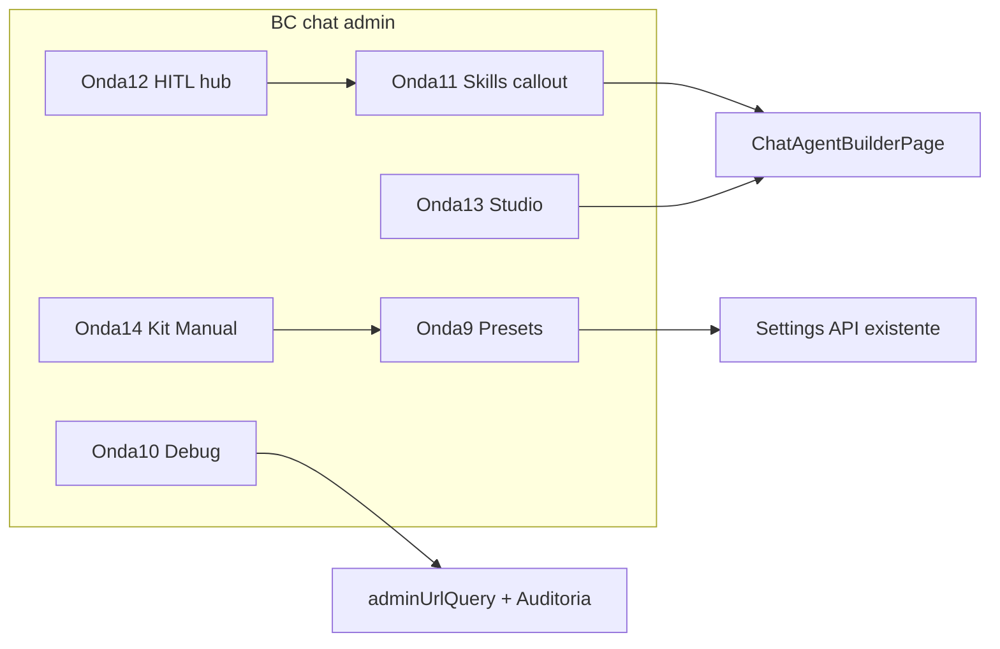

# Plano de implementação — restante do BC admin do chat

**Data:** 2026-09-08  
**Bounded context:** `minha-delpi-ai-api` + `plugins/minha-delpi-chat` (admin do chat)  
**Fonte do veredito:** [admin-fluxos-revisao.md](./admin-fluxos-revisao.md)  
**Escopo deste documento:** planejar e detalhar **como implementar** o que ainda falta após as ondas **1–8**. **Não** é implementação de código.

---

## 1. Leitura do pedido

| Campo | Conteúdo |
|-------|----------|
| Objetivo | Documentar o backlog restante do BC admin e o plano executável (ondas 9+) |
| Subobjetivos | Priorizar; travar decisões; receita por subetapa; sync de Ajuda; critérios de pronto |
| Restrições | Sem `core-api` (RBAC formal); sem segundo pipeline de inteligência; paths/query EN; kit-first; `feature-help-sync` |
| Dependências | Ondas 1–8 já entregues; APIs admin existentes; `chatIntelligenceSettingMeta`; Studio builder |
| Entregável deste arquivo | Plano `.md` + ponteiros no roadmap |
| Aceite | Implementador consegue executar cada `E*.S*` sem improvisar módulo canônico |

---

## 2. Estado confirmado (ondas 1–8)

| # | Onda | Status |
|---|------|--------|
| 1 | Studio agente (MVP) | Entregue |
| 2 | Observe métricas | Entregue |
| 3 | Fine-tune honesto | Entregue |
| 4 / 4b | Ajuda tooltips + aliases EN | Entregue |
| 5 | Kit dual-class + higiene Legacy | Entregue (MVP) |
| 6 | RBAC formal core-api | **Fora do BC** |
| 7 | Fila de atenção no Painel | Entregue (MVP) |
| 8 | Deep link query filtros | Entregue |

Evidência: `admin-fluxos-revisao.md` §6 · código em `plugins/minha-delpi-chat/src/navigation/adminUrlQuery.ts`, `overview/attentionQueue.ts`, `adminNavigation.ts`.

---

## 3. Evidências vs hipóteses (gaps restantes)

| Gap | Classificação | Evidência |
|-----|---------------|-----------|
| Sem presets Rápido/Equilibrado/Máxima em Inteligência | `CONFIRMADO_NO_CODIGO` | `ChatIntelligenceSettingsPanel` + `chatIntelligenceSettingMeta` — knobs flat, sem preset |
| Debug: chips + JSON sempre; sem “abrir no admin” | `CONFIRMADO_NO_CODIGO` | `ChatAdminDebugPanel.tsx` |
| Skills global sem CTA Studio | `CONFIRMADO_NO_CODIGO` | `AdminSkillsTab` vs Agents/Tools com Abrir Studio |
| HITL unificado | `CONFIRMADO_NO_CODIGO` | Evals / Learning / thumbs em superfícies separadas |
| Studio ficha única completa | `CONFIRMADO_NO_CODIGO` (parcial) | Especialização no builder existe; catálogo admin ainda paralelo |
| Traces em métricas | `HIPOTESE_A_VALIDAR` | Observabilidade parcial; falta inventário de API de traces antes de UI |
| Kit total `admin/shared` | `CONFIRMADO_NO_CODIGO` | Só header/KPI dual-class |
| Manual por persona | `CONFIRMADO_NO_CODIGO` | Só `adminHelpTooltips` |
| Custo anômalo na fila | `CONFIRMADO_NO_CODIGO` | Sem baseline na API |
| RBAC formal | `CONFIRMADO_EM_DOCUMENTACAO` | Fora do BC (`melhorias-futuras.md`) |

---

## 4. Diretrizes `.cursor` que travam implementação

| Regra | Implicação |
|-------|------------|
| `chat-intelligence-base` | Presets e debug **não** reimplementam pipeline; admin configura/observa |
| `llm-stack-centralized` | Sem seletor de host LLM no admin |
| `centralized-rules-first` | Presets = patch de settings via contrato já persistido + meta; não segundo settings store |
| `english-code-identifiers` | Keys/arquivos novos EN; PT só copy/Ajuda |
| `feature-help-sync` | Toda onda user-facing atualiza `adminHelpTooltips` (+ Manual se criado) |
| `plugins-reusable-components` | Kit `@delpi/plugin-ui`; dual-class; zero CSS espelho do kit |
| `plugin-mfe-page-excellence` | URL/deep link antes de polish; não one-shot destrutivo de query |
| `application-bounded-context-decoupling` | Não alterar core-api “para alinhar” admin do chat |
| `test-and-commit` | Teste do pacote antes do commit; commit só se pedido |

---

## 5. Decisões travadas

| Decisão | Escolha |
|--------|---------|
| Ordem das próximas ondas | **9 presets → 10 debug → 11 skills/Studio callout → 12 HITL landing → 13 Studio deepen → 14 kit/Manual** |
| Presets | Só MFE + payload do settings API existente; presets = conjuntos nomeados de toggles/números derivados de `chatIntelligenceSettingMeta` |
| Persistência de preset | Gravar **valores** dos knobs (não só o nome do preset); nome opcional em metadata local/UI se o contrato permitir |
| Debug JSON | Oculto atrás de “Avançado” (localStorage ou query `debugAdvanced=1`); CTA “Abrir auditoria” quando houver `traceId`/`sessionId` |
| HITL | Nova página/landing sob Qualidade ou Conhecimento **sem** fundir tabelas; hub com atalhos |
| Traces | Só após inventário de endpoint; senão fora desta série |
| Custo anômalo | Bloqueado até baseline API |
| RBAC | Fora — documentar dependência em `melhorias-futuras.md` |
| Protocolo | Cada `E*.S*` = implement + teste + Ajuda + commit separado (quando o usuário pedir commit) |

---

## 6. Matriz de fluxos transversais

| Fluxo | Superfície | Caminho | P0 / herança / fora |
|-------|------------|---------|---------------------|
| Preset inteligência | Admin Plataforma → Inteligência | `ChatIntelligenceSettingsPanel` → PUT settings | P0 onda 9 |
| Preset afeta chat live | Turn prep / settings service | Contrato settings existente | Herança (sem mudar semântica) |
| Debug bolha | Chat comum | `ChatAdminDebugPanel` | P0 onda 10 |
| Abrir admin do trace | Bolha → Auditoria | `buildAdminHref` + `adminUrlQuery` (`traceId`) | P0 onda 10 |
| Skills global × Studio | Admin Comportamentos + Builder | Callout + `buildChatAgentHref` | P0 onda 11 |
| HITL hub | Admin Qualidade/Conhecimento | Nova landing + links | P0 onda 12 |
| Studio ficha | Builder | Especialização já; unificar CTAs | P1 onda 13 |
| Ajuda | `adminHelpTooltips` / Manual | Sync obrigatório | Satélite toda onda |
| Send/stream | Pipeline chat | Não alterar na série admin | Fora |
| core-api RBAC | Portal | — | Fora |

---

## 7. Ondas e receitas

### E9 — Presets de inteligência

#### E9.S1 — Catálogo de presets (puro)

- **Objetivo:** Definir três presets + modo Avançado sem UI ainda.
- **Fazer:**
  1. Criar `plugins/minha-delpi-chat/src/ui/components/admin/metrics-tab/chatIntelligencePresets.ts`.
  2. Exportar `INTELLIGENCE_PRESETS`: `fast` | `balanced` | `max_quality` com patches parciais de toggles/números alinhados a `chatIntelligenceSettingMeta`.
  3. Função `detectPreset(settings) → key | "custom"`.
  4. Textos PT de labels em `adminHelpTooltips` ou `adminIntelligenceContent.ts` (não hardcoded espalhado).
- **Não fazer:** Novo endpoint; alterar `LLM_PROVIDER`; preset = só label sem patch.
- **Evidência:** Arquivo puro + teste detecta balanced vs custom.
- **Teste:** `vitest` `chatIntelligencePresets.test.ts` (positivo / negativo / irmão).
- **Pronto quando:** Três patches + `detectPreset` cobertos.
- **Commit:** `Adiciona catálogo de presets de inteligência do admin.`

#### E9.S2 — UI Presets + Avançado

- **Objetivo:** Seletor no painel; Avançado mostra knobs atuais.
- **Fazer:**
  1. Estender `ChatIntelligenceSettingsPanel.tsx`: segment control Preset + checkbox/toggle “Avançado”.
  2. Aplicar preset → merge no draft → save existente.
  3. `helpHint={ADMIN_HELP.intelligence}` atualizado.
- **Não fazer:** Duplicar save; esconder knobs sem caminho Avançado.
- **Evidência:** Save usa o mesmo PUT; detectPreset após load.
- **Teste:** Unitário do merge; smoke manual Plataforma → Inteligência.
- **Pronto quando:** Trocar preset altera toggles e persiste; Avançado revela knobs.
- **Commit:** `Expõe presets Rápido/Equilibrado/Máxima no admin de inteligência.`

---

### E10 — Debug na conversa

#### E10.S1 — JSON só avançado

- **Objetivo:** Trace resumido padrão; raw JSON atrás de controle.
- **Fazer:**
  1. `ChatAdminDebugPanel.tsx`: chips permanecem; `<pre>` só se `advanced` (localStorage key EN `mdcAdminDebugAdvanced` ou query).
  2. Toggle “Mostrar JSON avançado” no painel.
  3. Copy Ajuda curta se houver superfície de help do debug.
- **Não fazer:** Remover dados do payload; quebrar permissão admin.
- **Evidência:** Snapshot/teste de render condicional.
- **Teste:** Teste de componente ou função `shouldShowRawDebug`.
- **Pronto quando:** Default sem JSON; avançado mostra.
- **Commit:** `Oculta JSON bruto do debug admin atrás de modo avançado.`

#### E10.S2 — CTA Abrir no admin

- **Objetivo:** Deep link para Auditoria com `traceId` (e session se houver).
- **Fazer:**
  1. Botão “Abrir na auditoria” → `buildAdminHref({ governance, audit })` + `syncAuditFiltersToUrl({ traceId })` / navigate com query.
  2. Desabilitar se sem `traceId`.
- **Não fazer:** Embutir ficha de auditoria na bolha.
- **Evidência:** URL resultante contém `traceId`.
- **Teste:** Unitário do builder de href+query.
- **Pronto quando:** Clique abre admin/audit filtrado.
- **Commit:** `Liga o debug da bolha à auditoria via deep link.`

---

### E11 — Comportamentos global × agente

#### E11.S1 — Callout + helpHint

- **Objetivo:** Deixar explícito catálogo global vs skills do Studio.
- **Fazer:**
  1. `AdminSkillsTab`: `helpHint={ADMIN_HELP.behaviors}`; aside CTA “Abrir Studio” (lista agentes ou deep link agents).
  2. Ajustar description.
- **Não fazer:** Segundo CRUD de skills de agente no admin.
- **Evidência:** Paridade com Agents/Tools CTAs.
- **Teste:** Help tooltip key; smoke visual.
- **Pronto quando:** Usuário vê diferença global × agente sem ler código.
- **Commit:** `Explicitar skills globais versus Studio no admin.`

---

### E12 — HITL hub

#### E12.S1 — Landing Improve

- **Objetivo:** Entrada única para avaliações + aprendizagem (+ link thumbs se existir doc).
- **Fazer:**
  1. Nova página nested ou card no Painel/Qualidade: “Melhoria contínua” com 3 CTAs (`evaluations`, `learning/candidates`, métricas feedback).
  2. Nav em `adminNavPages` / tree se nested; slug EN.
  3. Ajuda.
- **Não fazer:** Fundir tabelas num único grid; mover APIs.
- **Evidência:** Deep links funcionam; sidebar coerente.
- **Teste:** `adminNavigation` parse/build da nova rota.
- **Pronto quando:** Um clique a partir do hub chega a cada fila.
- **Commit:** `Adiciona hub HITL de avaliações e aprendizagem no admin.`

---

### E13 — Studio deepen (P1)

#### E13.S1 — Reduzir paralelismo especialização

- **Objetivo:** Catálogo admin = descoberta; edição principal no Studio.
- **Fazer:**
  1. Reforçar CTA “Abrir Studio” / opcional redirect após save.
  2. Documentar no README admin a jornada canônica.
- **Não fazer:** Apagar API de especialização admin.
- **Teste:** Smoke + doc.
- **Commit:** `Consolida edição de especialização no Studio do agente.`

---

### E14 — Kit restante + Manual persona (P2)

#### E14.S1 — Dual-class DataTable / SummaryStrip

- **Objetivo:** Mais um primitivo admin no kit sem regressão visual.
- **Fazer:** `AdminDataTable` ou `AdminSummaryStrip` com `delpiUiClass`; rebuild remote se necessário.
- **Não fazer:** CSS `.delpi-ui-*` no MFE.
- **Commit:** `Aproxima primitivos admin do kit plugin-ui.`

#### E14.S2 — Manual curto por persona

- **Objetivo:** Curador / Plataforma / Auditor em conteúdo canônico.
- **Fazer:** `adminManualContent.ts` + rota `/admin` help ou painel; links para seções EN.
- **Não fazer:** Paths de API no Manual.
- **Commit:** `Adiciona Manual do admin por persona.`

---

### E15 — Verify-final (após onda pedida)

- Rebuild MFE (`up-*-sequential` fase mfe).
- Smoke: presets, debug, skills CTA, hub HITL, deep links.
- Tabela pass/fail vs objetivo da onda.
- Commit só se fix de regressão.

---

## 8. Fora do escopo (explícito)

| Item | Motivo |
|------|--------|
| RBAC perfis formais | BC `core-api` |
| Custo anômalo na fila | Sem baseline API |
| Traces UI | Precisa inventário de contrato primeiro |
| Seletor `LLM_PROVIDER` no admin | `llm-stack-centralized` |
| Notificações / Projetos | Outros BCs |
| Apagar endpoints metrics/learning | Remover da jornada ≠ apagar API |

---

## 9. Critérios de pronto da série

- [ ] Cada onda user-facing com Ajuda sincronizada
- [ ] Paths/query EN; aliases PT só onde já existir padrão
- [ ] Testes vitest (e API se tocar Python) verdes no pacote
- [ ] `admin-fluxos-revisao.md` §6 atualizado por onda
- [ ] Nenhum desvio de clean architecture sem confirmação explícita

---

## 10. Protocolo de execução

1. Marcar subetapa `in_progress`.
2. Implementar só o escopo da receita.
3. Testar.
4. Sync Ajuda se user-facing.
5. Commit + push **somente** quando o usuário pedir (mensagem PT, porquê).
6. Não agrupar duas `E*.S*` no mesmo commit.

---

## 11. Referências

- [admin-fluxos-revisao.md](./admin-fluxos-revisao.md)
- [admin-minha-delpi-chat.md](./admin-minha-delpi-chat.md)
- [melhorias-futuras.md](./melhorias-futuras.md) (RBAC core)
- MFE: `plugins/minha-delpi-chat/docs/admin-shell-navegacao.md`
- Regras: `development-standards-index.mdc`, `feature-help-sync.mdc`, `plugin-mfe-page-excellence.mdc`, `chat-intelligence-base.mdc`
