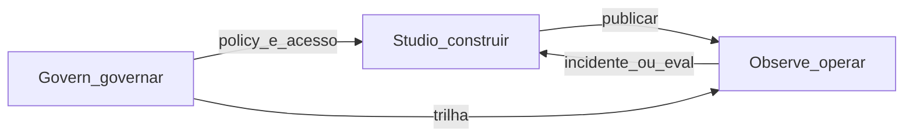

# Revisão dos fluxos de administração do chat

**Data:** 2026-09-04  
**Escopo desta entrega:** somente documentação (inventário + veredito). **Nenhuma** alteração de código MFE, API, JSON de runtime, CSS, rotas ou testes.

**Documentos relacionados**

- [admin-minha-delpi-chat.md](./admin-minha-delpi-chat.md) — roadmap histórico itens 1–15
- [melhorias-futuras.md](./melhorias-futuras.md) — pós-roadmap (thumbs, health, simulação avançada — já entregues; RBAC core pendente)
- [Playbook 11 — Admin UX](./melhorias/playbooks_melhoria_minha_delpi_chat/11_admin_ux_reorganizacao_abas.md) — diagnóstico histórico de 10 abas; shell de 6 seções já no código
- [API Admin](../api/08-admin.md) — contratos HTTP
- [Fluxo workspace / agente / admin](../flows/06-workspace-agente-admin.md)
- MFE: [`plugins/minha-delpi-chat/src/ui/components/admin/README.md`](../../../plugins/minha-delpi-chat/src/ui/components/admin/README.md) · [admin-shell-navegacao.md](../../../plugins/minha-delpi-chat/docs/admin-shell-navegacao.md)

---

## 1. O que esta revisão cobre (e o que não mudou)

### Cobre

- Painel admin do MFE (`/apps/minha-delpi-chat/admin/...`)
- Satélites de administração fora de `/admin` (builder de agente, debug na bolha)
- Superfície API admin (`/admin/*`) na medida em que sustenta cada fluxo de UI
- Classificação **manter / melhorar / remover da jornada** alinhada a padrão de mercado e às diretrizes `.cursor`

### Não mudou no código

- Nenhuma tela, endpoint, migration, flag ou teste foi alterado nesta entrega.
- “Remover da jornada” neste documento = recomendação futura (esconder / feature-flag / deprecar UX), **não** apagar API agora.

---

## 2. Diretrizes `.cursor` que travam decisões

| Regra | Implicação para o admin |
|-------|-------------------------|
| `chat-intelligence-base` | Simulação e inteligência transversal vivem no pipeline do chat; agente só filtra actions/skills. Admin configura, observa e simula — não reimplementa inteligência. |
| `clean-architecture-chat-api` | Send/stream/simulate compartilham serviços de turn prep; novos textos/reasons em `assistant/*.json`. |
| `llm-stack-centralized` | Motor = `LLM_PROVIDER` (hoje tipicamente `openai_compatible` / Kimi). Não inventar seletor paralelo no admin que ignore o stack. |
| `assistant-content-json` | Copy PT de API (reasons, activity, erros) em JSON; UI do admin em catálogo do plugin quando houver Ajuda. |
| `feature-help-sync` | Qualquer mudança user-facing futura do admin exige Ajuda in-app no mesmo entregável. **Hoje não há** Manual/tooltips do console admin. |
| `english-code-identifiers` | Paths/códigos **novos** em inglês; slugs PT atuais (`conhecimento`, `metricas`, …) são legado — alias EN em onda futura, sem rewrite destrutivo. |
| `plugins-reusable-components` / `plugins-visual-design-system` | Preferir kit `@delpi/plugin-ui`; admin ainda tem DS próprio em `admin/shared/` (Playbook 12) — convergência gradual. |
| `plugin-mfe-page-excellence` | P0 URL/deep link → P1 valor operacional → P2 higiene/Ajuda. |
| `application-bounded-context-decoupling` | Regra do admin do chat fica em `minha-delpi-ai-api` + `plugins/minha-delpi-chat`; não acoplar core/portal. |
| `evidence-driven-execution` / `centralized-rules-first` | Corrigir no módulo canônico; não patch pontual por aba. |

**Drift documentado (já existente no código)**

- Slugs de URL do admin em português (`adminNavigation.ts`).
- Sem `helpTooltips` / Manual do admin (só `ChatHelpPanel` do assistente).
- Primitivos admin locais em vez do kit federado.

---

## 3. Inventário — árvore real (CONFIRMADO_NO_CODIGO)

Shell: `admin-v3-sidebar` · orquestração: `ChatAdminPage.tsx` · navegação: `adminNavigation.ts`, `adminNavPages.ts`, `adminNavTree.ts`.

```
Painel
Conhecimento
  ├─ Documentos
  ├─ Diretrizes
  ├─ Comportamentos
  └─ Aprendizagem
       ├─ Pipeline
       ├─ Candidatos
       ├─ Vocabulário
       ├─ Memória
       ├─ Regressão
       └─ Ajuste fino
Agentes
  ├─ Especialização
  └─ Simulação
Qualidade
  ├─ Métricas
  └─ Avaliações
Plataforma
  ├─ Ferramentas
  ├─ Inteligência
  ├─ Modos de resposta
  └─ Visão e anexos
Governança
  ├─ Segurança
  └─ Auditoria
```

| Fluxo | Superfície MFE | API / serviço (referência) |
|-------|----------------|----------------------------|
| Painel | `AdminOverviewTab` | metrics summary, RBAC, security, tool health, evaluations summary |
| Documentos + ingestão + teste RAG | `AdminKnowledgeTab` | `/admin/knowledge/*`, `/admin/rag/test` |
| Diretrizes | `AdminGuidelinesTab` | guidelines CRUD / versions / publish |
| Comportamentos (skills globais) | `AdminSkillsTab` | `/admin/skills` (`tools.manage`) |
| Aprendizagem (6 páginas) | `AdminLearningTab` | learning / vocabulary / memory / evaluation / fine-tuning |
| Especialização de agente | `AdminAgentsTab` | `/admin/agents/.../specialization` |
| Simulação | `AdminSimulateTab` | `POST /admin/agent/simulate` — mesmo turn prep do chat |
| Métricas (~13 widgets) | `AdminMetricsTab` | `GET /admin/metrics/*/summary` + cost-table + timeseries |
| Avaliações | `AdminEvaluationsTab` | response evaluations |
| Ferramentas / saúde / actions | `AdminToolsTab` view=tools | `/admin/tools/health`, external actions |
| Inteligência / resposta / visão | `AdminToolsTab` + panels | intelligence / response / vision settings bundles |
| Segurança | `AdminSecurityTab` | input security config / scan / events |
| Auditoria | `AdminAuditTab` | audit-logs list / detail / export |

### Satélites (ainda são administração)

| Satélite | Onde | Nota |
|----------|------|------|
| Builder de agente | `ChatAgentBuilderPage` + rotas `agent-config` / `agent-skills` / `agent-actions` | Identidade, prompt, skills/actions do agente fora do shell `/admin` |
| Debug na conversa | `ChatAdminDebugPanel` | Dump `adminDebug` / JSON na bolha |
| Notificações de plataforma | Portal `/admin` | Fora deste plugin |
| Projetos | `ChatProjectsPage` | Workspace, não console de plataforma |

### Evidências adicionais

- **Playbook 11 (6 seções):** já implementado no MFE; textos do playbook que ainda falam em “10 abas planas” são **históricos**.
- **Fine-tuning:** captura/export/Modelfile; com `LLM_PROVIDER != ollama` usa `ExportOnlyFineTuningModelGateway` — **não** faz deploy/treino local no stack Kimi atual.
- **Métricas:** uma home empilha widgets por playbook (intent, interactivity, typing, presentation, error, web, feedback, quality unified, session memory, text tasks, drawing, vision, SQL, …).
- **Hipótese:** sem telemetria de produto por aba; “remover” = tirar da jornada padrão, não deletar API sem prova de zero consumidor.

---

## 4. Padrão de mercado (referência, não cópia)

Consoles maduros (LangSmith/Langfuse, OpenAI Platform, Anthropic Console, Azure AI Foundry, Copilot Studio, ChatGPT Enterprise) convergem em jornadas, não em “uma aba por playbook”:



| Jornada | Pergunta | Peças Delpi já existentes |
|---------|----------|---------------------------|
| **Studio** | O que o chat sabe e como cada agente se comporta? | Documentos, diretrizes, comportamentos, builder, especialização |
| **Playground** | O turno de produção se comporta assim? | Simulação (`AdminAgentSimulateUseCase` no mesmo pipeline) |
| **Observe** | Está saudável, caro, quebrado? | Painel, métricas, health, debug |
| **Govern** | Quem pode o quê; o que aconteceu? | RBAC, segurança, auditoria |
| **Improve (HITL)** | O que revisar / promover? | Avaliações, aprendizagem (candidatos, regressão), thumbs no chat |

O admin Delpi já tem as **peças**; a IA ainda parece **inventário de playbooks**.

---

## 5. Veredito — manter / melhorar / remover da jornada

### 5.1 Manter (faz sentido; evoluir só higiene)

| Fluxo | Por quê |
|-------|---------|
| Painel | Landing operacional (KPIs, health, atalhos, RBAC) |
| Documentos + ingestão + teste RAG | Curadoria de grounding (Knowledge) |
| Diretrizes versionadas (CRUD, ambiente, publish) | Políticas globais (Prompt Hub) |
| Simulação no pipeline do chat | Playground canônico — **não** criar segundo motor |
| Auditoria (filtro, detalhe, export, `canExportAudit`) | Trilha de governança |
| Segurança de entrada (scan, enforce/monitor) | Content safety; manter link com Auditoria |
| Health de ferramentas / catálogo OpenAPI | Necessário para plataforma |
| Settings de inteligência como contrato persistido | `ChatIntelligenceSettingsService` + bundles — manter fonte de verdade; UX pode mudar |

### 5.2 Melhorar (quando houver onda de código)

| Tema | Direção |
|------|---------|
| **Jornada de agente (P0)** | Uma ficha (Studio): identidade + knowledge + tools/skills + especialização RAG; especialização admin e logs de Ferramentas deixam de ser produtos separados |
| **Painel** | Fila de atenção (saúde vermelha, bloqueios 24h, candidatos pendentes, evals falhos, custo anômalo) |
| **Qualidade / Métricas** | Overview + custo/LLM + traces + drill-down de skills especializadas; **manter** APIs `GET /admin/metrics/*/summary` |
| **Improve HITL** | Entrada única na IA para avaliações + aprendizagem + thumbs (tabelas podem permanecer) |
| **Comportamentos vs skills por agente** | Deixar explícito global × agente |
| **Plataforma (knobs)** | Presets (Rápido / Equilibrado / Máxima qualidade) + “Avançado”; reutilizar `chatIntelligenceSettingMeta` |
| **Debug na conversa** | Trace resumido (timings + rota + tools) + “abrir no admin”; raw JSON só avançado |
| **Ajuda** | Manual/tooltips do admin (curador × plataforma × auditor) — `feature-help-sync` |
| **Deep link / query** | Filtros de documentos, auditoria e métricas na URL |
| **Kit UI** | Convergência gradual `admin/shared` → `@delpi/plugin-ui` |
| **Docs** | Este arquivo é a fonte do veredito; Playbook 11 / roadmap admin apontam para cá |

### 5.3 Remover da jornada padrão (não apagar API nesta fase)

| Item | Motivo |
|------|--------|
| **Ajuste fino como “treinar modelo”** na sidebar enquanto o gateway for export-only (Kimi) | UI não deve prometer deploy; manter API de dataset/export para Ollama ou trainer futuro |
| **`AdminLegacyTab` / `warnLegacyAdminTab`** | Deprecar quando grep de callers zerar |
| **Logs de action por agente duplicados** em Ferramentas × Builder | Um só lugar (ficha do agente) |
| **RBAC “como ferramenta”** | Já no Painel; não reintroduzir em Ferramentas |
| **Métrica-por-playbook na home de Qualidade** | Drill-down / especialistas; home = decisão |
| **JSON bruto do `ChatAdminDebugPanel` como UX padrão** | Modo avançado / permissão |

### 5.4 Fora / satélite (não misturar)

- Projetos — workspace.
- Notificações — Portal.
- Host LLM (`LLM_PROVIDER`) — infra/env (`llm-stack-centralized`), não seletor paralelo no admin.

---

## 6. Backlog futuro (documentado — não executar nesta entrega)

Ordem sugerida quando houver implementação:

1. **Studio de agente** — unificar builder + especialização admin + logs de tools.
2. **Observe** — home de Qualidade atenção-primeiro + drill-down (APIs permanecem).
3. **Fine-tune honesto** — esconder/relabel na sidebar se `supports_local_deploy` for falso.
4. **Ajuda in-app** do admin + aliases EN de paths novos (PT legado com dual parse).
5. **Kit UI** e higiene de legado (`AdminLegacyTab`) em ondas posteriores.
6. **RBAC perfis formais no core-api** — já pendente em [melhorias-futuras.md](./melhorias-futuras.md) (fora deste bounded context).

Regras de qualquer onda futura de código:

- Simulação continua no mesmo pipeline do chat.
- Não apagar endpoints de métricas/learning só porque saíram da home.
- Sync de Ajuda no mesmo entregável user-facing.
- Paths novos em inglês; testes/regressão no pacote alterado.

---

## 7. Critérios de pronto desta entrega documental

- [x] Inventário dos 6 domínios + nested Aprendizagem + satélites.
- [x] Cada fluxo com veredito manter / melhorar / remover-da-jornada.
- [x] Decisões alinhadas às diretrizes listadas na §2.
- [x] Zero diff de produto (`.ts` / `.tsx` / `.py`) nesta entrega.
- [x] Índices e roadmaps apontam para este arquivo (ver § Documentos relacionados e commits de ponteiros).
