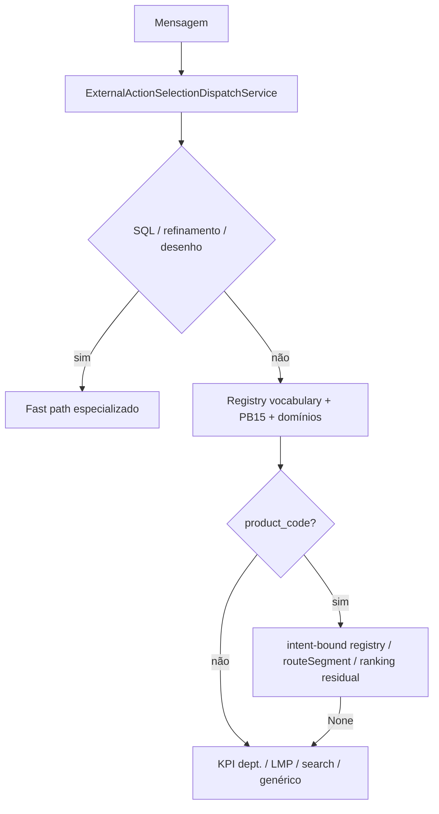

# DOCIE — Desacoplamento da seleção de rotas OpenAPI (chat generalista)

**Tipo:** Documento de Orientação para Implementação e Evolução (DOCIE)  
**Status:** Fase 0–6 concluída; **Fase 7 em curso** (jun/2026) — registry v2026.06.8: open-orders, KPI suprimentos/produção no motor operacional; ranking residual ~280 linhas  
**Data:** jun/2026  
**Commit de referência:** `d598efcc` (routeSegment + enxugamento ranking) · `c30ccc80` (smoke alinhado)  
**Público:** `minha-delpi-ai-api`, gestão de agentes, integradores de novas APIs  
**Regras Cursor:** `chat-intelligence-base.mdc`, `centralized-rules-first.mdc`, `assistant-content-json.mdc`, `clean-architecture-chat-api.mdc`

---

## 1. Objetivo

Tornar o **chat base** um roteador **generalista de qualquer provider OpenAPI** (api-delpi, api_externa, futuros gateways), eliminando:

- paths, `operationId` e scores **hardcoded** em Python por rota api-delpi;
- métodos `select_*` dedicados por endpoint;
- registro `_MATCHERS` em código;
- fallback implícito para rotas «catch-all» (ex.: `/analyser`);
- viés de provider (`api_delpi.` vs `api_externa.`) no ranking heurístico.

**Princípio:** OpenAPI importado + perfis JSON declaram **o que existe**; vocabulário JSON declara **como o usuário pede**; um **motor único** resolve action + parâmetros; ranking semântico cobre ambiguidade.

---

## 2. Estado atual (jun/2026)

### 2.1 Arquitetura vigente

```text
ExternalActionSelectionDispatchService (~760 linhas — ordem fixa, transição)
  └── ExternalActionRouteSelectionService
        ├── ExternalActionOperationalRouteSelectionService  ← motor registry (v2026.06.8)
        ├── ExternalActionProductRouteSelectionService      ← wrapper ranking residual
        ├── ExternalActionKpiRouteSelectionService          ← KPI dept. + fallback dashboards
        ├── ExternalActionLmpRouteSelectionService
        ├── ExternalActionProductSearchRouteSelectionService
        ├── ExternalActionSqlRouteSelectionService
        └── ExternalActionGenericRouteSelectionService      ← semântico
```

| Item | Situação |
|------|----------|
| `operational_route_registry.json` | **~50 rotas** — produto P0/PB15, domínios comercial/engenharia/system, suprimentos KPI (Fase 7) |
| `vocabularyFastPaths` | **Esvaziado** — migrado para registry |
| `_MATCHERS` Python | **Removido** — `OperationalRouteMatcherService` + `customPredicate` allowlist |
| Provider bias `api_delpi`/`api_externa` | **Removido** — desempate por `allowed_action_ids` |
| Ranking legado FULL | **~280 linhas** — só ambiguidade (NF genérica, conflitos playbook, intents não registry) |
| Continuação multi-turno | **`select_by_route_segment`** + `routeSegment` no registry |

### 2.2 Fluxo de seleção hoje (simplificado)



**Problema restante:** dispatch ainda imperativo; KPI departamental, LMP, search e SQL fora do registry.

### 2.3 Estado legado (referência histórica pós `519f3834`)

---

## 3. Arquitetura alvo

```text
app/content/pt-BR/assistant/
  operational_route_registry.json     ← NOVO: catálogo declarativo único
  api_route_domains.json              ← domínios + parameterStrategies (já existe)
  product_query_intent.json           ← vocabulário de intenção (já existe)
  production_operational_intent.json  ← Playbook 15 (já existe)
  external_action_responses.json      ← selectionReasons + vocabularyFastPaths (transição)

app/domain/services/
  OperationalRouteRegistryService     ← NOVO: carrega registry, resolve entrada por id
  OperationalRouteMatcherService      ← NOVO: terms/excludeTerms/matcherExpr (JSON)
  OperationalRouteParameterService    ← estende OperationalApiParameterBuilderService

app/application/services/external_actions/
  ExternalActionOperationalRouteSelectionService  ← NOVO: motor único
  ExternalActionSelectionDispatchService          ← fino: ordem de prioridade JSON
  ExternalActionGenericRouteSelectionService      ← mantém fallback semântico
  ExternalActionProductRouteSelectionService      ← DEPRECAR → remover após migração
```

### 3.1 Ordem de resolução alvo (declarativa)

Ordem definida em `operational_route_registry.json` → `dispatchOrder` (não mais ordem fixa espalhada no dispatch):

1. Bloqueios globais (canvas, web search, SQL authoring) — permanecem em serviços de intent
2. Refinamentos de sessão (estoque, paginação, profundidade, métrica)
3. **Registry fast paths** (todas as rotas com matcher + pathMarkers)
4. Intents de produto **granulares** (STOCK, STRUCTURE, …) via registry `intentBinding`
5. **Ranking semântico** (`select_generic`) — score mínimo configurável
6. `None` → LLM escolhe tool (sem fast path)

### 3.2 Regra de ouro

> Nenhum fragmento de path api-delpi (`factory-status`, `/production/consumption/…`) fora de JSON ou do OpenAPI importado.

---

## 4. Inventário completo de acoplamentos

Legenda de **severidade**:

| Tag | Significado |
|-----|-------------|
| 🔴 | Acoplamento api-delpi / provider — remover |
| 🟡 | Padrão válido mas duplicado — consolidar em registry |
| 🟢 | Generalista — manter (com ajustes) |

---

### 4.1 Camada A — Dispatch (`external_action_selection_dispatch_service.py`)

| # | Acoplamento | Tipo | Severidade | Migração |
|---|-------------|------|------------|----------|
| A1 | Ordem fixa de ~25 blocos `if` sequenciais | Ordem hardcoded | 🟡 | `dispatchOrder` no registry |
| A2 | `ChatSqlProductionQueryService` + `productionSqlFastPath` | SQL template SC2010 | 🔴* | *Manter até rotas REST 100%; marcar `fallbackPolicy: sql_until_rest` no registry |
| A3 | `ChatSqlInventoryQueryService` + `inventorySqlFastPath` | SQL template estoque | 🔴* | Idem |
| A4 | `ChatDrawingIntentService` → `intent=ANALYSER` | Skill desenho | 🟡 | Registry entry `drawingAnalyser` + path `/analyser` |
| A5 | `select_production_operational` (Playbook 15) | Serviço paralelo | 🟡 | Mesclar pathTokens de `production_operational_intent.json` no registry |
| A6 | `select_sale_orders` / `select_transforma` / `select_system_metadata` | Serviço por domínio | 🟡 | Entradas registry `commercial.sales`, `engineering.transforma`, `system.metadata` |
| A7 | `select_vocabulary_fast_path` | Parcialmente declarativo | 🟢 | Estender schema (§6) |
| A8 | Blocos `product_intent == PARENTS/STRUCTURE/STOCK/…` (8 intents) | Despacho Python | 🔴 | `intentBinding` no registry |
| A9 | `_select_product_action(intent=FULL)` | Ranking heurístico | 🔴 | Substituir por semântico ou registry |
| A10 | `path_fragment="/stock"` em refinamento | Path literal | 🟡 | `routeSegment: stock` no registry de refinamento |

---

### 4.2 Camada B — Ranking de produto (`external_action_product_route_selection_service.py`)

**God class ~1250 linhas** — maior concentrador de acoplamento.

#### B1. Paths api-delpi no scoring (`_rank_product_actions`)

| Path / token | Boost | Vocabulário origem | Registry id proposto |
|--------------|-------|-------------------|----------------------|
| `/directives/` | +165 | `product_query_intent.directives` | ✅ `productDirectives` (migrado) |
| `factory-status` | +140 | `product_query_intent.factoryStatus` | `productFactoryStatus` |
| `production-status` | +145 | `product_query_intent.productionStatus` | `productProductionStatus` |
| `shipping-status` | +145 | `product_query_intent.shippingStatus` | `productShippingStatus` |
| `/structure/exclusivity` | +145 | `product_query_intent.structureExclusivity` | `productStructureExclusivity` |
| `raw-material-price-intelligence` | +150 | `product_query_intent.rawMaterialPriceIntelligence` | `productRawMaterialPriceIntelligence` |
| `cost-impact-simulation` | +150 | `product_query_intent.costImpactSimulation` | `productCostImpactSimulation` |
| `last-purchase` | +110 | `product_query_intent.lastPurchase` | `productLastPurchase` |
| `purchase-price-history` | +110 | `product_query_intent.purchasePriceHistory` | `productPurchasePriceHistory` |
| `purchase-budget-history` | +110 | `product_query_intent.purchaseBudgetHistory` | `productPurchaseBudgetHistory` |
| `/purchases` | +110 | `product_query_intent.purchases.terms` | ✅ `productPurchases` |
| `/sales/billing` | +125 | `product_query_intent` + billing predicate | ✅ `productBilling` |
| `/pricing` | variável | sale pricing / `router.priceTerms` | ✅ `productSalePricing` / `productGenericPricing` |
| `/structure` | +150 | structure intent | `productStructure` (intentBinding) |
| `/stock` | +120 | stock intent | `productStock` (intentBinding) |
| `/parents` | +200 | parents intent | `productParents` (intentBinding) |
| `/guide` | +110 | `router.guideTerms` | ✅ `productGuide` |
| `/suppliers` | +110 | `suppliers.terms` | ✅ `productSuppliers` |
| `/customers` | +110 | `customers.terms` | ✅ `productCustomers` |
| `/internal-movements` | +110 | `internalMovements.terms` | ✅ `productInternalMovements` |
| `/inbound-invoice` / `/outbound-invoice` | +120–130 | `invoices.*` + predicados entrada/saída | ✅ `productInvoicesInbound` / `productInvoicesOutbound` |
| `/inspection` | +120 | `inspection.terms` | ✅ `productInspection` |
| `/summary` | +260 | summary terms | `productSummary` (intentBinding) |
| `/analyser` | +280 (intent ANALYSER) | full analyser terms | `productAnalyser` (explícito only) |
| `/products/{code}` | +25 genérico | — | **Remover** — usar semântico |
| `exclusive-raw-materials/catalog` | fast path | exclusiveRawMaterialCatalog | ✅ migrado |

#### B2. Provider bias (acoplamento multi-API)

```python
# external_action_product_route_selection_service.py ~849
if action_id.startswith("api_delpi."): return -120
if action_id.startswith("api_externa."): return +95
```

| Severidade | Ação |
|------------|------|
| 🔴 | Remover bias por prefixo de provider; preferência via **ordem do allowed_action_ids** do agente ou score semântico |

#### B3. Métodos dedicados api-delpi (legacy)

| Método | Status | Ação |
|--------|--------|------|
| `select_product_directives` | Duplica registry | **Remover** após registry |
| `select_exclusive_raw_material_catalog` | Duplica registry | **Remover** após registry |
| `_build_exclusive_catalog_parameters` | Lógica PA/MP | Mover para `parameterStrategy: exclusive_catalog` no builder |
| `_build_product_parameters` | Genérico | **Manter** — delegar ao `OperationalApiParameterBuilderService` |

#### B4. `_MATCHERS` Python (`external_action_vocabulary_route_selection_service.py`)

| Matcher key | Função Python | Severidade |
|-------------|---------------|------------|
| `directives` | `_looks_like_directives_question` | 🔴 |
| `exclusiveRawMaterialCatalog` | `_looks_like_exclusive_raw_material_catalog_question` | 🔴 |

**Alvo:** zero entradas em dict Python; matcher 100% JSON (§6.2).

---

### 4.3 Camada C — Intent (`chat_product_query_intent_service.py`)

| # | Acoplamento | Severidade | Notas |
|---|-------------|------------|-------|
| C1 | 25+ métodos `_looks_like_*` | 🟡 | Vocabulário já em `product_query_intent.json`; lógica composta (excludeWhen*, requires code) ainda em Python |
| C2 | `has_actionable_product_route_intent` lista 14 markers | 🟡 | Derivar do registry (`actionableWhen`) |
| C3 | `refine_operational_intent_from_full` | 🟢 | Manter para intents clássicos STOCK/STRUCTURE/… |
| C4 | `detect()` ordem fixa de 20+ checks | 🟡 | Opcional: pipeline declarativo por prioridade JSON |
| C5 | Import `ExternalActionResponseContentService` em domain | ✅ | summary/purchases/invoices via `product_query_intent.json` |

---

### 4.4 Camada D — Serviços de rota paralelos

| Serviço | Domínio | Paths hardcoded | Severidade | Registry |
|---------|---------|-----------------|------------|----------|
| `ExternalActionProductionOperationalRouteSelectionService` | Playbook 15 | 14 `pathTokens` em JSON, `_REASON_KEYS` em Python | 🟡 | Mesclar `production_operational_intent.pathTokens` |
| `ExternalActionDomainRouteSelectionService` | Comercial / Transforma / System | `/sales`, `transforma-mais`, `/system/` | 🟡 | 3 entradas registry |
| `ExternalActionKpiRouteSelectionService` | KPI dept/supplies | `cpv`, `otd`, `inventory-turnover` | 🟡 | Entradas `kpi.*` |
| `ExternalActionLmpRouteSelectionService` | LMP / OV | paths LMP | 🟡 | Entrada `lmp.*` |
| `ExternalActionProductSearchRouteSelectionService` | Busca | `/products/search` | 🟢 | Manter — domínio `product_search` já no `api_route_domains.json` |
| `ExternalActionSqlRouteSelectionService` | POST /data/sql | SQL | 🟢 | Fallback controlado |
| `ExternalActionRefinementRouteSelectionService` | Paginação/profundidade | `/products/{code}/…` | 🟡 | Generalizar `pathTemplate` |
| `ExternalActionGenericRouteSelectionService` | Semântico | — | 🟢 | Fallback canônico |

---

### 4.5 Camada E — Conteúdo JSON (duplicação)

| Conceito | Onde aparece hoje | Problema |
|----------|-------------------|----------|
| Termos de rota produto | `product_query_intent.json` + `external_action_responses.json` → `productRouteRanking.*` | **Duplicado** — mesclar em registry |
| Domínios | `api_route_domains.json` | Falta cobrir rotas PB15 granulares e playbook produto |
| Reasons | `external_action_responses.json` → `selectionReasons.*` | 🟢 OK — manter |
| Path tokens produção | `production_operational_intent.json` | 🟡 Referenciar do registry |

---

### 4.6 Camada F — Apresentação / contrato api-delpi

| Serviço | Acoplamento | Severidade |
|---------|-------------|------------|
| `ChatApiDelpiResponseProfileService` | Nome + profiles por entity api-delpi | 🟡 | Renomear para `ChatOperationalResponseProfileService`; profiles keyed por `meta.entity` OpenAPI |
| Presenters em `domain/services/external_actions/presenters/` | Paths específicos | 🟡 | OK se driven por `meta.entity`, não por path string |

---

### 4.7 Camada G — Documentação desatualizada

| Documento | Problema |
|-----------|----------|
| `inteligencia-chat-onda-8.md` §8.4 | Ainda documenta «FULL → analyser +100» |
| `api-delpi-chat-intelligence-audit.md` | Lista heurísticas antigas |
| `assistant-content-catalog.md` | Falta `vocabularyFastPaths` / registry |

---

## 5. Catálogo de rotas api-delpi — backlog registry

Prioridade para migrar de scoring Python → `vocabularyFastPaths` / `operational_route_registry.json`.

### 5.1 Produto — playbook / status (P0)

| Registry id | Path | operationId | Matcher / terms source | parameterStrategy |
|-------------|------|-------------|--------------------------|-------------------|
| `productDirectives` | `/products/directives/{identifier}` | `get_product_directives` | `directives` | `product_code` ✅ |
| `productFactoryStatus` | `/products/{code}/factory-status` | `get_product_factory_status` | `factoryStatus` | `product_code` |
| `productProductionStatus` | `/products/{code}/production-status` | `get_product_production_status` | `productionStatus` | `product_code` |
| `productShippingStatus` | `/products/{code}/shipping-status` | `get_product_shipping_status` | `shippingStatus` | `product_code` |
| `productStructureExclusivity` | `/products/{code}/structure/exclusivity` | `get_product_structure_exclusivity` | `structureExclusivity` | `product_code` |
| `exclusiveRawMaterialCatalog` | `/products/exclusive-raw-materials/catalog` | `get_exclusive_raw_material_catalog` | `exclusiveRawMaterialCatalog` | `exclusive_catalog` ✅ |

### 5.2 Produto — preço / compras (P0)

| Registry id | Path | operationId | Matcher |
|-------------|------|-------------|---------|
| `productRawMaterialPriceIntelligence` | `…/raw-material-price-intelligence` | `get_product_raw_material_price_intelligence` | `rawMaterialPriceIntelligence` |
| `productCostImpactSimulation` | `…/cost-impact-simulation` | `get_product_cost_impact_simulation` | `costImpactSimulation` |
| `productLastPurchase` | `…/last-purchase` | `get_product_last_purchase` | `lastPurchase` |
| `productPurchasePriceHistory` | `…/purchase-price-history` | `get_product_purchase_price_history` | `purchasePriceHistory` |
| `productPurchaseBudgetHistory` | `…/purchase-budget-history` | `get_product_purchase_budget_history` | `purchaseBudgetHistory` |

### 5.3 Produto — intents clássicos (P1 — `intentBinding`)

| Registry id | Path | Intent enum | Notas |
|-------------|------|-------------|-------|
| `productStock` | `/products/{code}/stock` | `STOCK` | Despacho A8 |
| `productStructure` | `/products/{code}/structure` | `STRUCTURE` | |
| `productParents` | `/products/{code}/parents` | `PARENTS` | |
| `productSales` | `/products/{code}/sales` | `SALES` | |
| `productSummary` | `/products/{code}/summary` | `SUMMARY` | |
| `productAnalyser` | `/products/{code}/analyser` | `ANALYSER` | **Somente** explícito |
| `productDescription` | `/products/{code}` | `DESCRIPTION` | |
| `productGuide` | `/products/{code}/guide` | sub-intent | |
| `productSuppliers` | `/products/{code}/suppliers` | sub-intent | |
| `productPricing` | `/products/{code}/pricing` | sub-intent | |
| `productCustomers` | `/products/{code}/customers` | sub-intent | |
| `productInternalMovements` | `/products/{code}/internal-movements` | sub-intent | |
| `productInspection` | `/products/{code}/inspection` | sub-intent | |
| `productInvoicesInbound` | `…/inbound-invoice` | sub-intent | |
| `productInvoicesOutbound` | `…/outbound-invoice` | sub-intent | |

### 5.4 Produção Playbook 15 (P1)

Importar de `production_operational_intent.json` → `pathTokens` (14 rotas). Cada uma vira entrada registry com `parameterStrategy: date_branch`.

### 5.5 Domínios transversais (P2)

| Registry id | Serviço atual | Path prefix |
|-------------|---------------|-------------|
| `commercialSaleOrders` | DomainRouteSelection | `/commercial/sales` |
| `engineeringTransforma` | DomainRouteSelection | `transforma-mais` |
| `systemMetadata` | DomainRouteSelection | `/system/` |
| `kpiCpv` | KpiRouteSelection | `/supplies/cpv` |
| `kpiOtd` | KpiRouteSelection | `otd` |
| `kpiInventoryTurnover` | KpiRouteSelection | `inventory-turnover` |
| `lmpList` | LmpRouteSelection | `/lmp` |

---

## 6. Schema declarativo proposto

### 6.1 Arquivo `operational_route_registry.json` (novo)

```json
{
  "version": "2026.06.1",
  "dispatchOrder": [
    "sessionRefinement",
    "productionOperational",
    "vocabularyFastPaths",
    "intentBoundRoutes",
    "domainRoutes",
    "semanticFallback"
  ],
  "routes": [
    {
      "id": "productFactoryStatus",
      "domain": "product",
      "priority": 100,
      "match": {
        "termsFrom": "product_query_intent.factoryStatus.terms",
        "excludeTermsFrom": "product_query_intent.factoryStatus.excludeWhenProductionPlaybook",
        "requiresProductIdentifier": true
      },
      "route": {
        "pathMarkers": ["/factory-status"],
        "operationIdMarkers": ["get_product_factory_status"],
        "method": "GET"
      },
      "parameters": {
        "strategy": "product_code"
      },
      "presentation": {
        "reasonKey": "productFactoryStatus"
      }
    }
  ]
}
```

### 6.2 Evolução de `vocabularyFastPaths` (transição)

Fase 1–2: manter chave em `external_action_responses.json`.  
Fase 3: migrar entradas para `operational_route_registry.json` e **deletar** `vocabularyFastPaths`.

Campos **obrigatórios** por entrada:

| Campo | Descrição |
|-------|-----------|
| `id` | Identificador estável |
| `match.termsFrom` | Caminho no bundle JSON (`bundle.section.key`) — **substitui `_MATCHERS`** |
| `match.excludeTermsFrom` | Opcional |
| `match.requiresProductIdentifier` | bool |
| `match.customPredicate` | Opcional — **último recurso**; registrar em tabela allowlist Python (max 3) |
| `route.pathMarkers` | Substrings OpenAPI path |
| `route.operationIdMarkers` | Tokens operationId |
| `parameters.strategy` | Chave de `api_route_domains.parameterStrategies` |
| `presentation.reasonKey` | Chave em `selectionReasons` |

### 6.3 Matchers — eliminar `_MATCHERS`

| Hoje (Python) | Amanhã (JSON) |
|---------------|---------------|
| `_looks_like_directives_question` | `termsFrom: product_query_intent.directives.terms` + `requiresProductIdentifier: true` + regex opcional em JSON |
| `_looks_like_exclusive_raw_material_catalog_question` | `termsFrom` + `excludeTermsFrom` + `globalMarkers` |
| Lógica composta (excludeWhen*) | `excludeTermsFrom` múltiplos + `match.allOf` / `match.anyOf` |

**Predicados complexos** (ex.: «última compra» exige código produto): expressão declarativa:

```json
"match": {
  "allOf": [
    { "termsFrom": "product_query_intent.lastPurchase.terms" },
    { "hasProductIdentifier": true }
  ],
  "noneOf": [
    { "termsFrom": "product_query_intent.directives.terms" }
  ]
}
```

Motor: `OperationalRouteMatcherService` — sem import de api-delpi.

---

## 7. Plano de implementação por fases

### Fase 0 — Preparação (1 PR)

- [x] Criar `operational_route_registry.json` com schema versionado
- [x] Criar `OperationalRouteRegistryService` + testes de carga do JSON
- [x] Adicionar `OperationalRouteMatcherService` com `termsFrom` / `allOf` / `noneOf`
- [x] Documentar em `assistant-content-catalog.md`
- [ ] Atualizar `inteligencia-chat-onda-8.md` (remover linha analyser fallback)

### Fase 1 — Produto playbook P0 (1–2 PRs)

Migrar entradas §5.1 e §5.2 para registry; remover boosts correspondentes em `_rank_product_actions`.

**Critério de aceite:** perguntas de homologação em `tests/fixtures/chat_intelligence_regression_cases.py` inalteradas.

- [x] Registry P0 (directives, exclusive catalog, factory/production/shipping, structure exclusivity, preço/compra)
- [x] Remover boosts duplicados em `_rank_product_actions` (P0 vocabulário + intents clássicos)

### Fase 2 — Intents clássicos (1 PR)

Substituir blocos dispatch A8 por `intentBoundRoutes` no registry.

**Critério:** `_rank_product_actions` reduz >50% linhas; intents STOCK/STRUCTURE/PARENTS passam só pelo registry.

- [x] `intentBinding` no registry (stock, structure, parents, sales, summary, analyser, description, NF)
- [x] `select_by_intent` no motor operacional + dispatch unificado
- [x] Remover boosts duplicados em `_rank_product_actions` (intents clássicos)

### Fase 3 — Playbook 15 + domínios (1 PR)

Mesclar `ExternalActionProductionOperationalRouteSelectionService` e `ExternalActionDomainRouteSelectionService` no motor único.

- [x] Registry v2026.06.3 (14 rotas PB15 + OV + Transforma)
- [x] Motor operacional (`select_production_operational`, `select_sale_orders`, `select_transforma`)
- [x] Migrar `select_system_metadata` (registry `domainSystem` + fallback scoring)

### Fase 4 — Remoção de legado (1 PR)

- [x] Reduzir `ExternalActionProductRouteSelectionService` a wrapper fino (~213 linhas)
- [x] Extrair `ExternalActionProductRouteCatalogService` + `ExternalActionProductRouteRankingService`
- [x] Deletar `select_product_directives`, `select_exclusive_raw_material_catalog` (registry + vocabulary)
- [x] Deletar `vocabularyFastPaths` (conteúdo migrado — array vazio)
- [x] Remover `_provider_preference_bonus` api_delpi/api_externa (Fase 5)
- [x] Remover duplicação `productRouteRanking.*` vs `product_query_intent.json`

### Fase 5 — Generalização multi-provider (1 PR)

- [x] Desempate por ordem em `allowed_action_ids` (sem bias `api_delpi`/`api_externa`)
- [x] Remover `_provider_preference_bonus` do ranking legado
- [x] Remover fallbacks `ExternalActionDomainRouteSelectionService` / `ExternalActionProductionOperationalRouteSelectionService` em `ExternalActionRouteSelectionService`
- [x] Deletar `external_action_production_operational_route_selection_service.py`
- [x] Deletar `external_action_domain_route_selection_service.py` (heurísticas → `OperationalRouteMatcherService`)
- [x] Documentar «Como registrar nova API OpenAPI» em `docs/api/04-actions-openapi.md`
- [x] Testes multi-provider (tie-break `allowed_action_ids`)

### Fase 6 — Registry vocabulário produto FULL (jun/2026)

- [x] Consolidar vocabulário em `product_query_intent.json` (remover `productRouteRanking.*`)
- [x] Predicados de rota em `ChatProductQueryIntentService` (guide, purchases, billing, pricing, invoices, suppliers, inspection)
- [x] Registry v2026.06.5 — `productGuide`, `productSuppliers`, `productPurchases`, `productSalePricing`, `productBilling`, `productGenericPricing`, `productInspection`
- [x] Registry v2026.06.6 — `productCustomers`, `productInternalMovements`, NF entrada/saída com `customPredicate` + continuação por `routeSegment`
- [x] `select_by_route_segment` + `routeSegment` no registry — continuação multi-turno sem boosts no ranking
- [x] Enxugar `ExternalActionProductRouteRankingService` — só desempate ambíguo (intents clássicos, NF genérica, conflitos playbook)

### Fase 7 — KPI suprimentos + dashboards produção (jun/2026, em curso)

- [x] `productOpenOrders` + `routeSegment: open-orders` + `routeSegment: billing`
- [x] Registry `domainSupplies`: CPV, OTD compras, giro estoque, valor total estoque
- [x] Registry `domainProductionKpi`: OTD detalhe, OEE detalhe/apontamento, eficiência fabril
- [x] Vocabulary fast path com `build_date_branch_parameters` (parâmetros temporais KPI)
- [x] `select_by_department_kpi` no motor operacional (ponte `ChatDepartmentKpiIntentService` → registry virtual)
- [x] Dispatch chama KPI departamental via motor operacional; `ExternalActionKpiRouteSelectionService` reduzido a refinamentos
- [ ] Exportar regras `_RULES` de `ChatDepartmentKpiIntentService` para JSON no registry
- [ ] Deprecar `ChatDepartmentKpiIntentService._RULES` Python quando JSON cobrir 100%

### Fase 8 — Dispatch declarativo

- [ ] Interpretar `dispatchOrder` do registry em loop único (substituir ~25 blocos `if`)
- [ ] Unificar `select_sale_orders` / `select_transforma` / `select_production_operational` no motor
- [ ] Remover wrapper `ExternalActionVocabularyRouteSelectionService`

### Fase 9 — Eliminar ranking legado

- [ ] NF genérica sem direção entrada/saída → registry ou política explícita
- [ ] Conflitos playbook restantes → `noneOf` / prioridade registry
- [ ] Deletar `ExternalActionProductRouteRankingService` + wrapper `ExternalActionProductRouteSelectionService`

### Fase 10 — Domínios restantes + DoD

- [ ] LMP + product search no registry
- [ ] Refinamentos (paginação/profundidade/métrica) com `routeSegment`
- [ ] SQL fast path com `fallbackPolicy: sql_until_rest` no registry
- [ ] `has_actionable_product_route_intent` derivado do registry
- [ ] Lint CI: termos só em JSON
- [ ] Atualizar `inteligencia-chat-onda-8.md`; remover chave vazia `vocabularyFastPaths`

---

## 8. Matriz de arquivos — o que muda

| Arquivo | Ação |
|---------|------|
| `operational_route_registry.json` | **Criar** |
| `external_action_vocabulary_route_selection_service.py` | **Substituir** por `ExternalActionOperationalRouteSelectionService` |
| `external_action_product_route_selection_service.py` | **Deprecar → deletar** (Fase 4) |
| `external_action_production_operational_route_selection_service.py` | **Removido** (registry) |
| `external_action_domain_route_selection_service.py` | **Removido** (registry + matcher) |
| `external_action_kpi_route_selection_service.py` | **Deprecar → deletar** (Fase 7–8) |
| `external_action_selection_dispatch_service.py` | **Enxugar** — loop registry + refinamentos |
| `chat_product_query_intent_service.py` | **Manter** detect/refine; reduzir `_looks_like_*` compostos |
| `api_route_domains.json` | **Estender** domínios faltantes |
| `external_action_responses.json` | **Transição** → só `selectionReasons` |
| `product_query_intent.json` | **Fonte única** de termos produto |

---

## 9. Testes de regressão obrigatórios

| Suite | Escopo |
|-------|--------|
| `test_operational_route_registry_service.py` | Schema, termsFrom, allOf/noneOf |
| `test_external_action_vocabulary_route_selection_service.py` | Expandir para cada registry id P0 |
| `chat_intelligence_regression_cases.py` | Casos produto + playbook |
| `test_action_selection_content.py` | Toda chave `selectionReasons` referenciada existe |
| Teste multi-provider | Mesmo path, `api_delpi.*` vs `api_externa.*` — sem bias Python |

---

## 10. Riscos e mitigação

| Risco | Mitigação |
|-------|-----------|
| Regressão em follow-up («e o estoque?») | Manter `ChatOperationalRefinementService` + testes histórico |
| Matcher JSON insuficiente para casos compostos | `customPredicate` allowlist (máx. 3) + revisão semanal |
| OpenAPI desatualizado | Playbook 16 readiness + smoke pós-import |
| Latência ranking semântico | Manter fast path registry **antes** do semântico |
| Duplicação termos JSON | Lint CI: termos só em `product_query_intent` ou registry |

---

## 11. Definição de pronto (DoD)

1. **Zero** path api-delpi em `_rank_product_actions` (arquivo removido).
2. **Zero** entradas em `_MATCHERS` Python.
3. **Zero** métodos `select_product_*` / `select_exclusive_*` no dispatch.
4. Novo provider OpenAPI funciona **sem alterar Python** — só JSON + import OpenAPI + allowed actions do agente.
5. Documentação onda 8 / audit / catalog atualizadas.
6. Homologação manual: `docs/testing/smoke-operacional-manual.md` — seção produto + PB15.

---

## 12. Referências

| Documento | Relação |
|-----------|---------|
| [chat-intelligence-base.md](../architecture/chat-intelligence-base.md) | Pipeline canônico |
| [vocabulary-centralization-jun2026.md](../architecture/vocabulary-centralization-jun2026.md) | Padrão JSON |
| [assistant-content-catalog.md](../architecture/assistant-content-catalog.md) | Catálogo bundles |
| [playbook-15-rotas-operacionais-sem-sql.md](./playbook-15-rotas-operacionais-sem-sql.md) | Rotas REST produção |
| [playbook-11-clean-architecture-chat-api.md](./playbook-11-clean-architecture-chat-api.md) | Camadas |
| [api_route_domains.json](../../app/content/pt-BR/assistant/api_route_domains.json) | Domínios atuais |
| [inteligencia-chat-onda-8.md](./inteligencia-chat-onda-8.md) | **Atualizar** — remover fallback analyser |

---

## Apêndice A — Contagem de acoplamentos

| Camada | Itens mapeados | 🔴 Críticos | ✅ Resolvidos (jun/2026) |
|--------|----------------|-------------|-------------------------|
| A — Dispatch | 10 | 1 (ordem fixa) | SQL/refinamento isolados |
| B — Ranking produto | 35+ | 0 paths ativos | ~28 migrados registry |
| C — Intent | 5 | 1 (`has_actionable_*`) | C5 vocabulário |
| D — Serviços paralelos | 8 | 4 (KPI/LMP/search/SQL) | domain/production PB15 |
| E — JSON duplicado | 4 | 0 | productRouteRanking removido |
| **Total restante** | **~15** | **~6** | **~61** |

---

## Apêndice B — Commits sugeridos (sequência)

1. `docs(chat): DOCIE desacoplamento seleção rotas OpenAPI`
2. `feat(chat): operational_route_registry + matcher declarativo`
3. `refactor(chat): migrar fast paths produto P0 para registry`
4. `refactor(chat): intentBoundRoutes substituem dispatch por intent`
5. `refactor(chat): consolidar PB15 e domínios no motor operacional`
6. `refactor(chat): remover product route selection legado e provider bias`
