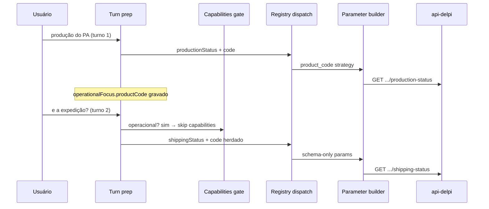

# Playbook — Follow-up operacional desacoplado (jun/2026)

> **Status:** P0 + P1.0 + P1.1 implementados (jun/2026); P1.2–P2 backlog.

Projeto: **Minha DELPI Chat IA** · Pacote: `minha-delpi-ai-api`

Origem: homologação do roteiro [`treinamento-agente-interacoes-jun2026.md`](../../knowledge/treinamento-agente-interacoes-jun2026.md) e auditoria E2E (jun/2026).

---

## 1. Diagnóstico

O pipeline REST + apresentação desacoplada **funciona** quando o usuário informa código explícito ou mantém contexto reconhecido. Falhas observadas concentraram-se em **follow-ups curtos** e **classificação meta vs operacional**:

| Interação | Mensagem | Sintoma | Causa raiz |
|-----------|----------|---------|------------|
| 2.2 | «quais MPs exclusivas existem na estrutura **desse produto**?» | Resposta «se eu consigo executar…» | `ChatCapabilitiesService` trata `?` + tópico «estrutura» como pergunta de capacidade; `_looks_like_operational_data_request` não considera referência anafórica sem código |
| 5.2 | «e a expedição?» | `Unknown parameter: limit` | Fallback semântico monta parâmetros fora do schema OpenAPI; produto do turno anterior não entra na rota determinística |
| 6.2 | «resuma o primeiro arquivo» | `text_task` genérico | Falta estágio inventário → slot → RAG filtrado (P2) |

Rotas api-delpi e perfis de apresentação **não** eram o problema.

---

## 2. Princípios (módulos canônicos)

```
Mensagem
  → gate operacional vs capabilities (ChatCapabilitiesService)
  → resolver contexto (operationalFocus, resolve_product_code, follow-up)
  → rota determinística (operational_route_registry) > semântica
  → parâmetros só do schema (ParameterBuilder + filter)
  → REST → apresentação (metadata; MFE render-only)
```

| Responsabilidade | Módulo canônico | Não duplicar em |
|------------------|-----------------|-----------------|
| Follow-up operacional | `ChatFollowUpIntentService` | use case Send/Stream |
| Herança de produto | `ChatProductQueryIntentService.resolve_product_code` | prompt de agente |
| Gate capabilities | `ChatCapabilitiesService._looks_like_operational_data_request` | componente MFE |
| Parâmetros HTTP | `ExternalActionProductRouteCatalogService`, `OperationalApiParameterBuilderService` | seleção semântica ad hoc |
| Rotas playbook | `operational_route_registry.json` + `product_query_intent.json` | `if path` no use case |
| Textos PT | `assistant/*.json` | strings em Python |

Referência: [`chat-intelligence-base.md`](../../architecture/chat-intelligence-base.md), regras `centralized-rules-first.mdc`, `operational-api-routing.mdc`.

---

## 3. Roadmap

### P0 — Contexto e contrato de parâmetros (jun/2026) ✅ em curso

| # | Entrega | Módulo | Regressão |
|---|---------|--------|-----------|
| P0.1 | Vocabulário follow-up: expedição, exclusividade | `ChatFollowUpIntentService` | `test_chat_follow_up_intent_service.py` |
| P0.2 | Herança de código em follow-up operacional | `resolve_product_code` | `MULTI_TURN_PRODUCT_CODE_CASES` |
| P0.3 | Escopo de produto em matcher (follow-up + playbook) | `OperationalRouteMatcherService._has_product_scope` | `SELECTION_CASES` follow-up expedição |
| P0.4 | Gate capabilities antes de self_help | `ChatCapabilitiesService` | `test_chat_capabilities_service.py` |
| P0.5 | Parâmetros estritos por schema (sem `limit` fantasma) | `filter_parameters_to_schema` | `test_external_action_product_route_catalog_service.py` |
| P0.6 | Segmentos playbook no contexto de rota | `ChatRouteContextService` | smoke opcional |

**Critério de aceite P0:**

- «e a expedição?» após turno `production-status` → `shipping-status` com `code` herdado, **sem** `limit` inválido.
- «…estrutura desse produto?» (exclusividade) → **não** dispara `resolve_capability_answer`.

**Critério de aceite P1.0:**

- «e a expedição?» **sem** «hoje», após turno com data explícita → herda `reference_date` / intervalo do histórico; **não** pede data de novo.

### P1 — Roteamento determinístico reforçado (jul/2026)

| # | Entrega |
|---|---------|
| P1.0 | Herdar `reference_date` do turno playbook anterior («e a expedição?» sem «hoje») | `ChatOperationalDateParameterService` | ✅ |
| P1.1 | `follow_up_type` → flags/segmentos declarativos (`operational_follow_up_routing.json`) | `ChatOperationalFollowUpRoutingService` | ✅ |
| P1.2 | Bloquear fallback semântico quando `should_inherit_product_code` e predicate playbook match parcial |
| P1.3 | Atualizar treinamento: PA com cadastro real (`90261255`) + notas de ambiente |
| P1.4 | Casos completos do roteiro em `chat_intelligence_regression_cases.py` |

### P2 — Projeto: inventário → síntese (jul–ago/2026)

| # | Entrega |
|---|---------|
| P2.1 | Snapshot `lastProjectSourcesInventory` pós-`project_sources_inventory` |
| P2.2 | `ChatProjectSourceSlotResolverService` (ordinal, nome parcial) |
| P2.3 | RAG filtrado por `project_source_id` — não `text_task` genérico |

---

## 4. Fluxo alvo (follow-up fabril)



---

## 5. Testes e gates

```bash
cd minha-delpi-ai-api
.venv/bin/python -m pytest tests/unit/domain/services/test_chat_follow_up_intent_service.py -q
.venv/bin/python -m pytest tests/unit/application/services/test_chat_capabilities_service.py -q
.venv/bin/python -m pytest tests/unit/domain/services/test_chat_intelligence_regression.py -q -k "follow_up or selection"
.venv/bin/python scripts/generate_operational_route_registry.py --check
```

---

## 6. Referências

- Treinamento: [`treinamento-agente-interacoes-jun2026.md`](../../knowledge/treinamento-agente-interacoes-jun2026.md)
- Contexto/assertividade (base): [playbook_contexto_assertividade_minha_delpi_chat.md](./playbook_contexto_assertividade_minha_delpi_chat.md)
- Rotas playbook: [playbook-chat-preco-mp-simulador-custos-pa.md](../playbook-chat-preco-mp-simulador-custos-pa.md)
- Changelog P0: [`2026-06-follow-up-operacional-parametros.md`](../../changelog/2026-06-follow-up-operacional-parametros.md) (após merge)
