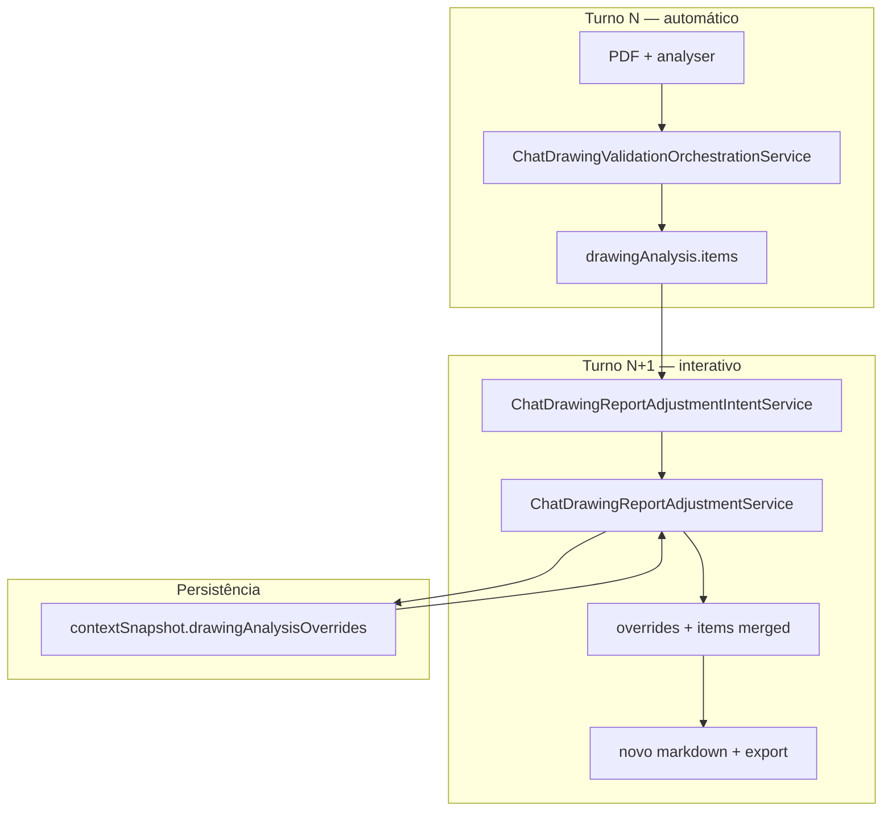

# Playbook — Ajuste interativo do relatório de desenho DELPI

> **Status (10/07/2026):** **Backlog** — Fases 16.1–16.3 planejadas.  
> **Projeto:** Minha DELPI Chat IA  
> **Arquitetura:** inteligência transversal no [chat base](../../architecture/chat-intelligence-base.md); overrides humanos **não** alteram o pipeline de extração — complementam `drawingAnalysis.items` com trilha auditável.

| Campo | Valor |
|-------|-------|
| Skill | `drawing-analysis-delpi` |
| Intent pai | `drawing_analysis` |
| Sub-intent alvo | `drawing_report_adjustment` (novo) |
| Orquestrador checklist | `ChatDrawingValidationOrchestrationService` |
| Follow-up existente | `ChatDrawingFollowUpTurnService` · `ChatDrawingFollowUpService` |
| Policy LLM (limite) | `drawing-analysis-render-only.md` — narrativa SIM, reclassificar checklist NÃO |
| Vocabulário | `drawing_validation.json` · `drawing_query_intent.json` · `personality_playbook.json` |
| Playbooks relacionados | [Validação normativa](./playbook_validacao_desenhos_delpi_roadmap.md) · [Desacoplamento skill](./playbook_skill_desenho_desacoplamento.md) · [Interatividade chips](./playbook_interatividade_botoes_minha_delpi_chat.md) · [Memória de sessão](./playbook_memoria_sessao_preferencias_minha_delpi_chat.md) |

**Caso de referência:** produto **90261877** — relatório «Aprovado com ressalvas» com item pendente `dimension_note_ambiguous`; usuário informa revisão manual («foi revisado, o problema não é verdadeiro, gere um novo relatório») e espera relatório atualizado sem a ressalva.

---

## 1. Objetivo

Permitir que o usuário **interaja com o chat após a análise automática** para:

1. **Confirmar revisão humana** de um item pendente ou erro (override auditável).
2. **Regenerar o relatório DELPI** com status recalculados (`approved` vs `approved_with_notes`).
3. **Distinguir** revisão humana de **reanálise técnica** (pipeline PDF × API de novo).

**Regra de ouro:** o checklist automático permanece a fonte primária; overrides são uma **camada explícita** sobre `drawingAnalysis.items[]`, nunca um parágrafo do LLM que «some» com a linha na UI.

---

## 2. Diagnóstico — estado atual (jul/2026)

### 2.1 O que já funciona

| Fluxo | Módulo | Comportamento |
|-------|--------|---------------|
| Análise inicial | `ChatDrawingTurnEnrichmentService` | PDF + `/analyser` → `drawingAnalysis` + `drawingAnalysisExport.markdown` |
| Chips pós-análise | `ChatDrawingFollowUpService` | «Ver só erros críticos», «Validar BOM», «Gerar relatório», «Reanalisar desenho» |
| Resposta direta curta | `ChatDrawingFollowUpTurnService` | Reformatar **o mesmo** `drawingAnalysis` do histórico |
| Reanálise | Chip «Reanalisar desenho» | Pipeline completo (`_wants_reanalysis` → não intercepta; tool context roda de novo) |
| LLM em follow-up | `ChatDrawingLlmPresentationService` + `drawing-analysis-render-only.md` | Narrativa e plano de ação; **proibido** promover/rebaixar itens |

### 2.2 Lacunas (causa do sintoma)

| Lacuna | Sintoma | Exemplo |
|--------|---------|---------|
| Sem camada de override | «Gere novo relatório» repete o mesmo `pending` | 90261877 — `dimension_note_ambiguous` |
| Regex de follow-up incompleta | «gere um **novo** relatório» não casa `_wants_report_repeat` | Mensagem livre do usuário |
| Follow-up sem export | `early_result` com só `directAnswer` pode não atualizar `drawingAnalysisExport` | MFE mostra relatório antigo |
| LLM como atalho | Usuário pede «não é verdadeiro» → modelo explica, mas checklist não muda | Policy render-only bloqueia (correto) — falta serviço determinístico |

### 2.3 O que NÃO é este playbook

| Pedido do usuário | Caminho correto (já existente ou outro) |
|-------------------|----------------------------------------|
| «Reanalise o desenho» / OCR leu errado | Reanálise — pipeline completo |
| «Explique a ressalva» | LLM render-only sobre `items[]` |
| «Corrija o cadastro no Protheus» | Action operacional / SQL — fora do escopo |
| Esconder linha só no MFE | **Proibido** — ver `centralized-rules-first.mdc` |

---

## 3. Arquitetura alvo

```text
Turno N   — análise automática
            → drawingAnalysis.items[] (pipeline)
            → drawingAnalysisExport.markdown

Turno N+1 — mensagem do usuário (revisão / disputa / novo relatório)
            → ChatDrawingReportAdjustmentIntentService     [NOVO — domain]
            → ChatDrawingReportAdjustmentService           [NOVO — domain]
                 ├── carrega overrides da sessão (contextSnapshot)
                 ├── parseia novo override (determinístico ± LLM estruturado)
                 └── merge em items[] + recalcula overallStatus
            → ChatDrawingValidationOrchestrationService.repackage_adjusted
            → ChatDrawingValidationPresentationService.format_report_markdown
            → ChatDrawingTurnEnrichmentService (export + metadata)
            → MFE: resolveAssistantDisplayContent + export buttons
```



---

## 4. Modelo de dados — overrides humanos

### 4.1 Contrato `drawingAnalysisOverrides`

Persistir no **metadata do assistente** e espelhar em `contextSnapshot` (memória de sessão) para follow-ups subsequentes.

```json
{
  "drawingAnalysisOverrides": [
    {
      "templateKey": "dimension_note_ambiguous",
      "item": "Nota dimensional ambígua",
      "section": "Cotas",
      "previousStatus": "pending",
      "status": "ok",
      "reason": "Revisado manualmente — nota de termo não conflita com decape de cabo",
      "pdfEvidenceOverride": "Revisado em engenharia em 10/07/2026",
      "sourceMessageId": "uuid-da-mensagem-usuario",
      "reviewedAt": "2026-07-10T16:30:00+00:00",
      "reviewedBy": "user"
    }
  ]
}
```

| Campo | Obrigatório | Regra |
|-------|-------------|-------|
| `templateKey` | Sim | Chave canônica do item (`itemTemplates` em `drawing_validation.json`) |
| `previousStatus` | Sim | Status antes do override (auditoria) |
| `status` | Sim | `ok` \| `not_applicable` — **nunca** `critical_error` por override humano |
| `reason` | Sim | Texto PT em JSON (`drawing_validation.json` → `manualReview.*`) |
| `sourceMessageId` | Sim | Mensagem do usuário que autorizou o override |
| `reviewedAt` | Sim | ISO-8601 |

### 4.2 Semântica de status após merge

| Situação | `overallStatus` | `overallLabel` |
|----------|-----------------|----------------|
| Todos os itens `ok` após merge | `approved` | Aprovado |
| Ainda há `pending` / `error` sem override | `approved_with_notes` | Aprovado com ressalvas |
| Qualquer `critical_error` restante | `rejected` | Reprovado — override **não** remove crítico |

**Proibido:** override humano rebaixar item crítico para `ok` sem reanálise — só `pending` / `error` não críticos.

---

## 5. Mapa canônico de módulos

| Responsabilidade | Módulo (novo ou estender) | Camada | Não duplicar em |
|------------------|---------------------------|--------|-----------------|
| Detectar intenção de ajuste | `ChatDrawingReportAdjustmentIntentService` | domain | use case Send/Stream |
| Resolver item alvo (último pending, menção explícita) | `ChatDrawingReportAdjustmentTargetService` | domain | prompt agente |
| Aplicar overrides + recalcular pacote | `ChatDrawingReportAdjustmentService` | domain | MFE |
| Repackage após merge | `ChatDrawingValidationOrchestrationService.repackage_with_overrides` | domain | presenter |
| Turno follow-up com export | `ChatDrawingReportAdjustmentTurnService` | application | lógica inline em `pre_turn` |
| Integração pré-tool | `chat_tool_context_pre_turn_service` | application | duplicar em stream/send |
| Chips «Confirmar revisão» | `ChatDrawingFollowUpService` | application | componente React |
| Textos PT / padrões | `drawing_validation.json` · `drawing_query_intent.json` | JSON | strings em Python |
| Persistência sessão | `ChatConversationMemoryService` / `contextSnapshot` | application | só metadata efêmero |
| Admin debug | `ChatDrawingAdminDebugService` | application | — |
| Render relatório | `assistantProseRendering` + `ChatMarkdown` | MFE | decisão de status |

---

## 6. Roteamento de intenção

### 6.1 Árvore de decisão (turno com histórico de desenho)

```text
Há drawingAnalysis no histórico?
  Não → fluxo normal
  Sim →
    is_drawing_analysis_request (novo PDF / «analise o desenho»)?
      Sim → pipeline completo (ignorar overrides antigos se novo PDF)
    _wants_reanalysis?
      Sim → pipeline completo
    _wants_report_adjustment?                    [NOVO]
      Sim → ChatDrawingReportAdjustmentTurnService
    _wants_report_repeat / chips «Gerar relatório»
      Sim → reformatar com overrides já aplicados
    Caso contrário
      → LLM render-only (explicar, plano de ação)
```

### 6.2 Padrões de mensagem (Fase 16.1 — determinístico)

Registrar em `drawing_query_intent.json` → `reportAdjustmentTriggers`:

| Categoria | Exemplos |
|-----------|----------|
| Confirmação manual | «foi revisado», «revisado em engenharia», «conferido manualmente», «aprovado em engenharia» |
| Negação do achado | «não é verdadeiro», «não é problema», «falso positivo», «pode descartar» |
| Pedido de novo relatório | «gere um novo relatório», «atualize o relatório», «refaça o relatório» |
| Item explícito | «nota ambígua», «decape esquerdo», «cotas», `templateKey` em chip |

**Resolução do item alvo (ordem):**

1. `templateKey` explícito na mensagem ou chip.
2. Único item `pending` / `error` não crítico no último `drawingAnalysis`.
3. Menção por seção («cotas», «bom») → primeiro item não-ok da seção.
4. Se ambíguo → resposta de clarificação (`drawing_query_intent.json` → `directAnswers.ambiguousAdjustment`).

---

## 7. Roadmap por fases (Onda 16 — relatório interativo)

### Visão geral

```text
Fase 16.1 — Override determinístico + novo relatório          [backlog]
Fase 16.2 — LLM estruturado (tool apply_drawing_override)     [backlog]
Fase 16.3 — UI por linha + auditoria export                   [backlog]
```

---

### Fase 16.1 — Override determinístico (MVP)

| ID | Entrega | Onde | DoD |
|----|---------|------|-----|
| 16.1.1 | `reportAdjustmentTriggers` + `manualReview` em JSON | `drawing_query_intent.json`, `drawing_validation.json` | Teste loader |
| 16.1.2 | `ChatDrawingReportAdjustmentIntentService` | `domain/services/` | Regressão 90261877 |
| 16.1.3 | `ChatDrawingReportAdjustmentService.apply` | `domain/services/` | Merge + recálculo status |
| 16.1.4 | `repackage_with_overrides` | `ChatDrawingValidationOrchestrationService` | Markdown reflete override |
| 16.1.5 | `ChatDrawingReportAdjustmentTurnService` | `application/services/` | `directAnswer` + `drawingAnalysisExport` |
| 16.1.6 | Wire em `chat_tool_context_pre_turn_service` | application | Antes de `FollowUpTurnService` repeat-only |
| 16.1.7 | Persistir `drawingAnalysisOverrides` em `contextSnapshot` | memória sessão | Follow-up turno N+2 |
| 16.1.8 | Chips «Confirmar revisão manual» / «Descartar ressalva» | `personality_playbook.json` + `ChatDrawingFollowUpService` | Condicional se `warnings > 0` |
| 16.1.9 | Estender `_wants_report_repeat` | `ChatDrawingFollowUpTurnService` | «novo relatório», «atualize o relatório» |
| 16.1.10 | Admin debug fase `drawing:manual_review` | `ChatDrawingAdminDebugService` | Trace com overrides |

**Testes mínimos:**

```bash
cd minha-delpi-ai-api
.venv/bin/python -m pytest tests/unit/domain/services/test_chat_drawing_report_adjustment_service.py -q
.venv/bin/python -m pytest tests/fixtures/chat_intelligence_regression_cases.py -k drawing_report_adjustment -q
```

**Fixture de regressão (90261877):**

```text
Mensagem: «foi revisado e o problema não é verdadeiro, gere um novo relatório»
Pré-condição: drawingAnalysis com dimension_note_ambiguous = pending
Pós-condição: status approved; item Cotas = ok; conclusão cita revisão manual
```

---

### Fase 16.2 — Extração estruturada via LLM (opcional)

| ID | Entrega | DoD |
|----|---------|-----|
| 16.2.1 | Tool `apply_drawing_report_override` (schema JSON) | Domain valida; LLM não grava direto |
| 16.2.2 | Policy `drawing-report-adjustment-llm.md` | Só preenche `{ templateKey, status, reason }` |
| 16.2.3 | Gate: recusar override em `critical_error` | Teste unitário |

**Regra:** mesmo com LLM, **só** `ChatDrawingReportAdjustmentService` altera `items[]`.

---

### Fase 16.3 — UI rica e auditoria

| ID | Entrega | DoD |
|----|---------|-----|
| 16.3.1 | Botão por linha pendente no relatório (MFE) | Envia chip canônico com `templateKey` |
| 16.3.2 | Selo «Revisão humana» no export PDF/MD | `ChatDrawingReportExportService` |
| 16.3.3 | Painel admin — histórico de overrides por sessão | Métricas + auditoria |

---

## 8. Integração com pipeline existente

### 8.1 Sequência no turno (send / stream)

```text
ChatTurnPreparationService
  → chat_tool_context_pre_turn_service
       1. ChatDrawingReportAdjustmentTurnService.resolve  [NOVO — se match]
       2. ChatDrawingFollowUpTurnService.resolve        [existente]
       3. ChatDrawingAnalysisTurnService.resolve        [análise nova]
  → … tools …
  → ChatDrawingTurnEnrichmentService.enrich_tool_context
  → ChatTurnCompletionMetadataService
       → persistir drawingAnalysisOverrides no metadata
```

### 8.2 Relatório markdown

Reutilizar serviços existentes após merge:

- `ChatDrawingValidationPresentationService.build_executive_summary`
- `ChatDrawingValidationPresentationService.build_analysis_conclusion`
- `format_dimensions_comparison_section` — exibir `pdfEvidenceOverride` quando houver

### 8.3 LLM render-only (inalterado)

A policy `drawing-analysis-render-only.md` **permanece**. Overrides entram **antes** do LLM; o modelo só narra o checklist já mesclado.

---

## 9. Vocabulário JSON (novas chaves)

### 9.1 `drawing_validation.json`

```json
{
  "manualReview": {
    "statusLabel": "Revisado manualmente",
    "evidenceTemplate": "Revisado em engenharia em {date}",
    "conclusionIntro": "Itens abaixo foram confirmados manualmente nesta conversa:",
    "overrideApplied": "Ressalva removida após revisão humana: {item}."
  }
}
```

### 9.2 `drawing_query_intent.json`

```json
{
  "reportAdjustmentTriggers": {
    "confirmManual": ["foi revisado", "revisado em engenharia", "conferido manualmente"],
    "disputeFinding": ["não é verdadeiro", "não é problema", "falso positivo"],
    "regenerateReport": ["gere um novo relatório", "atualize o relatório", "refaça o relatório"]
  },
  "directAnswers": {
    "ambiguousAdjustment": "Qual item devo marcar como revisado? Indique a seção (ex.: cotas, BOM) ou use o chip «Confirmar revisão manual».",
    "overrideRejectedCritical": "Não posso remover um erro crítico só por revisão manual — é necessário corrigir o desenho/cadastro ou pedir «Reanalisar desenho» com evidência nova."
  }
}
```

### 9.3 `personality_playbook.json`

```json
{
  "drawingFollowUpChips": [
    "Confirmar revisão manual",
    "Descartar ressalva",
    "…"
  ],
  "drawingFollowUpQueries": {
    "Confirmar revisão manual": "confirmar revisão manual do item pendente no relatório do desenho {{productCode}}",
    "Descartar ressalva": "descartar a ressalva pendente do relatório do desenho {{productCode}} após revisão em engenharia"
  }
}
```

Registrar em [`assistant-content-catalog.md`](../../architecture/assistant-content-catalog.md) após implementação.

---

## 10. MFE (render-only)

| Regra | Módulo |
|-------|--------|
| Corpo do turno = `drawingAnalysisExport.markdown` | `resolveAssistantDisplayContent` |
| Suprimir painel `/analyser` quando há relatório | `toolCallsForDrawingAnalysisDisplay` |
| Citação de anexo após relatório | `shouldShowAttachmentSourceCitation` |
| Export PDF/MD/CSV reflete overrides | `ChatDrawingExportButtons` — consumir metadata atualizado |
| **Não** esconder linha pendente só na UI | Proibido |

---

## 11. O que NÃO fazer

- Deixar o LLM alterar `status` de `items[]` sem passar por `ChatDrawingReportAdjustmentService`.
- Override de `critical_error` → `ok` sem reanálise.
- Patch no MFE que remove linhas do markdown sem metadata de override.
- Duplicar lógica de merge em `SendChatMessageUseCase` e `StreamChatMessageUseCase` — um serviço application.
- Textos PT ou regex de gatilho em Python — só JSON + loader (`assistant-content-json.mdc`).
- Confundir **reanálise** (pipeline) com **revisão manual** (override).

---

## 12. Checklist antes do merge (Fase 16.1)

- [ ] Domain sem import de infra?
- [ ] Textos e triggers só em `assistant/*.json`?
- [ ] Send e stream usam o mesmo `ChatDrawingReportAdjustmentTurnService`?
- [ ] Teste de regressão 90261877 (e caso com crítico rejeitado)?
- [ ] Admin debug lista overrides?
- [ ] `drawingAnalysisExport.markdown` atualizado no turno de ajuste?
- [ ] Policy render-only inalterada; checklist pós-merge coerente com export?

---

## 13. Ordem de implementação recomendada

1. **16.1.1–16.1.3** — JSON + intent + `apply` (domain puro).
2. **16.1.4–16.1.6** — orquestração + turn service + pre_turn.
3. **16.1.8–16.1.9** — chips + regex follow-up.
4. **16.1.7–16.1.10** — persistência + debug + testes fixture.
5. **16.2** — só se mensagens livres exigirem NLU além dos triggers.
6. **16.3** — UI por linha após MVP estável.

---

## 14. Referências cruzadas

| Documento | Conteúdo |
|-----------|----------|
| [playbook_validacao_desenhos_delpi_roadmap.md](./playbook_validacao_desenhos_delpi_roadmap.md) | Pipeline automático Onda 15 |
| [playbook_skill_desenho_desacoplamento.md](./playbook_skill_desenho_desacoplamento.md) | LLM render-only; checklist canônico |
| [drawing-analysis-render-only.md](../../../app/domain/prompt_policies/drawing-analysis-render-only.md) | Limites do LLM em follow-up |
| [chat-intelligence-base.md](../../architecture/chat-intelligence-base.md) | Pipeline transversal do chat |
| [2026-06-chat-anexos-desenho-ux.md](../../changelog/2026-06-chat-anexos-desenho-ux.md) | UX relatório DELPI na resposta |
| [playbook_interatividade_botoes_minha_delpi_chat.md](./playbook_interatividade_botoes_minha_delpi_chat.md) | Chips «Próximos passos» |

---

## 15. Changelog (a criar na implementação)

Ao concluir Fase 16.1, adicionar:

`minha-delpi-ai-api/docs/changelog/2026-07-drawing-report-manual-adjustment.md`

Com: caso 90261877, contrato `drawingAnalysisOverrides`, gates de teste e orientação de deploy (`minha-delpi-ai-api` apenas).
