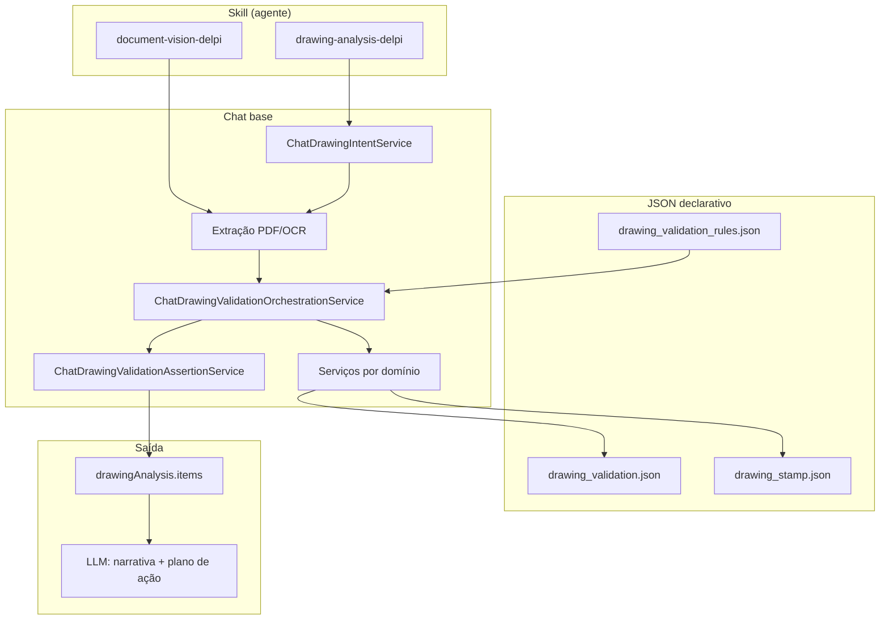

# Playbook — Skill de desenho desacoplada e generalista

> **Status (22/06/2026):** **Backlog** — Fase A–E planejadas após correções pontuais (90264243, 90262008).  
> **Projeto:** Minha DELPI Chat IA  
> **Arquitetura:** inteligência transversal no [chat base](../../architecture/chat-intelligence-base.md); skill só habilita pipeline + narrativa.

| Campo | Valor |
|-------|-------|
| Skill | `drawing-analysis-delpi` |
| Skill dependente | `document-vision-delpi` (extração/OCR — sem regras de validação) |
| Orquestrador | `ChatDrawingValidationOrchestrationService` |
| Vocabulário checklist | `drawing_validation.json` · `drawing_stamp.json` |
| Registry parcial | `drawing_validation_rules.json` |
| Policy atual | `drawing-analysis-delpi-skill.md` |
| Playbooks relacionados | [Análise de desenhos](./playbook_skill_analise_desenhos_delpi.md) · [Validação normativa](./playbook_validacao_desenhos_delpi_roadmap.md) · [OCR hierárquico](./playbook_ocr_hierarquico_desenhos_delpi.md) · [BOM colunar](./playbook_bom_colunar_visao_skill_desenho.md) |
| Paridade desacoplamento | [Playbook 18 — prosa template × LLM](../playbook-18-prosa-template-llm-desacoplamento.md) |

**Motivação:** regressões por produto (90262008, 90264243) mostram acoplamento residual — policy da skill repete regras que o pipeline já decide; testes nomeados por código; LLM pode reclassificar itens que `drawingAnalysis.items` já fixou.

---

## 1. Princípio

Separar em **quatro camadas** independentes:

```text
Skill (agente)           → ativação, gates, narrativa auditável
Chat base (transversal)  → extração, validação, assertividade, apresentação
Declarativo JSON         → thresholds, padrões OCR, templates, famílias PA
LLM                      → conclusão, plano de ação — NÃO reclassifica checklist
```

| Camada | Responsabilidade | Não fazer |
|--------|------------------|-----------|
| **Skill** | Quando acionar; consumir `drawingAnalysis`; tom e seções do relatório | Regex, tolerância, «revisão divergente = crítico» fixo |
| **Chat base** | `ChatDrawingValidationOrchestrationService` + serviços por domínio | Lógica só no `system_prompt` do agente |
| **JSON** | `drawing_validation.json`, `drawing_stamp.json`, `drawing_validation_rules.json` | Literais PT/threshold em Python |
| **LLM** | Redigir divergências a partir de `items[]` | Inventar status OK/Pendente/Crítico |

**Regra de ouro:** o checklist **canônico** é `drawingAnalysis.items` — UI, export e narrativa do assistente devem **ecoar** os mesmos `status` e `templateKey`.

---

## 2. Diagnóstico (jun/2026)

| Problema | Sintoma | Onde |
|----------|---------|------|
| Skill «gorda» | Policy contradiz código (ex.: revisão client vs internal) | `drawing-analysis-delpi-skill.md` |
| Testes por produto | Cada bug vira `test_*_90262008.py` | `tests/unit/domain/services/` |
| LLM re-decide | Checklist do modelo ≠ `drawingAnalysis.items` | Turn prep + policy |
| Duas skills entrelaçadas | Regras OCR misturadas na policy de análise | `document-vision-delpi` + `drawing-analysis-delpi` |
| Registry incompleto | Só 4 regras opcionais em `drawing_validation_rules.json` | Revisão, cotas, decape sempre «on» no código |
| RAG redundante | Docs GPT duplicam JSON | `drawing-validation-rules-delpi.md` vs `drawing_validation.json` |

**O que já está certo (manter):**

```text
PDF → ChatPdfDocumentExtractionService / document-vision-delpi
   → ChatDrawingPdfExtractionService
   → get_product_analyser
   → ChatDrawingValidationOrchestrationService
   → ChatDrawingValidationAssertionService (confiança)
   → drawingAnalysis.items → ChatDrawingValidationPresentationService
```

---

## 3. Arquitetura alvo



### 3.1 Contrato metadata (API → LLM → MFE)

```json
{
  "drawingAnalysis": {
    "items": [
      {
        "item": "Revisão",
        "status": "ok",
        "templateKey": "revision_cross_ok",
        "pdfEvidence": "…",
        "apiEvidence": "…",
        "recommendation": "…"
      }
    ],
    "summary": {
      "approved": false,
      "criticalCount": 0,
      "pendingCount": 1
    },
    "extractionConfidence": {
      "scorePercent": 88,
      "meetsThreshold": true
    }
  }
}
```

**Regra:** LLM **não altera** `status` dos items; redige conclusão, destaques e plano de ação.

### 3.2 Registry canônico (estender)

| `templateKey` | Serviço | Seção checklist |
|---------------|---------|-----------------|
| `revision_cross_ok` / `revision_manual_pending` | Orchestration | Cabeçalho |
| `bom_missing` / `bom_extra` | `ChatDrawingBomComparisonService` | BOM |
| `bom_quantity_*` | `ChatDrawingBomQuantityValidationService` | BOM |
| `guide_component_mismatch` | `ChatDrawingGuideComponentConsistencyService` | Roteiro |
| `segment_length_pending` | `ChatDrawingStructureValidationService` | Cotas |
| `decape_mismatch` | `ChatDrawingStructureValidationService` | Cotas |
| `balloon_missing_codes` | `ChatDrawingBalloonValidationService` | BOM |

Formalizar ligação `rule_id` → serviço → `templateKey` em `ChatDrawingValidationRuleRegistryService` (hoje parcial).

---

## 4. Fases de implementação

| Fase | Escopo | Entregáveis | Esforço |
|------|--------|-------------|---------|
| **A — Contrato skill × pipeline** | Policy enxuta; LLM render-only | `drawing-analysis-delpi-skill.md` ≤ 40 linhas técnicas; instrução em turn prep para ecoar `items[]`; doc em `chat-intelligence-base.md` | 1–2 d | **Concluída (jun/2026)** — `ChatDrawingLlmPresentationService` + policies |
| **B — Registry completo** | Todas as regras em `drawing_validation_rules.json` | Famílias PA ligam/desligam regras; orchestrator consulta registry antes de montar items | 2–3 d |
| **C — Testes por regra** | Migrar âncoras de produto para categorias | Casos em `drawing_hierarchical_regression_cases.py`; baseline `drawing_assertiveness_baseline.json`; smoke por regra, não por SKU | contínuo |
| **D — RAG enxuto** | Normas sem duplicar checklist | Docs GPT = contexto normativo; status só via pipeline | 1 d |
| **E — Visão separada** | `document-vision-delpi` sem regras de validação | Policy de desenho referencia visão como dependência | 0,5 d |

### Fase A — detalhe

**Manter na policy:**

- Gates (PDF, código, skill desabilitada)
- Ordem de autoridade: API → PDF → normas
- Como consumir `drawingAnalysis.items`
- Formato do relatório (seções, evidências)

**Remover da policy (→ JSON/código):**

- Thresholds, tolerâncias, padrões OCR
- Classificação fixa por tipo de divergência
- Vocabulário e mensagens PT-BR

### Fase B — detalhe

Expandir `drawing_validation_rules.json`:

```json
{
  "rules": {
    "revision_cross_check": { "section": "Cabeçalho", "defaultEnabled": true },
    "bom_comparison": { "section": "BOM", "defaultEnabled": true },
    "bom_quantity": { "section": "BOM", "defaultEnabled": true },
    "segment_length": { "section": "Cotas", "defaultEnabled": true },
    "decape_per_intermediate": { "section": "Cotas", "defaultEnabled": true },
    "balloon_presence": { "section": "BOM", "defaultEnabled": true },
    "multipage_coverage": { "section": "PDF", "defaultEnabled": true }
  },
  "families": {
    "9026": { "enabledRules": ["*"], "disabledRules": [] },
    "7026": { "enabledRules": ["*"], "disabledRules": ["balloon_presence"] }
  }
}
```

### Fase C — detalhe

| Nível | Artefato | Exemplo |
|-------|----------|---------|
| **Regra** | `test_chat_drawing_*_service.py` | `quantity_from_description`, `internalRevisionTableCapture` |
| **Cenário** | `drawing_hierarchical_regression_cases.py` | «BOM colunar truncada», «revisão data+interna invertida» |
| **Âncora** | `drawing_assertiveness_baseline.json` | `maxFalseCriticalRate` por PDF real |

Cada fix futuro:

1. Nomear **categoria** de regra (não só código de produto)
2. Caso sintético mínimo + baseline se houver PDF
3. ID de produto só como smoke de integração

---

## 5. Anti-padrões (review / CI)

1. Nova regex/threshold em serviço Python → obrigatório JSON + teste de loader (`assistant-content-json.mdc`)
2. Regra só no `system_prompt` do agente → rejeitar PR (`chat-intelligence-base.mdc`)
3. Teste nomeado por produto sem categoria de regra → pedir refactor
4. Policy da skill > 60 linhas de critério técnico → mover para JSON
5. Checklist gerado só pelo LLM sem `drawingAnalysis.items` → bloquear merge
6. Duplicar flatten BOM/estrutura no MFE ou Send/Stream → usar serviço canônico

---

## 6. Gates de teste

```bash
cd minha-delpi-ai-api

# Regras unitárias (por serviço)
.venv/bin/python -m pytest tests/unit/domain/services/test_chat_drawing_* -q

# Baseline assertividade (quando gate script existir)
DRAWING_VALIDATE_CODES=90262008,90264243,90264227 \
  .venv/bin/python scripts/validate_drawing_samples.py --assertiveness-gate

# Conteúdo declarativo
.venv/bin/python -m pytest tests/unit/domain/services/test_drawing_validation_content.py -q
```

**Gate proposto (Fase C):** `scripts/audit_drawing_validation_registry.py --check` — todo `templateKey` em `drawing_validation.json` tem `rule_id` no registry **e** toda regra tem caso de regressão ou teste de serviço dedicado.

---

## 7. Critérios de aceite

- [x] Policy `drawing-analysis-delpi-skill.md` sem thresholds nem classificação técnica duplicada
- [x] Policy render-only injetada quando tool context contém `drawingAnalysis` (`drawing-analysis-render-only.md`)
- [x] Turn prep hidrata `drawingAnalysis` em follow-ups e injeta policy render-only (`ChatDrawingLlmPresentationService`)
- [x] `drawing_validation_rules.json` cobre todas as regras ativas do orchestrator
- [x] Família PA desliga regra sem alterar skill nem agente
- [x] Novos fixes entram como caso de **regra** + teste de serviço (`drawing_validation_rule_regression_cases.py`)
- [ ] Checklist UI e relatório LLM concordam (mesmo `items[]`)
- [ ] RAG normativo não define status OK/Pendente/Crítico

---

## 8. Referências

| Documento | Conteúdo |
|-----------|----------|
| [chat-intelligence-base.md](../../architecture/chat-intelligence-base.md) | Pipeline transversal; agente só adiciona skill |
| [playbook_validacao_desenhos_delpi_roadmap.md](./playbook_validacao_desenhos_delpi_roadmap.md) | Onda 15 — módulos de validação |
| [playbook_skill_analise_desenhos_delpi.md](./playbook_skill_analise_desenhos_delpi.md) | Escopo funcional da skill |
| [playbook-18-prosa-template-llm-desacoplamento.md](../playbook-18-prosa-template-llm-desacoplamento.md) | Paridade «render-only» na prosa |
| [drawing_assertiveness_baseline.json](../../../tests/fixtures/drawing_assertiveness_baseline.json) | Âncoras de assertividade |

---

## Histórico

| Data | Alteração |
|------|-----------|
| 2026-06-22 | Criação do playbook após regressões 90262008/90264243 e plano de desacoplamento skill × chat base |
