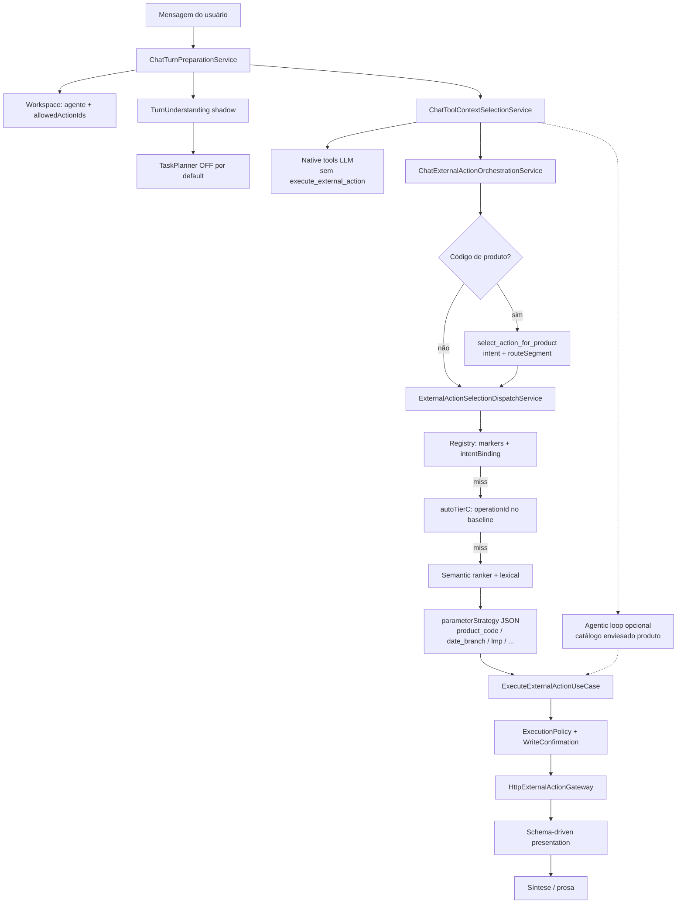
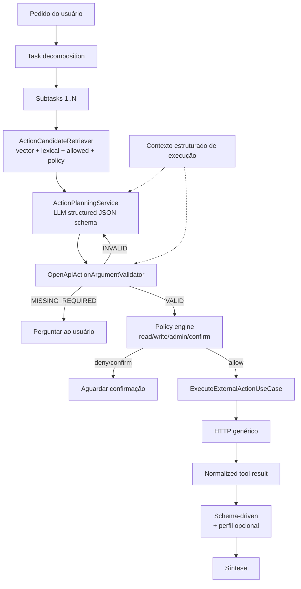

# OpenAPI-first — roteamento universal de tools (chat)

**Tipo:** plano técnico executável (diagnóstico + migração incremental)  
**Status:** cutover OpenAPI-first — default `CHAT_OPENAPI_PLANNER_MODE=on`, fail-closed (sem fallback silencioso para registry), `autoTierC` só em CI (`operational_route_registry_autotierc.ci.json`)

**Runtime:** Action Catalog OpenAPI (Postgres) é a fonte de seleção. `operational_route_registry.json` permanece para policies SQL/predicados legados em `mode=off` (rollback).

### Aceite E9 (suite `test_openapi_first_acceptance.py`)

| Caso | Resultado |
|------|-----------|
| 1 Tracking + id no plano | PASS |
| 2 Missing required → clarify | PASS |
| 3 Enum inválido | PASS |
| 4 additionalProperties body | PASS |
| 5 actionId fora do top-K | PASS |
| 6 Dois providers / allowed | PASS |
| 7 Write + confirmação | PASS |
| 8 Multi-action | PASS |
| 9 executionContext preserva id | PASS |
| 10 Legado mode=off | PASS |

**Requisitos ainda limitados (não bloqueantes do norte):** OAuth2 client-credentials além de `api_key`/`user_token`; embeddings off → retrieval lexical+schema_token; SQL `sql_until_rest` permanece no legado.  
**Data:** 2026-09-08  
**Pacote:** `minha-delpi-ai-api`  
**Público:** arquitetura do chat, gestão de agentes, integradores de APIs OpenAPI  
**Precedência:** `documentos/instrucoes_oficiais_gpt_arquiteto_delpi_central.md` → regras Cursor → ADRs → código/contrato → testes → docs históricas  

Este documento **não autoriza reescrita big-bang**. Cada fase tem feature flag, testes e critério de rollback. A implementação só começa após aceite explícito.

---

## 1. Sumário executivo

O chat já **importa** qualquer OpenAPI para um catálogo persistido (`ChatActionCatalogItem`), gera embeddings e executa HTTP de forma genérica. Isso **não** é o mesmo que **selecionar e parametrizar** a operação.

A inteligência operacional vigente ainda é **registry-first** (vocabulário + `pathMarkers` + `parameterStrategy` + intents de produto). O fallback semântico e o loop agentic existem, mas:

- o dispatch **prioriza** o registry da api-delpi;
- o binding de argumentos **não** lê o schema OpenAPI como fonte primária;
- o gerador `autoTierCRoutes` replica o baseline **local** da api-delpi;
- o planner de turno (`ChatTaskPlannerService`) está **desligado** por default.

**DRIFT principal:** o DOCIE de jun/2026 declara «100% desacoplamento» e «novo provider OpenAPI sem alterar Python». O checklist vigente (`new-api-route-checklist.mdc`) e o código **ainda exigem** ensinar a rota no `operational_route_registry.json`. Uma API de logística fora do monorepo importaria o contrato, mas o agente **não** a usaria com a mesma inteligência da api-delpi.

A correção é inverter a precedência:

```text
OpenAPI importado = o que existe e como chamar
retrieval top-K     = quais operations são candidatas
LLM planner         = qual operation + argumentos
validador OpenAPI   = se o contrato permite
policy engine       = se o agente/usuário pode
executor HTTP       = chamada genérica
apresentação        = schema-driven com perfil opcional
```

JSON de conteúdo permanece para **linguagem, UX e políticas corporativas** — não como segundo catálogo de endpoints.

---

## 2. Objetivo original

Permitir cadastrar uma API OpenAPI **nunca vista no repositório**, importá-la, vinculá-la a um agente e, em linguagem natural:

```text
entender → recuperar operations → planejar → validar argumentos
→ executar com segurança → interpretar → responder
```

**Sem** alterar Python central, **sem** `pathMarkers` / `operationIdMarkers` / `parameterStrategy` / intent / presenter obrigatórios específicos da API.

Critério de sucesso: o cenário da § 29 (API `logistica.exemplo.com`) passa em teste de fixture, não em narrativa.

---

## 3. Fluxo atual comprovado no código

### 3.1 Entrada do turno

| Etapa | Módulo | Evidência |
|-------|--------|-----------|
| Mensagem + projeto/agente | `ChatWorkspaceContextService` | `allowedActionIds` via `list_enabled_action_ids` (provider enabled + sensitivity × `allowRead`/`allowWrite`/`allowAdmin`) | **CONFIRMADO_NO_CODIGO** |
| Melhoria de pergunta | `ChatUserQueryImprovementService` | no início de `ChatTurnPreparationService.prepare` | **CONFIRMADO_NO_CODIGO** |
| Turn understanding (shadow) | `ChatTurnUnderstandingService` | flag `CHAT_TURN_UNDERSTANDING_SHADOW` / JSON | **CONFIRMADO_NO_CODIGO** |
| Task planner | `ChatTaskPlannerService` | `taskPlannerEnabled: false` em `conversational_intelligence.json`; bridge só **agenda** capabilities, não executa HTTP | **CONFIRMADO_NO_CODIGO** |
| Pipeline inteligência | `ChatIntelligencePipelineService` | intent, memória, `operationalFocus` | **CONFIRMADO_EM_DOCUMENTACAO_CANONICA** + **CONFIRMADO_NO_CODIGO** |

### 3.2 Seleção de tools (não é o LLM escolhendo OpenAPI)

`ChatToolContextSelectionService.select_tools`:

1. Tools internas determinísticas (`web_search`, plataforma, TV…).
2. Native tool calling LLM — **somente** tools em `NATIVE_TOOL_PARAMETERS` (`get_current_user`, `web_search`, `tv_dashboard_copilot`…). **Não inclui** `execute_external_action`. **CONFIRMADO_NO_CODIGO**
3. Tool router LLM opcional sugere **nomes de tools internas** + `actionId` residual; não é o planner OpenAPI.
4. Se `actionsEnabled` e há `allowed_action_ids`: `ChatExternalActionOrchestrationService.plan_actions` → `ExternalActionSelectionService`.

Orquestração (`ChatExternalActionOrchestrationService`) é **produto-first**: grounded planning, multi-scope de produto, `select_action_for_product`, depois `select_action` (dispatch registry). **CONFIRMADO_NO_CODIGO**

### 3.3 Dispatch registry-first

```text
ExternalActionSelectionDispatchService
  → preflight SQL / authoring
  → ExternalActionRegistryDispatchPhaseService (dispatchOrder JSON)
       sessionRefinement
       operationalRoutes      ← 84 rotas manuais (markers)
       domainRoutes
       intentBoundRoutes
       sqlFallback
       autoTierCRoutes        ← 422 rotas geradas do baseline api-delpi
       semanticFallback       ← ranking vetorial + lexical
```

**CONFIRMADO_NO_CODIGO** em `external_action_registry_dispatch_phase_service.py` + `operational_route_registry.json` (`version` 2026.06.16).

Contagens atuais (**CONFIRMADO_NO_CONTRATO** no JSON):

| Bloco | Quantidade |
|-------|------------|
| `routes` manuais | 84 |
| com `pathMarkers` | 80 |
| com `operationIdMarkers` | 55 |
| com `intentBinding` | 9 |
| `autoTierCRoutes` | 422 (todas com markers) |
| `fallbackPolicies` SQL | 6 |

Estratégias manuais: `product_code` 34, `date_branch` 26, `system_metadata` 7, `lmp` 5, `supplies_stock` 4, `department_idd` 3, `product_search` 2, `exclusive_catalog` 1, `supplier_part_number` 1, `sale_orders` 1.

### 3.4 Execução

`ChatToolContextExecutionService` → `ExecuteExternalActionTool` → `ExecuteExternalActionUseCase`:

1. Carrega provider+action do catálogo persistido.
2. Normaliza argumentos / SQL.
3. `ExternalActionExecutionPolicy.validate` (required, unknown, path params, body em GET).
4. `HttpExternalActionGateway` (URL = `baseUrl` + path, query do schema, auth `user_token`/`api_key`/`none`).
5. `ChatWriteConfirmationService` intercepta write/admin/destructive **antes** da execução paralela.
6. Apresentação: `ChatPresentationApiDeliveredMetadataService` → schema-driven.

**CONFIRMADO_NO_CODIGO**

### 3.5 Loop agentic (já existe, não é o caminho principal)

`ChatAgenticToolLoopService` (`CHAT_AGENTIC_LOOP_ENABLED` default **true**): após o fast path, o LLM recebe um catálogo **enxuto** (`ChatAgenticActionSchemaService`) e devolve JSON `{tools, arguments}`. Pode escolher `action:*`. **Porém**:

- o catálogo é recortado por `find_candidate_actions` + hints de path de **produto** (`ChatAgenticCatalogService._INTENT_PATH_HINTS`);
- exemplos de parâmetros são **hardcoded** (`code=10080022`, `branch=01`, …);
- o loop **injeta** `productCode` do foco operacional em `parameters.code`;
- max 2 passos por default.

**CONFIRMADO_NO_CODIGO** — o planner LLM já existe, mas está **enviesado para api-delpi/produto** e **não substitui** o dispatch registry.

---

## 4. Diagrama Mermaid atual



---

## 5. Inventário de acoplamentos

Legenda: 🔴 bloqueia API externa · 🟡 degrada qualidade · 🟢 generalista (manter)

| # | Acoplamento | Onde | Sev. | Estado |
|---|-------------|------|------|--------|
| A1 | `pathMarkers` / `operationIdMarkers` por endpoint | `operational_route_registry.json` + resolver | 🔴 | **CONFIRMADO_NO_CONTRATO** |
| A2 | `parameterStrategy` por rota | registry + `api_route_domains.json` + `OperationalApiParameterBuilderService` | 🔴 | **CONFIRMADO_NO_CODIGO** |
| A3 | `autoTierCRoutes` geradas de `api-delpi/.../openapi_baseline.json` | `OperationalRouteRegistryGeneratorService` | 🔴 | **CONFIRMADO_NO_CODIGO** |
| A4 | Affinity `/products/` no resolver | `OperationalRouteActionResolverService._action_fits_route_affinity` | 🔴 | **CONFIRMADO_NO_CODIGO** |
| A5 | Orquestração produto-first | `ChatExternalActionOrchestrationService` | 🔴 | **CONFIRMADO_NO_CODIGO** |
| A6 | Intent produto + `routeSegment` | `product_query_intent.json` + `ChatProductQueryIntentService` | 🟡 | vocabulário corporativo válido; **não** deve ser o único motor |
| A7 | Discovery por `markerPools` / `orIlike` | `ExternalActionCandidateDiscoveryService` + `external_action_responses.json` | 🟡 | **CONFIRMADO_NO_CODIGO** |
| A8 | Hints de path no catálogo agentic | `ChatAgenticCatalogService._INTENT_PATH_HINTS` | 🔴 | **CONFIRMADO_NO_CODIGO** |
| A9 | Exemplos de params hardcoded | `ChatAgenticActionSchemaService._PARAM_EXAMPLES` | 🟡 | **CONFIRMADO_NO_CODIGO** |
| A10 | `capability_registry.json` `routeHints` api-delpi | capabilities `action.product_*` | 🟡 | **CONFIRMADO_NO_CONTRATO** |
| A11 | `entity_capability_catalog.json` `routeId` do registry | grounded fan-out | 🟡 | **CONFIRMADO_NO_CONTRATO** |
| A12 | Sensitivity por substring de path | `OpenApiActionImporter._classify_sensitivity` | 🟡 | **CONFIRMADO_NO_CODIGO** |
| A13 | Native tools sem OpenAPI | `ChatNativeToolSchemaService` | 🟢 | correto para tools de plataforma |
| A14 | Executor HTTP genérico | `HttpExternalActionGateway` | 🟢 | **CONFIRMADO_NO_CODIGO** |
| A15 | Policy required/unknown/path | `ExternalActionExecutionPolicy` | 🟢 incompleto (sem enum/format/body schema) | **CONFIRMADO_NO_CODIGO** |
| A16 | Schema-first presentation default | `uses_schema_first_presentation` ≠ `legacy` | 🟢 | **CONFIRMADO_NO_CODIGO** |
| A17 | `if "/products/"` residual | resolver, `chat_route_context_service`, direct answer | 🔴 | **CONFIRMADO_NO_CODIGO** |
| A18 | Checklist nova rota exige registry | `new-api-route-checklist.mdc` § 2 | 🔴 | **CONFIRMADO_EM_DOCUMENTACAO_CANONICA** |
| A19 | DOCIE «100% desacoplado» | `docie-desacoplamento-selecao-rotas-openapi.md` | — | **DRIFT** vs código |
| A20 | `openapi_operation_contracts.json` | duplica entity/shape da api-delpi | 🟡 | **CONFIRMADO_NO_CONTRATO** |

---

## 6. Fontes duplicadas de verdade

| Fato | Fonte 1 | Fonte 2 | Fonte 3 | Problema |
|------|---------|---------|---------|----------|
| Quais operations existem | OpenAPI importado (Postgres) | `operational_route_registry.json` | `openapi_baseline.json` (api-delpi) | Três catálogos. Externa só entra no 1º. |
| Como chamar (path/method/params) | `parametersSchema` no catálogo | `parameterStrategy` no registry | bindings em `api_route_domains.json` | Binding ignora nomes genéricos (`shipment_id`). |
| O que a operação faz | `summary`/`description` OpenAPI | `match.terms` no registry | `capability_registry.whenToUse` | Retrieval lexical enviesado ao vocabulário DELPI. |
| Entity/shape | `x-delpi` no OpenAPI | `openapi_operation_contracts.json` | `presentation_profiles.json` | Enriquecimento api-delpi; fallback schema-driven já existe. |
| Intenção do usuário | LLM / embeddings | `product_query_intent.json` | `production_operational_intent.json` | Fast path excelente para DELPI; cego para domínio alheio. |

**DRIFT:** o DOCIE trata o registry como «catálogo declarativo único OpenAPI-first». No runtime ele é um **segundo OpenAPI** escrito à mão + um **dump** do baseline.

---

## 7. Análise de cada JSON relevante

Classificação: **A** permanecer · **B** migrar para OpenAPI/catálogo · **C** eliminar duplicação.

| Arquivo | Campo / bloco | Papel atual | Fonte futura | Ação |
|---------|---------------|-------------|--------------|------|
| `operational_route_registry.json` | `dispatchOrder` | Ordem de fases | Feature flag de seleção | **A** temporário; virar `selectionModes` |
| idem | `fallbackPolicies` SQL | `sql_until_rest` | Policy excepcional | **A** (exceção DELPI) |
| idem | `sqlReadiness` | REST vs SQL produção | Policy | **A** até REST 100% |
| idem | `routes[].route.pathMarkers` | Match de path | Embedding + schema | **B** → remover após paridade |
| idem | `routes[].route.operationIdMarkers` | Match de operationId | Catálogo persistido | **B** |
| idem | `routes[].parameters.strategy` | Binding | Schema OpenAPI + LLM | **B** (estratégias universais viram extractors genéricos) |
| idem | `routes[].intentBinding` | Intent produto → rota | Planner + retrieval | **B** |
| idem | `routes[].priority` | Ranking manual | Score semântico + policy | **C** progressivo |
| idem | `autoTierCRoutes` | Espelho GET do baseline | Catálogo Postgres | **C** (gerador só em teste/CI api-delpi) |
| idem | `actionableProductPredicates` / playbook | Vocabulário produto | `product_query_intent` | **A** (linguagem) se não duplicar markers |
| `api_route_domains.json` | `domains.*.pathMarkers` | Classificar path api-delpi | OpenAPI tags/entity | **B** para roteamento; **A** só se usado em apresentação DELPI |
| idem | `parameterStrategies.date_branch` | Filial/datas corporativas | Extractor genérico + vocabulário | **A** como **extractor reutilizável**, não por endpoint |
| idem | `department_idd`, `sale_orders`, `supplies_stock` | Bindings de domínio DELPI | Extractors opcionais | **A** (policy corporativa) |
| `product_query_intent.json` | termos, pipelines detect/refine | Linguagem de produto | — | **A** |
| idem | `routePredicates` amarrados a path | Fast path DELPI | Retrieval | **B** gradual |
| `production_operational_intent.json` | termos PB15 + `pathTokens` | Linguagem produção | — | **A** termos; **B** `pathTokens` |
| `external_action_responses.json` | `selectionReasons`, security, `manifestText` | UX + retrieval settings | — | **A** |
| idem | `actionSelection.candidateDiscovery.markerPools` | Path pools DELPI | Retrieval híbrido | **B** |
| `presentation_profiles.json` | `entityProfiles` / `pathRules` | UX rica api-delpi | OpenAPI `x-delpi` + fallback genérico | **A** opcional; **nunca** condição de funcionar |
| `openapi_operation_contracts.json` | entity/shape por `operationId` | Espelho api-delpi | `x-delpi` / `meta` da resposta | **B** (CI api-delpi); runtime lê catálogo |
| `entity_capability_catalog.json` | `routeId` registry | Fan-out produto | Capabilities derivadas do catálogo | **B** |
| `capability_registry.json` | `routeHints` `/products/...` | Discovery E4 | Semantic document | **B** para actions; **A** para rag/web/reason |
| `agentic_planner.json` | prompts do loop | Planner LLM | Estender para OpenAPI planner | **A** |
| `conversational_intelligence.json` | flags shadow/cutover | Migração | Novas flags OpenAPI-first | **A** |
| `column_labels.json` / `presenter_content.json` | rótulos DELPI | UX | `meta.fields` + fallback nome do campo | **A** |
| `date_range_vocabulary.json` | datas PT-BR | Interpretação corporativa | Extractor genérico | **A** |
| `operational_pagination.json` | caps por path fragment | Paginação DELPI | Schema `page`/`page_size` | **A** defaults genéricos; **B** markers de path |
| `error_handling.json` | `missing_required_parameter` | Clarify | — | **A** |

---

## 8. Funcionamento atual da indexação OpenAPI

```text
openApiUrl | schema JSON
  → requests.get (timeout 20s)
  → OpenApiActionImporter.import_actions
  → upsert ExternalActionModel + embedding
  → ChatAgentActionProvider (allowed por sensitivity)
```

**CONFIRMADO_NO_CODIGO** em `openapi_action_importer.py`, `postgres_external_action_repository.py`, Playbook 16.

### 8.1 O que o importer persiste

`actionId`, `operationId`, `method`, `path`, `summary`, `description`, `tags`, `parametersSchema`, `requestBodySchema`, `responseSchema`, `sensitivity`, `deprecated`, `enabled`, `delpiMetadata` (`x-delpi`), `whenToUse` (locale pt-BR).

### 8.2 O que o documento semântico (`ExternalActionManifestTextService.build`) inclui hoje

| Campo | No embed? | Notas |
|-------|-----------|-------|
| method, path, summary, description, operationId, tags | sim | |
| `whenToUse` | sim se `x-delpi.locale` | APIs padrão **não** têm |
| nomes + descrições + enums de **parameters** | sim (cap 24 params) | |
| required/optional | **não** explícito no texto | só no schema persistido |
| request body schema / properties | **não** | `request_body_schema` é persistido mas **não** entra no manifesto | **CONFIRMADO_NO_CODIGO** |
| examples OpenAPI | **não** | |
| response schema completo | **não**; só entity/shape/fields de `x-delpi` | API externa sem extensão perde «returns» |
| provider name / providerKey | **não** | |
| security / scopes | **não** | |

`$ref` **não é resolvido** no importer: parameters/`requestBody`/`responses` são copiados crus. **CONFIRMADO_NO_CODIGO** · **HIPOTESE_A_VALIDAR:** schemas com `$ref` geram `parametersSchema` inútil para validação/retrieval.

Sensitivity: heurística de path (`/data/sql`, `export`, `/admin`) + método HTTP. Uma API externa `POST /shipments/{id}/cancel` vira `write` (bom), mas `GET /admin/...` vira `admin` por substring. **CONFIRMADO_NO_CODIGO**

Embeddings: `ExternalActionEmbeddingService` usa o manifesto; `search_similar_actions` faz cosine no Postgres. Se embed está `off` (Kimi + bge local), cai para lexical. **CONFIRMADO_NO_CODIGO** + regra `llm-stack-centralized`.

---

## 9. Funcionamento atual da seleção de actions

Ordem efetiva (**CONFIRMADO_NO_CODIGO**):

1. Preflight SQL / authoring / canvas / web-search block.
2. Session refinement (paginação, profundidade, lastAction).
3. KPI departamental pode **furar** a ordem se `ChatDepartmentKpiIntentService` casar.
4. Registry vocabulary (`match.terms`) + production operational + LMP + system metadata.
5. Intent-bound produto (`STOCK`, `STRUCTURE`, …).
6. SQL fallback policy.
7. autoTierC: pega top semântico **somente se** `route_by_operation_id` existir **e** `autoGenerated`. API externa **nunca** entra aqui.
8. Semantic fallback: top-K vetorial + lexical; score mínimo; gap → clarify; params = **só** `build_date_branch`.

O LLM **não** escolhe a operation no caminho principal. O agentic loop pode escolher depois, com catálogo recortado e enviesado.

`find_candidate_actions` filtra por `allowed_action_ids` e, se houver regra `candidateDiscovery`, aplica `ILIKE` em colunas. Sem `allowed_ids` e sem regra, retorna vazio. **CONFIRMADO_NO_CODIGO**

---

## 10. Funcionamento atual do parameter binding

`OperationalRouteActionResolverService.build_parameters` despacha por `strategy`:

| Strategy | Comportamento | Universal? |
|----------|---------------|------------|
| `product_code` | código 8 dígitos / contexto → `code` | **Não** — assume `{code}` e `/products/` |
| `date_branch` | filial + intervalo via vocabulário | **Parcial** — nomes `branch`/`start_date` são comuns, mas o matcher é PT-BR DELPI |
| `department_idd` | depto SI | Não |
| `supplies_stock` | defaults de armazém | Não |
| `lmp` | `sale_number` regex | Não |
| `product_search` | query texto + `/products/search` | Não |
| `exclusive_catalog` | PA/MP | Não |
| `supplier_part_number` | PN fornecedor | Não |
| `sale_orders` | OV | Não |
| `system_metadata` | tabelas Protheus | Não |
| `none` (autoTierC maioria) | frequentemente `{}` ou date_branch inferido pelo **path** | Frágil |

`OperationalApiParameterBuilderService.build` no spec de domínio só cobre `product_code`, `date_branch`, `department_idd`, `supplies_stock`. O restante vive no resolver/catálogo de produto.

**Não existe** extração estruturada «schema da action → argumentos». O agentic loop pede JSON ao LLM, mas exemplos e injeção de `code` são DELPI.

Generic semantic fallback chama `build_date_branch` e filtra ao schema — para `/shipments/{id}/tracking` o path param **não é preenchido**. A policy depois falha com `missing_path_parameter` **se** a action chegar a executar. **CONFIRMADO_NO_CODIGO**

Validação atual (`ExternalActionExecutionPolicy`): required, unknown, path tokens, body proibido em GET. **Não** valida enum, format, types, `additionalProperties`, requestBody JSON Schema. **CONFIRMADO_NO_CODIGO**

---

## 11. Limitações para APIs externas

Se hoje um admin cadastrar `https://logistica.exemplo.com/openapi.json` e vincular ao agente:

| Etapa | Funciona? | Por quê |
|-------|-----------|---------|
| Import + persistência | Sim | Importer genérico |
| Embeddings | Parcial | Sem body/examples/provider; `$ref` cru |
| `allowed_action_ids` + RBAC sensitivity | Sim | `list_enabled_action_ids` |
| Fast path registry | Não | Sem markers/intent |
| autoTierC | Não | operationId ausente do baseline api-delpi |
| Semantic fallback | Talvez descubra a action | Se summary/path overlaparem com a pergunta |
| Binding `shipment_id=45871` | Não | Nenhuma strategy lê path param genérico |
| Planner agentic | Improvável | Hints `/stock` `/products/`; exemplos `code` |
| Execução HTTP + auth | Sim, se args corretos | Gateway genérico |
| Confirmação write | Sim | `ChatWriteConfirmationService` |
| Apresentação útil | Parcial | Schema-driven default; sem `x-delpi` perde entity/shape ricos |
| Multi-turno «e a previsão?» | Não generalizado | Continuidade é lastAction + segmentos de produto |

**Resposta objetiva à pergunta da § 30:** o que impede não é a ausência da API no registry — é o **motor de seleção e binding ser o registry**. Ver tabela da § 30.

---

## 12. Arquitetura alvo

Princípio travado (sem Option A/B):

> OpenAPI importado é a fonte de verdade de **quais** operations existem e **como** chamá-las. Retrieval + planner escolhem **qual**. Código determinístico decide **se** é permitido e **se** os argumentos são válidos.

```text
OpenAPI
  → OpenApiActionImporter (+ $ref resolve)
  → NormalizedActionDescriptor (catálogo)
  → ActionSemanticDocument (rico, provider-agnostic)
  → Embedding + índice lexical
  → RetrieveActionCandidatesService (top-K ∩ allowed ∩ policy)
  → PlanExternalActionsService (LLM structured: 1..N actions)
  → ValidateActionArgumentsService (JSON Schema OpenAPI)
  → missing required → clarify (nunca inventar)
  → ExecuteActionPlanService → ExecuteExternalActionUseCase
  → schema-driven presentation (perfil opcional)
```

**Não** criar `logistics_route_service.py`. **Não** inferir capacidade por substring de path no caminho novo (legado isolado até Fase 8).

Reuso obrigatório (não reinventar):

| Peça existente | Papel no alvo |
|----------------|---------------|
| `ChatActionCatalogItem` / importer / gateway | base |
| `ExternalActionManifestTextService` | estender documento semântico |
| `ExternalActionSemanticRankerService` + `search_similar_actions` | retrieval vetorial |
| `ChatAgenticToolLoopService` + `ChatAgenticActionSchemaService` | semente do planner (desenviesar) |
| `ChatTurnUnderstandingService` + `ChatTaskPlannerService` | decomposição multi-pedido (ligar cutover) |
| `ExternalActionExecutionPolicy` | base do validator (completar schema) |
| `ChatWriteConfirmationService` | policy write |
| `ChatSchemaDrivenPresentationService` | fallback apresentação |
| `ChatClarificationPolicyService` / `error_handling.json` | missing required |

---

## 13. Diagrama Mermaid alvo



---

## 14. Modelo `ActionDescriptor`

Domínio (`domain/models/` ou value object frozen). Persistência continua na tabela atual; o descriptor é a leitura normalizada.

```text
ActionDescriptor
  actionId: str                 # provider_token.tag.operation
  providerKey: str
  providerName: str
  operationId: str
  method: str
  path: str
  summary: str | None
  description: str | None
  tags: tuple[str, ...]
  parameters: tuple[OpenApiParameter, ...]   # $ref resolvido
  requestBody: OpenApiRequestBody | None
  responseContract: OpenApiResponseHints     # status 200 schema resumido
  examples: tuple[str, ...]
  sensitivity: Sensitivity                   # import + override opcional
  deprecated: bool
  enabled: bool
  extensions: dict                           # x-delpi / x-delpi-ai opcional
  semanticDocument: str                      # texto canônico do embed
```

`OpenApiParameter`: `name`, `in`, `required`, `schema` (type/enum/format), `description`, `example`.

Nenhum campo `pathMarkers` / `parameterStrategy`.

---

## 15. Modelo `ActionCandidate`

```text
ActionCandidate
  descriptor: ActionDescriptor
  retrievalScore: float          # vetorial
  lexicalScore: float
  hybridScore: float
  matchedSignals: tuple[str, ...]  # tags, param names, summary hits
  allowed: bool                  # já filtrado; redundante p/ auditoria
  policyPreview: str             # read | needs_confirmation | deny
```

Saída do retriever: lista ordenada top-K (K configurável por modo: fast 4 / normal 8 / thinker 12 — valores no JSON, não mágicos).

---

## 16. Modelo `ActionPlan`

Alinha `TaskPlan` existente, mas com **actions concretas** (não só `capabilityId` heurístico).

```text
ActionPlan
  source: "openapi_semantic_planner" | "legacy_registry" | "shadow_compare"
  tasks: tuple[PlannedAction, ...]
  confidence: float
  reason: str                    # chave JSON, não prosa hardcoded

PlannedAction
  id: str                        # t1, t2
  goal: str
  actionId: str
  operationId: str
  arguments: { parameters, body }
  dependsOn: tuple[str, ...]
  parallelGroup: str | None
  validationStatus: VALID | MISSING_REQUIRED | INVALID | AMBIGUOUS
  missingParameters: tuple[str, ...]
```

Contrato LLM: JSON Schema strict. **Proibido** executar a partir de texto livre.

---

## 17. Estratégia retrieval top-K

Componente: `RetrieveActionCandidatesService` (application) + port `ActionSemanticSearchPort`.

Entrada: mensagem, contexto compacto (lastAction, operationalFocus **genérico**, entidades resolvidas), `allowed_action_ids`, agent policies.

Pipeline:

1. Filtro duro: enabled + allowed + sensitivity vs allowRead/Write/Admin.
2. Vetor: `search_similar_actions` (já existe).
3. Lexical: overlap no **semantic document** (já existe `lexical_overlap_score`; hoje usado como anotação).
4. Híbrido: soma ponderada declarada em JSON (`actionSelection.hybridWeights`).
5. **Sem** `if provider == api-delpi`, **sem** boost de path conhecido.
6. Desempate: GET antes de write; `allowed_action_ids` order (já usado); score.

Candidate discovery `markerPools` DELPI sai do caminho novo (permanece no legado até Fase 8).

Quando embeddings estão `off`: lexical + BM25/trigram **HIPOTESE_A_VALIDAR** (Postgres `pg_trgm` já usado em knowledge?). Fallback mínimo: ILIKE em summary/path/operationId **genérico**, não pools de path DELPI.

---

## 18. Estratégia LLM Tool Planner

Evoluir `ChatAgenticToolLoopService` + `ChatAgenticActionSchemaService` em `PlanExternalActionsService` (application) com port `ActionPlannerPort`.

Contexto enviado (cap de chars no JSON):

- pedido + subtask atual;
- lastAction (actionId, args, pagination, timeRange) **sem** payload bruto;
- top-K candidates: operationId, method, path, description, parameters slim, requestBody slim;
- restrições: «só estes actionIds».

Saída: schema da § 16.

Regras:

- 1 action por subtask; N subtasks → N planned actions;
- writes nunca auto-executam se policy exigir confirmação;
- se top-2 scores próximos e descriptions distintas → `AMBIGUOUS` / clarify (reusar `ExternalActionScoreGapClarificationService` generalizado);
- **não** injetar `parameters.code` só porque existe foco de produto — injetar só se o **schema** tiver parâmetro compatível (nome/alias declarado no OpenAPI ou extractor genérico de identificador).

Flags: `CHAT_OPENAPI_PLANNER_MODE=off|shadow|canary|on` (ver § 32).

---

## 19. Estratégia de argument binding

```text
mensagem + contexto + JSON Schema da action
  → LLM structured extraction (planner)
  → coerce segura (string digit, date ISO)
  → validator
```

Extractors **universais** (JSON + serviços transversais, não por rota):

| Extractor | Quando aplicar | Origem atual a generalizar |
|----------|----------------|----------------------------|
| `identifier_from_message` | path/query required string/integer | hoje só product_code 8 dígitos |
| `date_range` | params com format date / nomes start/end | `date_branch` **sem** exigir `branch` |
| `enum_from_vocabulary` | schema.enum ∩ termos do usuário | granularity, status |
| `pagination` | page/page_size/limit | `operational_pagination` defaults |
| `context_inherit` | follow-up | lastAction args se nomes coincidem |

Extractors **corporativos DELPI** (`branch` filial 01/02, `code` produto 8 dígitos, LMP) permanecem como plugins de vocabulário **se e somente se** o schema da action tiver esses parâmetros. Não disparam em `/shipments/{id}`.

**Não** criar `parameterStrategy: shipment_id`.

---

## 20. Estratégia OpenAPI validation

`ValidateActionArgumentsService` + port `OpenApiValidatorPort` (infra: jsonschema após `$ref` resolve).

Resultados: `VALID` | `MISSING_REQUIRED_ARGUMENTS` | `INVALID_ARGUMENTS` | `AMBIGUOUS_ARGUMENTS`.

Cobertura:

- required path/query/header;
- types, enum, format;
- requestBody required + additionalProperties;
- rejeitar params fora do schema (já existe);
- **nunca** preencher required com default inventado (defaults OpenAPI `schema.default` **podem** aplicar se o contrato declarar — isso é o contrato, não invenção).

Clarificação: `error_handling.json` `missing_required_parameter` + `ChatClarificationPolicyService` (não perguntar o que é discoverable).

Estender `ExternalActionExecutionPolicy` em vez de um segundo validador paralelo no use case. **CONFIRMADO** alinhamento clean architecture.

---

## 21. Policy / confirmation model

Já separado de descoberta, em parte:

| Camada | Hoje | Alvo |
|--------|------|------|
| Provider enabled | sim | igual |
| Agent↔provider allowRead/Write/Admin | sim | igual |
| Action enabled / not deprecated | sim | igual |
| Sensitivity vs allow* | sim em `list_enabled_action_ids` | igual; importer menos heurístico |
| `requiresConfirmationForWrite` | agent + `ChatWriteConfirmationService` | planner **não** bypassa |
| RBAC usuário (JWT + permissões chat) | sim | igual |
| LLM URL arbitrária | impossível (só actionId catalogado) | manter |

Writes/admin/destructive: shortlist do planner **pode listar**, execução **não** ocorre sem confirmação. **CONFIRMADO_NO_CODIGO** o gate; o caminho novo deve chamá-lo **antes** do gateway.

Extensão opcional `x-delpi-ai.confirmation` / `sensitivity`: override se presente; **não** obrigatória.

---

## 22. Multi-action planning

Hoje: `ChatExternalActionOrchestrationService` faz fan-out **de produto** (estoque+estrutura); `ChatTurnUnderstandingService` decompõe em shadow; `ChatTaskPlannerService` mapeia para capabilities estáticas e **não executa**.

Alvo: understanding → um `ActionPlan` com tasks por subtask → retrieval **por subtask** → planner → execução paralela se `ChatWriteConfirmationService.is_parallel_safe_read` e sem `dependsOn`.

Exemplo composto («estoque, última compra, pedidos, preço») vira 4 planned actions se as operations existirem no catálogo do agente — **sem** `ChatProductMultiScopePlanningService` exclusivo. O serviço de produto permanece como **vocabulário** (scopes) até a paridade, depois vira um caso do planner genérico.

Cap `maxMultiActionsPerTurn` já existe em `tool_context.json` / response modes — reusar.

---

## 23. Multi-turn

Hoje: `operationalFocus`, lastAction, `ChatGroundedCapabilityPlanningService`, `routeSegment` de produto, merge `merge_last_action_params`.

Alvo — contexto estruturado **provider-agnostic** no working memory:

```text
executionContext:
  selectedProviderKey
  selectedActionId
  operationId
  resolvedArguments        # últimos args válidos
  lastToolResultMeta       # entity/shape/pagination, não payload inteiro
  pagination
  timeRange
```

Follow-up «e a previsão?» → retrieval enviesado ao **mesmo provider** + path prefix/tag da lastAction, ainda assim via score, **não** `if "/tracking"`. «agora desse outro produto» só preenche se o schema tiver o mesmo param (`code` vs `shipment_id`).

Não resolver por paths específicos.

---

## 24. Presentation fallback

Já é o default Playbook 22: `uses_schema_first_presentation` é verdadeiro salvo `presentationStrategy: legacy`. **CONFIRMADO_NO_CODIGO**

Fluxo alvo (já próximo):

```text
payload → unwrap → ChatSchemaDrivenPresentationService
  → tabela/KPI/chart/tree genéricos
  → perfil JSON se entity conhecida
  → prosa LLM (Playbook 18/19) ancorada em fatos
```

Obrigações desta migração:

- API sem `x-delpi` e sem `presentation_profiles` **ainda** produz tabela/texto a partir de lists/dicts;
- `openapi_operation_contracts.json` **não** é requisito de runtime para provider externo;
- não criar presenter `logistics_*`.

Risco: envelopes não-TOTVS (`data.items` vs `shipments[]`). Mitigação: estender `_TABULAR_LIST_KEYS` / unwrap com chaves do **response schema** OpenAPI, não com if de path. **HIPOTESE_A_VALIDAR** na Fase 5 com fixture logística.

---

## 25. Observabilidade

Estender `ExternalActionSelectionDiagnosticsService.annotate` (já existe `match_source`).

Metadata por decisão (sem tokens/secrets):

```json
{
  "selectionMode": "openapi_semantic_planner",
  "providerKey": "logistics",
  "candidateCount": 8,
  "selectedActionId": "logistics.shipments.get_shipment_tracking",
  "operationId": "get_shipment_tracking",
  "semanticScore": 0.87,
  "lexicalScore": 0.41,
  "plannerConfidence": 0.94,
  "validationStatus": "valid",
  "fallbackUsed": false,
  "legacyRouteId": null
}
```

Métricas (admin já tem qualidade; acrescentar séries):

- `action_selection_success_rate`
- `action_selection_fallback_rate`
- `planner_invalid_arguments_rate`
- `missing_required_argument_rate`
- `legacy_vs_new_divergence_rate` (shadow)
- `tool_execution_success_rate`

Textos de `reason` continuam em `external_action_responses.json`.

---

## 26. Migração do `operational_route_registry.json`

**O arquivo continua necessário no médio prazo. Não como catálogo de endpoints.**

| Permanecer (A) | Sumir (B/C) |
|----------------|-------------|
| `fallbackPolicies` SQL até REST cobrir | `routes[].route.pathMarkers` |
| `sqlReadiness` / `sqlRefinementPolicy` | `operationIdMarkers` |
| predicados de vocabulário **sem** path (se únicos) | `parameters.strategy` por endpoint |
| `dispatchOrder` enquanto dual-run | `priority` por endpoint |
| | **bloco inteiro** `autoTierCRoutes` no runtime |

**Após Fase 8:** o JSON vira `operational_selection_policies.json` (nome EN) com policies excepcionais. O gerador `generate_operational_route_registry.py` deixa de ser requisito de **runtime** para provider externo; pode permanecer como **gate CI da api-delpi** (cobertura de apresentação), opção **A da § 20 do pedido**:

> Baseline / gerador / `ChatPresentationCoverageService` → **teste/fixture e CI api-delpi**, não runtime do chat universal.

Runtime lê `ChatActionCatalogItem`. **CONFIRMADO** alinhamento ao requisito «API externa não depende de baseline versionado».

Checklist `new-api-route-checklist.mdc` deve ser atualizado na Fase 8: rota api-delpi = OpenAPI `x-delpi` + import; **não** linha nova no registry.

---

## 27. Arquivos que serão criados

| Path | Fase | Papel |
|------|------|--------|
| `app/domain/models/action_descriptor.py` | 1 | value objects |
| `app/domain/models/action_plan.py` | 3 | ActionPlan / PlannedAction |
| `app/domain/ports/action_semantic_search_port.py` | 2 | DIP |
| `app/domain/ports/action_planner_port.py` | 3 | DIP |
| `app/domain/ports/openapi_validator_port.py` | 4 | DIP |
| `app/domain/services/action_semantic_document_service.py` | 1 | documento rico (estende manifesto) |
| `app/application/services/retrieve_action_candidates_service.py` | 2 | top-K |
| `app/application/services/plan_external_actions_service.py` | 3 | planner |
| `app/application/services/validate_action_arguments_service.py` | 4 | orquestração validação |
| `app/infrastructure/openapi/openapi_ref_resolver.py` | 1 | `$ref` |
| `app/infrastructure/openapi/openapi_jsonschema_validator.py` | 4 | adapter |
| `app/content/pt-BR/assistant/openapi_tool_routing.json` | 1 | limites K, pesos híbridos, flags copy |
| `tests/fixtures/openapi/logistics_example.json` | 1 | aceite externo |
| `tests/unit/.../test_openapi_first_*.py` | 1–9 | casos 1–10 |
| `scripts/audit_openapi_first_routing.py` | 8 | gate pathMarkers / `if "/products/"` |
| este arquivo | 0 | plano |

Nomes em inglês (**english-code-identifiers**). Textos PT só no JSON.

---

## 28. Arquivos que serão alterados

| Path | Mudança |
|------|---------|
| `openapi_action_importer.py` | `$ref`, semantic document, sensitivity menos heurística, body no manifesto |
| `external_action_manifest_text_service.py` | provider, required, body, examples, responses sem x-delpi |
| `postgres_external_action_repository.py` | passar provider name ao embed; search híbrido |
| `external_action_selection_dispatch_service.py` / registry phase | inserir modo novo + shadow |
| `chat_external_action_orchestration_service.py` | não exigir product_code para planejar |
| `chat_agentic_catalog_service.py` | remover `_INTENT_PATH_HINTS` no modo novo |
| `chat_agentic_action_schema_service.py` | examples do OpenAPI, não `_PARAM_EXAMPLES` fixos |
| `chat_agentic_tool_loop_service.py` | delegar ao planner estruturado |
| `external_action_execution_policy.py` | enum/format/body |
| `execute_external_action_use_case.py` | consumir validator (sem lógica extra) |
| `chat_schema_driven_presentation_service.py` | unwrap via response schema |
| `chat_task_planner_service.py` / bridge | ligar actions reais no cutover |
| `conversational_intelligence.json` | flags OpenAPI planner |
| `external_action_responses.json` | reasons + pesos retrieval; encolher markerPools |
| `new-api-route-checklist.mdc` + docs espelho | Fase 8 |
| `assistant-content-catalog.md` | novo bundle |
| `docs/roadmap/README.md` | índice |
| testes de regressão `chat_intelligence_regression_cases.py` | caso 10 |

---

## 29. Arquivos que serão removidos ao final

Nenhum no início. **Ao final da Fase 8**, se paridade comprovada:

| Remover ou esvaziar | Condição |
|---------------------|----------|
| `autoTierCRoutes` no JSON de runtime | gerador só em CI api-delpi |
| `OperationalRouteRegistryGeneratorService` no **boot** do chat | permanece script `--check` da api-delpi |
| `_INTENT_PATH_HINTS` | modo legado desligado |
| `ChatAgenticCatalogService` ranking por intent de produto | substituído pelo retriever |
| rotas manuais cujo único papel é markers | após métrica de divergência < limiar |

**Não remover** `product_query_intent.json`, `date_range_vocabulary.json`, SQL policies, presentation_profiles (opcionais).

Serviços `ExternalActionOperationalRouteSelectionService` / matcher: **quarantine** (`legacy/` ou flag), não delete no cutover D+0.

---

## 30. Roadmap faseado

Ajuste em relação à sugestão original: **já existem** retrieval, agentic loop, schema-driven e policy. As fases **consolidam e invertem precedência**, não reescrevem o executor.

### Fase 0 — Diagnóstico e métricas (este documento)

- Baseline: `match_source` atual (`operationalRoutes` vs `semanticFallback` vs agentic).
- Fixture logística criada, **ainda esperada falhar**.
- Instrumentar contagem de `pathMarkers` (gate futuro).

**Pronto quando:** este doc + fixture + teste vermelho documentado.

### Fase 1 — Semantic document + `$ref`

- Resolver `$ref` no import.
- Documento: provider, required, body, examples, responses.
- Reindex embeddings (script existente `ReindexExternalActionEmbeddingsUseCase`).
- **Não** mudar seleção ainda.

### Fase 2 — Retriever genérico

- `RetrieveActionCandidatesService` limitado a `allowed_action_ids`.
- Híbrido vector+lexical.
- Usar no semantic fallback **e** no agentic catalog (substituir path hints quando flag on).

### Fase 3 — Planner estruturado

- JSON schema de `ActionPlan`.
- Top-K apenas, nunca catálogo inteiro.
- Sem injeção cega de `code`.

### Fase 4 — Validator OpenAPI

- Completar policy.
- Missing required → clarify.

### Fase 5 — Ligar ao executor existente

- Plan → `execute_external_action` (já genérico).
- Apresentação: teste fixture sem profile.
- Decomposição: ligar understanding → N planned actions (task planner cutover **só** para actions OpenAPI, sem bypass HTTP).

### Fase 6 — Shadow

- `legacy_selection` e `openapi_selection` em paralelo.
- Usuário vê legado.
- `legacy_vs_new_divergence_rate`.

### Fase 7 — Canary

- Flag por agente e/ou `providerKey`.
- Começar por provider **não** api-delpi (canary seguro) + um agente piloto.

### Fase 8 — Remover duplicação de rotas

- Parar de gerar `autoTierC` para runtime.
- Lint: crescimento de `pathMarkers` falha CI.
- Atualizar checklist nova rota.

### Fase 9 — Aceite API externa

- Fixture logística + (opcional) provider real de homologação fora do monorepo.
- Casos 1–9 verdes **sem** registry.

---

## 31. Testes de cada fase

Independem da api-delpi (exceto Fase 10 regressão).

| Caso | Fase mínima | Assertiva |
|------|-------------|-----------|
| 1 API desconhecida | 2–3 | pergunta → `get_shipment_tracking` |
| 2 path param | 3–4 | `{id}` ou `shipment_id` = `ABC123` |
| 3 query params | 3–4 | mês/filial mapeados **se** o OpenAPI fictício tiver esses params |
| 4 required ausente | 4 | clarify, não inventa |
| 5 duas actions próximas | 3 | distingue por description |
| 6 dois providers | 2–3 | respeita allowed; sem prefixo hardcoded |
| 7 write | 5 | confirmation |
| 8 frase composta | 5 | ≥2 actions |
| 9 multi-turn | 5 | preserva id da remessa |
| 10 regressão DELPI | 6–8 | fixtures `chat_intelligence_regression_cases.py` |

Fase 0: teste 1 **falha** (prova o gap).  
Fase 1: assertiva de que o semantic document contém `required` + body.  
Gates: `audit_openapi_first_routing.py --check` a partir da Fase 8.

Caso irmão (Fase 2): warehouse stock vs shipment tracking.  
Caso negativo: pergunta de small talk **não** seleciona action.

---

## 32. Feature flags / shadow mode

| Flag | Default | Efeito |
|------|---------|--------|
| `CHAT_OPENAPI_PLANNER_MODE` | `off` | `off` legado · `shadow` compara · `canary` · `on` |
| `CHAT_OPENAPI_PLANNER_PROVIDER_KEYS` | vazio | canary por provider |
| `CHAT_OPENAPI_PLANNER_AGENT_IDS` | vazio | canary por agente |
| `CHAT_TASK_PLANNER_ENABLED` | false | cutover decomposição (já existe) |
| `CHAT_AGENTIC_LOOP_ENABLED` | true | permanece; internamente delega ao planner novo quando mode≠off |

JSON `conversational_intelligence.json` espelha flags (padrão do repo). Env sobrescreve.

Shadow: gravar ambos `match_source` em adminDebug; **não** executar a action nova.

---

## 33. Rollback

1. `CHAT_OPENAPI_PLANNER_MODE=off` → dispatch registry intacto.
2. Não deletar JSON do registry até Fase 8 comprovada.
3. Reindex embeddings é idempotente (`force`); rollback de texto semântico = reimport OpenAPI antigo **não** é necessário se o catálogo não mudou contrato.
4. Se validator novo rejeitar args que o legado aceitava: flag `CHAT_OPENAPI_VALIDATOR_STRICT=false` temporário (só durante canary).

---

## 34. Riscos e mitigação

| Risco | Mitigação |
|-------|-----------|
| Planner escolhe action errada em produto DELPI | Shadow + regressão caso 10; canary primeiro em provider externo |
| Embeddings off | Híbrido lexical; não bloquear import |
| `$ref` complexo / OpenAPI 3.1 | Resolver subset; teste com fixture 3.0 e 3.1 |
| Latência +1 round LLM | Top-K pequeno; fast mode K=4; reusar agentic max_steps |
| Confundir `code` de produto com `id` de remessa | Binding só via schema; sem injeção global de productCode |
| SQL DELPI regressar | `fallbackPolicies` permanecem no legado até REST |
| Apresentação pobre sem x-delpi | schema-driven + prosa LLM; perfil opcional depois |
| Gate pathMarkers quebrar PRs api-delpi no meio da migração | Gate só após Fase 6; allowlist `legacy/` temporária |

---

## 35. Critérios objetivos de aceite

1. Fixture `logistics_example.json` importada em teste **sem** linha no registry.
2. Pergunta «Onde está a remessa 45871 e qual a previsão de entrega?» seleciona tracking e `id=45871`.
3. Write `POST .../cancel` exige confirmação.
4. Dois providers com `GET /stock` respeitam `allowed_action_ids`.
5. Required faltando → clarify (`missing_required_parameter`).
6. Suite DELPI de regressão de inteligência **não** piora além do limiar acordado no shadow (divergência explicada).
7. Grep CI: nenhum `pathMarkers` **novo** em `routes` manuais após Fase 8.
8. Nenhuma classe `*Logistics*Route*`.
9. Apresentação da fixture produz `renderPlan` schema-driven sem `presentation_profiles` dedicado.
10. Send e stream usam o mesmo planner (paridade ADR 002).

---

## 36. Definition of Done final

A arquitetura está concluída somente quando o teste mental da § 29 for um **teste automatizado verde** + canary em provider real fora do monorepo, e:

- runtime não lê `autoTierCRoutes` nem baseline local para selecionar actions;
- Python central **não** precisa mudar para a **próxima** API OpenAPI;
- policy/RBAC/confirmação/SSE/toolCalls/apresentação preservados;
- Ajuda in-app de gestão de agentes atualizada (**feature-help-sync**) no entregável da Fase 7/9 — cadastrar OpenAPI externa e o que o chat faz com isso;
- DoD da § 6 das instruções oficiais (testes, DIP, sem segredos).

**Fora de escopo deste plano:** reescrever apresentação rica da api-delpi; matar SQL `sql_until_rest`; federar auth OAuth de terceiros além de `api_key`/`user_token` já existentes (**HIPOTESE_A_VALIDAR** se a logística exigir OAuth2 client credentials — tratar como extensão de `authMode`, não de roteamento).

---

## Pergunta de aceite — o que impede hoje uma API OpenAPI de terceiro

Pergunta obrigatória:

> Se eu conectar hoje uma API OpenAPI de terceiro que o Minha DELPI nunca viu, o que exatamente impede o agente atual de utilizá-la com a mesma inteligência que utiliza a api-delpi?

| # | Causa | Arquivo / classe | Impacto | Solução | Fase | Teste |
|---|-------|------------------|---------|---------|------|-------|
| 1 | Seleção principal é registry com markers de path/operationId | `OperationalRouteActionResolverService`, `operational_route_registry.json` | Fast path nunca casa | Retriever + planner; markers só legado | 2–3, 8 | Caso 1 |
| 2 | autoTierC exige operationId gerado do baseline api-delpi | `OperationalRouteRegistryGeneratorService`, `OperationalRouteAutoTierCSelectionService` | GET desconhecidos não entram no «tier C» | Runtime = catálogo persistido | 2, 8 | Caso 1 |
| 3 | Binding por `parameterStrategy` DELPI | `OperationalRouteActionResolverService.build_parameters`, `OperationalApiParameterBuilderService` | Não extrai `shipment_id` | Extração via schema + LLM | 3–4 | Casos 2–3 |
| 4 | Semantic fallback só aplica `date_branch` | `ExternalActionGenericRouteSelectionService` | Mesmo com action certa, args vazios → 422/missing path | Planner + validator | 3–4 | Caso 2 |
| 5 | Affinity força `/products/` em strategies de código | `_action_fits_route_affinity` | Filtra actions não-produto | Remover affinity no modo novo | 2 | Caso 1 |
| 6 | Orquestração produto-first | `ChatExternalActionOrchestrationService` | Pedido sem código 8 dígitos cai em miss/SQL/generic fraco | Decomposition genérica | 5 | Casos 1, 8 |
| 7 | Catálogo agentic com path hints de produto + exemplos `code` | `ChatAgenticCatalogService`, `ChatAgenticActionSchemaService` | Planner LLM enviesado | Top-K OpenAPI + examples do schema | 2–3 | Casos 5–6 |
| 8 | Capabilities estáticas `routeHints` api-delpi | `capability_registry.json`, `ChatTaskPlannerService` | Task planner (quando on) não aponta à logística | Capabilities derivadas do catálogo | 5 | Caso 8 |
| 9 | Discovery ILIKE / markerPools DELPI | `ExternalActionCandidateDiscoveryService` | Candidatos errados ou vazios | Filtro allowed + híbrido | 2 | Caso 1 |
| 10 | Semantic document pobre (sem body, required, provider, `$ref`) | `OpenApiActionImporter`, `ExternalActionManifestTextService` | Retrieval falha em operations parecidas | Documento rico | 1 | Caso 5 |
| 11 | Task planner desligado e bridge não executa HTTP | `conversational_intelligence.json`, `ChatTaskPlanExecutionBridgeService` | Frase composta vira 1 intent | Ligar plan → execute via use case existente | 5 | Caso 8 |
| 12 | Checklist e DOCIE ensinam a **adicionar registry** | `new-api-route-checklist.mdc`, DOCIE | Integrador reproduz o anti-padrão | Atualizar docs na Fase 8 | 8 | Gate CI |
| 13 | Validator sem enum/body | `ExternalActionExecutionPolicy` | Args inválidos passam ou required mal reportado | JSON Schema | 4 | Casos 3–4 |
| 14 | Continuidade multi-turno amarrada a produto/routeSegment | `ChatRouteContextService`, grounded planning | «e a previsão?» não reusa `id` | `executionContext` genérico | 5 | Caso 9 |
| 15 | Baseline/cobertura de apresentação no runtime do gerador | `ChatPresentationCoverageService` + baseline api-delpi | Externa invisível ao gerador (bom) mas o chat **depende** do gerador para tier C | Gerador só CI | 8 | Caso 1 |

**Nenhuma linha da tabela se resolve com «adicionar a API ao registry».**

---

## DRIFT explícito (evidência × docs)

| Fonte | Afirma | Realidade | Classificação |
|-------|--------|-----------|---------------|
| DOCIE § 11 item 4 | Novo provider OpenAPI sem alterar Python | Sem markers a action só chega no semantic fallback, com params errados | **DRIFT** |
| DOCIE apêndice A | 100% desacoplamento seleção | 84 rotas manuais + 422 autoTierC + affinity `/products/` | **DRIFT** |
| `new-api-route-checklist` § 2 | Registry obrigatório para rota chat | Contraria o objetivo OpenAPI-first | **DRIFT** (atualizar na Fase 8, não agora) |
| Playbook 16 | Roteamento PB15 **não depende** de embedding | Verdade para DELPI; falsa para API externa | **CONFIRMADO_EM_DOCUMENTACAO_CANONICA** + limitação |
| `chat-intelligence-base.md` | Task planner cutover via flag | Flag off; bridge não chama HTTP | **CONFIRMADO_NO_CODIGO** |
| `04-actions-openapi.md` | Provider OpenAPI genérico | Contrato de **catálogo/execução** genérico; **seleção** não | **DRIFT** parcial |
| Native tool calling | «LLM escolhe tools» | Não escolhe `execute_external_action` | **CONFIRMADO_NO_CODIGO** |

---

## Protocolo de execução (quando o usuário pedir implementação)

Alinhado a `plan-construction.mdc` / `test-and-commit.mdc`:

1. Uma fase (ou subetapa) por vez.
2. Testes do pacote `minha-delpi-ai-api` antes de commit.
3. Commit só se pedido.
4. Não agrupar Fase 2+3 no mesmo PR se o planner ainda não tiver retriever.
5. Satélite Ajuda na Fase 7 (gestão de providers/agentes).
6. Paridade send/stream obrigatória.

### Matriz de fluxos transversais (P0 nesta migração)

| Fluxo | Superfície | Caminho | P0 |
|-------|------------|---------|----|
| Send | API | `SendChatMessageUseCase` → tool context | P0 mesmo planner |
| Stream | API | `StreamChatMessageUseCase` | P0 |
| Simulate/admin | API | mesmo pipeline | P0 |
| Fast / normal / thinker | modos | K e max_steps por JSON | P0 |
| Agentic loop | pós-seleção | delega ao planner | P0 |
| SQL authoring | preflight | permanece legado | herança |
| Desenho / TV / web | outros tools | não misturar | herança |
| Ajuda gestão agentes | plugin chat admin | sync Fase 7 | P0 user-facing |
| MFE render | `chatPresentation.ts` | render-only | herança (contrato metadata) |

---

## Revisão adversarial

**Como pode estar errado mesmo com testes verdes?** O planner pode acertar a fixture logística e ainda perder 10 pontos na regressão DELPI porque o registry é um compilador de heurísticas acumuladas. Por isso shadow (Fase 6) é obrigatório **antes** de desligar markers.

**Fluxo irmão fácil de esquecer:** paginação «mostre os próximos 20», SQL `sql_until_rest`, busca de produto por descrição, confirmação write, embeddings off.

**Consumidor que bypassa:** `ChatProductMultiScopePlanningService` e `select_registry_route_id` (sugestão admin). Precisam da mesma flag ou permanecer legado explícito.
