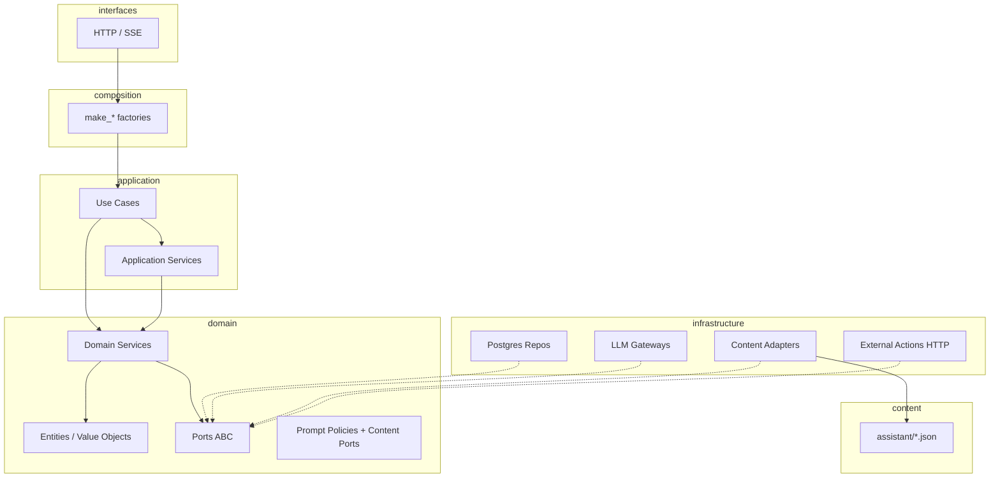

# Playbook 11 — Clean Architecture na API Chat AI

**Projeto:** `minha-delpi-ai-api`  
**Status:** Fase 0 concluída · Fase 1 concluída · Fase 2 lote 1 em andamento (jun/2026)  
**Público:** backend, revisores de PR, agentes Cursor  
**Relacionado:** [`chat-intelligence-base.md`](../architecture/chat-intelligence-base.md), [`chat-pre-llm-layers.md`](../architecture/chat-pre-llm-layers.md), [`assistant-content-catalog.md`](../architecture/assistant-content-catalog.md)

---

## 1. Objetivo

Evoluir o `minha-delpi-ai-api` para uma **clean architecture pragmática**: regras de negócio e inteligência transversal **testáveis e estáveis**, orquestração fina na application, infraestrutura substituível, e textos editáveis fora do código.

Não é reescrever o projeto. É **convergir** o que já funciona (chat base, JSON de conteúdo, composers, ports centrais) e **eliminar** débitos que impedem evolução: god classes, domain acoplado à infra, duplicação send/stream, rotas HTTP gordas.

**Critério de sucesso (12 meses):**

| Métrica | Hoje (jun/2026) | Alvo |
|---------|-----------------|------|
| Use cases send/stream | ~1,5k–2k linhas cada | < 400 linhas cada (orquestração) |
| `external_action_result_presenter` | ~5,1k linhas | < 800 linhas + sub-presenters |
| Domain importando `ContentService` / `Settings` / ORM | ~30 arquivos | 0 |
| Repos sem port | ~6 críticos | 0 nos eixos chat/tools |
| Strings PT-BR fora de `content/` | residual | 0 (enforcement em CI) |
| Regressão inteligência | ~40+ casos | mantida ou ampliada a cada fase |

---

## 2. Revisão do estado atual

### 2.1 O que já está alinhado

```text
interfaces/http  →  composition/*_composer  →  application/use_cases
                                              →  application/services (orquestração)
                                              →  domain/services (regras)
                                              →  domain/ports (contratos)
                                              →  infrastructure/* (adapters)
```

**Pontos fortes:**

- Camadas nomeadas e usadas na prática (`domain`, `application`, `infrastructure`, `interfaces`, `composition`).
- **Ports** nos eixos centrais: `LlmGatewayPort`, `EmbeddingGatewayPort`, repos de sessão/agente/projeto/anexo, `KnowledgeRepositoryPort`, `AuditRepositoryPort`.
- **Entities** separadas de ORM (`ChatSession`, `ChatMessage`, …).
- **Composers** (`chat_composer.py`, `admin_composer.py`) como DI manual.
- **Inteligência transversal** extraída: `ChatIntelligencePipelineService`, `ChatTurnPreparationService`, `ChatToolContextService`.
- **Conteúdo editável:** 33+ bundles em `app/content/pt-BR/assistant/`, `ChatAssistantContentService`, regras Cursor.
- **Entregas recentes (base para continuar):**
  - `ChatPresentationFieldNormalizationService` + `column_labels.json` (humanização tabelas/gráficos).
  - `ExternalActionRouteSelectionService` + `api_route_domains.json` (roteamento API desacoplado).
  - `ChatAttachmentContentService` + `attachments.json` (anexos/lousa).
  - `smoke_e2e_scenarios.json` + smokes empresa/KPI.

### 2.2 Débitos prioritários

| Prioridade | Problema | Onde | Impacto |
|------------|----------|------|---------|
| **P0** | God classes | `external_action_result_presenter.py` (~5,1k), `external_action_selection_service.py` (~3,1k), `chat_routes.py` (~3,1k), `chat_tool_context_service.py` (~2,4k), send/stream use cases | Difícil testar, duplicar, revisar |
| **P0** | Pós-LLM duplicado | `SendChatMessageUseCase` vs `StreamChatMessageUseCase` após `ChatTurnPreparationService` | Bugs de paridade, drift |
| **P1** | Domain → infra | `ContentService`, `Settings`, `db.models` em ~30 `domain/services` | Quebra independência do domínio |
| **P1** | Ports incompletos | `external_action`, `chat_skill`, `admin_guideline`, métricas qualidade | HTTP e application instanciam Postgres direto |
| **P2** | Fronteira application/domain inconsistente | Seleção OpenAPI em application; intent em domain; vision em application com regra pesada | Onde implementar fica ambíguo |
| **P3** | HTTP gordo | `chat_routes.py` instancia repos além dos `make_*` | Viola composition root |

---

## 3. Modelo alvo

### 3.1 Regra de dependência



**Dependências permitidas:**

| De | Para | Exemplos |
|----|------|----------|
| `interfaces` | `composition`, `application` (DTO) | rotas chamam `make_send_chat_message()` |
| `composition` | todas as camadas | wiring apenas |
| `application` | `domain`, `domain.ports` | use case chama `ChatIntentRouterService` |
| `domain` | `domain` apenas | sem `infrastructure`, sem Flask |
| `infrastructure` | `domain` (ports, entities) | adapter implementa port |
| `content/` | — | lido só via adapter |

### 3.2 Onde implementar o quê

| Tipo de mudança | Camada | Exemplo |
|-----------------|--------|---------|
| Nova intenção / roteamento determinístico | `domain/services` | `ChatDepartmentKpiIntentService` |
| Nova policy de prompt global | `domain/prompt_policies` + JSON | `analysis_mode.md` |
| Novo vocabulário UI/resposta | `content/pt-BR/assistant/*.json` | `attachments.json` |
| Normalização apresentação (tabela/gráfico) | `domain/services` | `ChatPresentationFieldNormalizationService` |
| Seleção de action OpenAPI | `domain` (spec) + `application` (repo) | `OperationalApiRouteSpec` + `ExternalActionRouteSelectionService` |
| Orquestração de turno (send/stream) | `application` | `ChatTurnPreparationService` |
| Persistência / LLM / HTTP api-delpi | `infrastructure` | `PostgresChatSessionRepository` |
| Endpoint REST | `interfaces` + use case fino | handler de 10–30 linhas |

**Anti-padrões (não fazer):**

- `if produto` / `if kpi` novo em `SendChatMessageUseCase` — extrair para domain.
- String PT-BR completa em Python — mover para JSON.
- `ContentService.load_json` dentro de `domain/services` — usar port.
- Lógica de apresentação só no prompt do agente — herdar pipeline do chat base.

### 3.3 Contratos novos (alvo)

| Port | Responsabilidade | Substitui hoje |
|------|------------------|----------------|
| `AssistantContentPort` | `load(bundle)`, `get`, `list`, `format` | `ContentService` direto no domain |
| `AppConfigPort` | flags (`CHAT_AGENTIC_*`, limites) | `Settings` no domain |
| `ExternalActionRepositoryPort` | actions, providers, execução metadata | instância direta em rotas |
| `ChatSkillRepositoryPort` | skills do agente | Postgres direto |
| `ChatTurnCompletionPort` | pós-LLM unificado (opcional como service) | duplicação send/stream |

---

## 4. Roadmap por fases

### Visão geral

```text
Fase 0 ─ Governança e baseline          [concluída]
Fase 1 ─ Unificar turno send/stream     [concluída]
Fase 2 ─ Desacoplar domain da infra     [lote 1: ports conteúdo/config · 3–4 semanas]
Fase 3 ─ Quebrar god classes            [4–6 semanas]
Fase 4 ─ HTTP fino + ports restantes    [2 semanas]
Fase 5 ─ Enforcement conteúdo + CI      [1–2 semanas]
Fase 6 ─ Documentação viva + ADRs       [contínuo]
```

---

### Fase 0 — Governança e baseline

**Por quê:** sem regra escrita, refactors voltam a acoplar.

**Entregas:**

1. Este playbook linkado em `docs/roadmap/README.md` e `chat-intelligence-base.md`.
2. Regra Cursor: `.cursor/rules/clean-architecture-chat-api.mdc` (checklist PR).
3. Inventário automatizado:
   - script `scripts/audit_clean_architecture.py` — conta imports proibidos domain→infra, linhas dos god files.
4. Baseline salvo em `docs/architecture/clean-architecture-baseline.json` (métricas iniciais).

**Como implementar:**

```bash
# Exemplo de auditoria (a criar)
PYTHONPATH=minha-delpi-ai-api python3 scripts/audit_clean_architecture.py --write-baseline
```

**DoD:** baseline commitado; PR de inteligência cita checklist da regra Cursor.

---

### Fase 1 — Unificar turno (send/stream)

**Por quê:** `ChatTurnPreparationService` unificou pré-LLM; pós-LLM ainda diverge.

**Entregas:**

1. `ChatTurnCompletionService` (application):
   - persistência mensagem assistant;
   - metadata (intentRouting, toolCalls, presentation);
   - memória de sessão / snapshot;
   - telemetria e feedback hooks.
2. `SendChatMessageUseCase` e `StreamChatMessageUseCase` delegam 100% do pós-LLM ao novo serviço.
3. Testes de paridade: mesmo input → mesmo metadata (exceto streaming chunks).

**Arquivos alvo:**

| Ação | Arquivo |
|------|---------|
| Criar | `app/application/services/chat_turn_completion_service.py` |
| Refatorar | `send_chat_message_use_case.py`, `stream_chat_message_use_case.py` |
| Testes | `tests/unit/application/services/test_chat_turn_completion_parity.py` |
| Doc | atualizar `chat-pre-llm-layers.md` (renomear seção para turno completo) |

**Como implementar (passo a passo):**

1. Listar métodos privados duplicados nos dois use cases (diff estrutural).
2. Extrair blocos idênticos para `ChatTurnCompletionService.complete_turn(...)`.
3. Manter stream apenas com: geração de chunks SSE + chamada ao mesmo `complete_turn` no final.
4. Rodar regressão: `pytest tests/unit/domain/services/test_chat_intelligence_regression.py` + smokes L/P/K.

**DoD:** send/stream < 500 linhas cada; teste de paridade verde; zero `if stream` duplicando regra de negócio.

---

### Fase 2 — Desacoplar domain da infraestrutura

**Por quê:** domain não deve importar Flask, SQLAlchemy, paths de JSON, env vars.

**Lote 1 (jun/2026) — concluído parcialmente:**

| Item | Status |
|------|--------|
| `AssistantContentPort` + `InfrastructureAssistantContentAdapter` | ✅ |
| `AppConfigPort` + `InfrastructureAppConfigAdapter` | ✅ |
| `configure_domain_infrastructure_ports()` no composition root | ✅ |
| `ChatAssistantContentService` via port | ✅ |
| Migração `column_labels`, `api_route_domains`, `personality_playbook`, direct response | ✅ |
| ~15 serviços domain ainda com `ContentService`/`Settings` direto | ⏳ lote 2 |

**Entregas restantes (lotes 2–3):**

1. Migrar serviços domain restantes que importam `ContentService` (~15 arquivos).
2. Expandir `AppConfigPort` para flags SQL/agentic usadas no domain.
3. Extrair queries ORM de domain para repos dedicados (ex.: métricas adoção, contexto projeto).

**Ordem sugerida de migração:**

| Ordem | Serviço domain | Bundle JSON |
|-------|----------------|-------------|
| 1 | `ChatAssistantContentService` (já é loader — mover para infra, port fino) | todos |
| 2 | `ExternalActionColumnLabelService` | `column_labels` |
| 3 | `ChatAttachmentContentService` | `attachments` |
| 4 | `ChatOperationalApiDomainService` | `api_route_domains` |
| 5 | `ChatFeedbackContentService`, capabilities detection | `capabilities`, playbook |

**Como implementar:**

1. Definir port em `app/domain/ports/assistant_content_port.py`.
2. Adapter em `app/infrastructure/content/assistant_content_adapter.py`.
3. Composer passa port para use cases que criam domain services — ou registrar singleton no composition root.
4. Um PR por grupo de 3–5 serviços (evitar big bang).

**DoD:** `rg 'from app.infrastructure' app/domain/` retorna 0 matches (exceto `TYPE_CHECKING` se necessário).

---

### Fase 3 — Quebrar god classes

**Por quê:** presenter e selection concentram toda evolução operacional.

#### 3A — Presenter por perfil de rota

**Entregas:**

```
app/domain/services/external_actions/presenters/
  ├── base_presenter.py
  ├── product_list_presenter.py
  ├── product_analyser_presenter.py
  ├── kpi_presenter.py
  ├── chart_presenter.py
  └── sql_presenter.py
```

`ExternalActionResultPresenter` vira **facade** que delega por `ChatApiDelpiResponseProfileService.resolve().entity`.

**Como:** extrair um sub-presenter por PR; manter testes `test_external_action_result_presenter_*` verdes a cada extração.

#### 3B — Seleção OpenAPI

**Entregas:**

- Mover heurísticas estáveis para `domain/services/operational_route/`:
  - `ChatProductRouteSelector`
  - `ChatKpiRouteSelector` (expandir `ExternalActionRouteSelectionService`)
  - `ChatSqlRouteSelector`
- `ExternalActionSelectionService` fica orquestrador (~800 linhas): ordem de tentativa + fallback semântico.

**DoD:** nenhum arquivo > 1.200 linhas em `domain/services/external_actions/`; regressão `test_action_selection_regression` verde.

---

### Fase 4 — HTTP fino e ports restantes

**Entregas:**

1. `ExternalActionRepositoryPort`, `ChatSkillRepositoryPort` implementados.
2. `chat_routes.py` dividido:
   - `chat_session_routes.py`
   - `chat_message_routes.py`
   - `chat_attachment_routes.py`
   - `chat_agent_routes.py`
3. Handlers: validar DTO → chamar `make_*` → retornar resposta (sem `Postgres*` inline).

**DoD:** `rg 'Postgres.*Repository' app/interfaces/` → 0.

---

### Fase 5 — Enforcement de conteúdo

**Entregas:**

1. Fechar itens de `presenter-content-migration-audit.md`.
2. Teste CI `tests/unit/infrastructure/content/test_no_hardcoded_pt_strings.py`:
   - falha se regex encontrar frases PT longas em `app/application` e `app/domain` (allowlist para logs/erros técnicos).
3. Template PR: «alterou texto? atualizou bundle em `assistant/`?»

**DoD:** pipeline CI com gate; novo código sem strings soltas.

---

### Fase 6 — Documentação viva

**Entregas:**

1. ADRs curtos em `docs/architecture/adr/` (formato: contexto, decisão, consequências).
2. Índice único em `chat-intelligence-base.md` apontando para sub-sistemas (evitar 170 serviços soltos).
3. Atualizar playbook a cada fase concluída (status na tabela §4).

---

## 5. Checklist de PR (inteligência / chat)

Usar em todo PR que toque `minha-delpi-ai-api`:

- [ ] Regra de negócio nova está em `domain/services` (não no use case)?
- [ ] Texto exibido ao usuário está em `app/content/pt-BR/assistant/*.json`?
- [ ] Send e stream compartilham o mesmo serviço (preparação **e** conclusão)?
- [ ] Domain não importa `infrastructure.*`?
- [ ] Repositório novo tem port em `domain/ports/`?
- [ ] Rota HTTP não instancia Postgres diretamente?
- [ ] Teste unitário ou caso em `chat_intelligence_regression_cases.py`?
- [ ] Smoke relevante executado (operacional / empresa / anexos)?

---

## 6. Priorização vs produto

| Se o time precisa de… | Fazer primeiro |
|----------------------|----------------|
| Menos bugs send≠stream | **Fase 1** |
| Editar textos sem deploy | **Fase 5** (já parcialmente feito) |
| Novas rotas api-delpi rápido | **Fase 3B** + `api_route_domains.json` |
| Onboarding dev | **Fase 0** + **Fase 6** |
| Performance / latência | Fase 1 + manter fast paths em domain |
| Admin UI estável | Fase 4 (rotas) depois Fase 3A (presenter admin) |

---

## 7. Trabalho já feito (ponto de partida)

Commit `2b4d2272` (jun/2026) entregou blocos alinhados a este playbook:

| Entrega | Fase | Próximo passo |
|---------|------|----------------|
| `ChatPresentationFieldNormalizationService` | 3A | extrair chart presenter |
| `ExternalActionRouteSelectionService` | 3B | migrar `_select_product_action` |
| `ChatAttachmentContentService` | 5 | port de conteúdo (Fase 2) |
| `api_route_domains.json`, `attachments.json` | 5 | enforcement CI |
| Smokes K01–K12 centralizados | 0 | amarrar ao `audit_clean_architecture` |

---

## 8. Referências

| Documento | Uso |
|-----------|-----|
| [`chat-intelligence-base.md`](../architecture/chat-intelligence-base.md) | Mapa de serviços e pipeline |
| [`chat-pre-llm-layers.md`](../architecture/chat-pre-llm-layers.md) | Camadas pré-LLM e alvo `ChatTurnContext` |
| [`assistant-content-catalog.md`](../architecture/assistant-content-catalog.md) | Bundles JSON |
| [`presenter-content-migration-audit.md`](../architecture/presenter-content-migration-audit.md) | Strings residuais |
| [`.cursor/rules/chat-intelligence-base.mdc`](../../.cursor/rules/chat-intelligence-base.mdc) | Onde implementar inteligência |
| [`.cursor/rules/operational-api-routing.mdc`](../../.cursor/rules/operational-api-routing.mdc) | Roteamento API |
| [`.cursor/rules/assistant-content-json.mdc`](../../.cursor/rules/assistant-content-json.mdc) | Vocabulário |

---

## 9. Próxima ação recomendada

**Sprint imediata (Fase 3 — god classes, lote 5):**

1. Reduzir `external_action_selection_service.py` (LMP/SQL delegates) e `chat_tool_context_service.py`.
2. Extrair sub-presenters restantes do facade (SQL, billing, system tables).
3. Expandir `ExternalActionRouteSelectionService` para `_select_lmp_action` e KPIs restantes.

**Concluído (Fase 3 lote 1):** `ExternalActionKpiChartPresenter` (~850 linhas) extraído; facade **6247 → ~5570** linhas.

**Concluído (Fase 3 lote 2):** `ExternalActionProductAnalyserPresenter` (~1208 linhas) extraído; facade **5572 → ~4524** linhas.

**Concluído (Fase 3 lote 3):** `ExternalActionProductListPresenter` (~972 linhas) extraído; facade **4524 → ~3641** linhas.

**Concluído (Fase 3B lote 4):** `ExternalActionProductRouteSelectionService` (~720 linhas); `_select_product_action` migrado para `ExternalActionRouteSelectionService.select_product()`; `external_action_selection_service.py` **3151 → ~2490** linhas.

Atualizar a coluna **Status** deste playbook quando cada fase for concluída.
