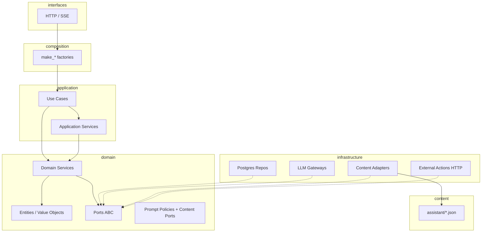

# Playbook 11 — Clean Architecture na API Chat AI

**Projeto:** `minha-delpi-ai-api`  
**Status:** Fases 0–6 concluídas (jun/2026) · baseline PT zerado (jun/2026)  
**Público:** backend, revisores de PR, agentes Cursor  
**Relacionado:** [`chat-intelligence-base.md`](../architecture/chat-intelligence-base.md), [`chat-pre-llm-layers.md`](../architecture/chat-pre-llm-layers.md), [`assistant-content-catalog.md`](../architecture/assistant-content-catalog.md)

---

## 1. Objetivo

Evoluir o `minha-delpi-ai-api` para uma **clean architecture pragmática**: regras de negócio e inteligência transversal **testáveis e estáveis**, orquestração fina na application, infraestrutura substituível, e textos editáveis fora do código.

Não é reescrever o projeto. É **convergir** o que já funciona (chat base, JSON de conteúdo, composers, ports centrais) e **eliminar** débitos que impedem evolução: god classes, domain acoplado à infra, duplicação send/stream, rotas HTTP gordas.

**Critério de sucesso (12 meses):**

| Métrica | Hoje (jun/2026) | Alvo |
|---------|-----------------|------|
| Use cases send/stream | ~1,5k–2k linhas cada | < 400 linhas cada (orquestração) |
| `external_action_result_presenter` | ~5,1k linhas | < 800 linhas + sub-presenters |
| Domain importando `ContentService` / `Settings` / ORM | ~30 arquivos | 0 |
| Repos sem port | ~6 críticos | 0 nos eixos chat/tools |
| Strings PT-BR fora de `content/` | residual | 0 (enforcement em CI) |
| Regressão inteligência | ~40+ casos | mantida ou ampliada a cada fase |

---

## 2. Revisão do estado atual

### 2.1 O que já está alinhado

```text
interfaces/http  →  composition/*_composer  →  application/use_cases
                                              →  application/services (orquestração)
                                              →  domain/services (regras)
                                              →  domain/ports (contratos)
                                              →  infrastructure/* (adapters)
```

**Pontos fortes:**

- Camadas nomeadas e usadas na prática (`domain`, `application`, `infrastructure`, `interfaces`, `composition`).
- **Ports** nos eixos centrais: `LlmGatewayPort`, `EmbeddingGatewayPort`, repos de sessão/agente/projeto/anexo, `KnowledgeRepositoryPort`, `AuditRepositoryPort`.
- **Entities** separadas de ORM (`ChatSession`, `ChatMessage`, …).
- **Composers** (`chat_composer.py`, `admin_composer.py`) como DI manual.
- **Inteligência transversal** extraída: `ChatIntelligencePipelineService`, `ChatTurnPreparationService`, `ChatToolContextService`.
- **Conteúdo editável:** 33+ bundles em `app/content/pt-BR/assistant/`, `ChatAssistantContentService`, regras Cursor.
- **Entregas recentes (base para continuar):**
  - `ChatPresentationFieldNormalizationService` + `column_labels.json` (humanização tabelas/gráficos).
  - `ExternalActionRouteSelectionService` + `api_route_domains.json` (roteamento API desacoplado).
  - `ChatAttachmentContentService` + `attachments.json` (anexos/lousa).
  - `smoke_e2e_scenarios.json` + smokes empresa/KPI.

### 2.2 Débitos prioritários

| Prioridade | Problema | Onde | Impacto |
|------------|----------|------|---------|
| **P0** | God classes | `external_action_result_presenter.py` (~5,1k), `external_action_selection_service.py` (~3,1k), `chat_routes.py` (~3,1k), `chat_tool_context_service.py` (~2,4k), send/stream use cases | Difícil testar, duplicar, revisar |
| **P0** | Pós-LLM duplicado | `SendChatMessageUseCase` vs `StreamChatMessageUseCase` após `ChatTurnPreparationService` | Bugs de paridade, drift |
| **P1** | Domain → infra | `ContentService`, `Settings`, `db.models` em ~30 `domain/services` | Quebra independência do domínio |
| **P1** | Ports incompletos | `external_action`, `chat_skill`, `admin_guideline`, métricas qualidade | HTTP e application instanciam Postgres direto |
| **P2** | Fronteira application/domain inconsistente | Seleção OpenAPI em application; intent em domain; vision em application com regra pesada | Onde implementar fica ambíguo |
| **P3** | HTTP gordo | `chat_routes.py` instancia repos além dos `make_*` | Viola composition root |

---

## 3. Modelo alvo

### 3.1 Regra de dependência



**Dependências permitidas:**

| De | Para | Exemplos |
|----|------|----------|
| `interfaces` | `composition`, `application` (DTO) | rotas chamam `make_send_chat_message()` |
| `composition` | todas as camadas | wiring apenas |
| `application` | `domain`, `domain.ports` | use case chama `ChatIntentRouterService` |
| `domain` | `domain` apenas | sem `infrastructure`, sem Flask |
| `infrastructure` | `domain` (ports, entities) | adapter implementa port |
| `content/` | — | lido só via adapter |

### 3.2 Onde implementar o quê

| Tipo de mudança | Camada | Exemplo |
|-----------------|--------|---------|
| Nova intenção / roteamento determinístico | `domain/services` | `ChatDepartmentKpiIntentService` |
| Nova policy de prompt global | `domain/prompt_policies` + JSON | `analysis_mode.md` |
| Novo vocabulário UI/resposta | `content/pt-BR/assistant/*.json` | `attachments.json` |
| Normalização apresentação (tabela/gráfico) | `domain/services` | `ChatPresentationFieldNormalizationService` |
| Seleção de action OpenAPI | `domain` (spec) + `application` (repo) | `OperationalApiRouteSpec` + `ExternalActionRouteSelectionService` |
| Orquestração de turno (send/stream) | `application` | `ChatTurnPreparationService` |
| Persistência / LLM / HTTP api-delpi | `infrastructure` | `PostgresChatSessionRepository` |
| Endpoint REST | `interfaces` + use case fino | handler de 10–30 linhas |

**Anti-padrões (não fazer):**

- `if produto` / `if kpi` novo em `SendChatMessageUseCase` — extrair para domain.
- String PT-BR completa em Python — mover para JSON.
- `ContentService.load_json` dentro de `domain/services` — usar port.
- Lógica de apresentação só no prompt do agente — herdar pipeline do chat base.

### 3.3 Contratos novos (alvo)

| Port | Responsabilidade | Substitui hoje |
|------|------------------|----------------|
| `AssistantContentPort` | `load(bundle)`, `get`, `list`, `format` | `ContentService` direto no domain |
| `AppConfigPort` | flags (`CHAT_AGENTIC_*`, limites) | `Settings` no domain |
| `ExternalActionRepositoryPort` | actions, providers, execução metadata | instância direta em rotas |
| `ChatSkillRepositoryPort` | skills do agente | Postgres direto |
| `ChatTurnCompletionPort` | pós-LLM unificado (opcional como service) | duplicação send/stream |

---

## 4. Roadmap por fases

### Visão geral

```text
Fase 0 ─ Governança e baseline          [concluída]
Fase 1 ─ Unificar turno send/stream     [concluída]
Fase 2 ─ Desacoplar domain da infra     [concluída]
Fase 3 ─ Quebrar god classes            [concluída]
Fase 4 ─ HTTP fino + ports restantes    [concluída]
Fase 5 ─ Enforcement conteúdo + CI      [concluída]
Fase 6 ─ Documentação viva + ADRs       [concluída]
```

---

### Fase 0 — Governança e baseline

**Por quê:** sem regra escrita, refactors voltam a acoplar.

**Entregas:**

1. Este playbook linkado em `docs/roadmap/README.md` e `chat-intelligence-base.md`.
2. Regra Cursor: `.cursor/rules/clean-architecture-chat-api.mdc` (checklist PR).
3. Inventário automatizado:
   - script `scripts/audit_clean_architecture.py` — conta imports proibidos domain→infra, linhas dos god files.
4. Baseline salvo em `docs/architecture/clean-architecture-baseline.json` (métricas iniciais).

**Como implementar:**

```bash
# Exemplo de auditoria (a criar)
PYTHONPATH=minha-delpi-ai-api python3 scripts/audit_clean_architecture.py --write-baseline
```

**DoD:** baseline commitado; PR de inteligência cita checklist da regra Cursor.

---

### Fase 1 — Unificar turno (send/stream)

**Por quê:** `ChatTurnPreparationService` unificou pré-LLM; pós-LLM ainda diverge.

**Entregas:**

1. `ChatTurnCompletionService` (application):
   - persistência mensagem assistant;
   - metadata (intentRouting, toolCalls, presentation);
   - memória de sessão / snapshot;
   - telemetria e feedback hooks.
2. `SendChatMessageUseCase` e `StreamChatMessageUseCase` delegam 100% do pós-LLM ao novo serviço.
3. Testes de paridade: mesmo input → mesmo metadata (exceto streaming chunks).

**Arquivos alvo:**

| Ação | Arquivo |
|------|---------|
| Criar | `app/application/services/chat_turn_completion_service.py` |
| Refatorar | `send_chat_message_use_case.py`, `stream_chat_message_use_case.py` |
| Testes | `tests/unit/application/services/test_chat_turn_completion_parity.py` |
| Doc | atualizar `chat-pre-llm-layers.md` (renomear seção para turno completo) |

**Como implementar (passo a passo):**

1. Listar métodos privados duplicados nos dois use cases (diff estrutural).
2. Extrair blocos idênticos para `ChatTurnCompletionService.complete_turn(...)`.
3. Manter stream apenas com: geração de chunks SSE + chamada ao mesmo `complete_turn` no final.
4. Rodar regressão: `pytest tests/unit/domain/services/test_chat_intelligence_regression.py` + smokes L/P/K.

**DoD:** send/stream < 500 linhas cada; teste de paridade verde; zero `if stream` duplicando regra de negócio.

---

### Fase 2 — Desacoplar domain da infraestrutura

**Por quê:** domain não deve importar Flask, SQLAlchemy, paths de JSON, env vars.

**Lotes 1–3 (jun/2026) — concluídos:**

| Item | Status |
|------|--------|
| `AssistantContentPort` + `InfrastructureAssistantContentAdapter` | ✅ |
| `AppConfigPort` + `InfrastructureAppConfigAdapter` + `ChatDomainConfigService` | ✅ |
| `ChatRuntimeIntelligenceSettingsPort` (override admin web_search) | ✅ |
| `configure_domain_infrastructure_ports()` + `configure_domain_persistence_ports()` | ✅ |
| `ChatAssistantContentService` via port; bundles JSON no domain | ✅ |
| Repos domain: adoção, peer context, quality issues, skills/actions | ✅ |
| `rg 'from app.infrastructure' app/domain/` → **0** | ✅ |
| Gate CI `test_domain_clean_architecture` | ✅ |

**Ordem sugerida de migração:**

| Ordem | Serviço domain | Bundle JSON |
|-------|----------------|-------------|
| 1 | `ChatAssistantContentService` (já é loader — mover para infra, port fino) | todos |
| 2 | `ExternalActionColumnLabelService` | `column_labels` |
| 3 | `ChatAttachmentContentService` | `attachments` |
| 4 | `ChatOperationalApiDomainService` | `api_route_domains` |
| 5 | `ChatFeedbackContentService`, capabilities detection | `capabilities`, playbook |

**Como implementar:**

1. Definir port em `app/domain/ports/assistant_content_port.py`.
2. Adapter em `app/infrastructure/content/assistant_content_adapter.py`.
3. Composer passa port para use cases que criam domain services — ou registrar singleton no composition root.
4. Um PR por grupo de 3–5 serviços (evitar big bang).

**DoD:** `rg 'from app.infrastructure' app/domain/` retorna 0 matches (exceto `TYPE_CHECKING` se necessário).

---

### Fase 3 — Quebrar god classes

**Por quê:** presenter e selection concentram toda evolução operacional.

#### 3A — Presenter por perfil de rota

**Entregas:**

```
app/domain/services/external_actions/presenters/
  ├── base_presenter.py
  ├── product_list_presenter.py
  ├── product_analyser_presenter.py
  ├── kpi_presenter.py
  ├── chart_presenter.py
  └── sql_presenter.py
```

`ExternalActionResultPresenter` vira **facade** que delega por `ChatApiDelpiResponseProfileService.resolve().entity`.

**Como:** extrair um sub-presenter por PR; manter testes `test_external_action_result_presenter_*` verdes a cada extração.

#### 3B — Seleção OpenAPI

**Entregas:**

- Mover heurísticas estáveis para `domain/services/operational_route/`:
  - `ChatProductRouteSelector`
  - `ChatKpiRouteSelector` (expandir `ExternalActionRouteSelectionService`)
  - `ChatSqlRouteSelector`
- `ExternalActionSelectionService` fica orquestrador (~800 linhas): ordem de tentativa + fallback semântico.

**DoD:** nenhum arquivo > 1.200 linhas em `domain/services/external_actions/`; regressão `test_action_selection_regression` verde.

---

### Fase 4 — HTTP fino e ports restantes

**Entregas:**

1. `ExternalActionRepositoryPort`, `ChatSkillRepositoryPort` implementados.
2. `chat_routes.py` dividido:
   - `chat_session_routes.py`
   - `chat_message_routes.py`
   - `chat_attachment_routes.py`
   - `chat_agent_routes.py`
3. Handlers: validar DTO → chamar `make_*` → retornar resposta (sem `Postgres*` inline).

**DoD:** `rg 'Postgres.*Repository' app/interfaces/` → 0.

---

### Fase 5 — Enforcement de conteúdo

**Entregas:**

1. Fechar itens de `presenter-content-migration-audit.md`.
2. Teste CI `tests/unit/infrastructure/content/test_no_hardcoded_pt_strings.py`:
   - falha se regex encontrar frases PT longas em `app/application` e `app/domain` (allowlist para logs/erros técnicos).
3. Template PR: «alterou texto? atualizou bundle em `assistant/`?»

**DoD:** pipeline CI com gate; novo código sem strings soltas.

---

### Fase 6 — Documentação viva

**Entregas:**

1. ADRs curtos em `docs/architecture/adr/` (formato: contexto, decisão, consequências).
2. Índice único em `chat-intelligence-base.md` apontando para sub-sistemas (evitar 170 serviços soltos).
3. Atualizar playbook a cada fase concluída (status na tabela §4).

---

## 5. Checklist de PR (inteligência / chat)

Usar em todo PR que toque `minha-delpi-ai-api`:

- [ ] Regra de negócio nova está em `domain/services` (não no use case)?
- [ ] Texto exibido ao usuário está em `app/content/pt-BR/assistant/*.json`?
- [ ] Send e stream compartilham o mesmo serviço (preparação **e** conclusão)?
- [ ] Domain não importa `infrastructure.*`?
- [ ] Repositório novo tem port em `domain/ports/`?
- [ ] Rota HTTP não instancia Postgres diretamente?
- [ ] Teste unitário ou caso em `chat_intelligence_regression_cases.py`?
- [ ] Smoke relevante executado (operacional / empresa / anexos)?

---

## 6. Priorização vs produto

| Se o time precisa de… | Fazer primeiro |
|----------------------|----------------|
| Menos bugs send≠stream | **Fase 1** |
| Editar textos sem deploy | **Fase 5** (já parcialmente feito) |
| Novas rotas api-delpi rápido | **Fase 3B** + `api_route_domains.json` |
| Onboarding dev | **Fase 0** + **Fase 6** |
| Performance / latência | Fase 1 + manter fast paths em domain |
| Admin UI estável | Fase 4 (rotas) depois Fase 3A (presenter admin) |

---

## 7. Trabalho já feito (ponto de partida)

Commit `2b4d2272` (jun/2026) entregou blocos alinhados a este playbook:

| Entrega | Fase | Próximo passo |
|---------|------|----------------|
| `ChatPresentationFieldNormalizationService` | 3A | extrair chart presenter |
| `ExternalActionRouteSelectionService` | 3B | migrar `_select_product_action` |
| `ChatAttachmentContentService` | 5 | port de conteúdo (Fase 2) |
| `api_route_domains.json`, `attachments.json` | 5 | enforcement CI |
| Smokes K01–K12 centralizados | 0 | amarrar ao `audit_clean_architecture` |

---

## 8. Referências

| Documento | Uso |
|-----------|-----|
| [`chat-intelligence-base.md`](../architecture/chat-intelligence-base.md) | Mapa de serviços e pipeline |
| [`chat-pre-llm-layers.md`](../architecture/chat-pre-llm-layers.md) | Camadas pré-LLM e alvo `ChatTurnContext` |
| [`assistant-content-catalog.md`](../architecture/assistant-content-catalog.md) | Bundles JSON |
| [`presenter-content-migration-audit.md`](../architecture/presenter-content-migration-audit.md) | Strings residuais |
| [`adr/README.md`](../architecture/adr/README.md) | Decisões arquiteturais (ADRs) |
| [`.cursor/rules/chat-intelligence-base.mdc`](../../.cursor/rules/chat-intelligence-base.mdc) | Onde implementar inteligência |
| [`.cursor/rules/operational-api-routing.mdc`](../../.cursor/rules/operational-api-routing.mdc) | Roteamento API |
| [`.cursor/rules/assistant-content-json.mdc`](../../.cursor/rules/assistant-content-json.mdc) | Vocabulário |

---

## 9. Próxima ação recomendada

**Sprint imediata (pós-playbook 11):**

1. Ports application restantes (admin metrics, external actions inline, runtime settings).

**Concluído (ports learning/memory/vision):** `MemoryItemRepositoryPort`, `VocabularyTermRepositoryPort`, `LearningCandidateRepositoryPort`, `EvaluationCaseRepositoryPort`, `FineTuningRepositoryPort`; aliases em `repository_composer`; application sem `Postgres*` inline nos eixos learning/memory/vision; `ChatDocumentVisionService` via `ChatAttachmentRepositoryPort`; testes `test_learning_memory_vision_repository_ports`.

**Concluído (baseline PT):** heurísticas `external_action_*_route_selection_service` migradas para `external_action_responses.json` (`actionSelection.*`); `semanticRankReason` em `selectionReasons`; gate `test_no_hardcoded_pt_strings` com baseline **32 → 0**.

**Concluído (Fase 2 lote 3):** `ChatRuntimeIntelligenceSettingsPort` + adapter; `ChatWebSearchIntentService` sem import da application; gate `test_domain_clean_architecture`; Fase 2 encerrada (DoD: 0 imports domain→infra).

**Concluído (Fase 2 lote 2):** `ChatMessageFeedbackRepositoryPort` + `ChatQualityIssueRepositoryPort` (`list_issues`, `update_status`); use cases feedback/quality issues e resumos admin (`session_memory`, `text_task`) tipados com ports; composers `make_chat_message_feedback_repository` / `make_chat_quality_issue_repository`; `get_assistant_message` retorna dict (`id`, `metadata`, `content`); testes `test_repository_ports`, `test_feedback_repository_ports`.

**Concluído (pós-Fase 6):** mensagens da lousa migradas para `attachments.canvasResponses`; `chat_canvas_content_service` sem strings PT soltas; baseline **58 → 32**.

**Concluído (Fase 6):** ADRs 001–006 em `docs/architecture/adr/`; índice de sub-sistemas em `chat-intelligence-base.md`; playbook §4 atualizado.

**Concluído (Fase 5):** gate `test_no_hardcoded_pt_strings` + baseline `hardcoded_pt_strings_baseline.json`; scanner em `hardcoded_pt_string_scanner.py`; resíduos presenter (`collectionPreviewLine`, `playbookReports`, `factoryStatus` table); template PR `.github/pull_request_template.md`.

**Concluído (Fase 4 lote 5):** `admin_chat_skill_use_cases` e `generate_weekly_quality_report_use_case` tipados com ports; composers injetam `make_chat_skill_repository` / `make_chat_quality_report_repository`; `test_interfaces_clean_architecture` + `audit_clean_architecture` verificam `Postgres*Repository` e `make_postgres_` em `app/interfaces/`; smoke `test_generate_weekly_quality_report_use_case`.

**Concluído (Fase 4 lote 4):** ports formais (`ExternalActionRepositoryPort`, `ChatSkillRepositoryPort`, `ChatQualityReportRepositoryPort`); aliases `make_chat_quality_report_repository` / `make_chat_skill_repository`; `admin_routes.py` sem `make_postgres_*`; `agent_routes.py` **1076 → 548** + `agent_provider_routes.py` (461) + `agent_skill_routes.py` (68); `rg 'Postgres.*Repository|make_postgres_' app/interfaces/` → **0**.

**Concluído (Fase 4 lote 3):** `app/interfaces/http/routes/chat/` — `meta`, `agent`, `project`, `attachment`, `session`, `message` + `shared`/`deps`; `chat_routes.py` facade (**3153 → 5**); `rg 'Postgres.*Repository' app/interfaces/http/routes/chat` → **0**; aliases `make_chat_agent_repository` / `make_audit_repository` / `make_external_action_repository`.

**Concluído (Fase 4 lote 2):** `ChatStreamTurnPrepareService`, `ChatStreamSessionTitleService`, `ChatStreamUserMessageService`; textos prepare em `stream.json`; `stream_chat_message_use_case.py` **838 → ~437** linhas.

**Concluído (Fase 4 lote 1):** `ChatTurnSideEffectsService`, `ChatTurnUseCaseSupportService`, `ChatTurnLlmAssemblyService`; paridade send/stream na montagem pré-LLM; `send_chat_message_use_case.py` **877 → ~286**; `stream_chat_message_use_case.py` **1396 → ~838**.

**Concluído (Fase 3B lote 23):** `ExternalActionSelectionDispatchService` (~670 linhas); `select_action` migrado para `dispatch()`; facade `external_action_selection_service.py` **723 → ~148** linhas. **Fase 3B encerrada.**

**Concluído (Fase 3):** god classes de presenter, selection, tool context e turn prep abaixo de ~900 linhas (facades); inteligência transversal no chat base.

**Concluído (Fase 3B lote 22):** `ExternalActionSelectionSupportService` (candidatos, ranking, histórico de tools); `looks_like_sql_or_data_query` em `ExternalActionSelectionHeuristicsService` com termos em `actionSelection.sqlOrDataQueryTerms`; `merge_date_range` em `OperationalApiParameterBuilderService`; `external_action_selection_service.py` **886 → ~723** linhas.

**Concluído (Fase 3C lote 22):** `ChatTurnPreparationPreToolContextService`; early bundle + memória + interpretação sem dados extraídos; `chat_turn_preparation_service.py` **387 → ~356** linhas.

**Concluído (Fase 3 lote 1):** `ExternalActionKpiChartPresenter` (~850 linhas) extraído; facade **6247 → ~5570** linhas.

**Concluído (Fase 3 lote 2):** `ExternalActionProductAnalyserPresenter` (~1208 linhas) extraído; facade **5572 → ~4524** linhas.

**Concluído (Fase 3 lote 3):** `ExternalActionProductListPresenter` (~972 linhas) extraído; facade **4524 → ~3641** linhas.

**Concluído (Fase 3B lote 4):** `ExternalActionProductRouteSelectionService` (~720 linhas); `_select_product_action` migrado para `ExternalActionRouteSelectionService.select_product()`; `external_action_selection_service.py` **3151 → ~2490** linhas.

**Concluído (Fase 3B lote 5):** `ExternalActionLmpRouteSelectionService` (~210 linhas); `_select_lmp_action` migrado para `select_lmp()`; `external_action_selection_service.py` **2503 → ~2349** linhas.

**Concluído (Fase 3B lote 6):** `ExternalActionSqlRouteSelectionService` (~170 linhas); `_select_sql_or_data_action` migrado para `select_sql()`; `external_action_selection_service.py` **2349 → ~2236** linhas; correção de falso positivo em `ChatSqlSafetyService` para intenção natural «execute essa consulta».

**Concluído (Fase 3A lote 7):** `ExternalActionSqlPresenter` (~430 linhas); métodos SQL/resultsets migrados para delegate `_sql()`; `external_action_result_presenter.py` **3650 → ~3310** linhas.

**Concluído (Fase 3A lote 8):** `ExternalActionBillingPresenter` (~260 linhas) e `ExternalActionSystemTablesPresenter` (~200 linhas); billing/estoque/PMR e SX2/SX3 migrados para `_billing()` e `_system_tables()`; facade **3325 → ~2893** linhas.

**Concluído (Fase 3C lote 9):** `ChatToolContextPresentationService` e `ChatToolContextFormatService` extraídos; `chat_tool_context_service.py` **2438 → ~2028** linhas.

**Concluído (Fase 3A lote 9):** `ExternalActionLegacyRoutePresenter` e `ExternalActionPlaybookReportPresenter`; facade **2893 → ~2700** linhas.

**Concluído (Fase 3A lote 10):** `ExternalActionEntityRoutePresenter` (~254 linhas); `_present_entity_first` / `_present_entity_extensions` migrados para `_entity_route()`; facade **2700 → ~2459** linhas.

**Concluído (Fase 3C lote 10):** `ChatToolContextExternalActionFormatter` (~211 linhas); metadata/contexto de external actions extraído; `chat_tool_context_service.py` **2028 → ~1870** linhas.

**Concluído (Fase 3A lote 11):** `ExternalActionPresentationBuilderPresenter` (~454 linhas); `_build_presentation*` e table builders migrados para `_presentation_builder()`; facade **2459 → ~2054** linhas.

**Concluído (Fase 3C lote 11):** `ChatToolContextAuxiliaryService` (~287 linhas); drawing/direct answer/SQL recovery extraídos; `chat_tool_context_service.py` **1869 → ~1645** linhas.

**Concluído (Fase 3A lote 12):** `ExternalActionTextPresentationPresenter` (~238 linhas); `build_text_presentation` / `build_tree_presentation` migrados para `_text()`; facade **2054 → ~1853** linhas.

**Concluído (Fase 3C lote 12):** `ChatToolContextSelectionService`, `ChatToolContextExecutionService` e `ChatToolContextResultAssemblyService`; `build_context` fatiado em seleção/execução/finalização; `chat_tool_context_service.py` **1645 → ~872** linhas.

**Concluído (Fase 3C lote 13):** `ChatToolContextPreTurnService` (~458 linhas); drawing/SQL/paginação extraídos; `chat_tool_context_service.py` **872 → ~523** linhas.

**Concluído (Fase 3A lote 13):** helpers de coluna (`infer_column_type`, `enrich_column`, `format_num`) migrados para `ExternalActionColumnLabelService`; facade **1853 → ~1818** linhas.

**Concluído (Fase 3A lote 14):** `ExternalActionRouteLinePresenter` (~287 linhas); formatadores de linha, helpers de coleção e títulos de detalhe migrados para `_route_lines()`; `_present_product_structure` e `_present_product_factory_status` em `ExternalActionProductListPresenter`; textos de status fabril em `presenter_content.routePresentations.factoryStatus`; facade **1816 → ~1481** linhas.

**Avaliação lote 14 (turn prep):** `chat_turn_preparation_service.py` permanece orquestrador único de send/stream; extração recomendada no lote 15 (direct-answers pré-tool), sem bypass do pipeline.

**Concluído (Fase 3A lote 15):** `ExternalActionOperationalResponsePresenter` (~350 linhas) e `ExternalActionProductOverviewPresenter` (~300 linhas); empty operational, erros API, normalização e visão geral de produto migrados para `_operational_response()` e `_product_overview()`; facade **1481 → ~944** linhas.

**Concluído (Fase 3C lote 15):** `ChatTurnPreparationDirectAnswerService` (~250 linhas); direct-answers pré-tool extraídos; texto de interpretação sem dados em `turn_preparation.json`; `chat_turn_preparation_service.py` **1282 → ~1151** linhas.

**Concluído (Fase 3A lote 16):** `ExternalActionPresenterContentPresenter` e `ExternalActionPresentationShapePresenter`; `_path_fragment_title`, textos JSON e detecção tabular/inspeção migrados; facade **944 → ~903** linhas.

**Concluído (Fase 3C lote 16):** `ChatTurnPreparationMemoryContextService` (~130 linhas); memória de trabalho e conversation context extraídos; `chat_turn_preparation_service.py` **1151 → ~1078** linhas.

**Concluído (Fase 3B lote 17):** `ExternalActionKpiRouteSelectionService` (~310 linhas); heurísticas CPV/OTD/IDD/valor estoque e KPI departamental migradas; `external_action_selection_service.py` **2236 → ~1937** linhas.

**Concluído (Fase 3C lote 17):** `ChatTurnPreparationToolRoutingService` (~330 linhas); guards operacionais, skip-tools e execução de ferramentas extraídos; `chat_turn_preparation_service.py` **1078 → ~948** linhas.

**Concluído (Fase 3B lote 18):** `ExternalActionDomainRouteSelectionService` (~400 linhas); sale orders, Transforma e metadados Protheus migrados para `select_sale_orders` / `select_transforma` / `select_system_metadata`; `external_action_selection_service.py` **1937 → ~1587** linhas.

**Concluído (Fase 3C lote 18):** `ChatTurnPreparationPostToolResolutionService` (~350 linhas); cadeia de `direct_answer`/`skip_rag` pós-tools extraída; correção de `request_attachment_ids` no intent route; `chat_turn_preparation_service.py` **948 → ~704** linhas.

**Concluído (Fase 3B lote 19):** `ExternalActionProductSearchRouteSelectionService`, `ExternalActionRefinementRouteSelectionService` e `ExternalActionGenericRouteSelectionService`; product search, paginação/profundidade e fallback semântico migrados; `external_action_selection_service.py` **1587 → ~1080** linhas.

**Concluído (Fase 3C lote 19):** `ChatTurnPreparationRagService` (~240 linhas); construção RAG, glossário, memória semântica e stream activity extraídos; `chat_turn_preparation_service.py` **704 → ~532** linhas.

**Concluído (correção pós-lote 19):** textos `reason` e activity RAG migrados para `external_action_responses.json` (`selectionReasons`) e `stream.json` (`activity.rag`, `turnPreparation.think`); diretrizes `.cursor/rules` atualizadas.

**Concluído (Fase 3C lote 20):** `ChatTurnPreparationResultService`; intent route e montagem de `ChatTurnPreparationResult` extraídos; mensagens think do turn prep via `stream.turnPreparation.think`.

**Concluído (Fase 3B lote 21):** `ExternalActionSelectionHeuristicsService`; termos de produto/LMP em `actionSelection` JSON; `build_date_branch` delegado a `OperationalApiParameterBuilderService`; `external_action_selection_service.py` **1080 → ~870** linhas.

**Concluído (Fase 3C lote 21):** `ChatTurnPreparationIngressService`; canvas, pre-tool, histórico e think extraídos; targets em `stream.turnPreparation.thinkTargets`; `chat_turn_preparation_service.py` **548 → ~380** linhas.

Atualizar a coluna **Status** deste playbook quando cada fase for concluída.
