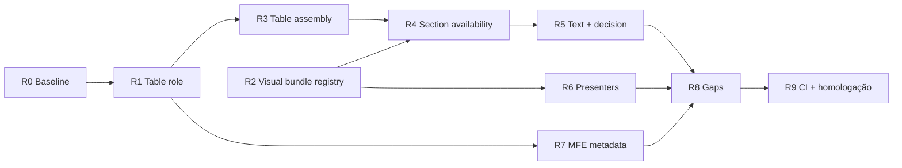

# Playbook 12 — Refatoração declarativa da apresentação

Projeto: Minha DELPI Chat IA  
Escopo: segunda onda de generalização do pipeline de apresentação — eliminar `if` por path, unificar API↔MFE e escalar para **qualquer action** sem copy-paste de presenters.

> **Princípio:** regra de negócio **uma vez** no módulo canônico + JSON PT + teste de regressão. Ver [centralized-rules-first.mdc](../../.cursor/rules/centralized-rules-first.mdc) e [assistant-content-json.mdc](../../.cursor/rules/assistant-content-json.mdc).

Relacionado:

- [apresentacao-dados-generalizada-jun2026.md](./apresentacao-dados-generalizada-jun2026.md) — onda 1 (fases 0–6, **concluída**)
- [humanized-narrative-stack-jun2026.md](../architecture/humanized-narrative-stack-jun2026.md) — narrativa humanizada
- [playbook-09-apresentacao-rica.md](./playbook-09-apresentacao-rica.md) — decisor + MFE unificado
- [chat-assistant-content-presentation.md](../architecture/chat-assistant-content-presentation.md) — contrato metadata

**Commits de referência (onda 1 parcial):** `70d9556f`, `cc4ce7d8`, `6afa8243`, `072b3503`.

---

## Status do playbook

| Fase | Tema | Status |
|------|------|--------|
| **R0** | Baseline e inventário de débito | ✅ Concluído |
| **R1** | `role` nas tabelas (API → MFE) | ✅ Concluído |
| **R2** | Registry de bundles visuais por perfil | ✅ Concluído |
| **R3** | Montagem declarativa de `tablePresentations` | ✅ Concluído |
| **R4** | Section availability declarativa | ✅ Concluído |
| **R5** | Texto e decisão por perfil (não por path) | ✅ Concluído |
| **R6** | Presenters produto — quartet unificado | ✅ Concluído |
| **R7** | MFE confia no metadata da API | ✅ Concluído |
| **R8** | Narrativa, dedup e gaps residuais | ✅ Concluído |
| **R9** | CI, homologação e encerramento | ✅ Concluído |
| **R10** | Fechamento tier A (visualBuilders + cobertura) | ✅ Concluído |
| **R11** | Chips pós-resposta API↔MFE | ✅ Concluído |
| **R12** | Regressão entity contract + CI consolidado | ✅ Concluído |

Atualizar a coluna **Status** ao concluir cada fase (`⬜` → `✅`).

---

## 1. Contexto

### 1.1 O que a onda 1 já entregou

| Entrega | Módulo / artefato |
|---------|-------------------|
| Perfis declarativos | `presentation_profiles.json` + `ChatPresentationProfileService` |
| Preferência de sessão | `ChatPresentationPrimaryViewService` |
| Schema-driven tier C→B | `ChatSchemaDrivenPresentationService` |
| Stack markdown + framing | `ChatPresentationStackMarkdownService` |
| Narrativa humanizada | `ChatPresentationHumanizedNarrativeService` |
| KPI cards generalizados | `ChatPresentationKpiAssemblyService` |
| Rich stack default | `ChatPresentationRichStackPolicyService` |
| Cobertura 130 rotas + CI | `audit_presentation_coverage.py`, workflow presentation |

### 1.2 Débito técnico restante (diagnóstico jun/2026)

Apesar da onda 1, ainda existem **três camadas paralelas** de regra por rota:

```
ExecuteExternalActionUseCase     ~14 elif por path (tablePresentations)
ChatPresentationVisualBundleService   ~12 flags + métodos _enrich_* dedicados
ChatPresentationSectionAvailabilityService   ~1126 linhas, handler por rota
MFE presentationStackPlan / presentationMultiRoute   inferTableRoleFromTitle, ROUTE_VISUAL_ORDER
```

**Sintoma:** nova rota rica exige Python em 3–4 arquivos + heurística MFE; risco de divergência API↔UI.

### 1.3 Meta da onda 2

| Métrica | Alvo |
|---------|------|
| Novo perfil rico | JSON + teste; **zero** `elif` novo no use case |
| Tabelas com `role` | 100% dos `tablePresentations` em perfis tier A |
| MFE `inferTableRoleFromTitle` | Reduzido a fallback legacy (< 5 casos) |
| `ChatPresentationSectionAvailabilityService` | < 400 linhas; regras em JSON |
| Homologação | Roteiro R1–R12 (ver §8) verde |

---

## 2. Arquitetura alvo

### 2.1 Pipeline canônico (pós-refatoração)

```
meta.entity + path
  → ChatPresentationProfileService.resolve_profile_key()
  → ChatPresentationTableAssemblyService.assemble()          ← NOVO (R3)
  → ChatPresentationProfileVisualBundleService.enrich()    ← NOVO (R2)
  → ChatPresentationFieldNormalizationService.normalize_metadata()
       → ChatPresentationKpiAssemblyService (já existe)
       → ChatPresentationTableRoleService (R1)
  → ChatPresentationStructureDedupService.dedupe_metadata()
  → ChatPresentationHumanizedNarrativeService.enrich_metadata()
  → ChatPresentationStackOrderService.enrich_metadata()
       → lê stackPlan + sectionRules do perfil (R4)
  → ChatPresentationDecisionService.enrich_metadata()
       → intent + perfil; sem keywords PT soltas (R5)
  → presentationDecision + stackPresentationPlan + tablePresentations[].role
  → MFE: chatPresentation.ts consome metadata; sem re-decidir formato (R7)
```

### 2.2 Extensão de `presentation_profiles.json`

Cada perfil tier A/B passa a declarar (além de `viewOrder` / `stackPlan`):

```json
{
  "factory_status": {
    "defaultView": "table",
    "viewOrder": ["text", "table", "kpi", "chart", "tree", "dashboard"],
    "stackPlan": "factory_status",
    "flags": ["factory_status"],
    "visualBuilders": {
      "kpi": "build_factory_kpi",
      "tree": "build_factory_tree",
      "chart": "build_factory_chart",
      "dashboard": "build_factory_dashboard"
    },
    "tableAssembly": {
      "builder": "build_factory_status_table_presentations",
      "profileTableIndex": 0,
      "primaryTableIndex": 1
    },
    "tableRoles": ["profile", "lmp", "efficiency"],
    "humanizedNarrative": "enrich",
    "sectionRules": "factory_status"
  }
}
```

**Registry de builders (R2):** mapa `builderName → callable` em `ChatPresentationProfileVisualBundleService`, não `if is_factory_profile` no visual bundle.

### 2.3 Contrato `tablePresentation` estendido

```json
{
  "type": "table",
  "title": "Panorama fabril — 90263749",
  "role": "profile",
  "columns": [],
  "rows": []
}
```

| `role` | Uso no stack |
|--------|----------------|
| `profile` | Tabela principal do perfil |
| `guide` | Roteiro / guia de montagem |
| `inspection` | Inspeção / checklist |
| `stock` | Posição de estoque |
| `lmp` | Lista de LMPs |
| `efficiency` | Eficiência fabril |
| `generic` | Fallback |

Tokens de título para inferência legacy: `presentation_vocabulary.json` → `sectionAvailability.tableTitleTokens` (já existe; API passa a **emitir** `role`).

---

## 3. Fases de implementação

### R0 — Baseline e inventário (0,5 sprint)

**Objetivo:** medir débito antes de refatorar.

**Tarefas**

1. Script `scripts/audit_presentation_path_ifs.py`:
   - contar `elif`/`if` com fragmentos de path em `execute_external_action_use_case.py`, `visual_bundle_service.py`, `section_availability_service.py`, `text_presentation_presenter.py`;
   - listar perfis em `presentation_profiles.json` sem `visualBuilders` / `tableAssembly`.
2. Baseline JSON: `docs/architecture/presentation-refactor-baseline-jun2026.json`.
3. Estender `chat_presentation_regression_cases.py` com 1 caso por perfil tier A (factory, stock, analyser, sale_pricing, production_status, raw_material_price).

**Critério de aceite:** baseline versionado; inventário com contagem por arquivo.

**Testes:** `test_presentation_refactor_baseline.py` (snapshot do inventário).

---

### R1 — `role` nas tabelas (API → MFE) — **prioridade máxima**

**Problema:** MFE usa `inferTableRoleFromTitle` (~50 linhas PT) porque a API não envia `role`.

**Módulo canônico:** `ChatPresentationTableRoleService` (novo).

**Tarefas**

1. Criar `ChatPresentationTableRoleService`:
   - `resolve_role(title, path, profile_key) → str` usando `presentation_vocabulary.json`;
   - `assign_roles(tables: list, *, path, profile_key) → list`.
2. Chamar em:
   - `ChatPresentationTableAssemblyService` (R3) ou, provisoriamente, `ExecuteExternalActionUseCase` após montar tabelas;
   - `ChatPresentationFieldNormalizationService.normalize_metadata` (propagar `role` em `tablePresentations` e painéis dashboard).
3. MFE `presentationStackPlan.ts`:
   - preferir `table.role` e `stackPresentationPlan.tableRoleOrder`;
   - marcar `inferTableRoleFromTitle` como `@deprecated` com teste de cobertura decrescente.
4. Testes API: factory 90263749, analyser multi-tabela, stock — cada tabela com `role` esperado.
5. Testes MFE: `presentationStackPlan.test.ts` — sem inferência quando `role` presente.

**Critério:** homologação `status fabril 90263749` — ordem de stack idêntica com e sem inferência MFE.

**Esforço:** M (1–2 dias) · **maior ROI API↔MFE**

---

### R2 — Registry de bundles visuais por perfil

**Problema:** `ChatPresentationVisualBundleService` repete Padrão B (`_enrich_sale_pricing_bundle`, `_enrich_factory_bundle`, …).

**Módulo canônico:** `ChatPresentationProfileVisualBundleService` (novo) ou refatoração do visual bundle existente.

**Tarefas**

1. Extrair mapa de builders do padrão já usado em `_enrich_playbook_status_bundle` / `_enrich_mp_purchase_bundle`.
2. Declarar `visualBuilders` em `presentation_profiles.json` para: `factory_status`, `stock`, `sale_pricing`, `raw_material_price_intelligence`, `cost_impact_simulation`, `production_status`, `shipping_status`, `structure_exclusivity`, `last_purchase`, `purchase_*`, `purchase_list`.
3. Substituir flags `is_*_profile` por loop único: `for view in view_order: registry.build(view)`.
4. Manter `_ensure_generic_kpi_bundle` como fallback (já generalizado em `072b3503`).
5. Política de chart: `chartPolicy: skip|force|auto` no perfil em vez de lista negativa de 11 perfis.
6. Testes: reutilizar `test_factory_playbook_visual_bundle.py`, `test_mp_purchase_playbook_visual_bundle.py`, `test_product_composite_analysis_presenter.py` — todos verdes sem métodos dedicados.

**Critério:** remover ≥ 8 métodos `_enrich_*_bundle` dedicados; diff visual bundle < 250 linhas.

**Esforço:** L (2–3 dias)

---

### R3 — Montagem declarativa de `tablePresentations`

**Problema:** `ExecuteExternalActionUseCase._build_presentation_metadata` com ~14 `elif` por path.

**Módulo canônico:** `ChatPresentationTableAssemblyService` (novo).

**Tarefas**

1. Registry `tableAssembly` no perfil: `builder`, `profileTableIndex`, `primaryTableIndex`, `titleMatchers` (opcional).
2. `assemble(data, path, profile) → { tablePresentations, tablePresentation, profileTablePresentation }`.
3. Migrar rotas nesta ordem (menor risco → maior):
   - `production_status`, `shipping_status`, `structure_exclusivity`
   - `factory_status`, `sale_pricing`, `raw_material_price_intelligence`
   - `analyser` (último — maior complexidade; título PT → `titleMatchers` no JSON)
4. Integrar R1 (`assign_roles`) na saída do assembly.
5. Remover `elif` correspondentes do use case; manter só orquestração.
6. Testes: `test_playbook_presentation_pipeline_regression.py` + casos por perfil.

**Critério:** use case perde ≥ 200 linhas de `elif`; nenhum título PT hardcoded no use case.

**Esforço:** M (1–2 dias)

---

### R4 — Section availability declarativa

**Problema:** `ChatPresentationSectionAvailabilityService` (~1126 linhas) com early-return por rota.

**Módulo canônico:** estender `presentation_profiles.json` + `ChatPresentationSectionAvailabilityService` (refatorar, não duplicar).

**Tarefas**

1. Novo bloco JSON `stackSectionRules` (ou reutilizar `stackPlans.*` existente):
   ```json
   {
     "factory_status": {
       "humanizedSections": true,
       "sectionVisibility": { "scope": true, "highlights": true, "attention": true },
       "narrativeOrder": ["scope", "panorama", "reading", "attention", "conclusion", "panels"],
       "sectionFraming": "stackSectionFraming.factory_status"
     }
   }
   ```
2. Resolver genérico: `_resolve_visibility(rules, metadata)`, `_build_framing(rules)`, `_narrative_order(rules)`.
3. Migrar handlers: `analyser`, `factory_status`, `stock`, `sale_pricing`, `raw_material_price_intelligence`, playbooks status.
4. `ChatPresentationStackOrderService` lê `narrativeOrder` do perfil.
5. Testes: `test_chat_presentation_section_availability_service.py` — um caso por perfil migrado.

**Critério:** arquivo < 400 linhas; regras novas só em JSON.

**Esforço:** L (3–4 dias)

---

### R5 — Texto e decisão por perfil

**Problema:** `ExternalActionTextPresentationPresenter` e `ChatPresentationDecisionService` ainda usam fragmentos de path e keywords PT na mensagem.

**Módulos canônicos:** `EntityRoutePresenter`, `ChatPresentationDecisionService`, `ChatPresentationRoutePolicyService`.

**Tarefas**

1. Registry `textBuilder` no perfil (paralelo a `visualBuilders`).
2. `ChatPresentationDecisionService._decision_for_operational_intent`:
   - consumir `presentation_vocabulary.json` → `intentMarkers`, `formatPreferenceMarkers`;
   - delegar default a `ChatPresentationProfileService` + data shape;
   - remover checks `"/analyser" in intent_token` onde `has_flag(path, "analyser")` basta.
3. Deprecar tokens soltos em `ChatPresentationRoutePolicyService` migrados para perfil.
4. Testes: mesma mensagem com perfis diferentes → `selected` coerente; sem dependência de substring de path no teste.

**Critério:** zero strings PT novas em Python; decisão documentada por perfil no JSON.

**Esforço:** M (1–2 dias)

---

### R6 — Presenters produto: quartet unificado

**Problema:** ~10 presenters × 4 métodos `build_*_{kpi,tree,chart,dashboard}` quase idênticos.

**Módulo canônico:** generalizar `product_composite_analysis_presenter` + `playbook_report_presenter`.

**Tarefas**

1. Spec JSON por perfil: `presenter_content.json` → seções `compositeAnalysisInsights`, `kpiCards`, `chartAxes`.
2. `ChatPresentationCompositeVisualBuilder` (novo): `build_kpi|tree|chart|dashboard(spec, data, path)`.
3. Migrar incrementalmente (1 PR por família):
   - playbook status (production, shipping, exclusivity)
   - MP (last_purchase, purchase_history, purchase_list)
   - sale_pricing, raw_material_price, cost_impact
4. Presenters finos: só mapeiam payload → spec; sem lógica de layout.
5. Testes: smoke `scripts/smoke_playbook_product_routes.py` verde.

**Critério:** reduzir ≥ 30 métodos `build_*_presentation` duplicados.

**Esforço:** L (3–5 dias, incremental)

---

### R7 — MFE confia no metadata da API

**Problema:** `presentationMultiRoute.ts`, `assistantContentVisualFormats.ts`, `presentationStackPlan.ts` reimplementam política de rota.

**Módulo canônico MFE:** `chatPresentation.ts` + `assistantContentLayout.ts`.

**Tarefas**

1. `resolveInitialToolbarKind`: ler `presentationDecision.selected` e `availableViews` — não `routeKeyFromPath`.
2. Eliminar ou sincronizar `ROUTE_VISUAL_ORDER` com `viewOrder` do perfil (script de validação ou remoção).
3. `isTableFirstRouteToolCalls` / `isStructureHeavyToolCalls`: substituir por `stackPresentationPlan` + `dataShape`.
4. Após R1: remover ramos de `inferTableRoleFromTitle` cobertos por `role`.
5. Testes: `presentationStackPlan.test.ts`, `chatPresentation.test.ts` — metadata mock da API como fonte única.

**Critério:** nenhum `path.includes("/stock")` novo no MFE de apresentação.

**Esforço:** M (1–2 dias)

---

### R8 — Narrativa, dedup e gaps residuais

**Tarefas**

1. `ChatPresentationHumanizedNarrativeService`:
   - skips via perfil (`humanizedNarrative: skip|enrich`), não `"/pricing" in path`;
   - headers via `ChatAssistantContentService` / `presenter_content.json`, não regex `**Panorama**`.
2. `ChatPresentationStackOrderService._markdown_has_attention`: prefixos do JSON.
3. MFE `presentationStructureDedup.ts`: confiar em metadata pós-`StructureDedupService`; markers do vocabulário sincronizado.
4. `ChatSchemaDrivenPresentationService._RICH_PROFILE_KEYS`: incluir `purchase_price_history`, `purchase_budget_history`.
5. Opcional: extrair `ChatPresentationMetadataPipelineService` do use case (~500 linhas → orquestração fina).

**Critério:** skips e headers sem literais PT em Python/MFE.

**Esforço:** S (0,5–1 dia)

---

### R9 — CI, homologação e encerramento

**Tarefas**

1. Estender `audit_presentation_coverage.py`:
   - gate `--check-table-roles` (tier A sem `role` → fail);
   - gate `--check-visual-builders` (perfil com `viewOrder` kpi sem builder → warn).
2. Workflow `.github/workflows/minha-delpi-ai-api-presentation.yml` — novos gates.
3. Roteiro manual §8 em `perguntas-teste-chat-jun2026.md`.
4. Changelog `docs/changelog/2026-06-playbook-12-apresentacao-declarativa.md`.
5. Atualizar [assistant-content-catalog.md](../architecture/assistant-content-catalog.md) com novas chaves JSON.

**Critério:** CI verde; playbook 12 com todas as fases ✅.

**Esforço:** M (1 dia)

---

## 4. Ordem de execução recomendada



| Ordem | Fase | Por quê |
|-------|------|---------|
| 1 | **R0** | Medir antes de mexer |
| 2 | **R1** | Desbloqueia MFE; baixo risco |
| 3 | **R2** + **R3** | Paralelizáveis após R1 |
| 4 | **R4** | Depende de perfis e tabelas estáveis |
| 5 | **R5** + **R7** | Alinhar decisão API↔MFE |
| 6 | **R6** | Incremental por família de presenter |
| 7 | **R8** + **R9** | Polimento e gates |

---

## 5. Mapa de módulos canônicos

| Mudança | Implementar em | Não duplicar em |
|---------|----------------|-----------------|
| `role` em tabelas | `ChatPresentationTableRoleService` | `inferTableRoleFromTitle` (MFE) |
| Bundles auxiliares | `ChatPresentationProfileVisualBundleService` | `_enrich_*_bundle` ad hoc |
| `tablePresentations` | `ChatPresentationTableAssemblyService` | `ExecuteExternalActionUseCase` elif |
| Visibilidade stack | `presentation_profiles.json` + section resolver | handler por rota em Python |
| Texto markdown | registry `textBuilder` + `EntityRoutePresenter` | `text_presentation_presenter` path if |
| KPI cards | `ChatPresentationKpiAssemblyService` ✅ | presenters inline |
| Narrativa | `ChatPresentationHumanizedNarrativeService` | skip por path |
| Render MFE | `chatPresentation.ts`, `assistantProseRendering.ts` | `ChatMessageList` ad hoc |
| Textos PT | `presenter_content.json`, `presentation_vocabulary.json` | strings em use case |

---

## 6. Checklist por PR

Antes de merge de qualquer fase R1–R8:

- [ ] Existe **um** ponto de verdade para a regra?
- [ ] Nenhum consumidor novo bypassa o módulo canônico?
- [ ] Teste de regressão cobre o perfil/rota motivador?
- [ ] Strings PT novas só em JSON (gate ADR-006)?
- [ ] `pytest` nos pacotes alterados — verde?
- [ ] MFE alterado: `npm run build` no plugin — verde?
- [ ] Homologação amostral (≥ 1 pergunta do §8) documentada?

---

## 7. Riscos e mitigação

| Risco | Mitigação |
|-------|-----------|
| Regressão analyser multi-rota | Fixtures `2026-06-apresentacao-multi-rota-produto`; migrar analyser por último (R3) |
| Stack order quebrado sem `role` | R1 antes de R7; fallback legacy temporário no MFE |
| JSON de perfil inchado | `stackSectionRules` referencia chaves em `presenter_content.json` |
| Presenters quebrados na migração R6 | 1 PR por família; smoke playbook após cada |
| CI falso positivo em rotas tier C | Gates só em perfis tier A/B declarados |

---

## 8. Roteiro de homologação (R1–R12)

| ID | Pergunta / ação | Valida |
|----|-----------------|--------|
| R1 | `analise de preço 90260145` — stack narrativo + abas KPI/tabela | R4, R8 |
| R2 | `status fabril 90263749` — KPI em cards, ordem painel | R1, R2, `072b3503` |
| R3 | `estrutura 10080001` — árvore + tabela sem duplicata | R3, R8 |
| R4 | `estoque 10080001` — tabela stock, sem narrativa humanizada forçada | R4, R8 |
| R5 | `status produção` (produto playbook) — dashboard + KPI | R2, R6 |
| R6 | `última compra MP` — bundle compra | R2 |
| R7 | Modo **Tabela** na toolbar — respeita preferência | R5, onda 1 |
| R8 | Modo **Gráfico** em rota com série — chart disponível | R2, R6 |
| R9 | Multi-rota analyser — seções numeradas, toolbar por bloco | R1, R3, R7 |
| R10 | Rotas tier C (ex. HR snapshot) — schema-driven + KPI | onda 1, R6 |
| R11 | Chip «Ver em gráfico» pós-resposta | onda 1 Fase 5 |
| R12 | Regressão pytest entity contract + audit coverage | R9 |

Documentar resultados em [perguntas-teste-chat-jun2026.md](../testing/perguntas-teste-chat-jun2026.md).

---

## 9. Referências de código (estado jun/2026)

| Arquivo | Papel | Alvo pós-R* |
|---------|-------|-------------|
| `execute_external_action_use_case.py` | Orquestração metadata | < 200 linhas de montagem |
| `chat_presentation_visual_bundle_service.py` | Bundles auxiliares | Registry único |
| `chat_presentation_section_availability_service.py` | Stack humanizado | Resolver declarativo |
| `chat_presentation_kpi_assembly_service.py` | KPI cards ✅ | Manter canônico |
| `chat_presentation_humanized_narrative_service.py` | Narrativa ✅ | Skips por perfil |
| `kpi_chart_presenter.py` | KPI/chart builders | Delegar ao registry R6 |
| `text_presentation_presenter.py` | Texto por path | Registry R5 |
| `presentation_profiles.json` | Perfis | + visualBuilders, tableAssembly, sectionRules |
| `presentation_vocabulary.json` | Tokens título/intent | Fonte de `role` |
| MFE `presentationStackPlan.ts` | Ordem stack | Consumir `role` |
| MFE `presentationMultiRoute.ts` | Multi-rota | Só layout, não decisão |

---

## 10. Próximo passo imediato

**Manutenção contínua:** novos perfis tier A → fixtures + gates; CI via `--check-playbook12`.

**R12 entregue (jun/2026):**

| Artefato | Detalhe |
|----------|---------|
| Texto | `text_presentation_presenter.py` — zero path literals (entity + profileKey) |
| Gate | `--check-playbook12` — perfis, roles, chips, path baseline, new ops |
| Fixture | `presentation_playbook12_regression_gate.py` |
| Testes | `test_playbook12_regression_suite.py` + entity contract (≥40 entidades) |
| Baseline | `totalPathConditionals` → **0** |

**Playbook 12 encerrado (R0–R12).**

**R11 entregue (jun/2026):**

| Artefato | Detalhe |
|----------|---------|
| API | `ChatPresentationProfileService.should_auto_force_chart`, `text_when_available`; use case sem `stock_like`/`price_like` |
| Interactivity | `viewChipLabels.chart` → «Ver em gráfico»; gate `--check-interactivity-chips` |
| Vocabulário | `postResponseChips` em `presentation_vocabulary.json` |
| MFE | `presentationInteractivityPolicy.ts` — menu de formato via `presentationDecision` |
| Baseline | condicionais use case: 2 → 0 |

**R10 entregue (jun/2026):**

| Artefato | Detalhe |
|----------|---------|
| analyser | `visualBuilders` tree/chart/kpi/dashboard + registry `build_analyser_*` |
| stock | `build_stock_chart` no perfil e registry |
| Vocabulário | `tierAProfileKeys` expandido (13 perfis); `tierAPipelineCases` +7 fixtures |
| Baseline | `tierAMissingVisualBuildersCount` → 0; gate `--check-visual-builders` sem avisos tier A |

**Playbook 12 concluído (R0–R10).**

**R9 entregue (jun/2026):**

| Artefato | Detalhe |
|----------|---------|
| Gates CI | `--check-table-roles` (fail), `--check-visual-builders` (warn) |
| Workflow | `.github/workflows/minha-delpi-ai-api-presentation.yml` — gates + regressões pipeline/role |
| Homologação | §8 em `perguntas-teste-chat-jun2026.md` (H1–H12) |
| Validação | `tests/fixtures/presentation_table_role_gate.py` + `find_visual_builder_warnings` |

**R8 entregue (jun/2026):**

| Artefato | Detalhe |
|----------|---------|
| Perfis | `humanizedNarrative: skip\|enrich` em `presentation_profiles.json` (default enrich; stock e sale_pricing skip) |
| Narrativa | `ChatPresentationHumanizedNarrativeService` — skips e headers via perfil + `presenter_content.humanizedNarrative` |
| Stack order | `_markdown_has_attention` / `_markdown_has_highlights` leem prefixos do JSON |
| Dedup API | `structureDedupApplied` em metadata pós-`dedupe_metadata` |
| Dedup MFE | `presentation_vocabulary.json` sincronizado; markers + flag metadata em `presentationStructureDedup.ts` |
| Schema driven | `_RICH_PROFILE_KEYS` inclui `purchase_price_history` e `purchase_budget_history` |

**R7 entregue (jun/2026):**

| Artefato | Detalhe |
|----------|---------|
| Política MFE | `presentationMetadataPolicy.ts` — `selected`, `visualOrder`, `dataShape.hasHierarchy` |
| Toolbar | `resolveInitialToolbarKind*` e `resolveDefaultVisualKind` sem heurística por path |
| Multi-rota | ordem visual via `resolveVisualOrderFromToolCalls` por tool call |
| Stack plan | removido fallback `path.includes("/stock")` em `getStackPresentationPlanFromToolCalls` |
| Tipos | `ChatPresentationDecision.presentationProfileKey`, `stackPresentationPlan` |
| Testes | `presentationMetadataPolicy.test.ts`, regressões visualFormats/stackPlan/multiRoute |

**R6 lote 2 entregue (jun/2026):**

| Artefato | Detalhe |
|----------|---------|
| Builder | extensões: KPI multi-seção/computed, chart composition/aggregate, tree primary/fallback/combineSections |
| Specs | `factory_status`, `last_purchase`, `purchase_list`, `sale_pricing`, `purchase_price_history`, `purchase_budget_history`, `raw_material_price_intelligence`, `cost_impact_simulation` |
| Presenters | 5 módulos delegando ao `ChatPresentationProfileCompositeVisualService` |
| Limpeza | bloco duplicado `build_cost_impact_*` removido de `product_raw_material_price_presenter.py` |

**R6 lote 1 entregue (jun/2026) — família playbook status:**

| Artefato | Caminho |
|----------|---------|
| Builder | `app/domain/services/chat_presentation_composite_visual_builder.py` |
| Orquestração | `app/domain/services/chat_presentation_profile_composite_visual_service.py` |
| Specs | `presenter_content.json` → `compositeVisualSpecs` (production, shipping, exclusivity) |
| Perfis | `presentation_profiles.json` → `compositeVisualSpec` (3 perfis) |
| Presenters | `product_production_status`, `product_shipping_status`, `product_structure_exclusivity` |
| Testes | `test_chat_presentation_composite_visual_builder.py` |

**R5 entregue (jun/2026):**

| Artefato | Caminho |
|----------|---------|
| Texto | `app/domain/services/chat_presentation_profile_text_builder_service.py` |
| Decisão | `app/domain/services/chat_presentation_operational_decision_service.py` |
| Perfis | `presentation_profiles.json` → `textBuilder`, `presentationDecision` (14 perfis) |
| Vocabulário | `presentation_vocabulary.json` → `operationalDecision` |
| Presenter | `text_presentation_presenter.py` — registry declarativo, sem `elif` por path |
| Testes | `test_chat_presentation_profile_text_and_decision.py` |

**R4 entregue (jun/2026):**

| Artefato | Caminho |
|----------|---------|
| Serviço | `app/domain/services/chat_presentation_section_rules_service.py` |
| Orquestração | `chat_presentation_section_availability_service.py` (78 linhas; 0 handlers por rota) |
| Perfis | `presentation_profiles.json` → `stackPlans.*.sectionRules` (10 rotas ricas) |
| Testes | `test_chat_presentation_section_rules_service.py` + regressões existentes |
| Baseline | `sectionAvailabilityLineCount`: 1125 → 78; `sectionAvailabilityRouteHandlerCount`: 10 → 0 |

**R3 entregue (jun/2026):**

| Artefato | Caminho |
|----------|---------|
| Serviço | `app/domain/services/chat_presentation_table_assembly_service.py` |
| Perfis | `presentation_profiles.json` → `tableAssembly` (11 perfis) |
| Use case | `execute_external_action_use_case.py` — `elif` por path → `assemble()` |
| Dedup | `chat_presentation_structure_dedup_service.py` — preserva slots `profile`/`inspection` no bundle |
| Testes | `test_chat_presentation_table_assembly_service.py` + regressões tier A |
| Baseline | `useCaseTableAssemblyPathConditionalCount`: 15 → 2 |

**R2 entregue (jun/2026):**

| Artefato | Caminho |
|----------|---------|
| Registry | `app/domain/services/chat_presentation_profile_visual_bundle_service.py` |
| Orquestração | `chat_presentation_visual_bundle_service.py` (< 280 linhas; 7 `_enrich_*` removidos) |
| Perfis | `presentation_profiles.json` → `visualBuilders`, `chartPolicy`, `visualBundle` |
| Testes | `test_chat_presentation_profile_visual_bundle_service.py` + regressões existentes |

**R1 entregue (jun/2026):**

| Artefato | Caminho |
|----------|---------|
| Vocabulário | `presentation_vocabulary.json` → `tableRoles` |
| Serviço | `app/domain/services/chat_presentation_table_role_service.py` |
| Wiring | `ChatPresentationFieldNormalizationService.normalize_metadata` |
| MFE | `resolveTableRole`, `bucketTableSegmentsByRole` preferindo `presentation.role` |
| Testes API | `test_chat_presentation_table_role_service.py` |
| Testes MFE | `presentationStackPlan.test.ts` |

**R0 entregue (jun/2026):**

| Artefato | Caminho |
|----------|---------|
| Serviço | `app/domain/services/chat_presentation_refactor_baseline_service.py` |
| Script | `scripts/audit_presentation_path_ifs.py` |
| Baseline | `docs/architecture/presentation-refactor-baseline-jun2026.json` |
| Fixtures | `presentation_vocabulary.json` → `playbook12Refactor.tierAPipelineCases` |
| Testes | `tests/unit/domain/services/test_presentation_refactor_baseline.py` |

---

*Playbook 12 — criado jun/2026. Mantenedor: equipe chat base / minha-delpi-ai-api.*
