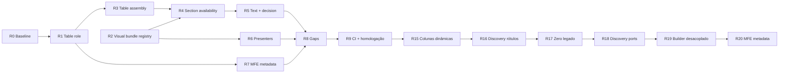

# Playbook 12 — Refatoração declarativa da apresentação

Projeto: Minha DELPI Chat IA  
Escopo: segunda onda de generalização do pipeline de apresentação — eliminar `if` por path, unificar API↔MFE e escalar para **qualquer action** sem copy-paste de presenters.

> **Princípio:** regra de negócio **uma vez** no módulo canônico + JSON PT + teste de regressão. Ver [centralized-rules-first.mdc](../../.cursor/rules/centralized-rules-first.mdc) e [assistant-content-json.mdc](../../.cursor/rules/assistant-content-json.mdc).

Relacionado:

- [apresentacao-dados-generalizada-jun2026.md](./apresentacao-dados-generalizada-jun2026.md) — onda 1 (fases 0–6, **concluída**)
- [humanized-narrative-stack-jun2026.md](../architecture/humanized-narrative-stack-jun2026.md) — narrativa humanizada
- [playbook-09-apresentacao-rica.md](./playbook-09-apresentacao-rica.md) — decisor + MFE unificado
- [playbook-13-respostas-humanizadas-dados.md](./playbook-13-respostas-humanizadas-dados.md) — camada semântica (`dataAnswer`), score, DecisionCard, perfis `generic_*`
- [chat-assistant-content-presentation.md](../architecture/chat-assistant-content-presentation.md) — contrato metadata

**Commits de referência (onda 1 parcial):** `70d9556f`, `cc4ce7d8`, `6afa8243`, `072b3503`.

---

## Status do playbook

| Fase | Tema | Status |
|------|------|--------|
| **R0** | Baseline e inventário de débito | ✅ Concluído |
| **R1** | `role` nas tabelas (API → MFE) | ✅ Concluído |
| **R2** | Registry de bundles visuais por perfil | ✅ Concluído |
| **R3** | Montagem declarativa de `tablePresentations` | ✅ Concluído |
| **R4** | Section availability declarativa | ✅ Concluído |
| **R5** | Texto e decisão por perfil (não por path) | ✅ Concluído |
| **R6** | Presenters produto — quartet unificado | ✅ Concluído |
| **R7** | MFE confia no metadata da API | ✅ Concluído |
| **R8** | Narrativa, dedup e gaps residuais | ✅ Concluído |
| **R9** | CI, homologação e encerramento | ✅ Concluído |
| **R10** | Fechamento tier A (visualBuilders + cobertura) | ✅ Concluído |
| **R11** | Chips pós-resposta API↔MFE | ✅ Concluído |
| **R12** | Regressão entity contract + CI consolidado | ✅ Concluído |
| **R13** | Correções pós-E2E (roteamento, chips POST, narrativa) | ✅ Concluído |
| **R14** | Texto-first, visuais sob demanda e outline ASCII em estrutura | ✅ Concluído |
| **R15** | Colunas dinâmicas da API (sem whitelist fixa) | ✅ Concluído |
| **R16** | Rótulos desconhecidos — web + LLM (fallback pós-vocabulário) | ✅ Concluído |
| **R17** | Zero caminho legado `fixed_table_columns` em tabelas operacionais | ✅ Concluído |
| **R18** | Discovery de rótulos — ports clean (LLM/web/settings) | ✅ Concluído |
| **R19** | `build_items_table` desacoplado do god presenter | ✅ Concluído |
| **R20** | MFE: rótulos/roles só do metadata (fallback < 5 casos) | ✅ Concluído |
| **R21** | Humanização centralizada — rótulo + valor (tabular + KV) | ✅ Concluído |
| **R22** | Cobertura KV — `path` + `profile_name` em todos os presenters | ✅ Concluído |
| **R23** | Resíduos onda 2 — path ativo, builder com perfil, serviços transversais | ✅ Concluído |

Atualizar a coluna **Status** ao concluir cada fase (`⬜` → `✅`).

### R15 — Colunas dinâmicas (jun/2026)

**Problema:** `fixedTableColumns` / `build_fixed_items_table` whitelistava campos — nova coluna na api-delpi exigia editar JSON + presenter.

**Regra:**

| Camada | Comportamento |
|--------|----------------|
| `ChatPresentationOperationalTableService.build_items_table` | União de chaves dos rows da API; ignora só metadados (`_*`, exc. `_detailMeta` na linha) |
| `ExternalActionResultPresenter._build_profile_items_table` | Atalho canônico nos presenters — delega a `build_items_table` + `profile_name` |
| `ExternalActionColumnLabelService.resolve_columns_for_items` | Rótulo via `fields` + OpenAPI `meta.fields`; ordem opcional via `tableProfiles.preferredColumns` |
| `tableProfiles` | Hints de ordem/rótulo + `detect` opcional; payload da API define colunas exibidas |
| ~~`build_fixed_items_table`~~ | **Removido jun/2026** — usar `build_items_table(..., profile_name=...)` |
| ~~`fixedTableColumns`~~ | **Removido jun/2026** — migrado para `tableProfiles` |
| Presenters tier A | Montam título/role/seções; **não** decidem quais campos entram |

**Proibido:** nova rota ou campo exigir editar whitelist para aparecer na tabela.

**Testes:** `tests/unit/domain/services/test_dynamic_table_columns.py` + regressão por perfil.

### R17 — Zero caminho legado (jun/2026)

**Objetivo:** um único caminho R15+R16 para tabelas operacionais; grep zero de `fixed_table_columns` nos presenters.

**Entregas:**

| Item | Detalhe |
|------|---------|
| `product_analyser_presenter` | `analyserStructureComponents` via `_build_profile_items_table` |
| `ExternalActionResultPresenter` | removidos `_fixed_columns` / `_markdown_column_pairs` |
| `ChatPresentationFieldLabelResolutionService` | facade → `resolve_field_labels` |
| `ExternalActionColumnLabelService.resolve_field_labels` | cascata catálogo → humanize → discovery |
| Gate | `presentation_legacy_table_columns_gate.py` em `--check-playbook12` |

**Testes:** `test_presentation_legacy_table_columns_gate.py`, `test_external_action_result_presenter_analyser.py`, `test_chat_presentation_field_label_resolution_service.py`.

### R21 — Humanização e tradução centralizada (jun/2026)

**Problema:** R15/R16 unificaram colunas tabulares, mas tabelas **campo × valor** (perfil KV, resumo do simulador de custos, etc.) ainda chamavam `label_for` isolado — sem discovery, sem `fieldFormats` consistentes, rótulos em inglês (`Product Type`) e valores mal tipados (`returned_materials` como R$, percentuais como moeda).

**Princípio:** **uma cascata** para qualquer chave de campo da API — coluna de tabela **ou** linha `campo` de perfil KV — e **uma formatação** de valor via `format_field_value`.

#### Entrada canônica

| API | Uso |
|-----|-----|
| `ChatPresentationFieldLabelResolutionService.resolve_labels` / `resolve_label` | Facade — preferir em código novo |
| `ExternalActionColumnLabelService.resolve_field_labels` | Implementação (batch) |
| `ExternalActionColumnLabelService.format_field_value` | Valores (moeda, %, data, qtd.) |
| `ChatPresentationFieldLabelResolutionService.build_kv_rows` | Tabelas campo/valor |

#### Cascata unificada (R16 + catálogo + KV)

```
1. tableProfiles.preferredColumns (hint do profile_name, ex.: costImpactOverview)
2. meta.fields / OpenAPI (schema_labels)
3. column_labels.fields
4. _humanize_field_key (fallback técnico)
5. PresentationColumnLabelDiscoveryPort → web + LLM (batch por conjunto de chaves)
```

**Mesma cascata** em:

- `resolve_columns_for_items` (tabelas listagem)
- `summary_kv_rows` / `kv_rows_from_mapping` (perfil/resumo)
- `build_kv_profile_rows` (quando recebe `path` / `profile_name`)
- `label_for` (delega a `resolve_field_labels` — compat)

#### Formatação de valor (`fieldFormats` + inferência)

| Regra | Comportamento |
|-------|----------------|
| Sufixo `_percent` / `_pct` | **Percentual** vence tokens de moeda (`cost` no nome) |
| Sufixo `_date` | Data (`YYYYMMDD` → `DD/MM/AAAA`) |
| `column_labels.fieldFormats` | Override explícito por chave |
| Token `return` | **Removido** de currency — evita `returned_materials` → R$ |

#### Perfis KV (`tableProfiles`)

Perfil dedicado para hints de rótulo/ordem em resumos, ex.: `costImpactOverview` para `/cost-impact-simulation`. **Não** whitelist de campos — só rótulos preferidos; campos extras do payload continuam aparecendo.

#### O que NÃO fazer

- `label_for` / `_humanize_field_key` direto em presenter para perfil KV.
- `campo: "Product Type"` hardcoded em Python.
- Formatar `valor` no MFE quando a API já enviou tabela com `dataType`.
- Duplicar cascata só para colunas tabulares (R16) sem incluir KV.

#### Entregáveis R21

- [x] `resolve_field_labels` + `ChatPresentationFieldLabelResolutionService`
- [x] `summary_kv_rows` / `kv_rows_from_mapping` → `build_kv_rows`
- [x] Simulador de custos: `profile_name=costImpactOverview` + vocabulário em `column_labels.fields`
- [x] Inferência percent/date antes de currency
- [x] Testes: `test_chat_presentation_field_label_resolution_service.py`

#### Critério de aceite

- Resumo do simulador PA 90261255: rótulos PT-BR no catálogo; percentuais com `%`; contadores sem `R$`.
- Nova chave em perfil KV herda discovery quando ausente do JSON.
- Colunas tabulares e KV usam o mesmo batch de discovery no turno.

#### Auditoria KV — `path` / `profile_name` (jun/2026)

**Escopo:** chamadas a `summary_kv_rows`, `kv_rows_from_mapping`, `build_kv_profile_rows` e loops manuais com `label_for` nos presenters. Sem `path`, a discovery R16 perde contexto de rota; sem `profile_name`, perdem-se hints de `tableProfiles`.

**Legenda:** ✅ ok · ⚠ `path` ou `profile_name` ausente · 🔴 bypass direto de `label_for` em loop KV

##### Presenters — tabelas campo × valor

| Arquivo | Método / trecho | `path` | `profile_name` | Perfil sugerido |
|---------|-----------------|--------|----------------|-----------------|
| `product_raw_material_price_presenter.py` | `_build_cost_impact_overview_table` | ✅ | ✅ `costImpactOverview` | — |
| `product_raw_material_price_presenter.py` | `_build_intelligence_overview_table` (×3 `summary_kv_rows`) | ✅ | ✅ `rawMaterialPriceOverview` | — |
| `product_raw_material_price_presenter.py` | `_build_last_purchase_overview` → `kv_rows_from_mapping` | ✅ | ✅ `lastPurchaseOverview` | — |
| `product_raw_material_price_presenter.py` | `_build_kv_table` → `kv_rows_from_mapping` | ✅ param | ⚠ opcional | derivar do `path` do caller |
| `product_purchase_history_presenter.py` | `_build_overview_table` | ✅ | ✅ `purchaseHistoryOverview` | — |
| `product_production_status_presenter.py` | `_build_overview_table` | ✅ | ✅ `productionStatusOverview` | — |
| `product_shipping_status_presenter.py` | `_build_overview_table` | ✅ | ✅ `shippingStatusOverview` | — |
| `product_structure_exclusivity_presenter.py` | `_build_overview_table` | ✅ | ✅ `structureExclusivityOverview` | — |
| `product_composite_analysis_presenter.py` | `_build_factory_overview_table` | ✅ | ✅ `factoryStatusOverview` | migrado para `summary_kv_rows(indicators)` |
| `product_analyser_presenter.py` | `_build_product_analyser_profile_table` → `build_kv_profile_rows` | ✅ `/analyser` | ✅ `productProfileExtended` | — |
| `presentation_builder_presenter.py` | `_build_product_table` → `build_kv_profile_rows` | ✅ | ✅ `productProfileStandard` | — |

**Contagem presenters (pós-R22):** 11 ✅ · 0 ⚠ · 0 🔴

##### Serviços transversais (fora de presenter, mas afetam metadata)

| Módulo | Uso | `path` | Nota |
|--------|-----|--------|------|
| `ExternalActionResultPresenter._humanize_key` | `label_for` + schema | ✅ | repassa `_active_presentation_path` |
| `ChatPresentationFieldNormalizationService` | gráficos `fieldLabels` | ✅ | `path` em `_normalize_chart` |
| `ChatPresentationChartExplainService` | explain de eixo | ✅ | `label_for` com `path` |
| `ChatSqlDynamicColumnRefinementService` | colunas SQL | ⚠ | vocabulário JSON (sem display label) |
| `ChatPresentationTreeMetaCaptionService` | legenda árvore | ✅ | `label_for` com `path` |

##### Comportamento quando `path` / `profile_name` faltam

| Camada | O que ainda funciona | O que degrada |
|--------|----------------------|---------------|
| `column_labels.fields` | Rótulos cadastrados | — |
| OpenAPI `schema_labels` | Títulos do schema | — |
| `_humanize_field_key` | Fallback imediato (EN) | UX ruim |
| Discovery R16 | LLM batch | Menos contexto (sem fragmento de rota) |
| `tableProfiles` hints | — | **Ignorado** sem `profile_name` |

##### Próxima fase (R23 — resíduos onda 2) ✅ jun/2026

- [x] `_active_presentation_path` no presenter + `ColumnLabelContext.path` wired
- [x] `_humanize_key` / gráficos / árvore / `FieldNormalization` repassam `path` à cascata de rótulos
- [x] `ChatPresentationTableProfileInferenceService` + `_build_items_table_for_path` no builder genérico
- [x] Gate CI: `presentation_builder_items_table_gate.py`
- [ ] A9 grande (SectionAvailability / visual bundle / elif use case) — **fora do escopo R23**; onda 2 estrutural

##### Próxima fase (R22 — cobertura KV) ✅ jun/2026

- [x] Criar perfis `*Overview` em `tableProfiles` para cada rota da tabela acima
- [x] Passar `path=` em todo `_build_overview_table` (adicionar param onde falta)
- [x] Substituir loop `label_for` em `product_composite_analysis_presenter` por `summary_kv_rows(..., profile_name="factoryStatusOverview")`
- [x] Estender `ColumnLabelContext` com `path` default do turno (R19) — fallback em `summary_kv_rows` / `kv_rows_from_mapping`
- [x] Gate CI: `presentation_kv_label_context_gate.py` — falha se `summary_kv_rows(` sem `path=` em presenters

**Comando de auditoria local:**

```bash
rg 'summary_kv_rows\(|kv_rows_from_mapping\(|build_kv_profile_rows\(' \
  minha-delpi-ai-api/app/domain/services/external_actions/presenters -n
rg 'label_for\(' minha-delpi-ai-api/app/domain/services/external_actions/presenters -n
```

### R16 — Rótulos desconhecidos: web + LLM (jun/2026)

**Problema:** quando a chave não está em `column_labels.fields`, `meta.fields` (OpenAPI) nem `tableProfiles.preferredColumns`, o fallback atual é `_humanize_field_key` (`impact_on_material_cost_percent` → «Impact On Material Cost Percent») — ruim para usuário e não escala quando actions/APIs mudam.

**Princípio:** o chat **sempre** exibe colunas vindas do payload (R15); o vocabulário JSON **prioriza** rótulos; web + LLM **enriquecem** só o que faltar — sem bloquear renderização.

#### Cascata de resolução de rótulo (ordem obrigatória)

```
1. meta.fields / responseSchema (OpenAPI title)
2. column_labels.fields
3. tableProfiles.preferredColumns (hint explícito do perfil)
4. _humanize_field_key (fallback técnico imediato — UI nunca quebra)
5. [R16] descoberta web + LLM → rótulo PT-BR curto (cache em memória)
```

A etapa 5 **não substitui** 1–3; só roda quando a chave **não** foi resolvida pelo catálogo.

#### Arquitetura (clean — obrigatório antes de ligar)

```
ExternalActionColumnLabelService.resolve_columns_for_items
  → PresentationColumnLabelDiscoveryPort (domain/port)
  → InfrastructurePresentationColumnLabelDiscoveryAdapter (infra)
  → ChatPresentationColumnLabelDiscoveryService (application)
       → ChatPresentationColumnLabelEnrichmentService (domain — regras puras)
       → WebSearchHttpGateway (opcional, gated)
       → LlmGatewayPort (tradução em lote)
```

**Proibido:** `domain` importar `application` ou `infrastructure` diretamente (registrar port em `configure_domain_infrastructure_ports()`).

| Módulo | Camada | Responsabilidade |
|--------|--------|-------------------|
| `ChatPresentationColumnLabelEnrichmentService` | `domain/services` | Detectar «ausente do catálogo»; montar query web; prompt LLM; parse JSON |
| `ChatPresentationColumnLabelDiscoveryService` | `application/services` | Orquestrar web + LLM; cache LRU; limites por tabela |
| `PresentationColumnLabelDiscoveryPort` | `domain/ports` | Contrato `resolve_labels(keys, *, path, schema_labels, profile_labels)` |
| `InfrastructurePresentationColumnLabelDiscoveryAdapter` | `infrastructure` | Delega ao serviço de application |

#### Conteúdo JSON (`column_labels.json` → `columnLabelDiscovery`)

Prompts e templates **não** hardcoded em Python — ver `assistant-content-json.mdc`:

```json
{
  "columnLabelDiscovery": {
    "webSearchQueryTemplate": "{field} significado campo cadastro ERP Protheus",
    "llmSystemPrompt": "Traduza nomes técnicos de campos JSON/API para rótulos curtos de cabeçalho de tabela em português brasileiro. Responda SOMENTE JSON objeto {\"nome_campo\": \"Rótulo\"}. Máximo 4 palavras por rótulo; sem markdown.",
    "llmUserIntro": "Traduza estes campos técnicos para cabeçalhos de tabela PT-BR:",
    "llmWebContextIntro": "Contexto público da web:",
    "llmResponseHint": "Responda somente JSON: {\"campo_tecnico\": \"Rótulo PT-BR\"}"
  }
}
```

#### Fluxo web + LLM

1. `resolve_columns_for_items` monta `ordered_keys` (R15).
2. Filtra chaves **sem** rótulo de catálogo (passo 1–3 da cascata).
3. Limita a `CHAT_PRESENTATION_COLUMN_LABEL_MAX_KEYS` (default 8) por tabela.
4. **Web** (opcional): até `CHAT_PRESENTATION_COLUMN_LABEL_WEB_MAX_QUERIES` buscas (default 3) via `WebSearchHttpGateway` — reutiliza pipeline `web_search` (SearXNG/Tavily/…); query de `webSearchQueryTemplate`.
5. **LLM**: uma chamada em lote com chaves + snippets web + `path` da rota; resposta JSON `{ "campo": "Rótulo" }`.
6. **Cache** processo (`CHAT_PRESENTATION_COLUMN_LABEL_CACHE_SIZE`, default 500) — mesma chave não repete web/LLM no turno seguinte.

#### Feature flags (`.env`)

| Variável | Default | Papel |
|----------|---------|--------|
| `CHAT_PRESENTATION_COLUMN_LABEL_DISCOVERY_ENABLED` | `true` | Master switch da descoberta |
| `CHAT_PRESENTATION_COLUMN_LABEL_WEB_SEARCH_ENABLED` | `true` | Busca web antes do LLM (requer `CHAT_WEB_SEARCH_ENABLED`) |
| `CHAT_PRESENTATION_COLUMN_LABEL_MAX_KEYS` | `8` | Teto de chaves desconhecidas por tabela |
| `CHAT_PRESENTATION_COLUMN_LABEL_WEB_MAX_QUERIES` | `3` | Teto de buscas web por tabela |
| `CHAT_PRESENTATION_COLUMN_LABEL_CACHE_SIZE` | `500` | Entradas no cache em memória |

#### O que NÃO fazer

- Bloquear tabela ou omitir coluna por falta de rótulo no JSON.
- Pesquisar na web valores de célula (PII, preços, clientes) — **somente nomes de campo**.
- Gravar automaticamente em `column_labels.fields` sem fluxo de learning/revisão (fase futura opcional via `CHAT_LEARNING_*`).
- Duplicar lógica de humanização no MFE.

#### Entregáveis R16

- [x] `PresentationColumnLabelDiscoveryPort` + adapter + registro em `content_composer.py`
- [x] `columnLabelDiscovery` em `column_labels.json`
- [x] Wiring em `resolve_columns_for_items` via port (sem import de application no domain)
- [x] Testes: `test_chat_presentation_column_label_discovery_service.py`, `test_chat_presentation_column_label_enrichment_service.py`
- [x] Atualizar `assistant-content-catalog.md`

#### Critério de aceite

- Campo novo na api-delpi aparece na tabela (R15) com rótulo humanizado PT-BR quando ausente do JSON.
- Com web desligada, LLM ainda traduz chaves desconhecidas (batch).
- Latência: falha silenciosa → permanece fallback `_humanize_field_key` (passo 4).
- Domain sem import de infra/application.

### Acoplamentos remanescentes (pós R15/R16 — jun/2026)

R15/R16 fecharam o fluxo **canônico** (`build_items_table` → `resolve_columns_for_items` → discovery via port). Ainda existem caminhos paralelos e dependências que **não** devem ser corrigidos com patch local — registrar aqui antes de nova fase.

#### Mapa de prioridade

| Prioridade | Acoplamento | Impacto | Canônico alvo |
|------------|-------------|---------|---------------|
| **Alta** | Dois caminhos de coluna (canônico vs legado) | Campos novos da API **não aparecem**; R16 **não roda** | Só `resolve_columns_for_items` / `build_items_table` |
| **Média** | Discovery: application → infra/composition direto | Clean architecture incompleta na orquestração | Ports para LLM, web search e settings |
| **Média** | LLM/web **síncronos** no hot path da tabela | Latência no turno quando há chaves desconhecidas | Discovery assíncrono ou warm cache |
| **Média** | Duplicação `is_catalog_resolved` / `is_catalog_label_resolved` | Regra de catálogo em dois módulos | `is_catalog_label_resolved` → `_resolve_catalog_label` (R21) |
| ~~Alta~~ | ~~KV perfil fora da cascata R16~~ | ~~Resumo simulador em inglês~~ | **R21** `resolve_field_labels` + `build_kv_rows` |
| **Baixa** | `build_items_table(host: ExternalActionResultPresenter)` | Builder genérico acoplado ao god presenter | Contrato estreito (port/DTO) |
| **Baixa** | Aliases/enriquecimento de row por rota no OpsTable | Semântica de rota no módulo «genérico» | Perfil JSON ou presenter tier A |
| **Onda 2** | Use case / visual bundle / section availability / MFE | Nova rota rica = 3–4 arquivos + heurística UI | Playbook §1.2, R1–R14 |

#### A1 — Dois caminhos de coluna (gap principal da R15)

| Caminho | Módulo | Comportamento |
|---------|--------|---------------|
| **Canônico** ✅ | `resolve_columns_for_items` | União de chaves do payload + hints + discovery R16 |
| **Legado** ⚠ | `fixed_table_columns` | Só chaves de `tableProfiles.preferredColumns` — **ignora campos extras do payload** |

**Onde ainda usa legado (pré-R17):**

- ~~`product_analyser_presenter.py` — `analyserStructureComponents`~~ migrado em R17.
- ~~`ExternalActionResultPresenter._fixed_columns`~~ removido em R17.

**Proibido:** novo código chamar `fixed_table_columns` para tabela operacional com rows da API.

**Gate CI:** `validate_no_legacy_table_columns_in_presenters()` incluído em `--check-playbook12` e `--check-no-legacy-table-columns`.

#### A2 — R16: orquestração ainda acoplada a infra

O **domain** está correto (port + facade). Na **application**, `ChatPresentationColumnLabelDiscoveryService` ainda:

- lê `Settings` direto (`infrastructure.config.settings`);
- instancia `WebSearchHttpGateway` (infra);
- chama `make_llm_gateway()` via `composition.llm_composer` (lazy).

O adapter infra → application é pass-through fino (infra depende de application — aceitável hoje, não ideal).

**Alvo:** `LlmGatewayPort` + port de web search + flags via `AppConfigPort` ou settings port; adapter infra implementa ports sem repassar para application.

#### A3 — Discovery síncrono na montagem da tabela

`resolve_columns_for_items` invoca discovery **no mesmo request** que monta colunas. Falha silenciosa ok; latência acoplada a tabelas com muitas chaves fora do catálogo.

**Alvo (futuro):** fila/async, prefetch por rota OpenAPI, ou aceitar humanize no 1º turno e enriquecer no cache no 2º.

#### A4 — Duplicação de regra «campo no catálogo»

- `ExternalActionColumnLabelService.is_catalog_label_resolved`
- `ChatPresentationColumnLabelEnrichmentService.is_catalog_resolved`

Discovery usa só enrichment; column label service mantém cópia paralela.

**Alvo:** um método canônico (enrichment ou column label service); o outro delega.

#### A5 — `build_items_table` acoplado ao presenter host

`ChatPresentationOperationalTableService.build_items_table` recebe `ExternalActionResultPresenter` inteiro e acessa `_column_labels`, `_active_schema_labels`.

**Alvo:** protocolo estreito, ex.: `ColumnLabelContext` com `resolve_columns_for_items` + `schema_labels`.

#### A6 — Regras de rota no builder «genérico»

Em `ChatPresentationOperationalTableService`:

- `LMP_ITEM_ALIASES` — camelCase → snake só para LMP;
- `enrich_structure_rows`, `enrich_stock_position_rows` — enriquecimento específico de produto/estoque.

Não quebra colunas dinâmicas, mas concentra semântica de rota fora de `tableProfiles` / presenters.

**Alvo:** aliases via perfil JSON ou normalização na api-delpi; enrichments nos presenters tier A.

#### A7 — `tableProfiles` grande (manutenção, não whitelist)

`column_labels.json` segue com dezenas de perfis `preferredColumns` + `detect`. No fluxo canônico **não** esconde colunas novas; ordem e rótulos preferidos ainda são curados manualmente. R16 só entra quando o campo não está em `fields` / OpenAPI / hint do perfil.

#### A8 — MFE: fallback duplicado

- `presentationFieldLabels.ts` — `humanizeFieldKeyFallback` para gráficos/KPIs quando `fieldLabels` vazio.
- `presentationStackPlan.ts` — `inferTableRoleFromTitle` quando API não manda `role`.

**Regra:** API deve mandar `columns[].label` e `role`; MFE fallback só legacy (< 5 casos — meta §1.3).

#### A9 — Débito onda 2 (fora do escopo R15/R16)

Persiste o diagnóstico §1.2:

```
ExecuteExternalActionUseCase              ~14 elif (tablePresentations)
ChatPresentationVisualBundleService       ~12 flags + _enrich_* por rota
ChatPresentationSectionAvailabilityService ~1126 linhas, handler por rota
MFE presentationStackPlan                 inferTableRoleFromTitle, ROUTE_VISUAL_ORDER
```

Adicional: `presentation_builder_presenter` chama `_build_items_table` **sem** `profile_name` em vários ramos — perde hints/detect do perfil.

**Não** misturar correção desses itens com patch em `fixed_table_columns`; cada item = fase ou extensão de R existente + teste.

### R17 — Zero caminho legado em tabelas operacionais (A1)

**Objetivo:** grep zero de `fixed_table_columns` / `_fixed_columns` para montagem de tabela com rows da API; um único caminho R15+R16.

**Tarefas**

1. Migrar `product_analyser_presenter._build_product_analyser_structure_components_table` → `_build_profile_items_table(..., profile_name="analyserStructureComponents")`.
2. Auditar `presentation_builder_presenter` — passar `profile_name`/`path` em ramos que chamam `_build_items_table` sem perfil (perde hints `tableProfiles.detect`).
3. Gate CI `--check-no-legacy-table-columns` (ou estender `--check-playbook12`): fail se Python montar `columns` via `fixed_table_columns` fora de testes unitários do serviço de labels.
4. Deprecar `_fixed_columns` no host presenter (warn log ou remover após grep zero).
5. Testes: `test_external_action_result_presenter_analyser.py` — campo extra no payload analyser aparece na tabela de componentes.

**Critério:** nenhum presenter tier A monta tabela operacional sem `build_items_table` / `_build_profile_items_table`.

**Esforço:** S (0,5 dia)

---

### R18 — Discovery clean architecture (A2 + A4)

**Objeto:** `ChatPresentationColumnLabelDiscoveryService` sem import direto de `Settings`, `WebSearchHttpGateway`, `make_llm_gateway`.

**Tarefas**

1. Ports: `PresentationColumnLabelWebSearchPort`, reutilizar `LlmGatewayPort`; flags via `AppConfigPort` (ou extensão mínima).
2. Wiring em `content_composer.py` / `configure_domain_infrastructure_ports()`.
3. Unificar `is_catalog_resolved` (enrichment) e `is_catalog_label_resolved` (column label) — um helper canônico; o outro delega.
4. Testes: mocks de port; domain continua sem import de application/infra.

**Critério:** `rg 'from app.infrastructure' app/domain/services/external_actions/external_action_column_label_service.py` vazio; application discovery só usa ports injetados.

**Status (jun/2026):** ✅ — `PresentationColumnLabelWebSearchPort` + `PresentationColumnLabelWebSearchService`; `PresentationColumnLabelLlmService` via `LlmGatewayPort`; flags via `AppConfigPort` / `ChatDomainConfigService`; wiring em `content_composer.py`; `is_catalog_field_resolved` canônico no column label service.

**Esforço:** M (1 dia)

---

### R19 — Builder de tabela desacoplado (A5 + A6)

**Objetivo:** `ChatPresentationOperationalTableService` não depende de `ExternalActionResultPresenter` god object; sem regra de rota hardcoded no builder genérico.

**Tarefas**

1. Introduzir protocolo/DTO `ColumnLabelContext` (`resolve_columns_for_items`, `schema_labels`).
2. `build_items_table(context, items, ...)` — presenters/host implementam o protocolo.
3. Mover `LMP_ITEM_ALIASES`, `enrich_structure_rows`, `enrich_stock_position_rows` para presenters tier A ou bloco `tableProfiles.fieldAliases` / `rowEnrichers` no JSON (registry fino).
4. Testes: `test_dynamic_table_columns.py` com fake context.

**Critério:** OpsTable importa só domain + typing; zero import de `external_action_result_presenter`.

**Status (jun/2026):** ✅ — `ColumnLabelContext` + `ExternalActionColumnLabelContext`; `build_items_table`/`kv_rows_*` consomem contexto; enrichers LMP/estrutura/estoque em `product_operational_table_row_enrichment.py`.

**Esforço:** M (1–2 dias)

---

### R20 — MFE e metadata como fonte única (A8 + trecho A9)

**Objetivo:** reduzir fallbacks duplicados no MFE; API sempre envia `columns[].label` e `role`.

**Tarefas**

1. Inventário: `presentationFieldLabels.ts` (`humanizeFieldKeyFallback`), `inferTableRoleFromTitle` — contagem de ramos restantes.
2. Gate MFE: teste de cobertura decrescente; fail se novo `path.includes` em módulos de apresentação.
3. Rotas tier A: smoke que asserta `columns[].label` PT (não snake_case cru) quando campo ausente de `fields` mas presente no payload (R16).
4. Documentar casos legacy remanescentes (< 5) em `presentation_vocabulary.json` → `legacyFallbacks`.

**Critério:** homologação H17–H19 (§8) verde; inferência MFE só onde API não manda `role`/`label` (lista explícita no JSON).

**Status (jun/2026):** ✅ — `legacyFallbacks` em `presentation_vocabulary.json`; gate MFE `presentationLegacyFallbackGate.test.ts`; gate API `presentation_table_column_label_gate.py` (H17/H18 tier A).

**Esforço:** M (1 dia)

---

## 1. Contexto

### 1.1 O que a onda 1 já entregou

| Entrega | Módulo / artefato |
|---------|-------------------|
| Perfis declarativos | `presentation_profiles.json` + `ChatPresentationProfileService` |
| Preferência de sessão | `ChatPresentationPrimaryViewService` |
| Schema-driven tier C→B | `ChatSchemaDrivenPresentationService` |
| Stack markdown + framing | `ChatPresentationStackMarkdownService` |
| Narrativa humanizada | `ChatPresentationHumanizedNarrativeService` |
| KPI cards generalizados | `ChatPresentationKpiAssemblyService` |
| Rich stack default | `ChatPresentationRichStackPolicyService` |
| Cobertura 130 rotas + CI | `audit_presentation_coverage.py`, workflow presentation |

### 1.2 Débito técnico restante (diagnóstico jun/2026)

Apesar da onda 1 e de R15/R16 (colunas dinâmicas + discovery de rótulos), ainda existem **camadas paralelas** de regra por rota e **acoplamentos documentados** na seção [Acoplamentos remanescentes (pós R15/R16)](#acoplamentos-remanescentes-pós-r15r16--jun2026) — em especial **A1** (caminho legado `fixed_table_columns`) e **A9** abaixo.

```
ExecuteExternalActionUseCase     ~14 elif por path (tablePresentations)
ChatPresentationVisualBundleService   ~12 flags + métodos _enrich_* dedicados
ChatPresentationSectionAvailabilityService   ~1126 linhas, handler por rota
MFE presentationStackPlan / presentationMultiRoute   inferTableRoleFromTitle, ROUTE_VISUAL_ORDER
fixed_table_columns (legado R15)   ~~product_analyser~~ — fechado em R17; gate CI ativo
```

**Sintoma:** nova rota rica exige Python em 3–4 arquivos + heurística MFE; risco de divergência API↔UI. Tabela via `fixed_table_columns` não herda colunas novas da API nem R16.

### 1.3 Meta da onda 2

| Métrica | Alvo |
|---------|------|
| Novo perfil rico | JSON + teste; **zero** `elif` novo no use case |
| Tabelas com `role` | 100% dos `tablePresentations` em perfis tier A |
| Colunas tabulares | 100% via `build_items_table` — zero whitelist presenter (R15; R17 fecha exceções) |
| Rótulos de coluna | API envia `columns[].label`; discovery R16 só para chaves fora do catálogo |
| MFE `inferTableRoleFromTitle` | Reduzido a fallback legacy (< 5 casos) |
| `ChatPresentationSectionAvailabilityService` | < 400 linhas; regras em JSON |
| Homologação | Roteiro §8 (H1–H20) verde |

---

## 2. Arquitetura alvo

### 2.1 Pipeline canônico (pós-refatoração)

```
meta.entity + path
  → ChatPresentationProfileService.resolve_profile_key()
  → ChatPresentationTableAssemblyService.assemble()          ← R3
  → ChatPresentationProfileVisualBundleService.enrich()      ← R2
  → ChatPresentationFieldNormalizationService.normalize_metadata()
       → ChatPresentationKpiAssemblyService (já existe)
       → ChatPresentationTableRoleService (R1)
  → [R15/R16] tablePresentations[].columns via build_items_table
       → resolve_columns_for_items (+ PresentationColumnLabelDiscoveryPort)
  → ChatPresentationStructureDedupService.dedupe_metadata()
  → ChatPresentationHumanizedNarrativeService.enrich_metadata()
  → ChatPresentationStackOrderService.enrich_metadata()
       → lê stackPlan + sectionRules do perfil (R4)
  → ChatPresentationDecisionService.enrich_metadata()
       → intent + perfil; sem keywords PT soltas (R5)
  → presentationDecision + stackPresentationPlan + tablePresentations[].role
  → MFE: chatPresentation.ts consome metadata; sem re-decidir formato (R7)
```

### 2.2 Extensão de `presentation_profiles.json`

Cada perfil tier A/B passa a declarar (além de `viewOrder` / `stackPlan`):

```json
{
  "factory_status": {
    "defaultView": "table",
    "viewOrder": ["text", "table", "kpi", "chart", "tree", "dashboard"],
    "stackPlan": "factory_status",
    "flags": ["factory_status"],
    "visualBuilders": {
      "kpi": "build_factory_kpi",
      "tree": "build_factory_tree",
      "chart": "build_factory_chart",
      "dashboard": "build_factory_dashboard"
    },
    "tableAssembly": {
      "builder": "build_factory_status_table_presentations",
      "profileTableIndex": 0,
      "primaryTableIndex": 1
    },
    "tableRoles": ["profile", "lmp", "efficiency"],
    "humanizedNarrative": "enrich",
    "sectionRules": "factory_status"
  }
}
```

**Registry de builders (R2):** mapa `builderName → callable` em `ChatPresentationProfileVisualBundleService`, não `if is_factory_profile` no visual bundle.

### 2.3 Contrato `tablePresentation` estendido

```json
{
  "type": "table",
  "title": "Panorama fabril — 90263749",
  "role": "profile",
  "columns": [],
  "rows": []
}
```

| `role` | Uso no stack |
|--------|----------------|
| `profile` | Tabela principal do perfil |
| `guide` | Roteiro / guia de montagem |
| `inspection` | Inspeção / checklist |
| `stock` | Posição de estoque |
| `lmp` | Lista de LMPs |
| `efficiency` | Eficiência fabril |
| `generic` | Fallback |

Tokens de título para inferência legacy: `presentation_vocabulary.json` → `sectionAvailability.tableTitleTokens` (já existe; API passa a **emitir** `role`).

---

## 3. Fases de implementação

### R0 — Baseline e inventário (0,5 sprint)

**Objetivo:** medir débito antes de refatorar.

**Tarefas**

1. Script `scripts/audit_presentation_path_ifs.py`:
   - contar `elif`/`if` com fragmentos de path em `execute_external_action_use_case.py`, `visual_bundle_service.py`, `section_availability_service.py`, `text_presentation_presenter.py`;
   - listar perfis em `presentation_profiles.json` sem `visualBuilders` / `tableAssembly`.
2. Baseline JSON: `docs/architecture/presentation-refactor-baseline-jun2026.json`.
3. Estender `chat_presentation_regression_cases.py` com 1 caso por perfil tier A (factory, stock, analyser, sale_pricing, production_status, raw_material_price).

**Critério de aceite:** baseline versionado; inventário com contagem por arquivo.

**Testes:** `test_presentation_refactor_baseline.py` (snapshot do inventário).

---

### R1 — `role` nas tabelas (API → MFE) — **prioridade máxima**

**Problema:** MFE usa `inferTableRoleFromTitle` (~50 linhas PT) porque a API não envia `role`.

**Módulo canônico:** `ChatPresentationTableRoleService` (novo).

**Tarefas**

1. Criar `ChatPresentationTableRoleService`:
   - `resolve_role(title, path, profile_key) → str` usando `presentation_vocabulary.json`;
   - `assign_roles(tables: list, *, path, profile_key) → list`.
2. Chamar em:
   - `ChatPresentationTableAssemblyService` (R3) ou, provisoriamente, `ExecuteExternalActionUseCase` após montar tabelas;
   - `ChatPresentationFieldNormalizationService.normalize_metadata` (propagar `role` em `tablePresentations` e painéis dashboard).
3. MFE `presentationStackPlan.ts`:
   - preferir `table.role` e `stackPresentationPlan.tableRoleOrder`;
   - marcar `inferTableRoleFromTitle` como `@deprecated` com teste de cobertura decrescente.
4. Testes API: factory 90263749, analyser multi-tabela, stock — cada tabela com `role` esperado.
5. Testes MFE: `presentationStackPlan.test.ts` — sem inferência quando `role` presente.

**Critério:** homologação `status fabril 90263749` — ordem de stack idêntica com e sem inferência MFE.

**Esforço:** M (1–2 dias) · **maior ROI API↔MFE**

---

### R2 — Registry de bundles visuais por perfil

**Problema:** `ChatPresentationVisualBundleService` repete Padrão B (`_enrich_sale_pricing_bundle`, `_enrich_factory_bundle`, …).

**Módulo canônico:** `ChatPresentationProfileVisualBundleService` (novo) ou refatoração do visual bundle existente.

**Tarefas**

1. Extrair mapa de builders do padrão já usado em `_enrich_playbook_status_bundle` / `_enrich_mp_purchase_bundle`.
2. Declarar `visualBuilders` em `presentation_profiles.json` para: `factory_status`, `stock`, `sale_pricing`, `raw_material_price_intelligence`, `cost_impact_simulation`, `production_status`, `shipping_status`, `structure_exclusivity`, `last_purchase`, `purchase_*`, `purchase_list`.
3. Substituir flags `is_*_profile` por loop único: `for view in view_order: registry.build(view)`.
4. Manter `_ensure_generic_kpi_bundle` como fallback (já generalizado em `072b3503`).
5. Política de chart: `chartPolicy: skip|force|auto` no perfil em vez de lista negativa de 11 perfis.
6. Testes: reutilizar `test_factory_playbook_visual_bundle.py`, `test_mp_purchase_playbook_visual_bundle.py`, `test_product_composite_analysis_presenter.py` — todos verdes sem métodos dedicados.

**Critério:** remover ≥ 8 métodos `_enrich_*_bundle` dedicados; diff visual bundle < 250 linhas.

**Esforço:** L (2–3 dias)

---

### R3 — Montagem declarativa de `tablePresentations`

**Problema:** `ExecuteExternalActionUseCase._build_presentation_metadata` com ~14 `elif` por path.

**Módulo canônico:** `ChatPresentationTableAssemblyService` (novo).

**Tarefas**

1. Registry `tableAssembly` no perfil: `builder`, `profileTableIndex`, `primaryTableIndex`, `titleMatchers` (opcional).
2. `assemble(data, path, profile) → { tablePresentations, tablePresentation, profileTablePresentation }`.
3. Migrar rotas nesta ordem (menor risco → maior):
   - `production_status`, `shipping_status`, `structure_exclusivity`
   - `factory_status`, `sale_pricing`, `raw_material_price_intelligence`
   - `analyser` (último — maior complexidade; título PT → `titleMatchers` no JSON)
4. Integrar R1 (`assign_roles`) na saída do assembly.
5. Remover `elif` correspondentes do use case; manter só orquestração.
6. Testes: `test_playbook_presentation_pipeline_regression.py` + casos por perfil.

**Critério:** use case perde ≥ 200 linhas de `elif`; nenhum título PT hardcoded no use case.

**Esforço:** M (1–2 dias)

---

### R4 — Section availability declarativa

**Problema:** `ChatPresentationSectionAvailabilityService` (~1126 linhas) com early-return por rota.

**Módulo canônico:** estender `presentation_profiles.json` + `ChatPresentationSectionAvailabilityService` (refatorar, não duplicar).

**Tarefas**

1. Novo bloco JSON `stackSectionRules` (ou reutilizar `stackPlans.*` existente):
   ```json
   {
     "factory_status": {
       "humanizedSections": true,
       "sectionVisibility": { "scope": true, "highlights": true, "attention": true },
       "narrativeOrder": ["scope", "panorama", "reading", "attention", "conclusion", "panels"],
       "sectionFraming": "stackSectionFraming.factory_status"
     }
   }
   ```
2. Resolver genérico: `_resolve_visibility(rules, metadata)`, `_build_framing(rules)`, `_narrative_order(rules)`.
3. Migrar handlers: `analyser`, `factory_status`, `stock`, `sale_pricing`, `raw_material_price_intelligence`, playbooks status.
4. `ChatPresentationStackOrderService` lê `narrativeOrder` do perfil.
5. Testes: `test_chat_presentation_section_availability_service.py` — um caso por perfil migrado.

**Critério:** arquivo < 400 linhas; regras novas só em JSON.

**Esforço:** L (3–4 dias)

---

### R5 — Texto e decisão por perfil

**Problema:** `ExternalActionTextPresentationPresenter` e `ChatPresentationDecisionService` ainda usam fragmentos de path e keywords PT na mensagem.

**Módulos canônicos:** `EntityRoutePresenter`, `ChatPresentationDecisionService`, `ChatPresentationRoutePolicyService`.

**Tarefas**

1. Registry `textBuilder` no perfil (paralelo a `visualBuilders`).
2. `ChatPresentationDecisionService._decision_for_operational_intent`:
   - consumir `presentation_vocabulary.json` → `intentMarkers`, `formatPreferenceMarkers`;
   - delegar default a `ChatPresentationProfileService` + data shape;
   - remover checks `"/analyser" in intent_token` onde `has_flag(path, "analyser")` basta.
3. Deprecar tokens soltos em `ChatPresentationRoutePolicyService` migrados para perfil.
4. Testes: mesma mensagem com perfis diferentes → `selected` coerente; sem dependência de substring de path no teste.

**Critério:** zero strings PT novas em Python; decisão documentada por perfil no JSON.

**Esforço:** M (1–2 dias)

---

### R6 — Presenters produto: quartet unificado

**Problema:** ~10 presenters × 4 métodos `build_*_{kpi,tree,chart,dashboard}` quase idênticos.

**Módulo canônico:** generalizar `product_composite_analysis_presenter` + `playbook_report_presenter`.

**Tarefas**

1. Spec JSON por perfil: `presenter_content.json` → seções `compositeAnalysisInsights`, `kpiCards`, `chartAxes`.
2. `ChatPresentationCompositeVisualBuilder` (novo): `build_kpi|tree|chart|dashboard(spec, data, path)`.
3. Migrar incrementalmente (1 PR por família):
   - playbook status (production, shipping, exclusivity)
   - MP (last_purchase, purchase_history, purchase_list)
   - sale_pricing, raw_material_price, cost_impact
4. Presenters finos: só mapeiam payload → spec; sem lógica de layout.
5. Testes: smoke `scripts/smoke_playbook_product_routes.py` verde.

**Critério:** reduzir ≥ 30 métodos `build_*_presentation` duplicados.

**Esforço:** L (3–5 dias, incremental)

---

### R7 — MFE confia no metadata da API

**Problema:** `presentationMultiRoute.ts`, `assistantContentVisualFormats.ts`, `presentationStackPlan.ts` reimplementam política de rota.

**Módulo canônico MFE:** `chatPresentation.ts` + `assistantContentLayout.ts`.

**Tarefas**

1. `resolveInitialToolbarKind`: ler `presentationDecision.selected` e `availableViews` — não `routeKeyFromPath`.
2. Eliminar ou sincronizar `ROUTE_VISUAL_ORDER` com `viewOrder` do perfil (script de validação ou remoção).
3. `isTableFirstRouteToolCalls` / `isStructureHeavyToolCalls`: substituir por `stackPresentationPlan` + `dataShape`.
4. Após R1: remover ramos de `inferTableRoleFromTitle` cobertos por `role`.
5. Testes: `presentationStackPlan.test.ts`, `chatPresentation.test.ts` — metadata mock da API como fonte única.

**Critério:** nenhum `path.includes("/stock")` novo no MFE de apresentação.

**Esforço:** M (1–2 dias)

---

### R8 — Narrativa, dedup e gaps residuais

**Tarefas**

1. `ChatPresentationHumanizedNarrativeService`:
   - skips via perfil (`humanizedNarrative: skip|enrich`), não `"/pricing" in path`;
   - headers via `ChatAssistantContentService` / `presenter_content.json`, não regex `**Panorama**`.
2. `ChatPresentationStackOrderService._markdown_has_attention`: prefixos do JSON.
3. MFE `presentationStructureDedup.ts`: confiar em metadata pós-`StructureDedupService`; markers do vocabulário sincronizado.
4. `ChatSchemaDrivenPresentationService._RICH_PROFILE_KEYS`: incluir `purchase_price_history`, `purchase_budget_history`.
5. Opcional: extrair `ChatPresentationMetadataPipelineService` do use case (~500 linhas → orquestração fina).

**Critério:** skips e headers sem literais PT em Python/MFE.

**Esforço:** S (0,5–1 dia)

---

### R9 — CI, homologação e encerramento

**Tarefas**

1. Estender `audit_presentation_coverage.py`:
   - gate `--check-table-roles` (tier A sem `role` → fail);
   - gate `--check-visual-builders` (perfil com `viewOrder` kpi sem builder → warn).
2. Workflow `.github/workflows/minha-delpi-ai-api-presentation.yml` — novos gates.
3. Roteiro manual §8 em `perguntas-teste-chat-jun2026.md`.
4. Changelog `docs/changelog/2026-06-playbook-12-apresentacao-declarativa.md`.
5. Atualizar [assistant-content-catalog.md](../architecture/assistant-content-catalog.md) com novas chaves JSON.

**Critério:** CI verde; playbook 12 com todas as fases ✅.

**Esforço:** M (1 dia)

---

## 4. Ordem de execução recomendada



| Ordem | Fase | Por quê |
|-------|------|---------|
| 1 | **R0** | Medir antes de mexer |
| 2 | **R1** | Desbloqueia MFE; baixo risco |
| 3 | **R2** + **R3** | Paralelizáveis após R1 |
| 4 | **R4** | Depende de perfis e tabelas estáveis |
| 5 | **R5** + **R7** | Alinhar decisão API↔MFE |
| 6 | **R6** | Incremental por família de presenter |
| 7 | **R8** + **R9** | Polimento e gates |
| 8 | **R15** + **R16** | Colunas da API + humanização sem whitelist |
| 9 | **R17** | Fecha gap A1 (caminho legado) |
| 10 | **R18**–**R20** | Acoplamentos A2–A8; paralelizável após R17 |

---

## 5. Mapa de módulos canônicos

| Mudança | Implementar em | Não duplicar em |
|---------|----------------|-----------------|
| `role` em tabelas | `ChatPresentationTableRoleService` | `inferTableRoleFromTitle` (MFE) |
| Bundles auxiliares | `ChatPresentationProfileVisualBundleService` | `_enrich_*_bundle` ad hoc |
| `tablePresentations` | `ChatPresentationTableAssemblyService` | `ExecuteExternalActionUseCase` elif |
| Visibilidade stack | `presentation_profiles.json` + section resolver | handler por rota em Python |
| Texto markdown | registry `textBuilder` + `EntityRoutePresenter` | `text_presentation_presenter` path if |
| KPI cards | `ChatPresentationKpiAssemblyService` ✅ | presenters inline |
| Narrativa | `ChatPresentationHumanizedNarrativeService` | skip por path |
| Render MFE | `chatPresentation.ts`, `assistantProseRendering.ts` | `ChatMessageList` ad hoc |
| Textos PT | `presenter_content.json`, `presentation_vocabulary.json` | strings em use case |
| Colunas tabulares (payload) | `ChatPresentationOperationalTableService.build_items_table` | `fixedTableColumns`, whitelist no presenter |
| Rótulos de coluna | `ExternalActionColumnLabelService.resolve_columns_for_items` + `PresentationColumnLabelDiscoveryPort` | `_humanize_key` no MFE, strings PT em Python |
| Hints ordem/rótulo | `column_labels.tableProfiles.preferredColumns` | listas fixas no presenter |
| Atalho presenter | `ExternalActionResultPresenter._build_profile_items_table` | montar `columns`/`rows` inline |
| Cascata rótulo (KV + colunas) | `ChatPresentationFieldLabelResolutionService` → `resolve_field_labels` | `_humanize_key` duplicado, discovery só no presenter |

---

## 6. Checklist por PR

Antes de merge de qualquer fase R1–R20:

- [ ] Existe **um** ponto de verdade para a regra?
- [ ] Nenhum consumidor novo bypassa o módulo canônico?
- [ ] Tabelas operacionais usam `build_items_table` (R15) — não `fixed_table_columns`?
- [ ] Rótulos novos passam por `resolve_columns_for_items` + discovery port (R16)?
- [ ] Teste de regressão cobre o perfil/rota motivador?
- [ ] Strings PT novas só em JSON (gate ADR-006)?
- [ ] `pytest` nos pacotes alterados — verde?
- [ ] MFE alterado: `npm run build` no plugin — verde?
- [ ] Homologação amostral (≥ 1 pergunta do §8) documentada?

---

## 7. Riscos e mitigação

| Risco | Mitigação |
|-------|-----------|
| Regressão analyser multi-rota | Fixtures `2026-06-apresentacao-multi-rota-produto`; migrar analyser por último (R3) |
| Stack order quebrado sem `role` | R1 antes de R7; fallback legacy temporário no MFE |
| JSON de perfil inchado | `stackSectionRules` referencia chaves em `presenter_content.json` |
| Presenters quebrados na migração R6 | 1 PR por família; smoke playbook após cada |
| CI falso positivo em rotas tier C | Gates só em perfis tier A/B declarados |

---

## 8. Roteiro de homologação (R1–R12)

| ID | Pergunta / ação | Valida |
|----|-----------------|--------|
| R1 | `analise de preço 90260145` — stack narrativo + abas KPI/tabela | R4, R8 |
| R2 | `status fabril 90263749` — KPI em cards, ordem painel | R1, R2, `072b3503` |
| R3 | `estrutura 10080001` — árvore + tabela sem duplicata | R3, R8 |
| R4 | `estoque 10080001` — tabela stock, sem narrativa humanizada forçada | R4, R8 |
| R5 | `status produção` (produto playbook) — dashboard + KPI | R2, R6 |
| R6 | `última compra MP` — bundle compra | R2 |
| R7 | Modo **Tabela** na toolbar — respeita preferência | R5, onda 1 |
| R8 | Modo **Gráfico** em rota com série — chart disponível | R2, R6 |
| R9 | Multi-rota analyser — seções numeradas, toolbar por bloco | R1, R3, R7 |
| R10 | Rotas tier C (ex. HR snapshot) — schema-driven + KPI | onda 1, R6 |
| R11 | Chip «Ver em gráfico» pós-resposta | onda 1 Fase 5 |
| R12 | Regressão pytest entity contract + audit coverage | R9 |
| R13 | `estrutura {code}` modo Texto — outline ASCII | R14, `00befb65` |
| R14 | `estrutura {code}` modo Tabela — preferência UI | R3, `d3d8ba15` |
| R15 | `estrutura {code}` modo Árvore nativa | R2 |
| R16 | Smoke estrutura text/table/tree | `smoke_structure_preference.py` |
| H17 | Rota tier A com campo **novo** na api-delpi (não listado em `fields`) | Coluna aparece na tabela sem editar whitelist (R15) |
| H18 | Mesmo campo novo — cabeçalho PT | Rótulo humanizado (LLM ou catálogo), não snake_case cru (R16) |
| H19 | `simulação impacto custo {code}` — coluna `unit` / percentual material | Ordem hints `costImpactMaterials`; narrativa e tabela usam `% impacto no custo de materiais` |
| H20 | Analyser — tabela componentes estrutura | Após R17: campo extra no payload visível na tabela |

Documentar resultados em [perguntas-teste-chat-jun2026.md](../testing/perguntas-teste-chat-jun2026.md).

---

## 9. Referências de código (estado jun/2026)

| Arquivo | Papel | Alvo pós-R* |
|---------|-------|-------------|
| `execute_external_action_use_case.py` | Orquestração metadata | < 200 linhas de montagem |
| `chat_presentation_visual_bundle_service.py` | Bundles auxiliares | Registry único |
| `chat_presentation_section_availability_service.py` | Stack humanizado | Resolver declarativo |
| `chat_presentation_kpi_assembly_service.py` | KPI cards ✅ | Manter canônico |
| `chat_presentation_humanized_narrative_service.py` | Narrativa ✅ | Skips por perfil |
| `kpi_chart_presenter.py` | KPI/chart builders | Delegar ao registry R6 |
| `text_presentation_presenter.py` | Texto por path | Registry R5 |
| `presentation_profiles.json` | Perfis | + visualBuilders, tableAssembly, sectionRules |
| `presentation_vocabulary.json` | Tokens título/intent | Fonte de `role` |
| MFE `presentationStackPlan.ts` | Ordem stack | Consumir `role` |
| MFE `presentationMultiRoute.ts` | Multi-rota | Só layout, não decisão |
| `chat_presentation_operational_table_service.py` | Tabelas operacionais tier A | Montagem inline de colunas |
| `external_action_column_label_service.py` | Colunas + rótulos + discovery port | `fixedTableColumns`, whitelist |
| `chat_presentation_column_label_discovery_service.py` | Orquestração web+LLM | Lógica no domain ou MFE |
| `column_labels.json` → `tableProfiles`, `columnLabelDiscovery` | Hints + prompts discovery | Python hardcoded |

---

## 10. Próximo passo imediato

**R17 entregue (jun/2026):**

| Artefato | Detalhe |
|----------|---------|
| Analyser | `_build_analyser_structure_components_table` → `_build_profile_items_table` (`analyserStructureComponents`) |
| Host | removidos `_fixed_columns` / `_markdown_column_pairs` legados |
| Cascata rótulos | `resolve_field_labels` + `ChatPresentationFieldLabelResolutionService` (facade R17) |
| Gate | `presentation_legacy_table_columns_gate.py` → `--check-playbook12` + `--check-no-legacy-table-columns` |
| Testes | `test_presentation_legacy_table_columns_gate.py`, `test_chat_presentation_field_label_resolution_service.py`, analyser dinâmico |

**Playbook 12 concluído (R15–R20).** Próximas ondas: Playbook 13 (respostas humanizadas) ou extensões declarativas fora do escopo tabular.

**R20 entregue (jun/2026):**

| Artefato | Detalhe |
|----------|---------|
| JSON | `presentation_vocabulary.json` → `legacyFallbacks` (baseline path.includes + fallbacks documentados) |
| Gate MFE | `presentationLegacyFallbackGate.test.ts` — fail se novo `path.includes` ou ramos de título |
| Gate API | `presentation_table_column_label_gate.py` — tier A com `columns[].label` PT (H17/H18) |
| MFE | `resolveTableRole` prefere `presentation.role`; `buildFieldLabelsFromTableColumns` prioriza metadata |

**Commit de referência R19:** `d050fbd3`.

| Artefato | Detalhe |
|----------|---------|
| Protocolo | `ColumnLabelContext` + `ExternalActionColumnLabelContext` |
| Builder | `build_items_table` / `kv_rows_*` sem `ExternalActionResultPresenter` |
| Enrichers | `product_operational_table_row_enrichment.py` (LMP, estrutura, estoque) |
| Host | `ExternalActionResultPresenter.column_label_context` |
| Testes | `test_build_items_table_accepts_column_label_context_without_presenter` |

**Commit de referência R18:** `3e4a8eb6`.

**R18 entregue (jun/2026):**

| Artefato | Detalhe |
|----------|---------|
| Ports | `PresentationColumnLabelWebSearchPort`; `PresentationColumnLabelLlmService` → `LlmGatewayPort` |
| Config | `AppConfigPort.chat_presentation_column_label_*` + `ChatDomainConfigService` |
| Application | `ChatPresentationColumnLabelDiscoveryService` — só domain services injetados |
| Catálogo | `is_catalog_field_resolved` canônico; enrichment delega |
| Wiring | `content_composer.py` — web search adapter + `make_llm_gateway()` |

**Commit de referência R17:** `4ab84818`.

**R15 entregue (jun/2026):**

| Artefato | Detalhe |
|----------|---------|
| Builder | `ChatPresentationOperationalTableService.build_items_table` — união de chaves do payload |
| Migração | 10 presenters tier A: `build_fixed_items_table` removido → `profile_name` + `tableProfiles` |
| Host | `_build_profile_items_table`, `_columns_for_items`, `_markdown_column_pairs_for_items` |
| JSON | `fixedTableColumns` removido; 39 perfis em `tableProfiles` |
| Testes | `test_dynamic_table_columns.py` (63 regressões presenters relacionados) |

**R16 entregue (jun/2026):**

| Artefato | Detalhe |
|----------|---------|
| Domain | `ChatPresentationColumnLabelEnrichmentService` — regras puras (query, prompt, parse) |
| Application | `ChatPresentationColumnLabelDiscoveryService` — web + LLM + cache |
| Port | `PresentationColumnLabelDiscoveryPort` + `InfrastructurePresentationColumnLabelDiscoveryAdapter` |
| Wiring | `content_composer.py` → `configure_domain_infrastructure_ports()` |
| JSON | `column_labels.columnLabelDiscovery` — prompts PT |
| Settings | `CHAT_PRESENTATION_COLUMN_LABEL_*` (6 flags) |
| Testes | `test_chat_presentation_column_label_discovery_service.py`, `test_chat_presentation_column_label_enrichment_service.py` |

**Backlog histórico R13 (encerrado 10/jun/2026) — referência E2E (`rober` / `1234`, `smoke_perguntas_teste_chat_jun2026.py`):**

| ID | Problema observado | Módulo canônico | Critério de aceite |
|----|-------------------|-----------------|-------------------|
| **E1** | «como está a fábrica do {code}?» → web search | `ChatProductQueryIntentService._looks_like_factory_status_question`, `ChatWebSearchIntentService._is_excluded_from_auto_augment` | Rota `/factory-status`; web augment bloqueado com código + escopo fabril |
| **E2** | «situação de produção {code}» → `/structure` | `resolve_product_intent` + `external_action_product_route_selection_service` | Rota `/production-status` mesmo após turno de estrutura na sessão |
| **E3** | «analise de preço {code}» → `/production-status` ou rota errada | `_looks_like_price_analysis_question` + ranking de rotas | `/analyser`, `/pricing` ou `raw-material-price-intelligence` conforme tipo de item |
| **E4** | «status fabril» após estoque na mesma sessão → `/stock` | `resolve_product_intent` — playbook explícito antes de herdar tool | Playbook fabril/produção/expedição não herda segmento de estoque |
| **E5** | BOM vazia: KPI «Total Pages» (EN) + `conclusionPanelsHint` genérico | `ChatPresentationHumanizedNarrativeService` + `presenter_content.json` | Labels técnicos de paginação omitidos; sem rodapé de painéis quando não há dados |
| **E6** | `SendChatMessageResponse.metadata` sem `interactivity` | `ChatMessageDeliveryService.client_metadata_for_response` + use cases send/stream | POST espelha chips/metadata de apresentação do stream |
| **E7** | Chip «Ver em gráfico» ausente no estoque (POST) | Mesmo que E6 + `ChatInteractivitySuggestionService` | `interactivity.suggestions` inclui chip de gráfico quando perfil permite |
| **E8** | Estoque: saldo negativo sem explicação / formatação | `product_stock_presenter.py` (já tem insights — validar path humanizado) | Lead menciona saldo negativo e formata milhar quando narrativa enriquecida |
| **E9** | Rate limit 429 em batch E2E | Gateway / smoke script | Pausa ≥2s entre cenários no smoke (documentado §8) |

**R13 lote 1 entregue (jun/2026):**

| ID | Entrega |
|----|---------|
| E1 | `factoryStatus.colloquialTerms` + fallback sem exigir «status»; web augment excluído com código + escopo operacional |
| E2/E3/E4 | Playbook cedo em `detect()`; `resolve_product_intent` não herda quando playbook/preço explícito; `priceAnalysis` + ranking de rotas |
| E5 | `kpiHighlightExcludeLabels`; conclusão só com painéis significativos |
| E6/E7 | `ChatMessageDeliveryService.client_metadata_for_response` — send/stream incluem `interactivity` |

**Pendente R13:** — *(encerrado 10/jun/2026 — ver homologação abaixo).*

**Homologação R13 (10/jun/2026, `rober`/`1234`, gateway `localhost`):**

| Verificação | Resultado |
|-------------|-----------|
| `smoke_perguntas_teste_chat_jun2026.py` (21 cenários) | **OK** |
| E1 coloquial + `hoje` | `/factory-status` *(sem data → `missing_date`, esperado F5)* |
| E3 «analise de preço 90260145» | `/pricing` |
| E4 pós-estoque | `/factory-status` |
| E6 `metadata.interactivity` no POST | **presente** |
| E7 chip «Ver em gráfico» | chips operacionais de refinamento na primary; menu de formato via `presentationDecision` no MFE |
| `--check-playbook12` | **OK** |

**R13 lote 2 (jun/2026):**

| ID | Entrega |
|----|---------|
| E8 | `product_stock_presenter` — descrição no título/lead, nota de saldo negativo, `format_num` com milhar PT |
| E9 | Pausa default 2s em `smoke_perguntas_teste_chat_jun2026.py` (`SMOKE_PAUSE_SECONDS`) |
| Gateway | `nginx.conf` — upstream GLPI lazy resolve (stack sobe sem container GLPI) |

**Manutenção contínua:** novos perfis tier A → fixtures + gates; CI via `--check-playbook12`.

**R12 entregue (jun/2026):**

| Artefato | Detalhe |
|----------|---------|
| Texto | `text_presentation_presenter.py` — zero path literals (entity + profileKey) |
| Gate | `--check-playbook12` — perfis, roles, chips, path baseline, new ops |
| Fixture | `presentation_playbook12_regression_gate.py` |
| Testes | `test_playbook12_regression_suite.py` + entity contract (≥40 entidades) |
| Baseline | `totalPathConditionals` → **0** |

**Onda principal encerrada (R0–R12).** Extensões R13–R16 documentadas abaixo; **R17–R20** fecham acoplamentos pós-colunas dinâmicas.

**R14 — texto-first e visuais sob demanda (jun/2026):**

| Princípio | Implementação |
|-----------|---------------|
| Pergunta simples → só texto | `defaultViewPolicy: text_when_available` nos defaults; perfil `stock` alinhado |
| Gráfico/tabela/árvore/painel só se pedir | `visualBundlePolicy: on_demand` — `ChatPresentationVisualBundleService` + `ChatPresentationTextFirstPolicyService` |
| Preferência UI ou chip | `sessionResponseFormat` / mensagem com hint de formato → monta bundle |
| Visão integrada / completo | `textFirstPolicy.integratedStackHints` → `layoutMode: stack` + bundle `eager` |
| Analyser inalterado | perfil `analyser`: `visualBundlePolicy: eager`, `stackLayoutPolicy: always` |
| MFE «Texto» = prosa pura | `assistantContentSegments`, `assistantContentVisualFormats`, `assistantContentLayout` |
| Estrutura em Texto = outline ASCII | `textEmbedTreeOutline` no perfil `tree_hierarchy` + `ChatPresentationTreeMarkdownService` + bloco ` ```text ` |
| Chips latentes | `availableViews` do perfil mesmo sem slot montado (ex.: «Ver em gráfico») |

**Homologação R14 (estrutura/BOM):**

| ID | Ação | Critério |
|----|------|----------|
| H13 | `estrutura {code}` modo **Texto** | `textPresentation.markdown` contém `**Composição**` + outline `├──`/`└──` em bloco `text` |
| H14 | Modo **Tabela** / chip «em tabela» | `presentation.type=table`, sem dedup forçando árvore |
| H15 | Modo **Árvore** | componente nativo `ChatRichTree` |
| H16 | Smoke | `scripts/smoke_structure_preference.py` (text/table/tree + refinamento) |

**R11 entregue (jun/2026):**

| Artefato | Detalhe |
|----------|---------|
| API | `ChatPresentationProfileService.should_auto_force_chart`, `text_when_available`; use case sem `stock_like`/`price_like` |
| Interactivity | `viewChipLabels.chart` → «Ver em gráfico»; gate `--check-interactivity-chips` |
| Vocabulário | `postResponseChips` em `presentation_vocabulary.json` |
| MFE | `presentationInteractivityPolicy.ts` — menu de formato via `presentationDecision` |
| Baseline | condicionais use case: 2 → 0 |

**R10 entregue (jun/2026):**

| Artefato | Detalhe |
|----------|---------|
| analyser | `visualBuilders` tree/chart/kpi/dashboard + registry `build_analyser_*` |
| stock | `build_stock_chart` no perfil e registry |
| Vocabulário | `tierAProfileKeys` expandido (13 perfis); `tierAPipelineCases` +7 fixtures |
| Baseline | `tierAMissingVisualBuildersCount` → 0; gate `--check-visual-builders` sem avisos tier A |

**Playbook 12 concluído (R0–R10).**

**R9 entregue (jun/2026):**

| Artefato | Detalhe |
|----------|---------|
| Gates CI | `--check-table-roles` (fail), `--check-visual-builders` (warn) |
| Workflow | `.github/workflows/minha-delpi-ai-api-presentation.yml` — gates + regressões pipeline/role |
| Homologação | §8 em `perguntas-teste-chat-jun2026.md` (H1–H12) |
| Validação | `tests/fixtures/presentation_table_role_gate.py` + `find_visual_builder_warnings` |

**R8 entregue (jun/2026):**

| Artefato | Detalhe |
|----------|---------|
| Perfis | `humanizedNarrative: skip\|enrich` em `presentation_profiles.json` (default enrich; stock e sale_pricing skip) |
| Narrativa | `ChatPresentationHumanizedNarrativeService` — skips e headers via perfil + `presenter_content.humanizedNarrative` |
| Stack order | `_markdown_has_attention` / `_markdown_has_highlights` leem prefixos do JSON |
| Dedup API | `structureDedupApplied` em metadata pós-`dedupe_metadata` |
| Dedup MFE | `presentation_vocabulary.json` sincronizado; markers + flag metadata em `presentationStructureDedup.ts` |
| Schema driven | `_RICH_PROFILE_KEYS` inclui `purchase_price_history` e `purchase_budget_history` |

**R7 entregue (jun/2026):**

| Artefato | Detalhe |
|----------|---------|
| Política MFE | `presentationMetadataPolicy.ts` — `selected`, `visualOrder`, `dataShape.hasHierarchy` |
| Toolbar | `resolveInitialToolbarKind*` e `resolveDefaultVisualKind` sem heurística por path |
| Multi-rota | ordem visual via `resolveVisualOrderFromToolCalls` por tool call |
| Stack plan | removido fallback `path.includes("/stock")` em `getStackPresentationPlanFromToolCalls` |
| Tipos | `ChatPresentationDecision.presentationProfileKey`, `stackPresentationPlan` |
| Testes | `presentationMetadataPolicy.test.ts`, regressões visualFormats/stackPlan/multiRoute |

**R6 lote 2 entregue (jun/2026):**

| Artefato | Detalhe |
|----------|---------|
| Builder | extensões: KPI multi-seção/computed, chart composition/aggregate, tree primary/fallback/combineSections |
| Specs | `factory_status`, `last_purchase`, `purchase_list`, `sale_pricing`, `purchase_price_history`, `purchase_budget_history`, `raw_material_price_intelligence`, `cost_impact_simulation` |
| Presenters | 5 módulos delegando ao `ChatPresentationProfileCompositeVisualService` |
| Limpeza | bloco duplicado `build_cost_impact_*` removido de `product_raw_material_price_presenter.py` |

**R6 lote 1 entregue (jun/2026) — família playbook status:**

| Artefato | Caminho |
|----------|---------|
| Builder | `app/domain/services/chat_presentation_composite_visual_builder.py` |
| Orquestração | `app/domain/services/chat_presentation_profile_composite_visual_service.py` |
| Specs | `presenter_content.json` → `compositeVisualSpecs` (production, shipping, exclusivity) |
| Perfis | `presentation_profiles.json` → `compositeVisualSpec` (3 perfis) |
| Presenters | `product_production_status`, `product_shipping_status`, `product_structure_exclusivity` |
| Testes | `test_chat_presentation_composite_visual_builder.py` |

**R5 entregue (jun/2026):**

| Artefato | Caminho |
|----------|---------|
| Texto | `app/domain/services/chat_presentation_profile_text_builder_service.py` |
| Decisão | `app/domain/services/chat_presentation_operational_decision_service.py` |
| Perfis | `presentation_profiles.json` → `textBuilder`, `presentationDecision` (14 perfis) |
| Vocabulário | `presentation_vocabulary.json` → `operationalDecision` |
| Presenter | `text_presentation_presenter.py` — registry declarativo, sem `elif` por path |
| Testes | `test_chat_presentation_profile_text_and_decision.py` |

**R4 entregue (jun/2026):**

| Artefato | Caminho |
|----------|---------|
| Serviço | `app/domain/services/chat_presentation_section_rules_service.py` |
| Orquestração | `chat_presentation_section_availability_service.py` (78 linhas; 0 handlers por rota) |
| Perfis | `presentation_profiles.json` → `stackPlans.*.sectionRules` (10 rotas ricas) |
| Testes | `test_chat_presentation_section_rules_service.py` + regressões existentes |
| Baseline | `sectionAvailabilityLineCount`: 1125 → 78; `sectionAvailabilityRouteHandlerCount`: 10 → 0 |

**R3 entregue (jun/2026):**

| Artefato | Caminho |
|----------|---------|
| Serviço | `app/domain/services/chat_presentation_table_assembly_service.py` |
| Perfis | `presentation_profiles.json` → `tableAssembly` (11 perfis) |
| Use case | `execute_external_action_use_case.py` — `elif` por path → `assemble()` |
| Dedup | `chat_presentation_structure_dedup_service.py` — preserva slots `profile`/`inspection` no bundle |
| Testes | `test_chat_presentation_table_assembly_service.py` + regressões tier A |
| Baseline | `useCaseTableAssemblyPathConditionalCount`: 15 → 2 |

**R2 entregue (jun/2026):**

| Artefato | Caminho |
|----------|---------|
| Registry | `app/domain/services/chat_presentation_profile_visual_bundle_service.py` |
| Orquestração | `chat_presentation_visual_bundle_service.py` (< 280 linhas; 7 `_enrich_*` removidos) |
| Perfis | `presentation_profiles.json` → `visualBuilders`, `chartPolicy`, `visualBundle` |
| Testes | `test_chat_presentation_profile_visual_bundle_service.py` + regressões existentes |

**R1 entregue (jun/2026):**

| Artefato | Caminho |
|----------|---------|
| Vocabulário | `presentation_vocabulary.json` → `tableRoles` |
| Serviço | `app/domain/services/chat_presentation_table_role_service.py` |
| Wiring | `ChatPresentationFieldNormalizationService.normalize_metadata` |
| MFE | `resolveTableRole`, `bucketTableSegmentsByRole` preferindo `presentation.role` |
| Testes API | `test_chat_presentation_table_role_service.py` |
| Testes MFE | `presentationStackPlan.test.ts` |

**R0 entregue (jun/2026):**

| Artefato | Caminho |
|----------|---------|
| Serviço | `app/domain/services/chat_presentation_refactor_baseline_service.py` |
| Script | `scripts/audit_presentation_path_ifs.py` |
| Baseline | `docs/architecture/presentation-refactor-baseline-jun2026.json` |
| Fixtures | `presentation_vocabulary.json` → `playbook12Refactor.tierAPipelineCases` |
| Testes | `tests/unit/domain/services/test_presentation_refactor_baseline.py` |

---

### Riscos R15–R20

| Risco | Mitigação |
|-------|-----------|
| Latência discovery síncrono (A3) | Limites `MAX_KEYS` / `WEB_MAX_QUERIES`; R18 ports; futuro async |
| Rótulo LLM impreciso | Fallback `_humanize_field_key`; cache; revisão manual → `fields` |
| Regressão analyser estrutura (R17) | Fixture + H20 antes de remover `_fixed_columns` |
| Gate CI falso positivo | Excluir só `test_external_action_column_label_service` para `fixed_table_columns` unitário |

---

*Playbook 12 — criado jun/2026; extensão R15–R20 jun/2026. Mantenedor: equipe chat base / minha-delpi-ai-api.*
