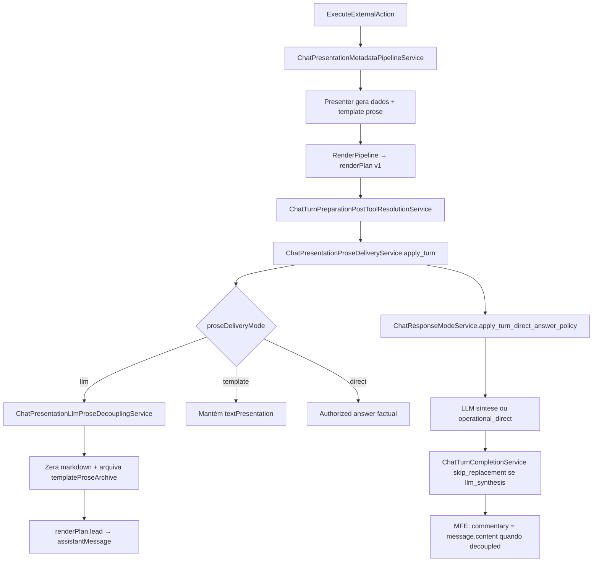

# Playbook 18 — Prosa template × LLM desacoplada

**Projeto:** Minha DELPI Chat IA  
**Status:** P0 entregue (jun/2026) · P2 parcial entregue (jun/2026) · P1/P3–P4 roadmap abaixo  
**Relacionado:** [`playbook-13`](./playbook-13-respostas-humanizadas-dados.md), [`playbook-09`](./playbook-09-apresentacao-rica.md), [`chat-response-modes.md`](../architecture/chat-response-modes.md)

---

## 1. Princípio

Separar em três camadas independentes:

```text
Dados estruturados (API/presenter)  →  fatos + visuais (tabela, árvore, KPI, gráfico)
Prosa do chat                       →  template OU LLM (mutuamente exclusivo por turno)
Contrato MFE (renderPlan)           →  slots visuais + source da prosa (textPresentation | assistantMessage)
```

| Modo | Quem escreve a prosa | Onde ficam os visuais |
|------|----------------------|------------------------|
| **template** | Presenter (`humanizedSummary` → `textPresentation`) | Slots nativos no Painel |
| **llm** | LLM com fatos de `dataAnswer`/tabelas/KPI | Slots nativos inalterados |
| **direct** | Template autorizado factual estreito | Tabela/KPI nativo |

**Regra de ouro:** nunca duplicar interpretação no markdown do presenter **e** na resposta LLM no mesmo turno.

---

## 2. Fluxo canônico (jun/2026)



### Gate único

| Serviço | Papel |
|---------|-------|
| **`ChatPresentationProseDeliveryService`** | Resolve e aplica `template` \| `llm` \| `direct` |
| `ChatOperationalNarrativeSynthesisService` | Detecta intenção narrativa (overview, evidence-first) |
| `ChatPresentationLlmProseDecouplingService` | Efeito colateral do modo `llm` (arquiva + zera prosa) |
| `ChatResponseModeService` | Presets LLM + limpa `directAnswer` narrativo |
| `ChatOperationalLlmSynthesisContextService` | Fatos para prompt (lê archive se humanized limpo) |

Bundle: `assistant/presentation_prose_delivery.json`

### Contrato metadata (API → MFE)

| Campo | Significado |
|-------|-------------|
| `proseDeliveryMode` | `template` \| `llm` \| `direct` |
| `llmProseDecoupled` | Template removido da UI |
| `presentationDecision.proseSource` | `llm` quando decoupled |
| `templateProseArchive` | Markdown/humanized arquivado (só LLM facts; não renderizar) |
| `renderPlan.segments[].source` | `assistantMessage` no lead quando LLM |

---

## 3. Auditoria de acoplamento (jun/2026)

Gate CI: `scripts/audit_presentation_prose_delivery.py --check`

### API — produção de template (upstream, esperado)

| Arquivo | Responsabilidade | Acoplado? |
|---------|------------------|-----------|
| `external_action_result_presenter.py` | Raiz presenter | Sim — gera template |
| `text_presentation_presenter.py` | humanized → markdown | Sim |
| `chat_presentation_humanized_narrative_service.py` | Enriquece markdown | Sim — antes do gate |
| `chat_presentation_metadata_pipeline_service.py` | Orquestra build | Sim — upstream |
| `chat_tool_context_external_action_formatter.py` | sync humanized → textPresentation | Sim |

### API — decisão template vs LLM (canônico)

| Arquivo | Gate? | Status |
|---------|-------|--------|
| `chat_presentation_prose_delivery_service.py` | **Sim** | ✅ P0 |
| `chat_presentation_llm_prose_decoupling_service.py` | Efeito llm | ✅ P0 |
| `chat_turn_preparation_post_tool_resolution_service.py` | Callsite `apply_turn` | ✅ P0 |
| `chat_rich_presentation_text_service.py` | `should_prefer_authorized` | ✅ respeita decoupled |
| `chat_tool_context_presentation_service.py` | authorized/persist | ✅ respeita decoupled |
| `chat_turn_completion_service.py` | skip_replacement LLM | ✅ |
| `chat_response_mode_service.py` | direct answer policy | ✅ |

### API — gaps remanescentes

| # | Gap | Arquivo | Fase |
|---|-----|---------|------|
| G1 | Decoupling só pós-tool (template ainda gerado no pipeline) | `execute_external_action_use_case` | P2 |
| G2 | `ChatToolContextFormatService` pode repopular markdown | format service | P1 |
| G3 | Preview/simulate/agent admin divergência | use cases | P2 |
| G4 | `ChatDataInterpretationAnswerService` usa humanized histórico | domain | P2 |
| G5 | Modos OFF → sempre template em stacks narrativos | config flag | P3 |

### MFE — consumo

| Arquivo | Status P0 |
|---------|------------|
| `presentationMarkdownNormalization.ts` | ✅ `isLlmProseDecoupled*`, skip metadata markdown |
| `renderPlanSegmentBuilder.ts` | ✅ lead `assistantMessage`, skip highlights template |
| `presentationMultiRoute.ts` | ✅ não usa humanized quando decoupled |
| `chatPresentation.ts` | ✅ via `getTextMarkdownFromToolCalls` |
| `presentationMetadataReaders.ts` | ⏳ P1 — expor `proseDeliveryMode` tipado |

---

## 4. Roadmap

### P0 — Gate e contrato (jun/2026) ✅

- [x] `ChatPresentationProseDeliveryService` + JSON
- [x] Integração `post_tool_resolution.apply_turn`
- [x] MFE helpers decoupled + renderPlan fallback
- [x] Testes unitários API + script audit
- [x] Limpar `humanizedSummary.linhas` na UI; facts via archive

### P1 — Fechar vazamentos (jul/2026)

| # | Entrega |
|---|---------|
| P1.1 | Guard em `ChatToolContextFormatService`: não repopular `textPresentation` se `llmProseDecoupled` |
| P1.2 | Tipos MFE: `proseDeliveryMode`, `templateProseArchive` filtrado do render |
| P1.3 | Banner `responseModeEffectNotice` no composer (visibilidade modo LLM) |
| P1.4 | Regressão MFE: `presentationMarkdownNormalization.test.ts` decoupled |
| P1.5 | Gate audit no CI (`audit_presentation_prose_delivery.py --check`) |

### P2 — LLM trata dados sem templates (ago/set 2026) — parcial ✅ jun/2026

Objetivo: **presenter entrega só dados estruturados**; prosa 100% LLM em rotas narrativas.

| # | Entrega | Status |
|---|---------|--------|
| P2.1 | Flag `dataOnlyPresentation` no pipeline quando mensagem narrativa + modos ON | ✅ `ChatPresentationDataOnlyProseService` |
| P2.2 | Pular `build_text_presentation` + enrichments markdown (embeds, humanized narrative) | ✅ pipeline |
| P2.3 | Formatter guard: humanized só `titulo`; linhas arquivadas para fatos LLM | ✅ |
| P2.4 | `ChatToolContextFormatService` não repopula markdown quando data-only | ✅ |
| P2.5 | Presenter mode `data_only` completo (sem chamar `present()` para linhas) | ✅ `resolve_humanized_summary` |
| P2.6 | Smoke qualidade: resposta ≠ template, assertividade, modos distintos | ✅ validador + smoke |
| P2.7 | Unificar preview/simulate/admin no mesmo `apply_turn` | ⏳ |

### P3 — Generalização e config (set/out 2026)

| # | Entrega |
|---|---------|
| P3.1 | `requireResponseModesForLlmProse: false` → LLM prose sem seletor de modos |
| P3.2 | Perfil JSON `proseDeliveryByEntity` em `presentation_profiles.json` |
| P3.3 | Rotas tier A/B: default `llm` para narrativa, `template` para listagem auditável |
| P3.4 | Métricas: taxa template vs LLM, similaridade smoke, latência por modo |

### P4 — Remoção de legado (out 2026+)

| # | Entrega |
|---|---------|
| P4.1 | Remover `synthesizeRenderPlanFromToolCalls` legado no MFE (API sempre envia v1) |
| P4.2 | Deprecar `humanizedSummary.linhas` como prosa UI |
| P4.3 | Consolidar playbook-13 § LLM como caminho primário narrativo |

---

## 5. Como usar (dev)

### Forçar LLM narrativo

```python
# Turno pós-tool (automático quando modos ON + intenção narrativa)
ChatPresentationProseDeliveryService.apply_turn(message, tool_calls, response_mode=mode)
```

### Manter template

Modos OFF **ou** consulta factual estreita → `MODE_TEMPLATE` / `MODE_DIRECT` sem decouple.

### Conectar LLM aos dados (próximo passo P2)

1. Pipeline: `if resolve_mode == llm: skip TextPresentationPresenter`
2. Prompt: `ChatOperationalLlmSynthesisContextService.build_facts_addon(tool_calls)`
3. Completion: `skip_replacement=True` quando `responseModeEffect` ∈ `llm_synthesis*`
4. MFE: renderPlan com visuais + `assistantMessage` lead

### Testes

```bash
cd minha-delpi-ai-api
.venv/bin/python -m pytest tests/unit/domain/services/test_chat_presentation_prose_delivery_service.py -q
.venv/bin/python scripts/audit_presentation_prose_delivery.py --check
SMOKE_SCENARIO=factory_status .venv/bin/python scripts/smoke_response_modes_product_overview.py
```

---

## 6. Checklist PR (obrigatório)

- [ ] Regra nova → `ChatPresentationProseDeliveryService` + teste
- [ ] Texto PT → `assistant/*.json`
- [ ] MFE render-only — não redecide template vs LLM
- [ ] `audit_presentation_prose_delivery.py --check` verde
- [ ] Playbook-13 / chat-response-modes alinhados se contrato mudar

---

## 7. Referências

- Regra Cursor: `presentation-operational-decoupling.mdc`
- [`assistant-content-catalog.md`](../architecture/assistant-content-catalog.md) — bundle `presentation_prose_delivery.json`
- Changelog modos: [`chat-response-modes.md`](../architecture/chat-response-modes.md)
