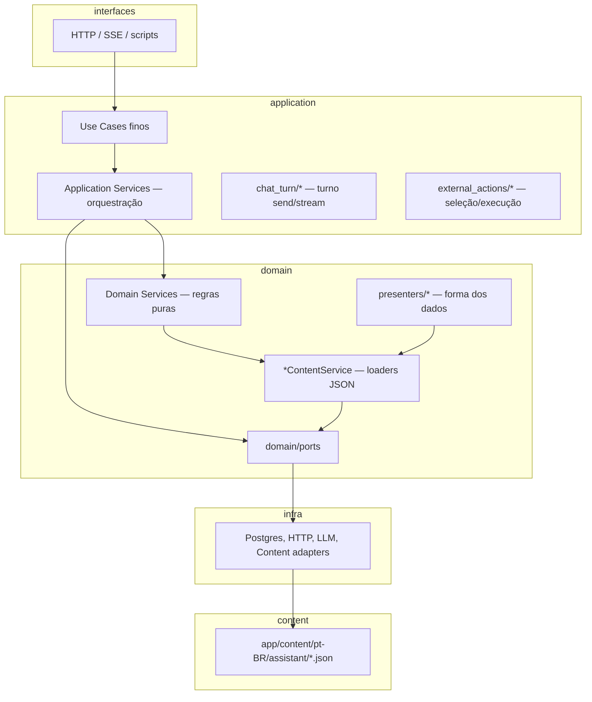

# Playbook 20 — Organização dos services (domain & application)

**Projeto:** `minha-delpi-ai-api`  
**Status:** vigente (jun/2026)  
**Público:** backend, revisores de PR, agentes Cursor  
**Relacionado:** [playbook-11](./playbook-11-clean-architecture-chat-api.md), [chat-intelligence-base](../architecture/chat-intelligence-base.md), [guia-desenvolvimento](../development/guia-desenvolvimento.md)

---

## 1. Objetivo

O repositório concentra **~420 módulos** em `app/domain/services/` e **~206** em `app/application/services/`. A maioria está **ativa e no padrão**, mas o volume dificulta:

- saber **onde** implementar uma regra nova;
- distinguir **facade**, **delegate**, **loader de JSON** e **código de script/CI**;
- identificar **código morto** vs. módulo só usado em `scripts/` ou testes;
- evitar **duplicação** send/stream e **patch local** em use case.

Este playbook é o **guia de organização** — não propõe big-bang de pastas; define taxonomia, convenções, auditoria e reorganização **incremental** alinhada ao playbook 11.

### Regra inviolável — remoção de arquivos

> **Nunca remover** um service (nem renomear/mover de forma destrutiva) **sem antes validar que ele não pertence a nenhum fluxo** — estático, dinâmico, indireto ou de tooling.

Contagem de imports (`rg`, `audit_service_inventory.py`) é **apenas o primeiro passo**. Um módulo “sem referência” pode ainda participar de:

- pipeline send/stream ou simulação admin;
- skill/agente com ativação condicional;
- script de smoke, gate CI ou job assíncrono;
- import dinâmico, lazy ou via composition root;
- contrato de metadata consumido pelo MFE;
- fixture de regressão que modela um fluxo real.

**Remoção só após** checklist completo da §8.1 + §8.5 e evidência de teste (pytest, smoke ou regressão do fluxo afetado).

---

## 2. Diagnóstico (jun/2026)

| Métrica | Domain | Application |
|---------|--------|---------------|
| Módulos `.py` (excl. `__init__`) | ~422 | ~206 |
| Subpastas dedicadas | `external_actions/`, `external_actions/presenters/` | `chat_turn/`, `external_actions/` |
| Imports domain → infrastructure | **0** (gate CI) | permitido via adapters |
| Imports domain → application | **14** (débito — ver §10) | — |
| Imports application → infrastructure | ~75 (esperado em orquestração) | — |
| God files (>1200 linhas) | `chat_presentation_decision_service`, `chat_intent_router_service`, presenters | `chat_document_vision_service` |

### 2.1 O que **não** é código morto (falsos positivos comuns)

Módulos com **zero referência no `app/`** mas usados em **scripts**, **gates CI** ou **testes** devem permanecer — classificar como `tooling`, não deletar:

| Módulo | Uso real |
|--------|----------|
| `operational_route_registry_lint_service` | `scripts/lint_operational_route_registry.py` |
| `api_delpi_openapi_catalog_service` | `scripts/sync_api_delpi_openapi.py` |
| `assistant_capabilities_catalog_generator` | `scripts/generate_assistant_capabilities_catalog.py` |
| `chat_presentation_refactor_baseline_service` | gates de apresentação / baseline JSON |
| `chat_humanized_response_quality_service` | fixtures `humanized_data_response_gate.py` |
| `chat_drawing_validation_assertiveness_metrics_service` | `scripts/validate_drawing_samples.py` |

**Regra:** classificar como `tooling` ou `fluxo indireto` — **não** tratar como candidato a remoção só porque o import não aparece em `app/`.

### 2.2 Categorias por volume (domain)

| Categoria | ~Qtd | Exemplos |
|-----------|------|----------|
| Apresentação | 77 | `ChatPresentation*`, `ChatRichPresentation*` |
| Outros / utilitários | 98 | normalização, similarity, policies |
| Desenho (skill) | 40 | `ChatDrawing*` |
| Operacional / API | 29 | `ChatOperational*`, `OperationalApi*` |
| Presenters | 27 | `external_actions/presenters/*` |
| Memória / contexto | 26 | `ChatConversationMemory*`, `ChatUserContext*` |
| Intent | 25 | `*IntentService` |
| Content loaders | 24 | `*ContentService`, `*PatternsService` |
| SQL | 24 | `ChatSql*` |
| PDF / visão genérica | 14 | `ChatPdf*`, `ChatDocumentVision*Content*` |
| Web search | 11 | `ChatWebSearch*` (domain) |
| Admin / métricas | 10 | `ChatFeedback*`, quality |

Application concentra **orquestração de turno** (`chat_turn/`), **tool context**, **vision runtime** e **delegates de route selection** (`external_actions/`).

---

## 3. Modelo de camadas



### 3.1 Responsabilidade por camada

| Camada | Colocar aqui | Não colocar aqui |
|--------|--------------|------------------|
| **domain/services** | Intenção, roteamento determinístico, presenter, normalização, SQL template, políticas de apresentação, loaders `*ContentService` | Acesso Postgres/HTTP direto; orquestração de turno; SSE |
| **application/services** | `ChatTurnPreparation*`, `ChatToolContext*`, pipeline metadata, vision runtime, import jobs, delegates que **precisam** de repo na mesma chamada | `if produto` novo no use case; strings PT soltas |
| **use_cases** | Validar DTO → chamar 1–3 serviços → retornar | Regras de negócio inline |
| **scripts/** | Gates, sync OpenAPI, smoke — podem importar domain/application | Lógica de produto que só existe no script |

**Princípio herdado das regras Cursor:** inteligência transversal evolui no **chat base** (`ChatIntelligencePipelineService`, `ChatTurnPreparationService`, `ChatToolContextService`) — agentes **filtram**, não reimplementam.

---

## 4. Taxonomia de tipos de serviço

Use esta tabela para classificar qualquer arquivo `chat_*_service.py`:

| Tipo | Sufixo / padrão | Camada | Conteúdo | Par JSON |
|------|-----------------|--------|----------|----------|
| **Intent** | `*IntentService` | domain | `classify`, `is_*`, vocabulário via loader | `*_vocabulary.json`, termos em bundle |
| **Direct answer** | `*DirectAnswerService` | domain (regra) / application (orquestra use case) | `build_direct_answer`, short-circuit | `turn_preparation.json`, etc. |
| **Content loader** | `*ContentService`, `*PatternsService` | domain | `get`, `format`, `compile_pattern`, `limit_int` — **sem** regra de negócio pesada | `assistant/*.json` |
| **Presenter** | `*Presenter` em `external_actions/presenters/` | domain | `humanizedSummary`, colunas, markdown de rota | `presenter_content.json`, `column_labels.json` |
| **Facade** | arquivo “grande” que delega | domain ou application | `< 400` linhas alvo; métodos viram `_*()` para sub-serviços | — |
| **Delegate** | `chat_turn_preparation_*`, `chat_tool_context_*`, `external_action_*_route_selection_*` | application (turno/tools) ou application/external_actions (rotas) | Um estágio do pipeline; chamado só pela facade | textos em JSON (`stream.json`, `external_action_responses.json`) |
| **Pipeline metadata** | `ChatPresentationMetadataPipelineService` | application | Orquestra domain após `ExecuteExternalAction` | `presentation_profiles.json` |
| **Orchestration** | `*OrchestrationService`, `*TurnService` | application | Coordena domain + ports + múltiplos passos | — |
| **Tooling / CI** | usado só em `scripts/` | domain ou application | Lint, baseline, sync catálogo | — |
| **Port adapter helper** | raro em application | application | Traduz port → chamada concreta | — |

### 4.1 Pares obrigatórios (content + regra)

```
foo.json  →  FooContentService (loader)
          →  FooService (lógica que consome o loader)
```

**Proibido:** regex `re.compile`, threshold e frase PT no serviço de regra — ver [assistant-content-json.mdc](../../../.cursor/rules/assistant-content-json.mdc).

### 4.2 Facades canônicas (não duplicar)

| Facade | Delegates principais | Doc |
|--------|---------------------|-----|
| `ChatTurnPreparationService` | `chat_turn/chat_turn_preparation_*` | [chat-pre-llm-layers](../architecture/chat-pre-llm-layers.md) |
| `ChatToolContextService` | `chat_tool_context_*` | [chat-intelligence-base](../architecture/chat-intelligence-base.md) |
| `ExternalActionSelectionService` | `external_actions/external_action_*_route_selection_*` | [operational-api-routing](../../../.cursor/rules/operational-api-routing.mdc) |
| `ExternalActionResultPresenter` | `external_actions/presenters/*` | [new-api-route-checklist](../architecture/new-api-route-checklist.md) |

Novas regras de turno → **novo delegate** + registro na facade; não expandir use case.

---

## 5. Convenções de nomenclatura

### 5.1 Arquivos

| Regra | Exemplo |
|-------|---------|
| Prefixo `chat_` para inteligência do produto | `chat_operational_parameter_service.py` |
| Sufixo `_service.py` (padrão) | `chat_canvas_intent_service.py` |
| Exceções históricas aceitas | `*_validator.py`, `*_classifier.py`, `*_presenter.py`, `*_formatter.py`, `*_extractor.py`, `*_generator.py` |
| Um conceito por arquivo | `ChatDrawingBomQuantitySemanticsService` separado de `ChatDrawingBomComparisonService` |
| Classe homônima ao arquivo | `chat_foo_service.py` → `class ChatFooService` |

### 5.2 Subpastas (atual → alvo incremental)

**Hoje (válido):**

```text
app/domain/services/
  external_actions/
    external_action_result_presenter.py    # facade
    presenters/                            # sub-presenters por rota/perfil
app/application/services/
  chat_turn/                             # turno send/stream
  external_actions/                      # seleção OpenAPI
```

**Alvo (somente quando um cluster ≥ 8–10 arquivos estável):**

```text
app/domain/services/
  presentation/          # ChatPresentation* (decision, view intent, profiles)
  drawing/               # ChatDrawing* (skill only)
  sql/                   # ChatSql*
  intent/                # *IntentService transversais
  operational/           # parâmetros, refinement, route spec helpers
  content_loaders/       # opcional: só *ContentService/*PatternsService
```

**Não mover em massa** — cada subpasta nasce quando um playbook/feature estabiliza o cluster; atualizar imports + `chat-intelligence-base.md` no mesmo PR.

### 5.3 Onde **não** criar arquivo novo

| Sintoma | Ação correta |
|---------|--------------|
| Mesmo `if` em send e stream | Extrair para `chat_turn/` ou domain |
| Texto novo ao usuário | Chave JSON + loader |
| Nova rota api-delpi | [new-api-route-checklist](../architecture/new-api-route-checklist.md) — registry + perfil + presenter |
| Lógica só no `system_prompt` do agente | Mover para domain/application base |

---

## 6. Árvore de decisão — onde implementar

```text
Nova mudança
│
├─ É texto/regex/limite para usuário ou classificador?
│   └─ SIM → assistant/*.json + *ContentService (domain)
│
├─ É instrução longa para o LLM (todos os chats)?
│   └─ SIM → domain/prompt_policies/*.md
│
├─ É detecção de intenção ou resposta sem LLM?
│   └─ SIM → domain/services/*IntentService ou *DirectAnswerService
│       └─ Registrar em ChatTurnPreparation* ou ChatIntelligencePipelineService
│
├─ É forma de apresentar dado de API (tabela, KPI, árvore)?
│   └─ SIM → presenter (domain) + presentation_profiles.json
│       └─ Pipeline: ChatPresentationMetadataPipelineService (application)
│
├─ É seleção de rota OpenAPI / parâmetros?
│   └─ SIM → api_route_domains.json + ExternalAction*RouteSelection* (application)
│       └─ Spec/predicate estável → domain (OperationalApiRouteSpec, matchers)
│
├─ É orquestração de turno (RAG, tools, flags, SSE)?
│   └─ SIM → application/services/chat_turn/ ou chat_tool_context_*
│
├─ É persistência, HTTP, LLM, OCR runtime?
│   └─ SIM → infrastructure + port; application orquestra
│
└─ É gate CI / sync / smoke?
    └─ SIM → scripts/ + serviço domain/application dedicado (tipo tooling)
```

---

## 7. Mapa por sub-sistema

Índice completo: [chat-intelligence-base § Sub-sistemas](../architecture/chat-intelligence-base.md#índice-de-sub-sistemas).

| Sub-sistema | Domain (regras) | Application (orquestração) |
|-------------|-----------------|---------------------------|
| Turno send/stream | intents, direct answers, skip flags | `chat_turn/*`, `ChatTurnLlmAssemblyService`, `ChatTurnCompletionService` |
| Tools & actions | `OperationalApiRouteSpec`, parameter builder, presenters | `ChatToolContextService` + delegates, `ExternalActionSelectionService` |
| Apresentação | `ChatPresentationDecisionService`, `ChatPresentationViewIntentService`, presenters | `ChatPresentationMetadataPipelineService` |
| SQL | `ChatSql*Service` (templates, advisors) | execução via tool context / external action |
| Desenho PDF | `ChatDrawing*` + validação | `ChatDrawingTurnEnrichmentService`, `ChatDocumentVisionTurnService` |
| PDF genérico | `ChatPdf*` | `ChatDocumentVisionService` |
| Memória | `ChatConversationMemoryService`, `ChatUserContextItemService` | `ChatSessionMemoryService`, `ChatContextMetadataService` |
| Web search | intents, query, source evaluation | synthesis, activity, gateway wiring |
| Admin / qualidade | classificadores, métricas domain | `ChatAdminDebugService`, import jobs, reports |

**Fronteira desenho × chat comum:** serviços `ChatDrawing*` e semântica BOM **não** entram em turn prep genérico — ver [chat-intelligence-base § Chat comum × skill desenho](../architecture/chat-intelligence-base.md#chat-comum--skill-desenho-fronteira).

---

## 8. Identificar código morto ou órfão

> **Atenção:** esta seção serve para **priorizar revisão**, não para autorizar exclusão automática. Nenhum arquivo deve ser removido sem validar participação em fluxo (§8.5).

### 8.1 Processo (obrigatório antes de deletar)

**Fase A — rastreamento estático**

1. **Referências em todo o repositório**
   ```bash
   rg "from app\.(domain|application)\.services\.<modulo>" app/ tests/ scripts/ .github/
   rg "<ClassName>" app/ tests/ scripts/ .github/
   rg "<modulo_sem_extensao>" app/ tests/ scripts/ docs/
   ```
2. **Composition root** — instanciação em `composition/*_composer.py` (pode ser o único wiring).
3. **Import indireto** — facade que delega (`ExternalActionResultPresenter._foo()`, `ChatTurnPreparationService` → delegate).
4. **Regressão e fixtures** — `chat_intelligence_regression_cases.py`, `tests/fixtures/*`, gates (`humanized_data_response_gate.py`, etc.).
5. **Metadata / contrato** — campos `metadata.*` ou `adminDebug.*` ainda consumidos pelo MFE.

**Fase B — validação de fluxo (obrigatória antes de remover)**

6. **Mapear fluxos possíveis** — ver §8.5; identificar send, stream, simulate, admin, script CI e skill que poderiam acionar o serviço.
7. **Executar testes do fluxo** — pytest dos módulos que orquestram o caminho; smoke manual ou script quando existir.
8. **Regressão de inteligência** — se o serviço toca intenção, roteamento ou apresentação:
   ```bash
   pytest tests/unit/domain/services/test_chat_intelligence_regression.py -q
   ```
9. **Remoção em PR dedicado** — só após A+B verdes; deletar módulo + testes órfãos + docs; **nunca** deixar import quebrado.

Se qualquer passo de fluxo falhar ou ficar inconclusivo → **manter o arquivo** e abrir issue de consolidação.

### 8.2 Sinais de candidato a **revisão** (não de remoção imediata)

| Sinal | O que fazer |
|-------|-------------|
| Zero refs em `app/`, `tests/`, `scripts/`, `.github/` | Iniciar Fase A; em seguida **obrigatório** Fase B (§8.5) |
| Substituído por delegate novo (changelog diz “migrado”) | Rodar regressão do fluxo antigo **e** do novo; só então remover |
| Duplica outro serviço com mesmo `classify`/`build_direct_answer` | Consolidar com testes dos dois caminhos antes de apagar |
| Só teste sem import em `app/` | Pode ser gate de qualidade — validar se o fluxo que o teste protege ainda existe |
| Comentário `# legacy` / `# unused` | Investigar git + fluxo; comentário **não** é evidência suficiente |

### 8.3 Sinais de **manter** (não é morto)

- Import apenas em `scripts/*.py` (sync, lint, audit).
- Loader usado indiretamente via `ChatAssistantContentService`.
- Sub-presenter chamado só via facade `ExternalActionResultPresenter`.
- Serviço de qualidade usado em fixture de gate (`humanized_data_response_gate.py`).

### 8.5 Checklist de fluxo — quando o módulo parece órfão

Preencher **antes** de qualquer remoção:

| # | Fluxo / superfície | Como validar |
|---|-------------------|--------------|
| 1 | **Send** (`SendChatMessageUseCase`) | pytest do use case + serviço pai na cadeia (`ChatTurnPreparation*`, `ChatToolContext*`) |
| 2 | **Stream** (`StreamChatMessageUseCase`) | idem + testes `*_stream*` se existirem |
| 3 | **Simulação admin** | `AdminAgentSimulateUseCase` / smoke admin com `previous_messages` quando o histórico importa |
| 4 | **Skill / agente** | skill em `metadata.skills` que ativa o domínio (ex.: `drawing-analysis-delpi`, `document-vision-delpi`) |
| 5 | **Feature flag / env** | `Settings`, `CHAT_*`, admin runtime — caminho pode estar desligado em dev |
| 6 | **Script / CI** | `scripts/`, workflow `.github/` que importa o módulo em job de gate |
| 7 | **Apresentação MFE** | metadata gerada ainda lida em `plugins/minha-delpi-chat` |
| 8 | **Regressão canônica** | caso em `chat_intelligence_regression_cases.py` ou fixture do sub-sistema |

**Critério de saída:** para cada linha aplicável ao domínio do serviço, teste executado e passando — ou documentado que o fluxo foi descontinuado com aprovação explícita.

### 8.6 Auditoria automatizada (complementar)

Script interno recomendado (rodar local/CI):

```bash
cd minha-delpi-ai-api
python3 scripts/audit_clean_architecture.py
python3 scripts/audit_service_inventory.py --summary   # ver §11
```

Critérios adicionais úteis:

- domain → application imports (alvo: 0);
- arquivos > 1200 linhas sem delegate;
- `*ContentService` em application (alvo: migrar para domain);
- módulos sem refs fora de si → **lista para revisão manual** (não lista de remoção).

---

## 9. Débitos conhecidos (organização)

| Débito | Qtd | Ação recomendada |
|--------|-----|------------------|
| Domain importa application | 14 arquivos | Extrair contrato para domain ou port; application injeta adapter |
| God files domain | 3+ | Continuar extração de delegates (playbook 11 Fase 3) |
| God files application | 2+ | `ChatDocumentVisionService` → sub-serviços por estágio OCR |
| Flat namespace 400+ arquivos | 1 pasta | Subpastas por cluster quando estável (§5.2) |
| Nomes sem `_service` | ~16 domain, ~6 application | Renomear só com reexport temporário ou em lote por cluster |
| `*ContentService` em application | 3 | Avaliar migração para domain (paridade com playbook 11) |

**Arquivos domain → application (revisar primeiro):**

`chat_intent_router_service`, `chat_operational_parameter_service`, `chat_simple_turn_gate_service`, `chat_fast_path_service`, `chat_pagination_consolidation_service`, `chat_tool_context_presentation_service`, `chat_drawing_*` (orquestração mista).

Cada caso deve virar: **port** + **adapter application** ou mover a regra para domain puro.

---

## 10. Processo de manutenção

### 10.1 Ao adicionar serviço

1. Classificar tipo (§4).
2. Escolher camada (§6).
3. Par JSON se houver texto/regex/limite.
4. Registrar no índice se for **centro de sub-sistema** ([chat-intelligence-base](../architecture/chat-intelligence-base.md)).
5. Teste unitário mínimo + caso em `chat_intelligence_regression_cases.py` se afetar roteamento.
6. Send **e** stream usam o mesmo entry point.

### 10.2 Ao refatorar serviço grande

1. Identificar **estágios** coesos (ingress, tool, presenter, etc.).
2. Extrair delegate em PR pequeno; facade delega com `_*()` lazy ou injeção no `__init__`.
3. Manter API pública da facade estável.
4. Atualizar baseline `clean-architecture-baseline.json` se linhas do god file mudarem.

### 10.3 Cadência sugerida

| Frequência | Ação |
|------------|------|
| Cada PR de inteligência | Checklist §12 |
| Mensal | Rodar inventário + revisar top 10 arquivos por linhas |
| Por release | Revisar candidatos órfãos; atualizar este playbook se taxonomia mudar |

---

## 11. Script de inventário (recomendado)

Adicionar `scripts/audit_service_inventory.py` com:

- contagem por camada e categoria (`intent`, `presenter`, `content_loader`, …);
- lista de módulos **sem referência estática** (revisão manual — validar fluxo §8.5 antes de qualquer remoção);
- domain → application violations;
- arquivos acima de limiar de linhas.

Saída JSON opcional: `docs/architecture/services-inventory-baseline.json` (mesmo padrão do playbook 11).

---

## 12. Checklist de PR (services)

- [ ] Arquivo na camada certa (domain = regra; application = orquestração)?
- [ ] Tipo taxonômico claro (intent / loader / delegate / presenter)?
- [ ] Texto/regex/limite em JSON, não no serviço de regra?
- [ ] Facade existente estendida em vez de novo ramo no use case?
- [ ] Send e stream compartilham o mesmo serviço?
- [ ] Domain não importa `app.infrastructure` nem `app.application`?
- [ ] Teste ou regressão cobrindo o comportamento?
- [ ] Se novo sub-sistema: linha no índice de `chat-intelligence-base.md`?
- [ ] Se remoção: checklist §8.1 + §8.5 completo, testes de fluxo verdes, changelog?

---

## 13. Roadmap incremental (opcional)

| Onda | Entrega | Risco |
|------|---------|-------|
| **20.1** | `audit_service_inventory.py` + baseline JSON | Baixo |
| **20.2** | Zerar domain → application (14 arquivos) | Médio |
| **20.3** | Subpasta `domain/services/presentation/` | Médio — muitos imports |
| **20.4** | Subpasta `domain/services/drawing/` | Médio — skill isolada |
| **20.5** | Partir `ChatDocumentVisionService` | Alto — vision runtime |
| **20.6** | Revisar módulos sem ref (consolidar **só** após §8.5) | Baixo — exige evidência de fluxo |

**Não bloquear features de produto** por reorganização de pastas; preferir delegates e JSON declarativos (retorno do playbook 11).

---

## 14. Referências

| Documento | Uso |
|-----------|-----|
| [playbook-11-clean-architecture-chat-api.md](./playbook-11-clean-architecture-chat-api.md) | Fases, god files, ports |
| [chat-intelligence-base.md](../architecture/chat-intelligence-base.md) | Mapa de serviços e pipeline |
| [chat-pre-llm-layers.md](../architecture/chat-pre-llm-layers.md) | Fases A/B/C do turno |
| [assistant-content-catalog.md](../architecture/assistant-content-catalog.md) | Bundles JSON |
| [guia-desenvolvimento.md](../development/guia-desenvolvimento.md) | §3 fluxo de feature |
| [clean-architecture-baseline.json](../architecture/clean-architecture-baseline.json) | Métricas CI |
| `.cursor/rules/centralized-rules-first.mdc` | Mapa canônico anti-patch |
| `.cursor/rules/clean-architecture-chat-api.mdc` | Checklist camadas |

---

## 15. Resumo executivo

| Pergunta | Resposta curta |
|----------|----------------|
| Todos estão no padrão? | **Maioria sim** — clean architecture Fase 0–6 concluída; débitos são god files, 14 domain→application e flat namespace. |
| Há código morto? | **Incerto sem teste de fluxo** — poucos módulos sem ref; quase todos são tooling/scripts. **Não remover** sem §8.5. |
| Onde colocar regra nova? | §6 árvore de decisão + mapa canônico Cursor. |
| Como organizar pastas? | Manter `chat_turn/`, `external_actions/presenters/`; subpastas por cluster **só quando estável** (§5.2). |
| Próximo passo útil | `audit_service_inventory.py` + zerar domain→application imports — **sem** exclusão de arquivos até validar fluxos. |
