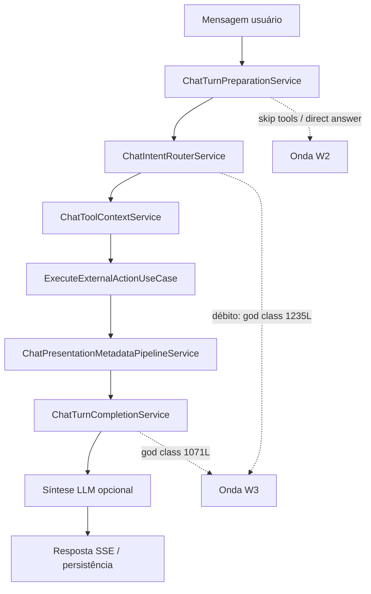
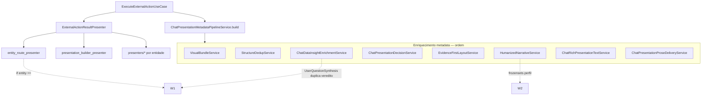
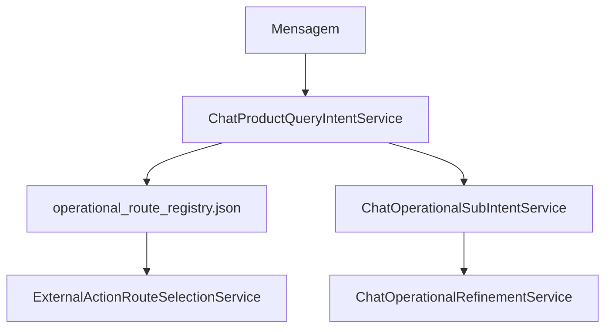

# Playbook 21 — Desacoplamento e refatoração completa (`minha-delpi-ai-api`)

**Projeto:** Minha DELPI Chat IA  
**Status:** **histórico / backlog** (jun/2026) — ondas W1–W3 **concluídas**; foco atual em bugs e qualidade de resposta. Ver **[chat-refactor-status-jun2026.md](../architecture/chat-refactor-status-jun2026.md)**. North star de apresentação: [playbook-22](./playbook-22-schema-first-api-actions-jun2026.md) e [presentation-delivered-pure-jun2026.md](../architecture/presentation-delivered-pure-jun2026.md).  
**Escopo:** revisão completa da API — o que é desacoplamento, fluxos, arquivos e ondas de refatoração pendentes  
**Público:** backend, revisores de PR, agentes Cursor  

**Relacionado:**

- [presentation-operational-decoupling.mdc](../../../.cursor/rules/presentation-operational-decoupling.mdc) — definição canônica de desacoplamento
- [centralized-rules-first.mdc](../../../.cursor/rules/centralized-rules-first.mdc) — mapa de módulos
- [playbook-22-schema-first-api-actions-jun2026.md](./playbook-22-schema-first-api-actions-jun2026.md) — **north star atual** (actions OpenAPI + delivered puro)
- [playbook-18-prosa-template-llm-desacoplamento.md](./playbook-18-prosa-template-llm-desacoplamento.md) — template × LLM × direct
- [playbook-20-organizacao-services-chat.md](./playbook-20-organizacao-services-chat.md) — god files e domain→application
- [playbook-13-respostas-humanizadas-dados.md](./playbook-13-respostas-humanizadas-dados.md) — `dataAnswer` / commentary
- [chat-intelligence-base.md](../architecture/chat-intelligence-base.md) — pipeline de turno
- [chat-refactor-status-jun2026.md](../architecture/chat-refactor-status-jun2026.md) — **status W1–W3 + backlog + foco atual**

---

## 1. Objetivo

> **North star (jun/2026):** ver **[Playbook 22 — Schema-first](./playbook-22-schema-first-api-actions-jun2026.md)** — actions 100% OpenAPI, apresentação as-delivered por padrão, remoção progressiva de presenters legados.

Documentar **o que falta refatorar** na `minha-delpi-ai-api` após a onda Playbook 12 (tier A) e o fix de exclusividade de MPs (jun/2026), com:

1. Definição operacional de **desacoplamento** (vs. centralização vs. presenter por entidade).
2. **Fluxos end-to-end** e pontos de acoplamento.
3. **Inventário de arquivos** por onda, severidade e módulo canônico alvo.
4. **Gates** e critérios de aceite por onda.

> **Não é objetivo** deste playbook reimplementar roteamento HTTP (`api-delpi`) nem o MFE — apenas a camada chat API.

---

## 2. Definições (obrigatórias)

### 2.1 Desacoplamento

**Separar camadas e contratos** para que cada uma tenha responsabilidade única e consuma a outra via **metadata / perfil JSON** — sem repetir o mesmo fato em dois lugares e **sem** regra transversal acoplada a path no Python.

| É desacoplamento | Não é desacoplamento |
|------------------|----------------------|
| Presenter monta veredito; perfil `dataAnswerLeadAlignment: preserve_template`; gate em `ChatPresentationProseDeliveryService` | `ChatOperationalStructureExclusivityService` com `if "/structure/exclusivity"` |
| Coerência LLM por `profileKey` em `operational_factual_verdict.json` + `ChatOperationalFactualVerdictService` | Mesma regra copiada em enrichment, quality e context |
| Banner `dataCoverageNotice` no MFE; flags em `summary` na API | Aviso de incompletude no markdown do presenter |
| `humanizedNarrative: skip` no perfil | `if entity == product_structure_exclusivity` no rich text |
| MFE render-only (`chatPresentation.ts`) | MFE redecide tabela vs gráfico |

### 2.2 Centralização (necessária, insuficiente)

**Uma fonte de verdade (DRY)** — ex.: extrair marcadores duplicados para um JSON. **Não substitui** perfil declarativo nem serviço transversal.

### 2.3 Acoplamento legítimo (não refatorar como “dívida”)

| Camada | Exemplo | Por quê |
|--------|---------|---------|
| Presenter por entidade | `product_structure_exclusivity_presenter.py` | Forma visual + markdown da rota |
| Perfil declarativo | `presentation_profiles.json` → `structure_exclusivity` | Contrato de apresentação |
| Registry operacional | `operational_route_registry.json` | Seleção de action |
| Intent / regressão | `product_query_intent.json`, fixtures | Roteamento de intenção |
| SQL / desenho | `ChatSql*`, `ChatDrawing*` | Domínios com regras próprias |

---

## 3. Estado atual (jun/2026)

### 3.1 Concluído recentemente (exclusividade MPs)

| Entrega | Arquivos |
|---------|----------|
| Sem duplicar veredito presenter × `dataAnswer` | `presentation_profiles.json` (`dataAnswerLeadAlignment`, `humanizedNarrative: skip`, `proseDelivery: template`) |
| Gate genérico de prosa | `chat_presentation_prose_delivery_service.py` |
| Coerência factual LLM transversal | `operational_factual_verdict.json`, `chat_operational_factual_verdict_service.py` |
| Diretrizes `.cursor` | `presentation-operational-decoupling.mdc`, `centralized-rules-first.mdc` |

### 3.2 Playbook 12 — escopo do baseline R0

O baseline `presentation-refactor-baseline-jun2026.json` audita **4 arquivos tier A** com **0** `if path` — **não** cobre o restante do repositório (~420 domain + ~206 application services).

### 3.3 Débito residual estimado

| Categoria | ~Itens | Severidade dominante |
|-----------|--------|----------------------|
| God classes / facades | 17 | alta |
| `if path` / `if entity` fora do perfil | 45+ | média–alta |
| Métodos `_build_*` por rota | 12+ | alta |
| JSON duplicado (mesmo conceito) | 10+ bundles | média |
| Domain → application (14 imports) | 14 arquivos | alta (CA) |

---

## 4. Fluxos end-to-end e pontos de refatoração

### 4.1 Turno send / stream (chat)



| Etapa | Módulo canônico | Débito principal | Onda |
|-------|-----------------|------------------|------|
| Intenção | `ChatIntentRouterService` | God class; import `application` | W3 |
| Skip tools | `ChatTurnPreparationToolRoutingService` | OK — manter | — |
| Seleção de rota | `ExternalActionRouteSelectionService` + registry | `external_action_operational_route_selection_service` 1079L | W2 |
| Parâmetros | `ChatOperationalParameterService` | Import application; cadeia `_looks_like_*` | W3 |

**Arquivos do fluxo:**

- `app/application/services/chat_turn/chat_turn_preparation_service.py`
- `app/application/services/chat_turn/chat_turn_preparation_*_service.py` (delegates)
- `app/application/services/chat_turn/chat_turn_completion_service.py`
- `app/application/use_cases/send_chat_message_use_case.py`
- `app/application/use_cases/stream_chat_message_use_case.py`
- `app/domain/services/chat_intent_router_service.py` (+ delegates em `chat_intent_router/`)
- `app/application/services/chat_tool_context_service.py`
- `app/application/services/external_actions/external_action_route_selection_service.py`
- `app/application/services/external_actions/external_action_operational_route_selection_service.py`

---

### 4.2 Execução operacional + apresentação (tool `execute_external_action`)



**Ordem canônica do pipeline** (`ChatPresentationMetadataPipelineService`):

1. `ChatPresentationDataOnlyProseService` (opcional)
2. `presenter.prepare_presentation_data` / `build_*_presentation`
3. `ChatPresentationVisualBundleService.enrich_metadata`
4. `ChatPresentationPrimaryViewService` / `ChatPresentationTextFirstPolicyService`
5. `ChatPresentationFieldNormalizationService.normalize_metadata`
6. `ChatPresentationStructureDedupService.dedupe_metadata`
7. **`ChatDataInsightEnrichmentService.enrich_metadata`** → `dataAnswer` / `dataCommentary`
8. **`ChatPresentationDecisionService.enrich_metadata`**
9. `ChatPresentationEvidenceFirstLayoutService.activate` + `compose`
10. `ChatPresentationStackOrderService.enrich_metadata`
11. `ChatPresentationHumanizedNarrativeService.enrich_metadata` (se não evidence-first)
12. **`ChatRichPresentationTextService.compact_metadata_text`** → alinha `dataAnswer` no markdown
13. Embeds árvore/tabela/gráfico no markdown
14. `ChatPresentationTextModeService.finalize_*`
15. `ChatPresentationRenderPipelineService`

**Pontos críticos de desacoplamento (W1):**

| # | Serviço | Problema | Alvo |
|---|---------|----------|------|
| 7 | `ChatOperationalUserQuestionSynthesisService` | `dataAnswer.summary` duplica veredito do presenter em perfis `template` | Respeitar `proseDelivery` + `dataAnswerLeadAlignment`; synthesis só metadados |
| 7 | `ChatOperationalDataCommentaryService` | 8× `_build_*_commentary` | Registry JSON + builder genérico por `commentaryProfileKey` |
| 12 | `ChatRichPresentationTextService` | OK após gate `ProseDeliveryService` | Manter delegação |
| — | `entity_route_presenter.py` | ~25 `if entity ==` | Dispatch por `profileKey` / registry |
| — | `presentation_builder_presenter.py` | Cadeia entity + path fragments | `presentation_profiles.json` only |
| — | `external_action_result_presenter.py` | Facade 1638L, dezenas de `build_*` | Delegates finos; registry `visualBuilders` / `textBuilder` |

**Arquivos do fluxo (apresentação):**

- `app/application/use_cases/execute_external_action_use_case.py`
- `app/application/services/chat_presentation_metadata_pipeline_service.py`
- `app/domain/services/external_actions/external_action_result_presenter.py`
- `app/domain/services/external_actions/presenters/entity_route_presenter.py`
- `app/domain/services/external_actions/presenters/presentation_builder_presenter.py`
- `app/domain/services/external_actions/presenters/text_presentation_presenter.py`
- `app/domain/services/chat_presentation_visual_bundle_service.py`
- `app/domain/services/chat_presentation_profile_visual_bundle_service.py`
- `app/domain/services/chat_presentation_profile_text_builder_service.py`
- `app/domain/services/chat_presentation_table_assembly_service.py`
- `app/domain/services/chat_operational_commentary_enrichment_service.py` (`ChatDataInsightEnrichmentService`)
- `app/domain/services/chat_operational_data_commentary_service.py`
- `app/domain/services/chat_operational_user_question_synthesis_service.py`
- `app/domain/services/chat_humanized_data_response_service.py`
- `app/domain/services/chat_presentation_decision_service.py` (2017L — god)
- `app/domain/services/chat_presentation_evidence_first_layout_service.py`
- `app/domain/services/chat_rich_presentation_text_service.py`
- `app/domain/services/chat_presentation_prose_delivery_service.py`
- `app/domain/services/chat_presentation_humanized_narrative_service.py`
- `app/domain/services/chat_presentation_structure_dedup_service.py`

**Presenters por entidade (legítimos; refatorar só se god file):**

- `app/domain/services/external_actions/presenters/product_structure_exclusivity_presenter.py`
- `app/domain/services/external_actions/presenters/product_stock_presenter.py`
- `app/domain/services/external_actions/presenters/product_factory_status_presenter.py`
- `app/domain/services/external_actions/presenters/product_composite_analysis_presenter.py`
- `app/domain/services/external_actions/presenters/product_raw_material_price_presenter.py` (1503L)
- `app/domain/services/external_actions/presenters/product_list_presenter.py` (975L)
- `app/domain/services/external_actions/presenters/kpi_chart_presenter.py`
- `app/domain/services/external_actions/presenters/playbook_report_presenter.py`
- (+ demais em `presenters/`)

---

### 4.3 Síntese LLM pós-tool (modos Rápida / Normal / Pensativa)


| Etapa | Débito | Onda |
|-------|--------|------|
| Policy por kind | `structureExclusivityPathMarkers` duplica `operational_factual_verdict` | W2 |
| Context facts | OK via `ChatOperationalFactualVerdictService.build_llm_facts` | — |
| Enrichment strip | OK via `strip_contradictory_claims_for_tool_calls` | — |
| Quality coherence | OK via `evaluate_coherence_gaps_for_tool_calls` | — |
| Narrative kind | `_SYNTHESIS_STRUCTURE_EXCLUSIVITY` hardcoded | W2 → derivar de `narrativePolicy` no perfil |

**Arquivos:**

- `app/application/services/chat_turn/chat_turn_completion_service.py`
- `app/domain/services/chat_response_mode_service.py`
- `app/domain/services/chat_operational_narrative_synthesis_service.py`
- `app/domain/services/chat_operational_narrative_synthesis_content_service.py`
- `app/content/pt-BR/assistant/operational_narrative_synthesis.json`
- `app/domain/services/chat_operational_llm_synthesis_context_service.py`
- `app/domain/services/chat_operational_llm_synthesis_answer_enrichment_service.py`
- `app/domain/services/chat_response_mode_synthesis_quality_service.py`
- `app/domain/services/chat_operational_factual_verdict_service.py`
- `app/content/pt-BR/assistant/operational_factual_verdict.json`
- `app/domain/prompt_policies/operational-synthesis-structure-exclusivity*.md`

---

### 4.4 Intenção e roteamento operacional



| Débito | Arquivos |
|--------|----------|
| God class intent (1164L, 30+ `_looks_like_*`) | `chat_product_query_intent_service.py` |
| Path tuples em refinement (1208L) | `chat_operational_refinement_service.py` |
| Route context segmentos hardcoded | `chat_route_context_service.py` |
| Follow-up por tipo literal | `chat_follow_up_intent_service.py`, `chat_operational_follow_up_routing_service.py` |
| Sub-intent pipeline | `chat_operational_sub_intent_service.py` |

**JSON âncora:** `product_query_intent.json`, `operational_route_registry.json`, `api_route_domains.json`, `operational_follow_up_routing.json`

**Meta W2:** um vocabulário de path — hoje **duplicado** entre `operational_route_registry.json` e `api_route_domains.json`.

---

### 4.5 Cobertura, incompletude e banner (desacoplamento operacional)

Fluxo canônico: flags API → serviços chat → metadata → MFE banner.

| Responsabilidade | Canônico | Débito |
|------------------|----------|--------|
| Summary flags | `ChatOperationalSummarySemanticsService` | OK |
| Incompleto / consolidado | `ChatOperationalResultCompletenessService` | OK |
| Banner texto | `ChatDataCoverageNoticeService` | `if "/structure"`, `"/stock"` em paths |
| Campos técnicos filtrados | `ChatPresentationOperationalMetadataFieldService` | OK |
| Insight lead | `ChatPresentationInsightService` | OK |

**Arquivos a refatorar:**

- `app/domain/services/chat_data_coverage_notice_service.py`
- `app/domain/services/chat_presentation_coverage_service.py` (`_RICH_PRODUCT_PATH_TOKENS`)
- `app/domain/services/chat_security_messaging_service.py` (mensagens por path — baixa prioridade)

---

## 5. Ondas de refatoração (W1–W4)

### W1 — Colisão de camadas (alta prioridade, risco de regressão UX)

**Objetivo:** nunca repetir veredito factual em presenter + `dataAnswer` + síntese LLM.

| # | Arquivo | Ação | Alvo canônico |
|---|---------|------|---------------|
| 1 | `chat_operational_user_question_synthesis_service.py` | Não preencher `summary.answer` com prosa duplicada quando `proseDelivery: template` e `dataAnswerLeadAlignment: preserve_template` | `ChatPresentationProseDeliveryService` + perfil |
| 2 | `chat_operational_data_commentary_service.py` | Substituir `_build_*_commentary` por registry declarativo | `humanized_data_response.json` + builder genérico |
| 3 | `entity_route_presenter.py` | Eliminar cadeia `if entity ==` | `presentation_profiles.json` + dispatch por `profileKey` |
| 4 | `presentation_builder_presenter.py` | Idem | Playbook 12 R6 residual |
| 5 | `external_action_result_presenter.py` | Reduzir facade; só registry para `build_*` | Delegates em `presenters/` |

**Status jun/2026:** W1a/b/c entregues — registry `commentaryProfiles` + `ChatOperationalCommentaryBuilderRegistryService`; gate `audit_commentary_profiles_registry` em `audit_presentation_prose_delivery.py`.

**Testes obrigatórios:**

- `tests/unit/application/use_cases/test_presentation_response_quality.py`
- `tests/unit/domain/services/test_presentation_decoupling.py`
- `tests/fixtures/operational_presentation_quality_cases.py`
- Caso regressão exclusividade em `chat_intelligence_regression_cases.py`

---

### W2 — Perfil e JSON como única fonte (média prioridade)

**Status jun/2026:** W2 entregue — `textFirstProfiles`, `tierAProfileKeys`, `entityTableProfiles`, `routeNamespace`, `visualHintProfileKeys` e `refinementVocabulary.paginatedPathFragments`; gate `audit_presentation_profile_declarative_w2`.

**Objetivo:** eliminar frozensets e path literals onde já existe `presentation_profiles.json`.

| # | Arquivo | Ação | Status |
|---|---------|------|--------|
| 1 | `chat_presentation_rich_stack_policy_service.py` | `_RICH_PROFILE_FLAGS` → `stackPlan` / flags no perfil | Parcial (`richStackProfiles` vazio) |
| 2 | `chat_presentation_text_first_policy_service.py` | Lista hardcoded → perfil | ✅ |
| 3 | `chat_schema_driven_presentation_service.py` | `_RICH_PROFILE_KEYS`, `_KPI_PROFILE_KEYS` → vocabulary / perfil | Pendente |
| 4 | `chat_presentation_coverage_service.py` | `_RICH_PRODUCT_PATH_TOKENS` → `pathRules` | ✅ |
| 5 | `chat_operational_refinement_service.py` | Tuplas de path → `operational_route_registry.json` | ✅ (`refinementVocabulary`) |
| 6 | `chat_operational_narrative_synthesis.json` | Unificar `structureExclusivityPathMarkers` com `operational_factual_verdict.json` | ✅ |
| 7 | `chat_presentation_visual_ui_hint_service.py` | Mapa profile → seção: só JSON | ✅ (`routeNamespace`) |
| 8 | `chat_presentation_table_profile_inference_service.py` | entity → tableProfile: declarar no perfil | ✅ (`entityTableProfiles`) |
| 9 | `operational_route_registry.json` + `api_route_domains.json` | Vocabulário unificado (P15) | **Backlog** — ver [chat-refactor-status-jun2026.md](../architecture/chat-refactor-status-jun2026.md) §4.2 |

**Bundles JSON a consolidar (`structure_exclusivity` como modelo):**

| Conceito | Ocorrências atuais | Âncora proposta |
|----------|-------------------|-----------------|
| Path markers | `operational_factual_verdict`, `operational_narrative_synthesis` | `operational_factual_verdict` ou perfil |
| Veredito Sim/Não | `presenter_content`, `operational_question_synthesis`, `operational_factual_verdict` | `presenter_content` + refs nos outros |
| Commentary highlights | `chat_operational_data_commentary_service` Python | `humanized_data_response.json` |
| Tier A keys | `presentation_vocabulary`, `presentation_profiles` | `presentation_profiles` entitySets |
| Policies LLM | `operational_narrative_synthesis.synthesisPolicies` | Manter; link `narrativePolicy` no perfil |

---

### W3 — God classes e clean architecture (alta prioridade, esforço maior)

| Arquivo | Linhas ~ | Ação |
|---------|----------|------|
| `chat_presentation_decision_service.py` | ~~2017~~ **~86** | ✅ **OK (jun/2026)** — fachada → `ChatPresentationDecideService`, `ChatPresentationDecisionEnrichmentService`, `ChatPresentationAutomaticScoreService` |
| `chat_intent_router_service.py` | ~~1235~~ **~124** | ✅ **OK (jun/2026)** — delegates `ChatIntentRouter{Classify,Executed,Heuristics,EntityResolution,Support}Service` |
| `chat_document_vision_service.py` | ~~2141~~ **~295** | ✅ **OK (jun/2026)** — fachada + `chat_document_vision/*` (config, pipeline, stage, attachment, drawing_merge, runtime) |
| `chat_operational_refinement_service.py` | ~~1208~~ **~236** | ✅ **OK (jun/2026)** — delegates `chat_operational_refinement/*` (heuristics, pagination, stock, metric, group-by, orchestration) |
| `external_action_operational_route_selection_service.py` | ~~1079~~ **~279** | ✅ **OK (jun/2026)** — delegates `operational_route_selection/*` |
| `chat_turn_completion_service.py` | ~~1071~~ **~200** | ✅ **OK (jun/2026)** — delegates `ChatTurnCompletionFinalize/Intelligence/Metadata/AuditService` |
| `chat_product_query_intent_service.py` | ~~1164~~ **~330** | ✅ **OK (jun/2026)** — delegates `chat_product_query_intent/*` + `ChatProductQueryIntentDetectionService` |
| `product_raw_material_price_presenter.py` | — | ✅ removido (schema-first no host; commit `1322970f3`) |
| `chat_operational_data_commentary_service.py` | ~~933~~ **~100** | ✅ **OK (jun/2026)** — delegates `chat_operational_data_commentary/*` |
| `chat_advanced_sql_specialist_service.py` | ~~1369~~ **~225** | ✅ **OK (jun/2026)** — delegates `chat_advanced_sql_specialist/*` (activation, pipeline, schema_prefetch, prose, prompt, tool_context, follow_up) |
| `kpi_chart_presenter.py` | ~~1068~~ **~154** | ✅ **OK (jun/2026)** — delegates `presenters/kpi_chart/*` (cards, build, dashboard, orchestration, row_chart, specialized) |
| `chat_presentation_profile_service.py` | ~~1035~~ **~429** | ✅ **OK (jun/2026)** — delegates `chat_presentation_profile/*` (entity, path, resolve, openapi, stack, decision, contract, prose) |
| `chat_operational_parameter_service.py` | ~~502~~ **~100** | ✅ **OK (jun/2026)** — delegates `chat_operational_parameter/*` (product_code, tool_skip, period, date); imports application pendentes (gate) |
| `external_action_result_presenter.py` | ~~619~~ **~408** | ✅ **OK (jun/2026)** — orquestração em `external_action_result_orchestration/*` (present, build, schema_auxiliary); sub-presenters em `presenters/` |

**Domain → application (14 arquivos — zerar):**

| Arquivo | Import application |
|---------|-------------------|
| `chat_intent_router_service.py` | pending, small_talk, utility, identity, conversation |
| `chat_operational_parameter_service.py` | conversation, tool_context, playbook readiness |
| `chat_error_handling_classifier.py` | ~~follow_up/canvas/web_search~~ ✅ no domain |
| `chat_active_query_session_service.py` | pending, ~~web_search~~ ✅ `ChatWebSearchFollowUpService` no domain |
| `chat_fast_path_service.py` | pending |
| `chat_tool_context_presentation_service.py` | ~~tool_context_content~~ ✅ `ChatToolContextContentService` no domain |
| `chat_pagination_consolidation_service.py` | ~~tool_context_content~~ ✅ idem |
| `chat_simple_turn_gate_service.py` | identity, capabilities, utility |
| `chat_evaluation_case_runner_service.py` | identity, capabilities, small_talk, utility |
| `chat_drawing_pdf_extraction_service.py` | bom vision |
| `chat_drawing_validation_orchestration_service.py` | bom vision |
| `chat_drawing_product_code_resolution_service.py` | document_vision |
| `chat_text_task_service.py` | ~~email supplements~~ ✅ `ChatEmailPromptSupplementService` no domain, correction supplements |
| `admin_rbac_profile_catalog_service.py` | ~~security permissions~~ ✅ `domain/security/chat_permission_constants.py` |

Gate: `scripts/audit_clean_architecture.py` — `domainInfrastructureImports` **0**; `domainApplicationImports` **0** (jun/2026, W3 concluído).

---

### W4 — Path literals residuais (média–baixa, por domínio)

**Application:**

- `chat_structure_comparison_service.py` — `/structure`, `/analyser`
- `chat_composite_direct_answer_service.py` — `/products/`, `/structure`
- `chat_data_interpretation_answer_service.py` — `/guide`, `/stock`, `/structure`, `/inspection`
- `chat_operational_refinement_interactivity_service.py` — `/stock`
- `external_action_candidate_prioritization_service.py`
- `external_action_product_route_catalog_service.py`
- `external_action_route_selection_service.py`

**Domain:**

- `chat_route_context_service.py`
- `chat_operational_llm_synthesis_context_service.py` — `/analyser`, `/profile`, `/data/sql`
- `chat_external_action_direct_answer_service.py`
- `chat_active_query_session_service.py`
- `chat_presentation_route_policy_service.py` — `/supplies/`
- `chat_presentation_section_rules_service.py`
- `chat_conversation_memory_extractor.py`
- `chat_agentic_catalog_service.py`
- `prompt_policy_service.py`
- `kpi_chart_presenter.py`
- `operational_response_presenter.py`
- `chat_production_schedule_membership_presentation_service.py`
- `chat_context_assertiveness_service.py`
- `chat_product_structure_presentation_service.py`
- `chat_presentation_format_refinement_service.py`
- `chat_analysis_intent_service.py`
- `chat_operational_date_parameter_service.py`
- `chat_product_multi_scope_planning_service.py`
- `chat_product_overview_intent_service.py`

**Aceitável (não priorizar):** `ChatSql*`, `ChatDrawing*`, schema discovery, admin debug.

---

## 6. Inventário completo por pacote

### 6.1 `app/content/pt-BR/assistant/` — bundles com débito de duplicação

| Bundle | Débito | Onda |
|--------|--------|------|
| `presentation_profiles.json` | Âncora — estender, não duplicar | — |
| `operational_factual_verdict.json` | Âncora veredito factual | — |
| `operational_narrative_synthesis.json` | Path markers duplicados | W2 |
| `operational_question_synthesis.json` | Veredito duplica presenter | W1 |
| `presenter_content.json` | Âncora textos presenter | — |
| `humanized_data_response.json` | Deve absorver commentary builders | W1 |
| `product_operational_content.json` | scope/framing duplica presenter | W2 |
| `presentation_vocabulary.json` | tierA vs perfis | W2 |
| `product_query_intent.json` | OK âncora intent | — |
| `operational_route_registry.json` | Duplica `api_route_domains` | W2 |
| `api_route_domains.json` | Unificar com registry | W2 |
| `operational_follow_up_routing.json` | OK | — |
| `response_mode_synthesis_quality.json` | OK (gap keys referenciados por factual_verdict) | — |
| `data_coverage.json` | OK | — |
| `presentation_prose_delivery.json` | Estender chaves metadata se necessário | W1 |

### 6.2 `app/domain/services/` — tier lista completa (refatoração)

**Apresentação (prioridade W1–W2):**

```
chat_presentation_decision_service.py
chat_presentation_coverage_service.py
chat_presentation_evidence_first_layout_service.py
chat_presentation_format_refinement_service.py
chat_presentation_humanized_narrative_service.py
chat_presentation_profile_service.py                    # W3 ✅
chat_presentation_profile/                              # delegates W3
chat_presentation_profile_visual_bundle_service.py
chat_presentation_profile_text_builder_service.py
chat_presentation_prose_delivery_service.py               # OK — estender
chat_presentation_rich_stack_policy_service.py
chat_presentation_route_policy_service.py                 # parcial OK (flags)
chat_presentation_schema_driven_presentation_service.py
chat_presentation_section_rules_service.py
chat_presentation_structure_dedup_service.py              # OK
chat_presentation_table_assembly_service.py
chat_presentation_table_profile_inference_service.py
chat_presentation_text_first_policy_service.py
chat_presentation_visual_ui_hint_service.py
chat_rich_presentation_text_service.py
chat_product_structure_presentation_service.py
chat_operational_factual_verdict_service.py               # OK — padrão
chat_operational_factual_verdict_content_service.py
chat_operational_data_commentary_service.py               # W1 / W3 ✅
chat_operational_data_commentary/                         # delegates W3
chat_advanced_sql_specialist_service.py                   # W3 ✅
chat_advanced_sql_specialist/                             # delegates W3
chat_operational_user_question_synthesis_service.py       # W1
chat_humanized_data_response_service.py
chat_operational_commentary_enrichment_service.py
chat_operational_commentary_lead_service.py               # OK
chat_operational_summary_semantics_service.py             # OK
chat_operational_result_completeness_service.py           # OK (se existir)
chat_data_coverage_notice_service.py                      # W4
chat_data_insight_service.py
chat_presentation_insight_service.py
chat_presentation_operational_metadata_field_service.py   # OK
```

**External actions / presenters (W1):**

```
external_actions/external_action_result_presenter.py
external_actions/external_action_result_orchestration/           # W3 delegates
external_actions/presenters/entity_route_presenter.py
external_actions/presenters/presentation_builder_presenter.py
external_actions/presenters/text_presentation_presenter.py
external_actions/presenters/product_structure_exclusivity_presenter.py
external_actions/presenters/product_raw_material_price_presenter.py
external_actions/presenters/product_list_presenter.py
external_actions/presenters/kpi_chart_presenter.py                   # W3 ✅
external_actions/presenters/kpi_chart/                             # delegates W3
external_actions/presenters/operational_response_presenter.py
(+ todos os presenters em presenters/ — revisar tamanho)
```

**Intent / roteamento (W2–W3):**

```
chat_product_query_intent_service.py                   # W3 ✅
chat_product_query_intent/                             # delegates W3
chat_intent_router_service.py
chat_operational_refinement_service.py                   # W3 ✅
chat_operational_refinement/                             # delegates W3
chat_route_context_service.py
chat_operational_parameter_service.py                   # W3 ✅
chat_operational_parameter/                             # delegates W3
chat_operational_sub_intent_service.py
chat_operational_follow_up_routing_service.py
chat_follow_up_intent_service.py
chat_analysis_intent_service.py
chat_external_action_direct_answer_service.py
chat_context_assertiveness_service.py
```

**Síntese LLM (W2 — consolidar JSON):**

```
chat_operational_narrative_synthesis_service.py
chat_operational_narrative_synthesis_content_service.py
chat_operational_llm_synthesis_context_service.py
chat_operational_llm_synthesis_context_content_service.py
chat_operational_llm_synthesis_answer_enrichment_service.py
chat_response_mode_synthesis_quality_service.py
chat_response_mode_synthesis_quality_content_service.py
chat_response_mode_service.py
chat_presentation_data_only_prose_service.py
chat_presentation_llm_prose_decoupling_service.py
```

### 6.3 `app/application/`

```
use_cases/execute_external_action_use_case.py              # OK (pipeline fino)
use_cases/send_chat_message_use_case.py
use_cases/stream_chat_message_use_case.py                  # ~115L ✅ (ChatStreamTurnExecutionService)
services/chat_turn/chat_stream_turn_execution_service.py   # orquestração SSE stream
services/chat_presentation_metadata_pipeline_service.py    # OK orquestrador
services/chat_turn/chat_turn_preparation_service.py
services/chat_turn/chat_turn_completion_service.py         # W3
services/chat_tool_context_service.py
services/external_actions/external_action_route_selection_service.py
services/external_actions/external_action_operational_route_selection_service.py  # W3
services/chat_structure_comparison_service.py              # W4
services/chat_composite_direct_answer_service.py           # W4
services/chat_data_interpretation_answer_service.py        # W4
services/chat_document_vision_service.py                   # W3 ✅
services/chat_document_vision/                             # delegates W3
```

---

## 7. Gates e critérios de aceite

| Gate | Comando | Onda |
|------|---------|------|
| Perfis tier A | `scripts/audit_presentation_coverage.py --check-profiles` | todas |
| Registry operacional | `scripts/generate_operational_route_registry.py --check` | W2 |
| Prosa template × LLM | `scripts/audit_presentation_prose_delivery.py --check` | W1 |
| Path ifs (escopo estreito) | `scripts/audit_presentation_path_ifs.py` | W1–W2 |
| Clean architecture | `scripts/audit_clean_architecture.py` | W3 |
| Service inventory | `scripts/audit_service_inventory.py` | W3 |
| Regressão apresentação | `pytest tests/unit/application/use_cases/test_presentation_response_quality.py` | W1 |
| Desacoplamento | `pytest tests/unit/domain/services/test_presentation_decoupling.py` | W1 |
| Factual verdict | `pytest tests/unit/domain/services/test_chat_operational_factual_verdict_service.py` | W1 |
| Inteligência | `pytest tests/fixtures/chat_intelligence_regression_cases.py` | W2 |

**Critério de aceite por PR (W1):**

- [x] Nenhum veredito factual repetido no markdown (`count("resposta") <= 1` em fixtures tier A) — caso modelo exclusividade MPs.
- [x] Perfil `template` + `preserve_template` → `dataAnswer` sem `summary.answer` redundante.
- [x] Commentary operacional via `commentaryProfiles` + `builderStrategy` (sem mapa `builders` hardcoded).
- [x] Nenhum serviço novo nomeado por rota (`*StructureExclusivity*` proibido para regra transversal).
- [x] Texto PT novo só em `assistant/*.json`.

---

## 8. Ordem recomendada de execução

```
W1a  UserQuestionSynthesis × template (maior risco UX texto duplicado)
W1b  Commentary registry JSON
W1c  entity_route_presenter dispatch por profileKey
W2   Unificar JSON path markers + frozensets → perfil
W3   God classes + domain→application ports
W4   Path literals residuais por domínio
```

**Não fazer em paralelo:** W1a e mudanças no presenter da mesma entidade sem teste de pipeline completo.

---

## 9. Anti-padrões (checklist de review)

- [ ] Novo `ChatOperational{RouteName}Service` para regra configurável por perfil
- [ ] `if "/structure/exclusivity" in path` fora de loader JSON ou registry
- [ ] Veredito no markdown **e** em `dataAnswer.summary.answer` **e** na síntese LLM
- [ ] Destaques / atenção no markdown quando `dataCommentary` existe
- [ ] Patch só no MFE para comportamento que nasce na API
- [ ] Duplicar `if` entre `Send*` e `Stream*` sem serviço base
- [ ] `re.compile` / string PT em serviço de domínio (exceto loaders `*ContentService`)

---

## 10. Referência rápida — caso exclusividade MPs (modelo W1)

| Camada | Artefato | Status |
|--------|----------|--------|
| Presenter | `product_structure_exclusivity_presenter.py` | OK |
| Perfil | `structure_exclusivity` em `presentation_profiles.json` | OK |
| Prosa gate | `dataAnswerLeadAlignment`, `ChatPresentationProseDeliveryService` | OK |
| LLM coerência | `operational_factual_verdict.json` + `ChatOperationalFactualVerdictService` | OK |
| Synthesis dataAnswer | `ChatOperationalUserQuestionSynthesisService` | OK (W1a) |
| Commentary | `commentaryProfiles` + `ChatOperationalCommentaryProfileService` | OK (W1b) |
| Entity dispatch | `EntityRoutePresenter` + perfis em `presentation_profiles.json` | OK (W1c) |
| JSON path duplicado | narrative_synthesis vs factual_verdict | **OK (W2)** — pathMarkers só em `operational_factual_verdict`; kind via `factualProfileSynthesisKinds` + `narrativePolicySynthesisKinds` |

---

## Changelog

| Data | Nota |
|------|------|
| jun/2026 | Playbook criado após auditoria completa pós-fix exclusividade MPs e diretrizes `.cursor` |
| jun/2026 | W1a — gate synthesis/dataAnswer para perfis `template` + `preserve_template` |
| jun/2026 | W1b — `commentaryProfiles` em `humanized_data_response.json`; exclusividade com `templateProseCommentary: skip` |
| jun/2026 | W1c — dispatch declarativo no `EntityRoutePresenter` (removido `profilePresentDispatch` / `entityPresentOverrides` em jun/2026) |
| jun/2026 | W2 (parcial) — unifica path markers de exclusividade: `operational_factual_verdict` + maps `factualProfileSynthesisKinds` / `narrativePolicySynthesisKinds` |
| jun/2026 | W2 — `richStackProfiles` + `is_rich_stack_profile`; `presentationTableAssemblyEntities` + `try_build_presentation_table` no builder |
| jun/2026 | W3 (parcial) — `ChatTurnCompletionService` fatiado em `chat_turn/chat_turn_completion_{finalize,intelligence,metadata,audit}_service.py`; orquestrador fino + paridade send/stream |
| jun/2026 | Limpeza — removidos `profilePresentDispatch` / `entityPresentOverrides` (JSON legado sem consumo); gate `presentation_builder_items_table_gate` (presenter deletado) |
| jun/2026 | W3 — `ChatIntentRouterService` fatiado em `chat_intent_router/*` (classify, executed, heuristics, entity resolution, support); fachada ~124L |
| jun/2026 | W3 — `ExternalActionOperationalRouteSelectionService` fatiado em `operational_route_selection/*` (resolver, vocabulary, domain, auto tier C); fachada ~279L |
| jun/2026 | W3 — `ChatDocumentVisionService` fatiado em `chat_document_vision/*` (config, pipeline, stage, attachment, drawing_merge); fachada ~295L |
| jun/2026 | W3 — `ChatOperationalRefinementService` fatiado em `chat_operational_refinement/*` (heuristics, pagination, stock, metric, group-by, orchestration); fachada ~236L |
| jun/2026 | W3 — `ChatProductQueryIntentService` fatiado em `chat_product_query_intent/*` (code, content, context, resolution, predicate, direct answer); fachada ~330L |
| jun/2026 | W3 — `ChatOperationalDataCommentaryService` fatiado em `chat_operational_data_commentary/*` (factory, stock, status, misc, orchestration); fachada ~98L |
| jun/2026 | W3 — `ChatAdvancedSqlSpecialistService` fatiado em `chat_advanced_sql_specialist/*` (activation, pipeline, schema_prefetch, prose, prompt, tool_context, follow_up); fachada ~225L; expõe `SQL_AUTHORING_INTRO` na fachada |
| jun/2026 | W3 — `ExternalActionKpiChartPresenter` fatiado em `presenters/kpi_chart/*` (cards, build, dashboard, orchestration, row_chart, specialized); fachada ~154L |
| jun/2026 | W3 — `ChatPresentationProfileService` fatiado em `chat_presentation_profile/*` (entity, path, resolve, openapi, stack, decision, contract, prose); fachada ~429L; `node`/`mapping` permanecem na fachada para patches de teste |
| jun/2026 | W3 — `ChatPresentationDecisionService` já era fachada ~86L (`Decide` / `Enrichment` / `AutomaticScore`); playbook atualizado |
| jun/2026 | W3 — `ChatOperationalParameterService` fatiado em `chat_operational_parameter/*` (product_code, tool_skip, period, date); fachada ~101L |
| jun/2026 | W3 — `ExternalActionResultPresenter` extrai `present` / `build_presentation` / `apply_schema_driven_auxiliaries` para `external_action_result_orchestration/*`; fachada ~408L |
| jun/2026 | W3 concluído — `domainApplicationImports` **0** (`ChatCapabilitiesCatalogAnswerService`, `ChatAttachmentDocumentSelectionService`, `ChatActionLabelService`→domain, etc.) |
| jun/2026 | W3 — `StreamChatMessageUseCase` fatiado: orquestração SSE em `chat_turn/chat_stream_turn_execution_service.py`; use case ~115L (ratchet `sendStreamUseCaseLinesMax`) |
| jun/2026 | Regressão — `preserveDirectAnswerStages` inclui `capabilities` (evita LLM em self-help quando `pre_capability_answer` já resolve o turno) |
| jun/2026 | **W1 concluída** — `commentaryProfiles` para 8 perfis operacionais + `builderStrategy`; `ChatOperationalCommentaryBuilderRegistryService`; gate `audit_commentary_profiles_registry`; `questionSynthesisStrategy` declarativo |
| jun/2026 | **W2 concluída** — `textFirstProfiles`, `tierAProfileKeys`, `entityTableProfiles`, `routeNamespace` nos perfis; `refinementVocabulary` no registry; `ChatPresentationProfileDeclarativeService`; gate `audit_presentation_profile_declarative_w2` |
| jun/2026 | **Pausa arquitetural** — doc [chat-refactor-status-jun2026.md](../architecture/chat-refactor-status-jun2026.md); foco em bugs e qualidade de resposta ao usuário |
