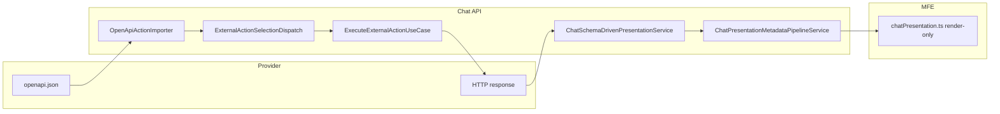

# Playbook 22 — Schema-first: actions 100% OpenAPI e apresentação as-delivered

**Projeto:** Minha DELPI Chat IA  
**Status:** vigente (jun/2026) — **substitui a north star** do Playbook 21 para rotas e apresentação  
**Escopo:** qualquer provider OpenAPI; eliminação progressiva de acoplamento Python/JSON manual  
**Público:** backend, integradores de API, agentes Cursor, gestão de agentes  

**Relacionado:**

- [docie-desacoplamento-selecao-rotas-openapi.md](./docie-desacoplamento-selecao-rotas-openapi.md) — seleção de action (Fases 0–20 concluídas)
- [playbook-10-contrato-respostas-api-delpi.md](./playbook-10-contrato-respostas-api-delpi.md) — contrato HTTP + `meta` (evolui para fonte única no OpenAPI)
- [playbook-21-desacoplamento-refatoracao-completa-jun2026.md](./playbook-21-desacoplamento-refatoracao-completa-jun2026.md) — inventário legado e ondas W1–W4 (referência histórica)
- [playbook-12-apresentacao-declarativa-refatoracao.md](./playbook-12-apresentacao-declarativa-refatoracao.md) — tier A concluído; perfis ricos entram em **modo legacy** até remoção
- [chat-intelligence-base.md](../architecture/chat-intelligence-base.md) — pipeline de turno

---

## 1. North star

O chat deve operar como **cliente genérico de qualquer API OpenAPI**, sem alterar Python a cada rota nova.

| Camada | Antes (jun/2026) | Alvo |
|--------|------------------|------|
| **Action / tool** | OpenAPI import + registry manual + matchers Python | **100%** derivado do `openapi.json` do provider (`parameters_schema`, `response_schema`, `operationId`, `summary`) |
| **Seleção NL** | Registry + vocabulário JSON + ranking semântico | Vocabulário mínimo; registry manual **só** onde semântica NL exigir (depreciar) |
| **Apresentação** | Presenter por entidade + `presentation_profiles.json` (~2,5k linhas) | **Fase 1:** dados **como a API entrega** (schema-driven genérico). **Fase 2+:** enriquecimento opcional via `x-delpi` no OpenAPI |
| **Agentes** | Especialização por allowed actions + RAG | Mesmo pipeline base; provider = conjunto de actions importadas |

**Princípio de ordem:** primeiro fazer funcionar **genérico e correto**; depois **substituir** presenters legados um a um — **deletando** o arquivo acoplado quando a rota migrar.

---

## 2. Definições

### 2.1 Action 100% OpenAPI

Uma **external action** existe porque foi **importada** de um documento OpenAPI:

```text
GET {provider}/openapi.json
  → OpenApiActionImporter
  → Postgres external_actions (path, method, operation_id, parameters_schema, response_schema, summary, tags, …)
  → LLM tool list (sem registro manual duplicado)
```

**Proibido** (meta final): duplicar path/`operationId` em `operational_route_registry.json` quando `autoTierCRoutes` + ranking semântico bastam.

### 2.2 Apresentação as-delivered (`presentationStrategy: as_delivered`)

Resposta HTTP sanitizada → **`ChatSchemaDrivenPresentationService`**:

1. Detecta forma (`items`, `series`, KPI escalar, árvore genérica).
2. Monta tabela / KPI / árvore / texto a partir dos **campos presentes**.
3. Fallback: markdown com payload JSON (`schemaDriven.rawPayloadLead`).

**Sem** presenter dedicado, **sem** veredito operacional customizado, **sem** stack rico — até a API publicar `meta`/`x-delpi` suficiente.

### 2.3 Apresentação legacy (`presentationStrategy: legacy`)

Rotas tier A ainda não migradas: presenter por entidade, stack rico, `dataAnswer` template, dedup estrutural.

Marcadas em `presentation_profiles.json` → `entitySets.legacyPresentationProfiles` ou flag explícita no perfil.

### 2.4 Remoção de acoplamento

Ao migrar uma rota de **legacy → as_delivered**:

1. Remover perfil de `legacyPresentationProfiles`.
2. Remover presenter Python (`*_presenter.py`) se não houver mais referência.
3. Remover entrada manual redundante no registry (se existir par OpenAPI).
4. Remover regras de path duplicadas em serviços de cobertura/refinement.
5. Gate: teste de regressão com fixture **payload real** da API.

---

## 3. Arquitetura alvo



### 3.1 Pipeline de apresentação (Fase 1)

```text
ExecuteExternalAction → sanitize
  → ChatPresentationProfileService.uses_schema_first_presentation?
       sim → ChatSchemaDrivenPresentationService.build_primary (prioridade)
       não → entity route / playbook / builder legacy (até remoção)
  → ChatPresentationMetadataPipelineService.build (modos Automático/Texto)
  → MFE
```

**Ordem invertida em relação ao legado:** schema-first **antes** de presenters acoplados quando `as_delivered`.

### 3.2 Contrato OpenAPI estendido (Fase 2 — futuro)

Metadados de apresentação **na fonte** (api-delpi ou qualquer provider):

```yaml
x-delpi:
  entity: product_stock
  shape: playbook_report | paged_list | scalar | composite_analysis | hierarchy
  presentation:
    strategy: enriched   # quando sair de as_delivered
    columnLabels: { ... }
```

Importador persiste extensão em `external_actions.metadata` → perfil derivado no sync — **sem** editar `presentation_profiles.json` manualmente.

---

## 4. Fases de implementação

### Fase A — Actions OpenAPI-only (seleção)

**Status:** DOCIE Fases 0–20 concluídas para api-delpi.

| # | Entrega | Done quando |
|---|---------|-------------|
| A1 | Sync OpenAPI periódico / CI | `sync_api_delpi_openapi.py` verde |
| A2 | `autoTierCRoutes` cobre rotas sem registry manual | diff registry vs OpenAPI → plano de remoção |
| A3 | Provider genérico (`api_externa`, futuros) | import + allowed_action_ids por agente |
| A4 | Depreciar entradas manuais duplicadas | checklist por rota removida do JSON |

**Arquivos candidatos à remoção (incremental):** entradas órfãs em `operational_route_registry.json`, predicates Python residuais, serviços `select_*` por path.

### Fase B — Apresentação as-delivered (default)

**Status:** em andamento (jun/2026).

| # | Entrega | Módulo canônico |
|---|---------|-----------------|
| B1 | `defaults.presentationStrategy: as_delivered` | `presentation_profiles.json` |
| B2 | `legacyPresentationProfiles` (tier A até migrar) | idem |
| B3 | `uses_schema_first_presentation()` | `ChatPresentationProfileService` |
| B4 | Schema-first **antes** de legacy no presenter | `ExternalActionResultPresenter.build_presentation` |
| B5 | Fallback JSON cru | `ChatSchemaDrivenPresentationService.build_raw_payload_markdown` |
| B6 | Remover `_RICH_PROFILE_KEYS` hardcoded | usar JSON + `legacyPresentationProfiles` |

**Critério de aceite B:** rota **sem** perfil legacy → tabela/KPI/texto/JSON genérico; rotas tier A inalteradas até saírem do set legacy.

### Fase C — Migração rota a rota (legacy → as-delivered)

Para cada entidade tier A (ordem sugerida: listagens simples → KPI → árvore → exclusividade/MP):

1. Validar payload OpenAPI + labels em `response_schema` / `meta.sections`.
2. Remover de `legacyPresentationProfiles`.
3. Deletar presenter dedicado.
4. Encurtar perfil em `presentation_profiles.json` (ou remover se derivado do OpenAPI na Fase D).
5. Regressão: fixture payload + modos Automático/Texto.

**Playbook 21 W2–W4** continua válido como **lista de débito** dentro desta fase — prioridade: eliminar frozensets e path tuples, não expandir perfis.

### Fase D — Shape e enriquecimento na API (depois)

1. api-delpi publica `x-delpi` / `meta.entity` / `meta.shape` consistentes.
2. Importador gera perfil mínimo automaticamente.
3. Reintroduzir stack rico **só** onde `presentation.strategy: enriched` no OpenAPI.
4. `presentation_profiles.json` reduzido a defaults + exceções NL.

---

## 5. Inventário de acoplamento (remover por fase)

### 5.1 Presenters por entidade (`external_actions/presenters/`)

| Arquivo | Perfil legacy | Remover quando |
|---------|---------------|----------------|
| `product_structure_exclusivity_presenter.py` | structure_exclusivity | payload + árvore genérica OK |
| `presentation_builder_presenter.py` | vários | tableAssembly coberto por schema + OpenAPI |
| `entity_route_presenter.py` | dispatch | zero entidades em `profilePresent` |
| … | … | migrado + teste verde |

**Meta:** pasta reduzida a hosts utilitários (`text_`, `kpi_chart_`, column labels) — sem `if entity`.

### 5.2 JSON manual redundante

| Arquivo | Manter (Fase 1) | Depreciar |
|---------|-----------------|-----------|
| `operational_route_registry.json` | intents NL, PB15, produto | rotas já em OpenAPI tier C |
| `presentation_profiles.json` | defaults + legacy sets | perfis por entidade (→ OpenAPI) |
| `api_route_domains.json` | parameter strategies | path markers duplicados |
| `product_query_intent.json` | vocabulário NL produto | — |

### 5.3 Frozensets / path tuples em Python

| Local | Substituto |
|-------|------------|
| `_RICH_PROFILE_KEYS` em `chat_schema_driven_presentation_service.py` | `legacyPresentationProfiles` |
| `_RICH_PRODUCT_PATH_TOKENS` | `pathRules` ou remoção pós-migração |
| Tuplas em `chat_operational_refinement_service.py` | registry / OpenAPI tags |
| `_RICH_PROFILE_KEYS` em `chat_schema_driven_presentation_service.py` | JSON |

---

## 6. Agentes e providers

### 6.1 Agente genérico

- **Allowed actions** = subset de `external_actions` importadas (por provider, tag, ou lista explícita).
- **Sem** system_prompt com lista de paths — LLM usa `summary` + `parameters_schema` das tools.
- RAG / skills = camada opcional; **não** substituem pipeline base.

### 6.2 Novo provider OpenAPI

Checklist:

1. Registrar provider + URL OpenAPI na config.
2. `OpenApiActionImporter` → sync actions.
3. Agente com `allowed_action_ids` ou filtro por tag.
4. Apresentação **as-delivered** imediata (Fase B).
5. (Opcional) Estender OpenAPI com `x-delpi` para enriquecimento.

---

## 7. Gates CI

```bash
cd minha-delpi-ai-api

# Apresentação legacy vs schema-first
.venv/bin/python -m pytest tests/unit/domain/services/test_chat_schema_driven_presentation_service.py -q
.venv/bin/python -m pytest tests/unit/domain/services/test_chat_presentation_profile_service.py -q

# Rotas OpenAPI
.venv/bin/python scripts/generate_operational_route_registry.py --check
.venv/bin/python scripts/sync_api_delpi_openapi.py --dry-run   # quando aplicável

# Tier A ainda legacy — suite dedicada até migrar
.venv/bin/python -m pytest tests/unit/domain/services/test_operational_route_table_presenters.py -q
```

**Gate de remoção de presenter:** grep zero referências + pytest da rota + `--check-profiles` se perfil JSON alterado.

---

## 8. O que NÃO fazer

- Adicionar presenter Python para **rota nova** — usar as-delivered + OpenAPI.
- Duplicar rota no registry se já importada e rankeável semanticamente.
- Expandir `presentation_profiles.json` para nova rota sem `x-delpi` (Fase D).
- Fix de UI no Trato de sintoma quando API pode entregar `meta` melhor.
- Manter `lastEntities` / chips product/branch (regra chat base jun/2026).

---

## 9. O que fazer (checklist PR)

- [ ] Action nova só via OpenAPI import?
- [ ] Apresentação default `as_delivered`?
- [ ] Se legacy, entrada explícita em `legacyPresentationProfiles`?
- [ ] Texto PT novo só em `assistant/*.json`?
- [ ] Teste com payload real da API?
- [ ] Se removeu acoplamento, arquivo deletado neste PR?

---

## 10. Referência rápida — módulos canônicos

| Responsabilidade | Módulo |
|------------------|--------|
| Import OpenAPI | `OpenApiActionImporter`, `sync_api_delpi_openapi.py` |
| Seleção action | `ExternalActionSelectionDispatchService`, `ExternalActionRouteSelectionService` |
| Execução HTTP | `ExecuteExternalActionUseCase` |
| Estratégia apresentação | `ChatPresentationProfileService.uses_schema_first_presentation` |
| Render genérico | `ChatSchemaDrivenPresentationService` |
| Pipeline metadata | `ChatPresentationMetadataPipelineService` |
| MFE | `chatPresentation.ts` (render-only) |

---

## 11. Histórico

| Data | Evento |
|------|--------|
| jun/2026 | Playbook 21 W1–W2 parcial (dedup, richStackProfiles, factual verdict) |
| jun/2026 | **Playbook 22** — north star schema-first; Fase B iniciada (`presentationStrategy`, schema-first no presenter) |
