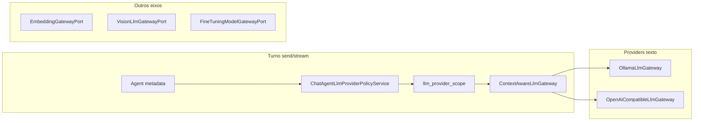

# Playbook 24 — Provedores LLM plugáveis (Ollama padrão, API externa opcional)

**Projeto:** Minha DELPI Chat IA · Pacote: `minha-delpi-ai-api`  
**Status:** P0–P5 implementados (jul/2026)  
**Pré-requisitos:** [Playbook 11 — clean architecture](./playbook-11-clean-architecture-chat-api.md), [Playbook 19 — inferência LLM](./playbook-19-inferencia-llm-universal.md)

---

## 1. Objetivo

Deixar o código **pronto para trocar o motor de inferência** sem reescrever o pipeline do chat:

| Requisito | Significado |
|-----------|-------------|
| **Ollama continua padrão** | Dev/homolog CPU e Compose atual seguem funcionando sem mudança de comportamento. |
| **Troca por API externa** | Produção ou tenants podem apontar para OpenAI-compatible, Azure OpenAI, Groq, vLLM remoto, etc. |
| **Um ponto por capacidade** | Chat texto, embeddings, visão VLM e fine-tuning local têm **porta + composer** — não `if ollama` espalhado. |
| **Config declarativa** | URLs, modelos, timeouts e custos por **env + perfil de latência**; sem constantes mágicas em serviço de domínio. |

**Fora de escopo inicial:** trocar modelo de embedding sem migração pgvector.

---

## 2. Estado atual (pós-implementação P0–P5, jul/2026)

### 2.1 Capacidades plugáveis ✅

| Eixo | Porta | Composer | Providers |
|------|-------|----------|-----------|
| **Texto** | `LlmGatewayPort` | `make_llm_gateway()` → `ContextAwareLlmGateway` | `ollama`, `openai_compatible` |
| **Embeddings** | `EmbeddingGatewayPort` | `make_embedding_gateway()` | `ollama`, `openai_compatible` |
| **Visão (VLM)** | `VisionLlmGatewayPort` | `make_vision_llm_gateway()` | `ollama`, `openai_compatible` |
| **Fine-tuning** | `FineTuningModelGatewayPort` | `make_fine_tuning_model_gateway()` | deploy local só `ollama`; senão `export_only` |

| Camada | Módulo canônico | Comportamento |
|--------|-----------------|---------------|
| Config texto | `llm_text_config.resolve_llm_text_config()` | `LLM_TEXT_*` com fallback `OLLAMA_*` / `VLLM_*` |
| Registry | `composition/provider_registry.py` | Mapa extensível por kind |
| Modos resposta | `ChatResponseModeService` + `llm_generation_scope` | Modelo/tokens por turno |
| Override agente | `ChatAgentLlmProviderPolicyService` + `llm_provider_scope` | `llmProviderOverride` no metadata |
| Custo / audit | `LlmCostEstimatorService` + metadata `provider` | Provider efetivo por turno |
| Warmup | `llm_warmup_service` | Só quando provider normalizado = `ollama` |
| Status admin | `GetLlmProviderStatusUseCase` | `text`, `embedding`, `vision` separados |
| Gate CI | `scripts/audit_llm_provider_coupling.py --check` | Proíbe import direto de gateways em domain/application |

**Changelog detalhado:** [2026-07-playbook-24-llm-provider-pluggable.md](../changelog/2026-07-playbook-24-llm-provider-pluggable.md)

### 2.2 Diagrama (estado atual)



### 2.3 Backlog residual (fora do playbook)

| Item | Notas |
|------|-------|
| Migração dimensão embedding | Trocar modelo exige reindex pgvector — documentar antes de trocar em produção |
| `AnthropicLlmGateway` / `GeminiLlmGateway` | Só se API nativa (sem OpenAI-compatible) for requisito |
| Aliases `OLLAMA_*` / `VLLM_*` | Manter compatibilidade; preferir `LLM_TEXT_*` em novos deploys |

---

## 3. Arquitetura alvo

### 3.1 Princípio — três eixos independentes

| Eixo | Porta | Default | Troca típica |
|------|-------|---------|--------------|
| **Texto (chat)** | `LlmGatewayPort` | `ollama` | `vllm` / `openai` → URL + API key |
| **Embeddings** | `EmbeddingGatewayPort` | `ollama` | `openai` / `vllm` / serviço dedicado |
| **Visão (VLM)** | `VisionLlmGatewayPort` (nova) | `ollama_vlm` | OpenAI vision / Gemini / desligado |

Fine-tuning permanece **opcional e local** (`FineTuningModelGatewayPort`); com provider externo → modo `export_only` (já parcialmente existe).

### 3.2 Registry de providers (composition)

```text
composition/
  llm_composer.py           → make_llm_gateway()
  embedding_composer.py     → make_embedding_gateway()   # hoje só cache; gateway em external_action_composer
  vision_llm_composer.py    → make_vision_llm_gateway()  # novo
  provider_registry.py      → resolve_provider(kind, name)  # novo — único mapa
```

**Regra:** `domain/` e `application/` **nunca** importam `OllamaLlmGateway` nem leem `OLLAMA_BASE_URL` diretamente — só `ChatDomainConfigService` / `AppConfigPort`.

### 3.3 Configuração unificada (env)

| Variável (alvo) | Papel | Default |
|-----------------|-------|---------|
| `LLM_PROVIDER` | Motor de **texto** do chat | `ollama` |
| `LLM_TEXT_BASE_URL` | URL base (substitui acoplamento nome Ollama) | derivado de `OLLAMA_BASE_URL` ou `VLLM_BASE_URL` |
| `LLM_TEXT_MODEL` | Modelo default | derivado de `OLLAMA_MODEL` / `VLLM_MODEL` |
| `LLM_TEXT_API_KEY` | Bearer (vazio para Ollama local) | `VLLM_API_KEY` |
| `EMBEDDING_PROVIDER` | Motor de embedding | `ollama` |
| `EMBEDDING_BASE_URL` | URL embeddings | `OLLAMA_BASE_URL` |
| `EMBEDDING_MODEL` | ex. `bge-m3` | inalterado |
| `VISION_LLM_PROVIDER` | VLM documentos | `ollama` |
| `VISION_LLM_MODEL` | ex. `qwen2.5vl:7b` | `CHAT_DOCUMENT_VISION_OLLAMA_MODEL` (alias legado) |

**Compatibilidade:** manter `OLLAMA_*` e `VLLM_*` como **aliases** por 1–2 releases; `Settings` resolve para `LLM_TEXT_*` internamente.

### 3.4 OpenAI-compatible como estratégia padrão

| Provider externo | Implementação alvo | Notas |
|------------------|-------------------|-------|
| OpenAI / Azure / Groq / Together | `OpenAiCompatibleLlmGateway` (renomear ou generalizar `VllmLlmGateway`) | `/v1/chat/completions`, tools |
| Ollama local | `OllamaLlmGateway` | `/api/chat`, tools nativos |
| Anthropic nativo (sem compat) | `AnthropicLlmGateway` | Backlog P4 — só se necessário |
| Gemini nativo | `GeminiLlmGateway` | Backlog P4 |

---

## 4. Roadmap de implementação

### P0 — Inventário e guardrails (1 sprint, baixo risco) ✅

| # | Entrega | Onde | DoD |
|---|---------|------|-----|
| P0.1 | Script `audit_llm_provider_coupling.py --check` | `scripts/` | Falha CI se `domain/` ou `application/` importar `infrastructure.llm.ollama_*` (allowlist documentada) |
| P0.2 | ADR `adr-00N-llm-provider-ports.md` | `docs/architecture/adr/` | Três eixos texto/embedding/visão |
| P0.3 | Doc operacional «trocar para API externa» | `docs/operations/llm-provider-switch.md` | Matriz env + smoke + rollback |
| P0.4 | Smoke `scripts/smoke_llm_provider_switch.py` | `scripts/` | Com `LLM_PROVIDER=vllm`, send+stream+tools passam |

### P1 — Texto 100% configurável (1 sprint) ✅

| # | Entrega | Onde | DoD |
|---|---------|------|-----|
| P1.1 | `LlmProviderConfigService` (domain) | `domain/services/` | `resolve_text_config()` — URL, model, key, timeout sem nome «ollama» no consumidor |
| P1.2 | Generalizar `VllmLlmGateway` → `OpenAiCompatibleLlmGateway` | `infrastructure/llm/` | Aceita qualquer base URL; logs sem «vllm» no path de erro |
| P1.3 | `provider_registry.py` + extensão `llm_composer` | `composition/` | Registro: `ollama`, `openai_compatible` (alias `vllm`) |
| P1.4 | Warmup condicional | `LlmWarmupService` | Só aquece provider ativo; skip se URL externa |
| P1.5 | `GetLlmProviderStatusUseCase` | application | Retorna `text`, `embedding`, `vision` separados |
| P1.6 | Testes paridade | `tests/unit/infrastructure/llm/` | Mock HTTP: ollama vs openai_compatible mesmos cenários tools/stream |

### P2 — Embeddings plugáveis (1–2 sprints) ✅

| # | Entrega | Onde | DoD |
|---|---------|------|-----|
| P2.1 | `make_embedding_gateway()` canônico | `embedding_composer.py` | Único wiring (hoje espalhado em `external_action_composer`) |
| P2.2 | `OpenAiCompatibleEmbeddingGateway` | `infrastructure/embeddings/` | `/v1/embeddings` |
| P2.3 | `EMBEDDING_PROVIDER` | `settings.py` + Compose | Default `ollama`; doc dimensões `EMBEDDING_DIMENSIONS` |
| P2.4 | Health embedding | admin system check | Status por provider |
| P2.5 | Teste + smoke RAG | `test_search_knowledge_*` | Indexação + busca com provider mock |

**⚠ Migração de dimensão:** trocar modelo de embedding exige reindex — documentar em `docs/knowledge/`; **não** automatizar no P2.

### P3 — Visão (VLM) plugável (1 sprint) ✅

| # | Entrega | Onde | DoD |
|---|---------|------|-----|
| P3.1 | `VisionLlmGatewayPort` | `domain/ports/` | `describe_image`, `describe_pdf_page` (contrato mínimo) |
| P3.2 | `OllamaVisionLlmGateway` | infrastructure | Extrair de `ChatDocumentVisionStageService` |
| P3.3 | `OpenAiCompatibleVisionLlmGateway` | infrastructure | GPT-4o-mini vision / equivalente |
| P3.4 | `VISION_LLM_PROVIDER` + composer | settings + composition | Fallback Tesseract-only se provider off |
| P3.5 | Regressão | `test_chat_document_vision_*` | Pipeline não referencia `OLLAMA_BASE_URL` direto |

### P4 — Fine-tuning e deploy (opcional, 1 sprint) ✅

| # | Entrega | Onde | DoD |
|---|---------|------|-----|
| P4.1 | `FineTuningModelGatewayPort` | domain | `create_local_model` / `export_only` |
| P4.2 | Resolver genérico | `ChatFineTuningDeployResolverService` | Provider-aware; sem `get_active_deployed_ollama_model` no domain |
| P4.3 | UI admin | mensagem clara | «Fine-tuning local só com Ollama; com API externa use export» |

### P5 — Multi-tenant / por agente ✅

| # | Entrega | Onde | DoD |
|---|---------|------|-----|
| P5.1 | `llmProviderOverride` no metadata do agente | `ChatAgentLlmProviderPolicyService` | `metadata.intelligence.llmProviderOverride` ou legado em `metadata` |
| P5.2 | Gateway por turno | `ContextAwareLlmGateway` + `llm_provider_scope` | Send/stream aplicam provider efetivo antes do LLM |
| P5.3 | Rate limit API externa | `ChatTurnLlmProviderGuardService` | Bucket `llm_text:{provider}:{user}`; env `RATE_LIMIT_EXTERNAL_LLM_PER_WINDOW` |
| P5.4 | Métricas admin | `PostgresAdminMetricsRepository` | `llmProviderUsage24h`, `llmRateLimitSnapshot`, custo normalizado por provider |

---

## 5. Mapa canônico — o que NÃO fazer

| Anti-padrão | Canônico |
|-------------|----------|
| `if Settings.LLM_PROVIDER == "ollama"` em serviço de domínio | `ChatDomainConfigService.llm_provider()` + policy JSON |
| `requests.post(OLLAMA_BASE_URL...)` fora de `infrastructure/llm` ou `infrastructure/embeddings` | Gateway na infra + porta no domain |
| Novo use case importando `OllamaLlmGateway` | Injetar `LlmGatewayPort` via composer |
| Troca só no MFE ou no prompt do agente | Env + composer + smoke API |
| Remover Ollama do Compose sem embedding alternativo | `EMBEDDING_PROVIDER` explícito antes de desligar serviço `ollama` |

Alinhado a: `clean-architecture-chat-api.mdc`, `clean-code-architecture-guardrails.mdc`.

---

## 6. Checklist operacional — trocar para API externa (alvo P1)

### 6.1 Pré-requisitos

- [ ] API suporta **chat completions** + **function calling** (tools).
- [ ] Latência aceitável para modos Normal/Pensador (ver `CHAT_LLM_LATENCY_PROFILE`).
- [ ] `LLM_PROMPT_TOKEN_COST_PER_1K` / `LLM_COMPLETION_TOKEN_COST_PER_1K` configurados no admin.

### 6.2 Variáveis (exemplo OpenAI-compatible)

```env
LLM_PROVIDER=openai_compatible
LLM_TEXT_BASE_URL=https://api.openai.com/v1
LLM_TEXT_MODEL=gpt-4o-mini
LLM_TEXT_API_KEY=sk-...
LLM_TIMEOUT_SECONDS=120

# Embeddings: manter Ollama local até P2
EMBEDDING_PROVIDER=ollama
OLLAMA_BASE_URL=http://ollama:11434
EMBEDDING_MODEL=bge-m3
```

### 6.3 Validação pós-deploy

```bash
# Restart obrigatório (flask sem --reload)
docker compose restart minha-delpi-ai-api

# Smokes
cd minha-delpi-ai-api
PYTHONPATH=. SMOKE_BASE_URL=http://delpi-gateway \
  SMOKE_USER=rober SMOKE_PASSWORD=1234 \
  python scripts/smoke_llm_provider_switch.py

pytest tests/unit/infrastructure/llm/ -q
```

### 6.4 Rollback

```env
LLM_PROVIDER=ollama
# remover LLM_TEXT_* overrides
```

Restart do container; conferir `GET /chat/llm-provider` (ou admin system check).

---

## 7. Gates CI (após P0–P1)

```bash
cd minha-delpi-ai-api
.venv/bin/python scripts/audit_llm_provider_coupling.py --check
pytest tests/unit/infrastructure/llm/ -q
pytest tests/unit/composition/test_llm_composer.py -q
# opcional homologação
PYTHONPATH=. python scripts/smoke_llm_provider_switch.py
```

---

## 8. Impacto infra (`delpi-central/infra`)

| Serviço Compose | Ollama padrão | Só API externa (futuro) |
|-----------------|---------------|-------------------------|
| `ollama` | **obrigatório** (chat + embeddings + VLM) | Opcional se P2+P3 com APIs externas |
| `minha-delpi-ai-api` | `LLM_PROVIDER=ollama` | `LLM_PROVIDER=openai_compatible` |
| `vllm` | Opcional (GPU local) | Pode substituir Ollama para texto |

Atualizar: `infra/README-ambiente.md`, `docs/02-infraestrutura/variaveis-de-ambiente.md`, `env.local.example`.

---

## 9. Relação com outros playbooks

| Playbook | Relação |
|----------|---------|
| [19 — inferência LLM universal](./playbook-19-inferencia-llm-universal.md) | Mais chamadas LLM por turno → **custo/latência** sobem com API externa |
| [11 — clean architecture](./playbook-11-clean-architecture-chat-api.md) | Ports + composition root |
| [Onda 11 — paridade assistentes](./inteligencia-chat-onda-11-paridade-assistentes.md) | Native tool calling — validar no provider externo |
| [Onda 13 — visão documentos](./inteligencia-chat-onda-13-skill-visao-documentos-ocr.md) | P3 deste playbook |
| [RAG calibração](./rag-context-min-score-calibracao.md) | `OLLAMA_NUM_CTX` → generalizar para perfil de latência |

---

## 10. Critérios de «pronto» (Definition of Done global)

- [x] Zero import de `infrastructure.llm.ollama_*` fora de `infrastructure/` e `composition/` (gate P0.1).
- [x] Troca texto Ollama → API externa **só com env** + restart + smoke verde.
- [x] Embeddings e visão têm porta + composer documentados (default Ollama; troca por env).
- [x] Admin exibe status por eixo (texto / embedding / visão).
- [x] README, guia operacional e changelog referenciam este playbook.

---

## 11. Referências no código (jul/2026 — implementado)

| Artefato | Caminho |
|----------|---------|
| Porta LLM texto | `app/domain/ports/llm_gateway_port.py` |
| Porta embedding | `app/domain/ports/embedding_gateway_port.py` |
| Porta VLM | `app/domain/ports/vision_llm_gateway_port.py` |
| Porta fine-tuning | `app/domain/ports/fine_tuning_model_gateway_port.py` |
| Composer texto | `app/composition/llm_composer.py` |
| Gateway context-aware | `app/infrastructure/llm/context_aware_llm_gateway.py` |
| Cache por provider | `app/infrastructure/llm/llm_gateway_registry.py` |
| Registry | `app/composition/provider_registry.py` |
| Config texto | `app/infrastructure/config/llm_text_config.py` |
| Ollama gateway | `app/infrastructure/llm/ollama_llm_gateway.py` |
| OpenAI-compatible | `app/infrastructure/llm/openai_compatible_llm_gateway.py` |
| Policy override agente | `app/domain/services/chat_agent_llm_provider_policy_service.py` |
| Contexto turno | `app/domain/services/chat_llm_generation_context_service.py` |
| Rate limit externo | `app/application/services/chat_turn/chat_turn_llm_provider_guard_service.py` |
| Warmup | `app/infrastructure/llm/llm_warmup_service.py` |
| Status admin | `app/application/use_cases/get_llm_provider_status_use_case.py` |
| Smoke | `scripts/smoke_llm_provider_switch.py` |
| Gate acoplamento | `scripts/audit_llm_provider_coupling.py` |

---

## 12. Documentação relacionada

| Documento | Conteúdo |
|-----------|----------|
| [llm-provider-switch.md](../operations/llm-provider-switch.md) | Troca operacional (env, restart, rollback, override agente) |
| [007-llm-provider-ports.md](../architecture/adr/007-llm-provider-ports.md) | ADR — decisão de portas por eixo |
| [2026-07-playbook-24-llm-provider-pluggable.md](../changelog/2026-07-playbook-24-llm-provider-pluggable.md) | Changelog com commits e artefatos |

---

*Última atualização: jul/2026 — P0–P5 implementados.*
