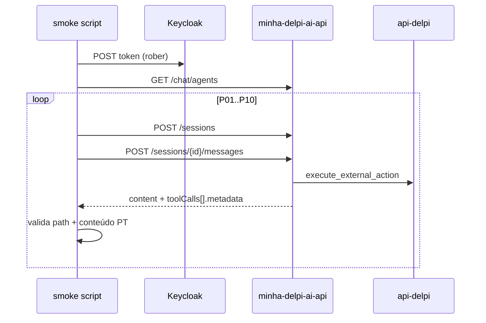

# Smoke E2E — inteligência operacional (10 perguntas)

Validação automatizada do roteamento operacional do chat Minha DELPI: cada cenário envia uma pergunta real via API HTTP, verifica a rota `api-delpi` na tool `execute_external_action` e confirma que a resposta não vaza erros técnicos nem cai em desambiguação indevida.

## Pré-requisitos

| Item | Valor |
|------|--------|
| Gateway | `http://localhost` (porta 80) ou `http://delpi-gateway` na rede Docker |
| Keycloak | realm `delpi`, client `delpi-central` |
| Usuário de teste | `rober` / `1234` |
| API do chat | container `delpi-minha-delpi-ai-api` no ar |
| Provider | agente com actions `api-delpi` ou `api-externa` habilitado |

Após alterar código Python da API em dev (volume bind):

```bash
docker compose -f infra/docker-compose.dev.yml restart minha-delpi-ai-api
```

## Execução

```bash
# Host (WSL / máquina com gateway na porta 80)
python3 minha-delpi-ai-api/scripts/smoke_operational_intelligence_e2e.py

# Container
docker exec delpi-minha-delpi-ai-api python scripts/smoke_operational_intelligence_e2e.py
```

### Variáveis de ambiente

| Variável | Padrão | Descrição |
|----------|--------|-----------|
| `SMOKE_BASE_URL` | `http://localhost` | URL do gateway |
| `SMOKE_USER` | `rober` | Usuário Keycloak |
| `SMOKE_PASSWORD` | `1234` | Senha |
| `SMOKE_CHAT_PREFIX` | `/apps/minha-delpi-ai/api/chat` | Prefixo da API do chat |
| `SMOKE_PAUSE_SEC` | `2` | Pausa entre cenários (evita HTTP 429) |

## Cenários (P01–P10)

| ID | Domínio | Pergunta | Rota esperada |
|----|---------|----------|---------------|
| P01 | Faturamento produto | Quanto já foi faturado do produto 90260015? | `/products/…/sales/billing` |
| P02 | Status fabril | Qual o status completo na fábrica do produto 90269002 hoje? | `/products/…/factory-status` |
| P03 | ROL | Qual foi o ROL da empresa em março de 2026? | `/financial/rol` |
| P04 | Estoque | Qual o saldo disponível do produto 10080033 na filial 01? | `/products/…/stock` |
| P05 | Estrutura | mostre a estrutura do produto 90260123 | `/products/…/structure` |
| P06 | CPV | Qual o CPV da empresa? | `/supplies/cpv` |
| P07 | Fornecedores | quem fornece o produto 10080022? | `/products/…/suppliers` |
| P08 | Where-used | onde é usado o produto 90260149? | `/products/…/parents` |
| P09 | Compras | mostre as compras do produto 90260015 | `/products/…/purchases` |
| P10 | PMR | Qual o PMR da empresa? | `/financial/pmr` |

## Critérios de OK / FAIL

**OK** quando, para cada cenário:

1. Existe tool `execute_external_action` com `metadata.ok == true`.
2. `metadata.path` contém o fragmento esperado (ex.: `/financial/rol`).
3. Texto avaliável em PT: `response.content` **ou** linhas de `metadata.humanizedSummary`.
4. Sem marcadores de desambiguação (`escolha uma opção`, …).
5. Sem vazamento técnico (`traceback`, `got multiple values for argument`, …).
6. KPIs financeiros (P03): contém indicador em PT (`receita bruta`, `ROL`, `R$`); sem glossário em inglês.

**FAIL** em qualquer violação acima ou exceção HTTP (401, 429, 5xx).

## Fluxo interno do script



## Regressão unitária relacionada

```bash
docker exec delpi-minha-delpi-ai-api pytest \
  tests/unit/domain/services/test_external_action_result_presenter_api_delpi_profiles.py \
  tests/unit/domain/services/test_chat_intent_router_service.py -q
```

## Histórico de descobertas

| Data | Achado | Correção |
|------|--------|----------|
| 2026-06 | CPV/pricing: `TypeError` em `_presenter_text` com placeholder `{key}` | Parâmetro renomeado para `text_key` |
| 2026-06 | ROL: `content` vazio mas `humanizedSummary.linhas` preenchido | Script lê `_effective_content()` |
| 2026-06 | HTTP 429 em rajada | `SMOKE_PAUSE_SEC` entre turnos |

## Referências

- Checklist manual amplo: [`smoke-operacional-manual.md`](smoke-operacional-manual.md)
- Script legado (preparação multi-turno): `scripts/smoke_operational_questions.py`
- Arquitetura do pipeline: [`../architecture/chat-intelligence-base.md`](../architecture/chat-intelligence-base.md)
