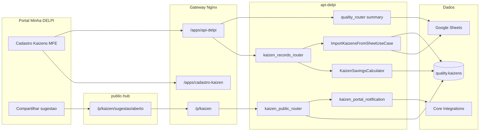

# Cadastro de Kaizens — documentação técnica

Complemento ao [README do plugin](../README.md). Foco em fluxos, contratos e decisões de arquitetura.

## 1. Objetivo

Substituir o cadastro manual em planilha Google Sheets por um fluxo operacional na plataforma Minha DELPI, com:

- Persistência em PostgreSQL (schema `quality`)
- Formulário validado (filial, status, tipos de economia)
- Importação controlada da planilha legada via API (sem scripts offline)
- Permissões RBAC dedicadas (`cadastro-kaizen.view` / `cadastro-kaizen.manage` / `cadastro-kaizen.notify-suggestions`)
- Canal público de sugestão (public-hub + `POST /public/kaizen/suggestions`)

A leitura para **indicadores estratégicos** e **dashboard-quality** permanece na planilha (`GET /quality/kaizens/summary`) até evolução planejada.

## 2. Diagrama de fluxo



## 3. Contrato HTTP — cadastro (`/quality/kaizens/records`)

Todas as respostas usam envelope padrão api-delpi (`success`, `data`, `meta`, `message`).

### GET — listagem

Query params:

| Parâmetro | Tipo | Descrição |
|-----------|------|-----------|
| `branch` | `01` \| `02` | Filial |
| `status` | enum | `recebido`, `aprovado`, `implantado`, `descontinuado`, `cancelado` |
| `savings_type` | enum | `tempo`, `material`, … |
| `title` | string | Busca parcial (ILIKE) |
| `date_start`, `date_end` | ISO date | Filtro em `date_implemented` |
| `page`, `page_size` | int | Paginação (máx. 200) |

`meta.operationId`: `list_kaizen_records` · `meta.shape`: `paged_list`

### POST — criar

Body JSON (campos principais):

```json
{
  "branch_code": "01",
  "title": "App resina CT-16",
  "accountable": "Ossamu",
  "sector": "Produção",
  "investment": 620,
  "seconds_per_occurrence": 1015.96,
  "occurrences_per_day": 0.21,
  "hourly_cost": 127.16,
  "status": "implantado",
  "date_idea_received": "2026-07-01",
  "date_implemented": "2026-01-16",
  "categories": ["Produção", "Segurança"]
}
```

Se `savings_type` for omitido, a API infere (`tempo`, `material`, `financeiro`, `qualitativo` ou `misto`) e recalcula `daily_savings` / `annual_savings`.

### POST — import-from-sheet

Body opcional:

```json
{ "dry_run": false }
```

Resposta `data`:

```json
{
  "created": 19,
  "skipped": 2,
  "errors": 0,
  "items": [
    {
      "sheet_id": "01-16/01/2026-App resina CT-16",
      "title": "App resina CT-16",
      "result": "skipped",
      "reason": "already_exists"
    }
  ]
}
```

`meta.operationId`: `import_kaizens_from_sheet`

Regras de deduplicação na importação: `branch_code` + `title` + `date_implemented`.

Mapeamento planilha → Postgres: `KaizenSheetImportMapper` (status normalizado, data `DD/MM/YYYY` → ISO).

## 4. Tipos de economia

| Tipo | Entradas | Fórmula `daily_savings` |
|------|----------|-------------------------|
| `tempo` | segundos/ocorrência, ocorrências/dia, custo/hora | `(s×o/3600) × custo_hora` |
| `material` | qtd economizada/dia, custo unitário | `qtd × custo_unit` |
| `financeiro` | economia fixa/dia | valor fixo |
| `qualitativo` | — | `null` |
| `misto` | combinação | soma das partes preenchidas |

### 4.1 Economia realizada

Campos `realized_daily_savings` e `realized_annual_savings` (migration `V032`) registram medição pós-implantação.

Quando **não informados**, a API e o painel usam **fallback para a estimativa calculada** (`resolve_realized_daily_savings` / `resolve_realized_annual_savings` em `kaizen_savings_calculator.py`) — evita exibir R$ 0 quando há parâmetros de economia preenchidos.

A **validade de 1 ano** dos ganhos financeiros usa sempre `date_implemented` (`kaizen_savings_validity.py`), independentemente de haver medição realizada.

## 5. Datas e vigência

| Campo | Uso |
|-------|-----|
| `date_idea_received` | Recebimento/registro da ideia (V035). Opcional. |
| `date_committee_approved` | Aprovação no comitê (V042). Obrigatória se `status = aprovado`. âncora preferencial do indicador de quantidade. |
| `date_implemented` | **Data de implantação** — início da operação, validade de 1 ano da economia e vigência da revisão implantada. Obrigatória se `status = implantado`. |
| `date_discontinued` | Fim da operação; interrompe contabilização. |

**Regra unificada (jul/2026):** o usuário informa **Data implantação** no Estágio. Internamente, `effective_from` da revisão espelha `date_implemented` (`kaizen_revision_service.resolve_effective_from`). O body legado `effective_from` no PUT é ignorado. Ao implantar rascunho (`POST .../implement`), a API lê `date_implemented` do snapshot da versão.

**Status Aprovado (jul/2026):** `aprovado` exige `date_committee_approved`. Conta no KPI de quantidade (`COALESCE(date_committee_approved, date_implemented)`), mas **não** nos ganhos financeiros (só `implantado`). Validação em `kaizen_status_date_rules` (API) e espelho no MFE.

**Status Recebido (jul/2026):** renomeação de `em_andamento` → `recebido` (migration V043). Status inicial do formulário público e de novos registros. **Não** conta quantidade mensal nem ganhos (`kaizen_indicator_eligibility`). Pipeline operacional: `recebido` → `aprovado` → `implantado`.

Timeline de versões exibe «Implantação: … → …» a partir de `effective_from` (sincronizado com `date_implemented`).

## 6. Categorias

Migration `V036`: coluna `categories TEXT[]` (substitui uso exclusivo de `category` string).

- Normalização: `kaizen_categories.normalize_categories` (trim, dedupe, legado `category` → array).
- UI: `CategoryMultiSelectField` com `createDashboardCreatableMultiSelectField`; categorias customizadas em `localStorage` (`delpi-kaizen-custom-categories`).
- `category` (singular) permanece como primeiro item do array (compatibilidade).

## 7. MFE — integração com o Portal

- **Manifesto:** `cadastro-kaizen.manifest.json`
- **Federation:** expõe `./App` via `remoteEntry.js`
- **Header obrigatório:** `X-Delpi-Caller-App: cadastro-kaizen`
- **Auth:** Bearer JWT do Keycloak (mesmo fluxo dos demais plugins)

O `httpClient.ts` centraliza token (via `configureHttpClient` no bootstrap) e tratamento de erros do envelope.

### 7.1 Camada UI (`@delpi/plugin-ui`)

Formulários, filtros, KPIs, tabelas e seções usam wrappers finos em `src/components/ui/` sobre [`@delpi/plugin-ui`](../../plugin-ui/README.md) (prefixo BEM `kz`). Textos de ajuda permanecem em `src/content/helpTooltips.ts`.

Detalhes, mapa de wrappers e checklist para novos campos: **[UI-PLUGIN-UI.md](./UI-PLUGIN-UI.md)**.

## 8. Variáveis de ambiente

| Variável | Uso |
|----------|-----|
| `QUALITY_SHEET_ID` | ID da planilha Google (import / summary Sheets) |
| `QUALITY_KAIZEN_SHEET_GID` | Aba kaizen |
| `GOOGLE_SHEETS_TIMEOUT` | Timeout do client HTTP |
| `KAIZEN_NOTIFICATIONS_ENABLED` | Liga/desliga notificações de sugestão pública (default `true`) |
| `CORE_API_BASE_URL` | Base do Core para Integrations |
| `CORE_API_INTEGRATIONS_SERVICE_TOKEN` | Bearer do serviço de notificações |
| `RUN_PLUGINS_MIGRATIONS_ON_STARTUP` | Aplica V0xx do schema `quality` no boot |

Definidas em `infra/.env` e repassadas ao container `delpi-api-delpi`.

## 8.1 Sugestão pública

| Item | Detalhe |
|------|---------|
| Rota | `POST /public/kaizen/suggestions` |
| Auth | Nenhuma (prefixo público no middleware) |
| Router | `kaizen_public_router.py` |
| Mapper | `kaizen_public_suggestion_mapper.build_suggestion_record_fields` |
| Status | Sempre `recebido` |
| Notificação | `notify_public_suggestion_created` → Core `/integrations/notifications` com `permissionCodes: [cadastro-kaizen.notify-suggestions]` |
| UI | public-hub `apps/kaizen` — wizard 2 etapas + % preenchimento + tela de conclusão |
| Compartilhar | Modal no MFE: QR (api.qrserver.com), copiar link, **Exportar PNG** (`downloadKaizenSuggestionQrPng`, 512×512) |

Body (campos obrigatórios):

```json
{
  "proposer_name": "Maria Silva",
  "sector": "Produtivo",
  "employee_registration": "12345",
  "work_center_or_location": "CT-16",
  "problem_description": "Descrição do problema (mín. 5).",
  "proposed_solution": "Solução proposta (mín. 5).",
  "branch_code": "01",
  "website": ""
}
```

`website` é honeypot: se preenchido, a API responde sucesso falso sem gravar.

`meta.operationId`: `create_public_kaizen_suggestion`

Catálogo de notificação: Core `notification_catalog.json` categoria `cadastro_kaizen` (+ espelho no portal).

## 9. Revisões, versões e rotas estendidas

Implementado (migrations `V029`–`V034`, rotas em `kaizen_records_router.py`):

| Rota | Descrição |
|------|-----------|
| `GET /records/{id}/revisions` | Lista revisões/snapshots |
| `GET /records/{id}/at?date=` | Estado vigente em uma data |
| `POST/PUT/DELETE /records/{id}/versions/{n}` | Ciclo de vida (rascunho → implantar) |
| `POST /records/{id}/versions/{n}/implement` | Torna versão ativa (usa `date_implemented` do snapshot) |
| `GET /records/{id}/savings-timeline` | Ganhos por segmento de vigência |
| `GET/POST/DELETE /records/{id}/evidences` | Evidências (volume persistente) |
| `GET /records/{id}/history`, `/audit-log` | Trilhas operacional e governança |

Edição inline na ficha ativa = **correção** da versão vigente (não cria revisão nova). Nova melhoria = **Nova versão** (clone em rascunho) + **Salvar e tornar ativa**.

PUT aceita `change_reason` (auditoria). Campo `effective_from` no body é **legado** — vigência deriva de `date_implemented`.

Especificação de cálculo temporal para dashboard: [ESPECIFICACAO-REVISOES.md](../../../docs/12-roadmap-e-volucao/cadastro-kaizen/ESPECIFICACAO-REVISOES.md).

## 10. Evolução planejada

Ver [ROADMAP.md](./ROADMAP.md) e documento canônico [docs/12-roadmap-e-volucao/cadastro-kaizen/ROADMAP.md](../../../docs/12-roadmap-e-volucao/cadastro-kaizen/ROADMAP.md) (Fases 4–10).

Resumo dos próximos passos:

1. **Fase 4** — Registro Core API, RBAC, go-live staging/prod
2. **Fase 5** — Scripts CI/homologação (`check-cadastro-kaizen.sh`)
3. **Fase 6b/6c** — `summary` Postgres com cálculo temporal — ver [ESPECIFICACAO-REVISOES.md](../../../docs/12-roadmap-e-volucao/cadastro-kaizen/ESPECIFICACAO-REVISOES.md)
4. **Fases 7–9** — Dashboard, agente chat, cutover planilha
5. **Fase 10** — Export em massa de registros (backlog; export PNG do QR de sugestão já entregue)

Status detalhado: [status-atual.md](../../../docs/12-roadmap-e-volucao/cadastro-kaizen/status-atual.md).

## 11. Testes automatizados

```bash
cd api-delpi
PYTHONPATH="../shared:.:." pytest \
  tests/unit/test_kaizen_savings_calculator.py \
  tests/unit/test_kaizen_revision_service.py \
  tests/unit/test_kaizen_status_and_indicators.py \
  tests/unit/test_kaizen_public_suggestion_mapper.py \
  tests/unit/test_kaizen_portal_notification_service.py \
  tests/unit/test_import_kaizens_from_sheet_use_case.py \
  tests/test_route_meta_smoke.py -k "kaizen" -q

cd plugins/cadastro-kaizen
npm run ci

cd plugins/public-hub
npx vite build
```
