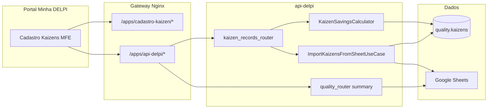

# Cadastro de Kaizens — documentação técnica

Complemento ao [README do plugin](../README.md). Foco em fluxos, contratos e decisões de arquitetura.

## 1. Objetivo

Substituir o cadastro manual em planilha Google Sheets por um fluxo operacional na plataforma Minha DELPI, com:

- Persistência em PostgreSQL (schema `quality`)
- Formulário validado (filial, status, tipos de economia)
- Importação controlada da planilha legada via API (sem scripts offline)
- Permissões RBAC dedicadas (`cadastro-kaizen.view` / `cadastro-kaizen.manage`)

A leitura para **indicadores estratégicos** e **dashboard-quality** permanece na planilha (`GET /quality/kaizens/summary`) até evolução planejada.

## 2. Diagrama de fluxo



## 3. Contrato HTTP — cadastro (`/quality/kaizens/records`)

Todas as respostas usam envelope padrão api-delpi (`success`, `data`, `meta`, `message`).

### GET — listagem

Query params:

| Parâmetro | Tipo | Descrição |
|-----------|------|-----------|
| `branch` | `01` \| `02` | Filial |
| `status` | enum | `em_andamento`, `implantado`, … |
| `savings_type` | enum | `tempo`, `material`, … |
| `title` | string | Busca parcial (ILIKE) |
| `date_start`, `date_end` | ISO date | Filtro em `date_implemented` |
| `page`, `page_size` | int | Paginação (máx. 200) |

`meta.operationId`: `list_kaizen_records` · `meta.shape`: `paged_list`

### POST — criar

Body JSON (campos principais):

```json
{
  "branch_code": "01",
  "title": "App resina CT-16",
  "accountable": "Ossamu",
  "sector": "Produção",
  "investment": 620,
  "seconds_per_occurrence": 1015.96,
  "occurrences_per_day": 0.21,
  "hourly_cost": 127.16,
  "status": "implantado",
  "date_implemented": "2026-01-16"
}
```

Se `savings_type` for omitido, a API infere (`tempo`, `material`, `financeiro`, `qualitativo` ou `misto`) e recalcula `daily_savings` / `annual_savings`.

### POST — import-from-sheet

Body opcional:

```json
{ "dry_run": false }
```

Resposta `data`:

```json
{
  "created": 19,
  "skipped": 2,
  "errors": 0,
  "items": [
    {
      "sheet_id": "01-16/01/2026-App resina CT-16",
      "title": "App resina CT-16",
      "result": "skipped",
      "reason": "already_exists"
    }
  ]
}
```

`meta.operationId`: `import_kaizens_from_sheet`

Regras de deduplicação na importação: `branch_code` + `title` + `date_implemented`.

Mapeamento planilha → Postgres: `KaizenSheetImportMapper` (status normalizado, data `DD/MM/YYYY` → ISO).

## 4. Tipos de economia

| Tipo | Entradas | Fórmula `daily_savings` |
|------|----------|-------------------------|
| `tempo` | segundos/ocorrência, ocorrências/dia, custo/hora | `(s×o/3600) × custo_hora` |
| `material` | qtd economizada/dia, custo unitário | `qtd × custo_unit` |
| `financeiro` | economia fixa/dia | valor fixo |
| `qualitativo` | — | `null` |
| `misto` | combinação | soma das partes preenchidas |

## 5. MFE — integração com o Portal

- **Manifesto:** `cadastro-kaizen.manifest.json`
- **Federation:** expõe `./App` via `remoteEntry.js`
- **Header obrigatório:** `X-Delpi-Caller-App: cadastro-kaizen`
- **Auth:** Bearer JWT do Keycloak (mesmo fluxo dos demais plugins)

O `httpClient.ts` centraliza token (via `configureHttpClient` no bootstrap) e tratamento de erros do envelope.

## 6. Variáveis de ambiente (planilha — importação e dashboard)

| Variável | Uso |
|----------|-----|
| `QUALITY_SHEET_ID` | ID da planilha Google |
| `QUALITY_KAIZEN_SHEET_GID` | Aba kaizen |
| `GOOGLE_SHEETS_TIMEOUT` | Timeout do client HTTP |

Definidas em `infra/.env` e repassadas ao container `delpi-api-delpi`.

## 7. Evolução planejada

Ver [ROADMAP.md](./ROADMAP.md) e documento canônico [docs/12-roadmap-e-volucao/cadastro-kaizen/ROADMAP.md](../../../docs/12-roadmap-e-volucao/cadastro-kaizen/ROADMAP.md) (Fases 4–10).

Resumo dos próximos passos:

1. **Fase 4** — Registro Core API, RBAC, go-live staging/prod
2. **Fase 5** — Scripts CI/homologação (`check-cadastro-kaizen.sh`)
3. **Fase 6** — Migrar `GET /quality/kaizens/summary` para Postgres
4. **Fases 7–9** — Dashboard, agente chat, cutover planilha
5. **Fase 10** — Export, auditoria, anexos (backlog)

## 8. Testes automatizados

```bash
cd api-delpi
PYTHONPATH="../shared:.:." pytest \
  tests/unit/test_kaizen_savings_calculator.py \
  tests/unit/test_import_kaizens_from_sheet_use_case.py \
  tests/test_route_meta_smoke.py -k "kaizen" -q

cd plugins/cadastro-kaizen
npm run ci
```
