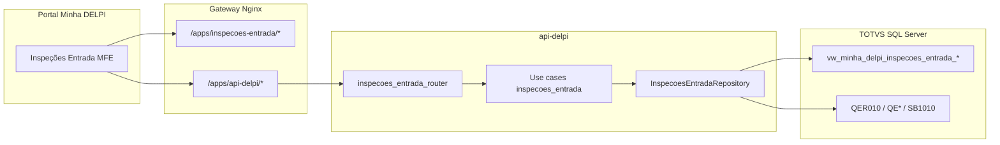

# Inspeções de Entrada — documentação técnica

Complemento ao [README do plugin](../README.md). Foco em fluxos, contratos e decisões de arquitetura.

## 1. Objetivo

Oferecer à equipe de qualidade e recebimento um painel operacional na plataforma Minha DELPI para:

- Monitorar **pendências** de inspeção de entrada por filial;
- Visualizar **KPIs** (taxa de aprovação, tempo médio de laudo);
- Identificar **gargalos por fornecedor** e **rejeições recentes**;
- Consultar **histórico** filtrado com detalhe de ensaios e impressão de certificado de qualidade.

Fonte de dados: **TOTVS Protheus** (views dedicadas + tabelas de ensaio QER/QE*).

## 2. Diagrama de fluxo



## 3. Contrato HTTP

Base no gateway: `/apps/api-delpi/inspecoes-entrada`

Todas as respostas de sucesso usam envelope padrão api-delpi (`success`, `data`, `meta`, `message`).

Parâmetro comum obrigatório:

| Parâmetro | Tipo | Descrição |
|-----------|------|-----------|
| `branch` | `01` \| `02` | Filial Protheus |

### GET `/resumo`

`meta.operationId`: `get_inspecoes_entrada_resumo` · `meta.shape`: `scalar`

Campos principais em `data`:

| Campo API | Origem view | Descrição |
|-----------|-------------|-----------|
| `pending_inspections` | `Inspecoes_Pendentes` | Aguardando laudo |
| `inspected` | `Ja_Inspecionados` | Total já inspecionados |
| `approved_inspections` | `Inspecoes_Aprovadas` | Aprovadas |
| `rejected_inspections` | `Inspecoes_Rejeitadas` | Rejeitadas |
| `approval_rate` | `Taxa_Aprovacao` | Percentual |
| `average_time_hours` / `average_time_days` | Tempo médio laudo | Apenas inspeções com tempo calculado |

### GET `/pendentes`

| Query | Tipo | Default | Descrição |
|-------|------|---------|-----------|
| `page` | int | 1 | Página |
| `page_size` | int | 50 (máx. 200) | Itens por página |

`meta.operationId`: `get_inspecoes_entrada_pendentes` · `meta.shape`: `paged_list`

Ordenação: data/hora de recebimento ascendente (FIFO operacional).

Enriquecimento: descrição do produto via `SB1010` (`product_description`).

### GET `/pendentes-fornecedor`

`meta.operationId`: `get_inspecoes_entrada_pendentes_fornecedor` · `meta.shape`: `list`

Retorna ranking por `pending_count` descendente + totais (`total_suppliers`, `total_pending`).

### GET `/rejeitadas-ensaiador`

`meta.operationId`: `get_inspecoes_entrada_rejeitadas_ensaiador` · `meta.shape`: `list`

Agregação por ensaiador (`rejected_count`). **Implementado na API; consumo no MFE previsto para fase futura.**

### GET `/rejeitadas-produto`

| Query | Default | Descrição |
|-------|---------|-----------|
| `limit` | 50 (máx. 200) | Quantidade de rejeições recentes |

`meta.operationId`: `get_inspecoes_entrada_rejeitadas_produto` · `meta.shape`: `list`

Filtra `Resultado_Resumo = 'REJEITADA'` na view de histórico; ordenação por data do laudo descendente.

### GET `/historico`

| Query | Descrição |
|-------|-----------|
| `page`, `page_size` | Paginação (máx. 200) |
| `result` | `APROVADA` ou `REJEITADA` |
| `date_from`, `date_to` | Intervalo em `Data_Laudo` (ISO date) |
| `supplier` | Busca parcial ILIKE em `Nome_Fornecedor` |
| `product_code` | Match exato (case-insensitive) |
| `inspector` | Busca parcial em `Nome_Ensaiador` |
| `invoice_number` | NF exata |
| `lot` | Lote exato |

`meta.operationId`: `get_inspecoes_entrada_historico` · `meta.shape`: `paged_list`

Resposta inclui `filters` ecoando os filtros aplicados.

### GET `/historico/detalhe`

| Query | Obrigatório | Descrição |
|-------|-------------|-----------|
| `inspection_id` | Sim | Chave composta da inspeção (`Id_Inspecao` na view) |

`meta.operationId`: `get_inspecoes_entrada_historico_detalhe` · `meta.shape`: `composite_analysis`

Estrutura `data`:

```json
{
  "branch": "01",
  "inspection_id": "01|...",
  "summary": { },
  "tests": [ ],
  "totals": {
    "tests_count": 0,
    "approved_tests_count": 0,
    "failed_tests_count": 0
  }
}
```

Ensaios carregados de `QER010` com joins em `QE1`, `QE7`, `QE8`, `QEQ`, `QES`, `QAA`. Medição preferencial: `QES` (numérica) → `QEQ` (textual).

Erro `404` com `code: INSPECAO_NOT_FOUND` quando o ID não existe na filial.

## 4. RBAC por filial

| Permissão manifesto | Filial |
|---------------------|--------|
| `inspecoes-entrada.view.filial-01` | `01` (SC) |
| `inspecoes-entrada.view.filial-02` | `02` (ES) |
| `inspecoes-entrada.view` | Ambas |
| `api-delpi.access` | Ambas (legado) |

Superadmin ignora restrição de filial. Demais usuários recebem `403` ao consultar filial sem permissão correspondente.

## 5. MFE — integração com o Portal

- **Manifesto:** `inspecoes-entrada.manifest.json`
- **Federation:** expõe `./App` via `remoteEntry.js` (`vite.config.ts`)
- **Header obrigatório:** `X-Delpi-Caller-App: inspecoes-entrada`
- **Auth:** Bearer JWT do Keycloak (via `configureHttpClient` no bootstrap)
- **Design system:** classes prefixo `ie-`, root `dashboard-inspecoes-entrada dashboard-page` (tokens do portal)

### Abas e URL

| Aba | Query | Conteúdo |
|-----|-------|----------|
| Visão geral | (default) | KPIs, fornecedores, rejeitadas, tabela pendências |
| Histórico | `?tab=historico` | Filtros, tabela paginada, modal detalhe |

Botão **Atualizar** no header incrementa `refreshToken` e recarrega a aba ativa.

### Detalhe e certificado

`HistoricoDetailModal` carrega `/historico/detalhe` sob demanda. Ação **Imprimir certificado** usa `qualityCertificatePrint.ts` (janela de impressão HTML).

## 6. Backend — clean architecture

| Camada | Artefatos |
|--------|-----------|
| Interface | `inspecoes_entrada_router.py` |
| Application | Use cases + DTOs em `app/application/use_cases|dto/inspecoes_entrada/` |
| Domain | `InspecoesEntradaRepositoryPort` |
| Infrastructure | `InspecoesEntradaRepository` |
| Composition | `inspecoes_entrada_composer.py` |

Registro de contratos: `route_contract_registry.py` (entity + shape por `operationId`).

## 7. Validação TOTVS (Fase 0)

Script: `api-delpi/scripts/validate_inspecoes_entrada_views.py`

Views validadas:

- `dbo.vw_minha_delpi_inspecoes_entrada_resumo_filial`
- `dbo.vw_minha_delpi_inspecoes_entrada_pendentes`
- `dbo.vw_minha_delpi_inspecoes_entrada_pendentes_fornecedor`
- `dbo.vw_minha_delpi_inspecoes_entrada_rejeitadas_ensaiador`
- `dbo.vw_minha_delpi_inspecoes_entrada_historico_tela`

Ver [FASE0-VALIDACAO.md](../../../docs/12-roadmap-e-evolucao/inspecoes-entrada/FASE0-VALIDACAO.md).

## 8. Testes automatizados

```bash
cd api-delpi
PYTHONPATH="../shared:.:." pytest tests/test_inspecoes_entrada_* \
  tests/test_route_meta_smoke.py -k "inspecoes_entrada" -q

cd plugins/inspecoes-entrada
npm run ci
```

## 9. Evolução planejada

Ver [ROADMAP.md](../../../docs/12-roadmap-e-volucao/inspecoes-entrada/ROADMAP.md).

Resumo:

1. Registro Core API + RBAC em staging/prod
2. Script CI/homologação (`check-inspecoes-entrada.sh`)
3. UI para rejeitadas por ensaiador
4. Integração chat (rotas operacionais + perfil apresentação)
5. Exportação Excel do histórico
