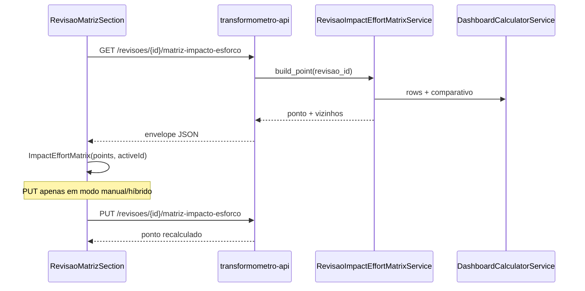

# Wireframe — Matriz impacto × esforço (Transformômetro)

**Playbook:** [PLAYBOOK-21](../../../../docs/12-roadmap-e-evolucao/transformometro-app/PLAYBOOK-21-matriz-impacto-esforco-revisao.md)  
**Componente:** `@delpi/plugin-ui` → `ImpactEffortMatrix`

---

## 1. Cadastro da revisão (`RevisaoCadastroPanel`)

Nova seção **abaixo** do toolbar de ativação e **acima** de vigência/medição (visível para revisões comparáveis; oculta para baseline).

```
┌─────────────────────────────────────────────────────────────────────────────┐
│ [← Lista]  Pesquisar…                                                       │
│ PROC-0001 · Acompanhamento de refugo                                        │
│   … › Melhorias › Todas as unidades › v1.1.0 · Melhoria  ◀ ativo           │
├─────────────────────────────────────────────────────────────────────────────┤
│                                                                             │
│  v1.1.0 · Melhoria de processo                          [ativa] [Excluir]   │
│  ─────────────────────────────────────────────────────────────────────────  │
│  Visualizando: Robério Oliveira                                             │
│                                                                             │
│  ┌─ Matriz impacto × esforço ──────────────────────────────── [?] ─────┐ │
│  │ Modo: (•) Automático  ( ) Híbrido  ( ) Manual          Confiança: Alta │ │
│  │                                                                       │ │
│  │  Impacto ▲                                                            │ │
│  │     100 ┤                    ┌ Estratégicos ─────────────┐            │ │
│  │         │                    │                           │            │ │
│  │      50 ┼──────── Quick wins │         Reavaliar         │            │ │
│  │         │                    │                           │            │ │
│  │       0 ┤ Complementares ────┴───────────────────────────┘            │ │
│  │         └──────────────────────────────────────────────► Esforço    │ │
│  │              0              50                         100          │ │
│  │                                                                       │ │
│  │     ● v1.1.0 (você)    ○ v1.0.0                                       │ │
│  │                                                                       │ │
│  │  Impacto 72 · Esforço 41 · Quick win                                  │ │
│  │  Economia líquida anual R$ 188.784 · ROI 2,4× · Payback 8 meses       │ │
│  │                                                                       │ │
│  │  [▼ Ajustes manuais]  (colapsado se modo Automático)                  │ │
│  │    Alinhamento estratégico  [1][2][3][4][5]                            │ │
│  │    Dependências externas    [1][2][3][4][5]                            │ │
│  │    Pessoas afetadas         [____120____]                              │ │
│  │    Observação               [________________________]                 │ │
│  │                              [Salvar ajustes]                          │ │
│  └───────────────────────────────────────────────────────────────────────┘ │
│                                                                             │
│  ┌─ Vigência e identificação ───────────────────────────────── [Editar] ─┐ │
│  │ …                                                                     │ │
│  └───────────────────────────────────────────────────────────────────────┘ │
│  ┌─ Medição operacional ───────────────────────────────────── [Editar] ─┐ │
│  …                                                                          │
└─────────────────────────────────────────────────────────────────────────────┘
```

### Comportamento

| Estado | UI |
|--------|-----|
| Carregando | Skeleton dentro do `ChartCard` |
| `confianca = baixa` | Banner âmbar «Complete medição e investimentos para score automático» |
| `rateio_excede_ganho` | Chip vermelho ao lado do título (reusa diagnóstico existente) |
| Clique em outro ponto (`vizinhos`) | Navega para `/revisoes/{id}` com transição workspace |
| Modo Automático | Colapsa «Ajustes manuais»; PUT só ao salvar em Híbrido/Manual |

---

## 2. Detalhe da instância (melhoria)

Scatter **todas** as revisões da instância + tabela ranking.

```
┌─ Priorização das revisões — Todas as unidades ─────────────────────────────┐
│  [ImpactEffortMatrix — mesmos pontos que API instancia]                     │
│                                                                             │
│  Versão      Cenário    Impacto  Esforço  Quadrante    Líquida anual  Ativa │
│  v1.1.0      Melhoria      72      41    Quick win    R$ 188.784     ●    │
│  v1.0.0      Baseline       —       —    (referência)        —         ○    │
└─────────────────────────────────────────────────────────────────────────────┘
```

Baseline na tabela com traço; opcionalmente ponto cinza `(0,0)` no gráfico se `incluir_baseline=true`.

---

## 3. Árvore do workspace (sidebar)

Badge colorido no nó `revisao:{id}` (não no texto inteiro — só pill à direita).

```
Melhorias                                           1
  Todas as unidades                                 2
    v1.1.0 · Melhoria de p…              [QW]  ◀── quick_win = verde
    v1.0.0 · Linha de base…              [—]   ◀── baseline = neutro
```

| `quadrante` | Cor token |
|-------------|-----------|
| `quick_win` | `--ds-success` |
| `strategic` | `--ds-accent` |
| `fill_in` | `--ds-text-muted` |
| `rethink` | `--ds-warning` |

Tooltip no badge: «Impacto 72 · Esforço 41 · Quick win».

---

## 4. Fluxo de dados (MFE)



---

## 5. Arquivos MFE (implementação S3–S4)

| Arquivo | Papel |
|---------|-------|
| `src/data/api/transformometroMatrixApi.ts` | GET/PUT matriz |
| `src/ui/revisao/RevisaoMatrizImpactoSection.tsx` | Seção cadastro |
| `src/ui/instancia/InstanciaMatrizRevisoesSection.tsx` | Scatter instância |
| `src/ui/processos/processoWorkspaceNav.ts` | Badge `quadrante` no nó revisão |
| `src/content/helpTooltips.ts` | `matriz.modo`, `matriz.quadrantes`, … |
| `src/index.css` | `.tm-impact-effort-matrix__*` (import plugin-ui base) |

---

## 6. Acessibilidade

- Scatter: `role="img"` + `aria-label` com resumo «Matriz impacto por esforço, N revisões»
- Pontos focáveis (`button` ou `role="button"`) — Enter navega para revisão
- Legenda: lista `ul` com quadrantes nomeados (não só cor)
