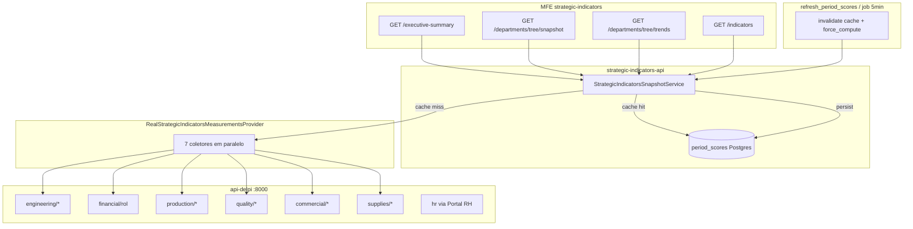

# Mapa de gargalos — Strategic Indicators × api-delpi

Documento de referência para otimização (refresh `period_scores`, leituras do painel e timeout 524 no gateway).

**Evidência (histórica):** log de `refresh_period_scores.py --competence 2026-05` com `trends_months=3`, `per_department=false` (2026-05-28, produção). Default atual: **YTD** (início do ano até a competência); env `SI_PERIOD_SCORES_REFRESH_TRENDS_MONTHS` só como override.

**Marco crítico no log:**

```text
si_measurements_loaded competence=2026-03 department_id=None branch=None items=28 errors=0 ms=352703
si_measurements_loaded competence=2026-05 department_id=None branch=None items=28 errors=0 ms=371792
```

Só o carregamento de medições do escopo **consolidado**, para **um** bloco de períodos, levou **~6 minutos**. O refresh repete isso para **3 filiais** (`consolidado`, `01`, `02`).

---

## 1. Fluxo (onde o tempo some)



| Camada | Quando é rápido | Quando é lento |
|--------|-----------------|----------------|
| Leitura SI (Grupo A/B) | `period_scores` + hash do catálogo OK | `force_compute` ou cache vazio |
| Refresh / cold start | — | Sempre recalcula + invalida Postgres |
| api-delpi | Resposta &lt; 1s | TOTVS/planilhas/consultas pesadas |

---

## 2. Rotas SI (painel) → carga interna

| Rota SI (GET) | Use case | Carga no snapshot | Períodos típicos |
|---------------|----------|-------------------|------------------|
| `/executive-summary` | `GetStrategicIndicatorsExecutiveSummaryRealUseCase` | `get_current_and_previous_snapshot` | 2 |
| `/departments` | `GetStrategicIndicatorsDepartmentsRealUseCase` | idem | 2 |
| `/departments/tree/snapshot` | `GetDepartmentsTreeSnapshotUseCase` | idem × escopos (1 ou 3 filiais) | 2 × escopos |
| `/departments/tree/trends` | `GetDepartmentsTreeTrendsUseCase` | `get_series_snapshot_optimized` | `months` (3–6) × escopos |
| `/indicators` | `GetStrategicIndicatorsUseCase` | comparativo | 2 |
| `/trends` | `GetStrategicIndicatorsTrendsRealUseCase` | série otimizada | N meses |
| `refresh_period_scores` (script/job) | `refresh_period_scores_materialized` | `get_series_snapshot_optimized` + **`force_compute=True`** | `trends_months` × **3 filiais** |

---

## 3. Rotas api-delpi — classificação (log 2026-05-28)

Legenda de prioridade:

- **P0** — latência alta ou chamada em excesso; maior impacto no refresh.
- **P1** — volume alto ou duplicação clara.
- **P2** — costuma ser rápida; manter no radar.

### P0 — latência alta (estimada pelo log)

| Rota api-delpi | Dept SI | Chamadas SI por mês/filial* | Observação no log |
|----------------|---------|----------------------------|-------------------|
| `GET /supplies/stock-value` | supplies | 1 (paralela com CPV/ROL/OTD) | Picos **12–44 s** entre linhas httpx; turnover **não** chama de novo (cálculo local a partir de CPV+stock) |
| `GET /supplies/inventory-turnover` | supplies | **0 HTTP** (local) | Derivado de CPV + stock-value no SI — ver `supplies_metrics_helpers` |
| `GET /supplies/otd` | supplies | 1 (paralela) | **11–20 s** em alguns meses |
| `GET /financial/rol` | financial | warm `list_rol_by_branch` + cache | Warm no início do período; hits no commercial/supplies |

\*Por mês = por `(start_date, end_date)` no `_build_snapshot` de suprimentos/financeiro.

### P1 — volume / paralelismo (rápidas isoladas, somam no refresh)

| Rota api-delpi | Dept SI | ~chamadas por mês (consolidado) |
|----------------|---------|----------------------------------|
| `GET /quality/branches` | quality | 1 (+ PPM abaixo) |
| `GET /quality/ppm/internal/summary` | quality | 1 |
| `GET /quality/ppm/external/summary` | quality | 1 (+ variantes `branch=01/02`) |
| `GET /production/overall_equipment_effectiveness_pct` | production | 1 (+ `branch=01/02`) |
| `GET /production/on_time_delivery_pct` | production | 1 (+ filial) |
| `GET /commercial/closing-rate` | commercial | 1 (+ filial) |
| `GET /commercial/new-business-rol-pct` | commercial | 1 (+ filial) |
| `GET /commercial/sales-order-otd` | commercial | 1 (+ filial; até **~8 s**) |
| `GET /supplies/cpv` | supplies | 1 (+ filial) |
| `GET /engineering/lmps/dashboard/summary` | engineering | 1 |
| `GET transformometro-api/.../processes/summary` | engineering | 1 (outro host) |

### P2 — geralmente rápidas no log

Engenharia LMP + Transformômetro (~100–300 ms), vários `financial/rol` quando a api-delpi responde em &lt; 1s.

---

## 4. Por que o refresh YTD ainda é caro (e o que já mudou)

Multiplicadores **atuais** (Compose + código pós plano performance ago/2026):

| Fator | Valor | Efeito |
|-------|-------|--------|
| Job horário (Fase A) | só `consolidated` (`SI_PERIOD_SCORES_REFRESH_BRANCHES=consolidated`) | Painel consolidado fresco a cada 1 h |
| Filiais `01`/`02` | Fase B noturna (`--branches 01,02 --no-invalidate`) | Fora do burst horário |
| Meses por escopo | **YTD** (ou override `SI_PERIOD_SCORES_REFRESH_TRENDS_MONTHS` / `--trends-months`) | ×N competências no ano |
| Departamentos na medição | 7 em paralelo por escopo | Cada um dispara seu pacote de rotas |
| Suprimentos por mês | **4** HTTP **em paralelo** (CPV ∥ ROL ∥ stock-value ∥ OTD); turnover **local** | Wall-clock ≈ max(latências), não soma |
| Rotina incremental | `--no-invalidate` (caminho feliz) | Wipe só via `POST /cache/invalidate` admin |
| Qualidade multi-mês | PPM + scrap/rework via **series** (não N× summary) | Kaizen/5s: series na api-delpi; consumo SI no path série (ver §6) |
| ROL | warm `list_rol_by_branch(["01","02"])` no provider | Evita N× `get_rol` frio |

**Env vazio vs Compose:** sem env, `parse_branch_scopes()` → `DEFAULT_PERIOD_SCORES_REFRESH_BRANCHES` = `(None, "01", "02")`. Compose/env example forçam `consolidated` no horário.

**Ordem de grandeza (histórica, pré-fases):**  
3 filiais × (3 meses × ~30–80 HTTP) ≈ centenas de calls. Fase A corta o ×3 no job horário.

---

## 5. Duplicações identificadas (alvos de otimização)

### 5.1 `financial/rol` — mesma competência, muitos GETs

- **Causa:** indicadores com meta `per_unit` (ROL filial 01/02) disparam leitura por filial; o snapshot financeiro já traz ROL por branch na série.
- **Sintoma no log:** `financial/rol?branch=01&...` repetido para mar/abr/mai no mesmo minuto.
- **Direção:** uma chamada `get_snapshot_series` por período com cache de linhas ROL; derivar `01`/`02` no SI sem novo HTTP por indicador.

### 5.2 `supplies/stock-value` / turnover

- **Status (ago/2026):** turnover é **local** (`build_turnover_raw_from_cpv` + stock já buscado). CPV ∥ ROL ∥ stock ∥ OTD em paralelo.
- **Residual:** mesma URL `stock-value` ainda pode repetir entre escopos/filiais se não houver cache compartilhado entre processos (Redis fora deste ciclo).
- **SQL (jun/2026):** CTE + `summary_only` na api-delpi — ver `api-delpi/docs/api/supplies-estoque-historico.md`.

### 5.3 Filiais em fases (não mais 3× no horário)

- **Código default** (env vazio): `(None, "01", "02")` em `goal_scope.DEFAULT_PERIOD_SCORES_REFRESH_BRANCHES`.
- **Compose / job horário:** `SI_PERIOD_SCORES_REFRESH_BRANCHES=consolidated` (Fase A).
- **Fase B:** `python -u scripts/refresh_period_scores.py --branches 01,02 --no-invalidate` — ver [OPERATIONS.md](./OPERATIONS.md).

### 5.4 Qualidade — series + dedupe

- **PPM / scrap / rework:** path multi-mês usa series (`get_snapshot_series`); filial explícita não duplica bloco consolidado (`fetch_consolidated_block`).
- **Kaizen / 5S:** rotas series na api-delpi; SI deve preferir series no YTD (ver backlog #7b / Resultado E5.S3).

---

## 6. Backlog de otimização (priorizado)

| # | Área | Ação | Impacto esperado | Status |
|---|------|------|------------------|--------|
| 1 | Operação | `refresh` com `--no-invalidate` após primeira carga | Evita rebuild total | **feito** (caminho feliz documentado) |
| 2 | Operação | Job horário `BRANCHES=consolidated`; filiais Fase B | ÷3 no horário | **feito** (Compose + CLI `--branches`) |
| 3 | api-delpi | Otimizar `/supplies/stock-value` | SQL | **feito** jun/2026 |
| 3b | api-delpi | Índices DBA SB9/SD3 (opcional) | −latência P0 | aberto |
| 4–5 | SI | Cache TTL / versões / ROL cache | Menos duplicata | **feito** |
| 5b | SI | Warm `list_rol_by_branch` no provider | Cache hit commercial/supplies | **feito** (E4.S1) |
| 6 | SI | Suprimentos: paralelizar CPV∥ROL∥stock∥OTD; turnover local | −wall-clock/mês | **feito** (E2.S1) |
| 7 | api-delpi + SI | PPM series + scrap/rework series | Menos GET YTD | **feito** (E3.S1–S3) |
| 7b | SI | Kaizen + audit-5s via series no `get_snapshot_series` | Sem N× summary | **feito** (E5.S3) |
| 8 | SI | Leitura `period_scores` mat-only | GET painel em ms | **feito** |
| 9 | MFE | Job assíncrono em 524 | UX Cloudflare | **feito** |
| 10 | SI | Helper único `build_series_coverage` | Paridade trends/presentation/tree | **feito** (E5.S1) |
| — | Fora | Redis multi-réplica; séries commercial | — | fora do plano |

---

## Baseline E1.S4 (2026-08 — código pré E2/E3)

Método: testes instrumentados em `tests/test_http_call_baseline_e1s4.py` (contagem de calls no gateway, sem TOTVS).

| Escopo | Métrica | Valor |
|--------|---------|-------|
| Qualidade, 1 mês, branch=None (2 filiais) | Calls gateway quality | **32** |
| Qualidade, série 6 meses (YTD exemplo) | Calls gateway quality | **192** (32×6) |
| Suprimentos, 1 mês | Fetches core (CPV+ROL+stock+OTD) | **4** (sequenciais) |
| Refresh horário | Branches | `consolidated` (Compose) |

Atualizar em **E5.S3** com a mesma suíte após otimizações.

## Resultado E5.S3 (2026-08 — pós E2–E5)

Método: `tests/test_quality_series_ytd_call_counts.py` + `tests/test_http_call_baseline_e1s4.py` (mesma contagem instrumentada).

| Escopo | Métrica | Baseline E1.S4 | Resultado E5.S3 |
|--------|---------|----------------|-----------------|
| Qualidade, 1 mês, branch=None | Calls gateway (summary path) | **32** | **32** (inalterado; path single-month) |
| Qualidade, série 6 meses YTD | Calls gateway quality | **192** (32×6) | **30** (series; não escala ×meses) |
| — PPM series | | N× summary | **18** fixas/janela |
| — scrap+rework series | | N× summary | **6** (None+01+02) |
| — kaizen+5s series | | N× summary | **4** (01+02) |
| Suprimentos, 1 mês | Fetches core | **4** sequenciais | **4** em **paralelo** (+ turnover local) |
| Refresh horário | Branches | `consolidated` | `consolidated` (Compose) |
| Trends GET | mat-only | `prefer_materialized_only=True` | confirmado em `get_trends_real_use_case` + testes cobertura |

Smoke mat-only: `tests/test_trends_series_coverage.py` — gaps viram `missing_competences`, sem recompute no GET.

### 7.1 Contagem por refresh

```bash
docker exec delpi-strategic-indicators-api python3 -u scripts/refresh_period_scores.py \
  --competence 2026-05 --trends-months 3 --no-per-department --no-invalidate 2>&1 \
  | tee /tmp/si-refresh.log

grep -oP 'GET http://delpi-api-delpi:8000\K[^"]+' /tmp/si-refresh.log | sort | uniq -c | sort -rn | head -30
```

### 7.2 Tempos por fase (SI)

```bash
grep -E 'si_period_scores_refresh_start|si_measurements_loaded|si_series_snapshot|refresh_done|refresh_ok' /tmp/si-refresh.log
```

### 7.3 Bench rotas do painel (cache quente)

```bash
docker exec delpi-strategic-indicators-api python3 scripts/bench_si_routes.py --competence 2026-05
```

### 7.4 api-delpi isolado

Medir p95 de cada rota P0 com `curl` ou OpenAPI direto no `delpi-api-delpi` (sem SI), para separar “TOTVS lento” de “SI chama demais”.

---

## 8. Referências no repositório

| Tópico | Arquivo |
|--------|---------|
| Plano performance SI | `docs/PERFORMANCE_IMPLEMENTATION.md` |
| Operação refresh | `docs/OPERATIONS.md` |
| Medições | `si_app/infrastructure/providers/strategic_indicators/real_indicator_measurements_provider.py` |
| Refresh materializado | `si_app/application/services/strategic_indicators/period_scores_refresh_service.py` |
| Suprimentos (4 HTTP // + turnover local) | `si_app/application/services/supplies/supplies_metrics_snapshot_service.py` |
| Cobertura série | `si_app/application/services/strategic_indicators/series_coverage.py` |
| Financeiro ROL | `si_app/application/services/financial/financial_metrics_snapshot_service.py` |

---

**Status (ago/2026):** Fase A/B, supplies paralelo, PPM+cost series, warm ROL e `build_series_coverage` entregues. Métricas finais em **Resultado E5.S3** (abaixo / após verify).
