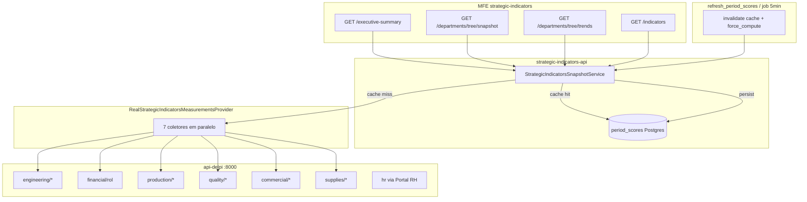

# Mapa de gargalos — Strategic Indicators × api-delpi

Documento de referência para otimização (refresh `period_scores`, leituras do painel e timeout 524 no gateway).

**Evidência:** log de `refresh_period_scores.py --competence 2026-05` com `trends_months=3`, `per_department=false` (2026-05-28, produção).

**Marco crítico no log:**

```text
si_measurements_loaded competence=2026-03 department_id=None branch=None items=28 errors=0 ms=352703
si_measurements_loaded competence=2026-05 department_id=None branch=None items=28 errors=0 ms=371792
```

Só o carregamento de medições do escopo **consolidado**, para **um** bloco de períodos, levou **~6 minutos**. O refresh repete isso para **3 filiais** (`consolidado`, `01`, `02`).

---

## 1. Fluxo (onde o tempo some)



| Camada | Quando é rápido | Quando é lento |
|--------|-----------------|----------------|
| Leitura SI (Grupo A/B) | `period_scores` + hash do catálogo OK | `force_compute` ou cache vazio |
| Refresh / cold start | — | Sempre recalcula + invalida Postgres |
| api-delpi | Resposta &lt; 1s | TOTVS/planilhas/consultas pesadas |

---

## 2. Rotas SI (painel) → carga interna

| Rota SI (GET) | Use case | Carga no snapshot | Períodos típicos |
|---------------|----------|-------------------|------------------|
| `/executive-summary` | `GetStrategicIndicatorsExecutiveSummaryRealUseCase` | `get_current_and_previous_snapshot` | 2 |
| `/departments` | `GetStrategicIndicatorsDepartmentsRealUseCase` | idem | 2 |
| `/departments/tree/snapshot` | `GetDepartmentsTreeSnapshotUseCase` | idem × escopos (1 ou 3 filiais) | 2 × escopos |
| `/departments/tree/trends` | `GetDepartmentsTreeTrendsUseCase` | `get_series_snapshot_optimized` | `months` (3–6) × escopos |
| `/indicators` | `GetStrategicIndicatorsUseCase` | comparativo | 2 |
| `/trends` | `GetStrategicIndicatorsTrendsRealUseCase` | série otimizada | N meses |
| `refresh_period_scores` (script/job) | `refresh_period_scores_materialized` | `get_series_snapshot_optimized` + **`force_compute=True`** | `trends_months` × **3 filiais** |

---

## 3. Rotas api-delpi — classificação (log 2026-05-28)

Legenda de prioridade:

- **P0** — latência alta ou chamada em excesso; maior impacto no refresh.
- **P1** — volume alto ou duplicação clara.
- **P2** — costuma ser rápida; manter no radar.

### P0 — latência alta (estimada pelo log)

| Rota api-delpi | Dept SI | Chamadas SI por mês/filial* | Observação no log |
|----------------|---------|----------------------------|-------------------|
| `GET /supplies/stock-value` | supplies | 1 direta + possível via turnover | Picos **12–44 s** entre linhas httpx; repetida para mesmas datas |
| `GET /supplies/inventory-turnover` | supplies | 1 (sequencial após CPV no snapshot) | **6–17 s**; doc interno: pode reutilizar lógica de stock-value |
| `GET /supplies/otd` | supplies | 1 | **11–20 s** em alguns meses |
| `GET /financial/rol` | financial | 1 série + **N extras** por indicador `per_unit` | Muitas linhas repetidas (`branch=01`, `02`, consolidado); gaps **15–21 s** |

\*Por mês = por `(start_date, end_date)` no `_build_snapshot` de suprimentos/financeiro.

### P1 — volume / paralelismo (rápidas isoladas, somam no refresh)

| Rota api-delpi | Dept SI | ~chamadas por mês (consolidado) |
|----------------|---------|----------------------------------|
| `GET /quality/branches` | quality | 1 (+ PPM abaixo) |
| `GET /quality/ppm/internal/summary` | quality | 1 |
| `GET /quality/ppm/external/summary` | quality | 1 (+ variantes `branch=01/02`) |
| `GET /production/overall_equipment_effectiveness_pct` | production | 1 (+ `branch=01/02`) |
| `GET /production/on_time_delivery_pct` | production | 1 (+ filial) |
| `GET /commercial/closing-rate` | commercial | 1 (+ filial) |
| `GET /commercial/new-business-rol-pct` | commercial | 1 (+ filial) |
| `GET /commercial/sales-order-otd` | commercial | 1 (+ filial; até **~8 s**) |
| `GET /supplies/cpv` | supplies | 1 (+ filial) |
| `GET /engineering/lmps/dashboard/summary` | engineering | 1 |
| `GET transformometro-api/.../processes/summary` | engineering | 1 (outro host) |

### P2 — geralmente rápidas no log

Engenharia LMP + Transformômetro (~100–300 ms), vários `financial/rol` quando a api-delpi responde em &lt; 1s.

---

## 4. Por que o refresh com `trends_months=3` ainda leva ~15–25 min

Multiplicadores atuais (config padrão produção após ajuste):

| Fator | Valor | Efeito |
|-------|-------|--------|
| Filiais materializadas | 3 (`consolidado`, `01`, `02`) | ×3 no trabalho de medições |
| Meses por filial | 3 (mar–mai/2026) | ×3 períodos na série |
| Departamentos na medição | 7 em paralelo por escopo | Cada um dispara seu pacote de rotas |
| Suprimentos por mês | **4** HTTP sequenciais (`cpv` → `inventory-turnover` → `otd` → `stock-value`) | Pior departamento |
| `force_compute` + invalidate | sempre no script padrão | Zera `period_scores`; nada reaproveitado |
| Duplicação `financial/rol` | metas `per_unit` + filial | Dezenas de GETs extras por escopo |

**Ordem de grandeza:**  
3 filiais × (3 meses × ~30–80 HTTP úteis + duplicatas) ≈ **centenas** de chamadas api-delpi por refresh completo.

---

## 5. Duplicações identificadas (alvos de otimização)

### 5.1 `financial/rol` — mesma competência, muitos GETs

- **Causa:** indicadores com meta `per_unit` (ROL filial 01/02) disparam leitura por filial; o snapshot financeiro já traz ROL por branch na série.
- **Sintoma no log:** `financial/rol?branch=01&...` repetido para mar/abr/mai no mesmo minuto.
- **Direção:** uma chamada `get_snapshot_series` por período com cache de linhas ROL; derivar `01`/`02` no SI sem novo HTTP por indicador.

### 5.2 `supplies/stock-value` — mesmas datas repetidas

- **Causa:** `_build_snapshot` chama turnover depois de stock-value, mas turnover pode consultar estoque de novo; cache do `SuppliesMetricsSnapshotService` é por processo e é perdido no invalidate global; refresh processa 3 filiais × 3 meses sem compartilhar entre escopos.
- **Sintoma:** mesma URL `stock-value?start_date=01-03-2026` aparece minutos depois de novo.
- **Direção:** cache TTL compartilhado (Redis ou `snapshot_shared_cache`) para respostas api-delpi; turnover reutilizar snapshot de stock-value já carregado.

### 5.3 Três filiais = três passes quase completos

- **Causa:** `DEFAULT_PERIOD_SCORES_REFRESH_BRANCHES = (None, "01", "02")`.
- **Direção:** materializar primeiro **consolidado** (destrava painel); filiais em job noturno ou `SI_PERIOD_SCORES_REFRESH_BRANCHES=consolidated` até otimizar.

### 5.4 Qualidade — PPM consolidado + por filial

- **Causa:** após série consolidada, indicadores por filial pedem `quality/ppm/...?branch=01`.
- **Direção:** endpoint série em api-delpi com breakdown por filial (uma ida).

---

## 6. Backlog de otimização (priorizado)

| # | Área | Ação | Impacto esperado | Onde mexer |
|---|------|------|------------------|------------|
| 1 | Operação | `refresh` com `--no-invalidate` após primeira carga | Evita rebuild total | `scripts/refresh_period_scores.py` |
| 2 | Operação | `SI_PERIOD_SCORES_REFRESH_BRANCHES=consolidated` até filial rápida | ÷3 no refresh | `.env` |
| 3 | api-delpi | Otimizar `/supplies/stock-value` e `/inventory-turnover` (TOTVS/cache) | −minutos no P0 | `api-delpi` supplies |
| 4 | SI | ~~Cache TTL medições (7 dept., zero erros)~~ **feito** | Menos duplicata parcial | `measurements_cache_policy.py` |
| 5 | SI | ~~Financial: ROL por escopo de filial + cache TTL `get_rol`~~ **feito** | Menos P1 | `financial_indicators_snapshot_provider`, `delpi_financial_gateway` |
| 6 | SI | Suprimentos: paralelizar 4 use cases dentro do mês | −latência por mês | `supplies_metrics_snapshot_service._build_snapshot` |
| 7 | api-delpi | Endpoints “série” com `branch` opcional (quality ppm, commercial) | Menos GET por filial | respectivos módulos api-delpi |
| 8 | SI | Já feito: leitura `period_scores` sem reconcile | GET painel em ms | `strategic_indicators_snapshot_service` |
| 9 | MFE | Job assíncrono em 524 (feito) | UX sob Cloudflare | `useStrategicIndicatorsDepartmentTree` |

---

## 7. Como medir na próxima iteração

### 7.1 Contagem por refresh

```bash
docker exec delpi-strategic-indicators-api python3 -u scripts/refresh_period_scores.py \
  --competence 2026-05 --trends-months 3 --no-per-department --no-invalidate 2>&1 \
  | tee /tmp/si-refresh.log

grep -oP 'GET http://delpi-api-delpi:8000\K[^"]+' /tmp/si-refresh.log | sort | uniq -c | sort -rn | head -30
```

### 7.2 Tempos por fase (SI)

```bash
grep -E 'si_period_scores_refresh_start|si_measurements_loaded|si_series_snapshot|refresh_done|refresh_ok' /tmp/si-refresh.log
```

### 7.3 Bench rotas do painel (cache quente)

```bash
docker exec delpi-strategic-indicators-api python3 scripts/bench_si_routes.py --competence 2026-05
```

### 7.4 api-delpi isolado

Medir p95 de cada rota P0 com `curl` ou OpenAPI direto no `delpi-api-delpi` (sem SI), para separar “TOTVS lento” de “SI chama demais”.

---

## 8. Referências no repositório

| Tópico | Arquivo |
|--------|---------|
| Plano performance SI | `docs/PERFORMANCE_IMPLEMENTATION.md` |
| Operação refresh | `docs/OPERATIONS.md` |
| Medições | `si_app/infrastructure/providers/strategic_indicators/real_indicator_measurements_provider.py` |
| Refresh materializado | `si_app/application/services/strategic_indicators/period_scores_refresh_service.py` |
| Suprimentos (4 calls/mês) | `si_app/application/services/supplies/supplies_metrics_snapshot_service.py` |
| Financeiro ROL | `si_app/application/services/financial/financial_metrics_snapshot_service.py` |

---

**Próximo passo sugerido:** workshop rápido **SI + api-delpi** focado em **P0 supplies** e **deduplicação financial/rol** — são os que explicam a maior parte dos ~6 min por bloco de `si_measurements_loaded` no log analisado.
